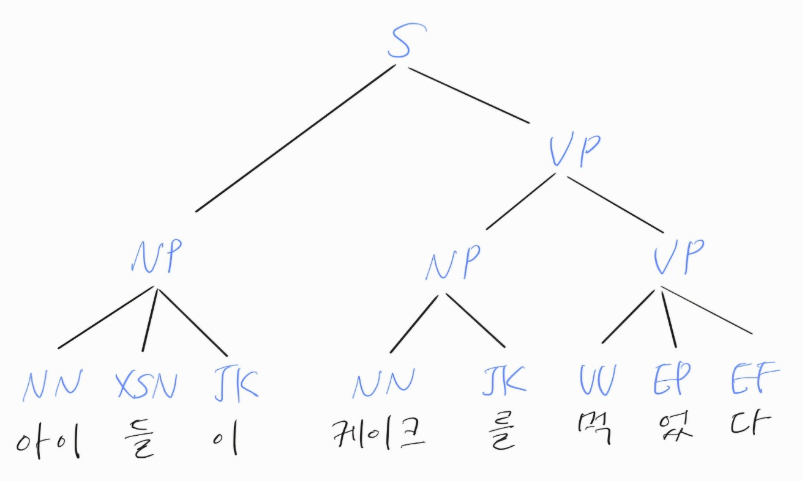
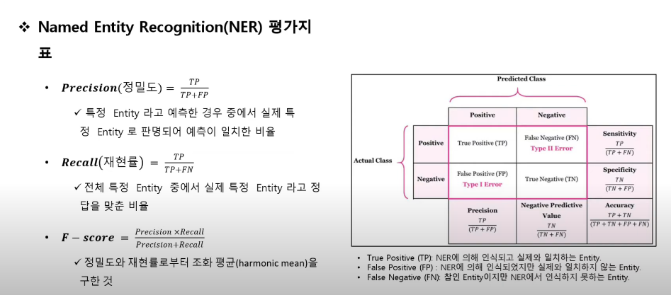

# 목차
1. [자연어 처리(NLP, Natural Language Process)란?](#1-자연어-처리nlp-natural-language-process란)
1. [NLP에 대한 접근 방식](#2-nlp에-대한-접근-방식)
    1. [규칙 기반 NLP](#21-규칙-기반-nlp)
    1. [통계적 NLP](#22-통계적-nlp)
    1. [딥 러닝 NLP](#23-딥-러닝-nlp)
1. [NLP 작업](#3-nlp-작업)
    1. [동일 지시성 해결](#31-동일-지시성-해결)
    1. [명명된 엔티티 인식(NER)](#32-명명된-엔티티-인식ner)
    1. [품사 태그 지정](#33-품사-태그-지정)
    1. [단어 의미 명확화](#34-단어-의미-명확화)
1. [NLP의 작동 방식](#4-nlp의-작동-방식)
    1. [텍스트 전처리](#41-텍스트-전처리)
    1. [특징 추출](#42-특징-추출)
    1. [텍스트 분석](#43-텍스트-분석)
    1. [모델 학습](#44-모델-학습)
1. [NLP의 과제](#5-nlp의-과제)
    1. [학습 편향](#51-학습-편향)
    1. [오해](#52-오해)
    1. [새로운 단어](#53-새로운-단어)
    1. [어조](#54-어조)

# 자연어 처리(NLP, Natural Language Process)
## 1. 자연어 처리(NLP, Natural Language Process)란?
**자연어 처리(NLP, Natural Language Process)**: 머신 러닝을 사용하여 컴퓨터가 인간의 언어를 이해하고 소통하도록 돕는 <mark>인공 지능(AI)의 하위 분야</mark>이다.  
`자연어 처리(NLP)` = `컴퓨터 언어학` + `통계 모델링` + `머신러닝, 딥러닝` => `컴퓨터 및 디지털 기기가 텍스트와 음성을 인식, 이해, 생성`

## 2. NLP에 대한 접근 방식
`자연어 처리(NLP)` = `컴퓨터 언어학` + `통계 모델링` + `머신러닝, 딥러닝`

**컴퓨터 언어학(Computational Linguistics)**: 데이터 과학을 사용하여 언어와 음성을 분석한다.  
여기에는 <abbr title="문장의 구조">구문</abbr> 분석과 의미 분석의 두 가지 주요 분석 유형이 포함된다.
* **구문 분석**: 단어의 구문을 분석하고 미리 프로그래밍된 문법 규칙을 적용해 단어, 구 또는 문장의 의미를 결정한다.
* **의미 분석**: 구문 분석을 사용해 단어에서 의미를 도출하고 문장 구조 내에서 그 의미를 해석한다.

***단어 구문 분석***은 두 가지 형식 중 하나를 사용할 수 있다.
* **종속성 구문 분석**: 명사와 동사를 식별하는 등 단어 사이의 관계를 살펴본다.
* **구성 요소 구문 분석**: 문장 또는 단어 문자열의 구문 구조를 뿌리부터 순서대로 표현한 구문 분석 트리(또는 구문 트리)를 구축한다.

NLP는 **자기 지도 학습(SSL)**을 사용하는 것이 유용하다.
왜냐하면 NLP는 AI 모델을 훈련시키기 위해 <mark>많은 양의 레이블이 지정된 데이터</mark>를 필요로 한다.
이러한 레이블이 지정된 데이터 세트의 경우 <mark>사람이 수동으로 레이블을 지정하는 프로세스인 주석이 필요</mark>하기 때문에 시간이 많이 걸려 충분한 데이터를 수집하는 것이 매우 어려울 수 있다.  
그렇지만 **자기 지도 학습(SSL)**은 학습 데이터에 수동으로 라벨을 지정해야 하는 일부 또는 전체적인 업무를 대체하므로 시간과 비용 면에서 더 효율적일 수 있다.
 
NLP에 대한 세 가지 접근 방식은 다음과 같다.

### 2.1. 규칙 기반 NLP
**규칙 기반 NLP**: 사전 프로그래밍된 규칙이 필요한 <mark>단순한 if-then 의사 결정 트리</mark>이다.  
초보적인 자연어 생성(NLG, Natural Language Generation) 기능을 통해 특정 프롬프트에 대한 응답으로만 답변을 제공한다. 규칙 기반 NLP에는 머신 러닝이나 AI 기능이 없기 때문에 이 기능은 매우 제한적이며 확장성이 떨어졌다.

### 2.2. 통계적 NLP
**통계적 NLP**: 텍스트 및 음성 데이터의 요소를 자동으로 추출, 분류 및 레이블을 지정한 다음 해당 요소의 가능한 각 의미에 통계적 우도(가능도, Likelihood)를 할당한다. 이는 머신 러닝을 기반으로 품사 태깅과 같은 정교한 언어학 분석을 가능하게 한다.
 
통계적 NLP는 회귀 또는 마르코프 모델을 비롯한 수학적(통계적) 방법을 사용하여 언어를 모델링할 수 있도록 단어 및 문법 규칙과 같은 언어 요소를 벡터 표현에 매핑하는 필수 기술을 도입했다. 이는 맞춤법 검사기 및 T9 문자(옛날 버튼식 전화기의 9개 버튼에 적힌 글자) 등 초기 NLP 개발에 정보를 제공했다.

### 2.3. 딥러닝 NLP
**딥러닝 NLP**: 최근에는 딥 러닝 모델이 텍스트와 음성 등 방대한 양의 비정형 원시 데이터를 사용하여 더욱 정확도를 높임으로써 NLP의 지배적인 모드가 되었다.  
딥 러닝은 신경망 모델을 사용한다는 점에서 통계적 NLP의 더욱 발전된 버전으로 볼 수 있다.  

모델은 여러 하위 범주를 갖는다.

#### 2.3.1. 시퀀스-투-시퀀스(seq2seq, Sequence-to-Sequence) 모델

**seq2seq 모델**: 크게 인코더와 디코더라는 두 개의 모듈로 구성되고, 이 두개의 모듈은 <mark>순환 신경망(RNN)</mark>을 기반으로 한다.
* 챗봇(Chatbot), 기계 번역(Machine Translation), 내용 요약(Text Summarization), STT(Speech to Text) 등등

#### 2.3.2. 트랜스포머(Transformer) 모델
**트랜스포머(Transformer) 모델**: 문장 속 단어와 같은 순차 데이터 내의 관계를 추적해 맥락과 의미를 학습하는 신경망 모델이다.  
트랜스포머 모델은 요소들 사이의 패턴을 수학적으로 찾아내기 때문에 라벨링 과정이 필요 없다.  
* 양방향 인코더 표현 트랜스포머(BERT, Bidirectional Encoder Representations from Transformers) 모델은 Google 검색 엔진 작동 방식의 기반이 되었다.

#### 2.3.3. 자기 회귀(Auto-regressive) 모델
**자기 회귀(Auto-regressive) 모델**: 시퀀스의 이전 입력에서 측정값을 가져와 시퀀스의 다음 성분을 자동으로 예측하는 기계 학습 모델이다.
자기회귀 <abbr title="Large Language Model">LLM</abbr>은 트랜스포머 모델로 구동되며, 인공지능의 텍스트 생성 능력을 크게 발달시켰다.

#### 2.3.4. 파운데이션(Foundation) 모델
**파운데이션(Foundation) 모델**: <mark>대량의 원시 데이터</mark>, 레이블이 없는 데이터에서 <mark>비지도 학습</mark>을 통해 훈련된 AI 신경망이다.
파운데이션 모델은 일반적으로 레이블이 없는 데이터세트로 학습해 대규모 컬렉션에서 각각의 항목을 수동으로 분ㄿ하는 데 드는 시간과 비용을 절약할 수 있다.

## 3. NLP 작업
NLP 작업은 일반적으로 인간의 텍스트와 음성 데이터를 분류하여 컴퓨터가 수집 내용을 쉽게 이해할 수 있도록 한다.  
이러한 작업에는 다음이 포함된다.
* 동일 지시성 해결
* 명명된 엔티티 인식
* 품사 태그 지정
* 단어 의미 명확화

### 3.1. 동일 지시성 해결
**동일 지시성 해결**: 두 단어가 동일한 엔터티를 지시하는지 여부와 이러한 경우를 식별하는 작업이다.
* 특정 대명사가 지칭하는 사람이나 사물을 결정(e.g. ‘그녀’ = ‘헤르미온느’).
* 텍스트에서 은유나 관용구를 식별(e.g. '곰'이 동물이 아니라 덩치 크고 털이 많은 사람을 가리키는 경우).

### 3.2. 명명된 엔티티 인식(NER, Named Entity Recognition)
**NER**: 단어나 구문을 유용한 엔티티로 식별한다.
* '호그와트' -> 장소
* '해리포터' -> 사람의 이름

### 3.3. 품사 태그 지정(PoS Tagging, Part-of-Speech Tagging)
**Pos Tagging(=문법 태깅)**: 형태소(의미를 가진 가장 작은 말의 단위)에 대해 품사를 파악해 부착(tagging)하는 작업이다.
* 'I can <u>make</u> a paper plane': 'make' -> 동사
* 'What <umake</u> of car do you own?': 'make' -> 명사

### 3.4. 단어 의미 명확화
**단어 의미 명확화**: 가능한 의미를 여러 개 가진 단어에 대해 적합한 단어 의미를 선택하는 것이다. 이는 의미 분석 프로세스를 사용하여 문맥에서 단어를 검사한다.
* Will, will Will will Will Will's will? –> Will (a person), will (future tense auxiliary verb) Will (a second person) will (bequeath) [to] Will (a third person) Will's (the second person) will (a document)?

## 4. NLP의 작동 방식
NLP는 기계가 처리할 수 있는 방식으로 인간의 언어를 분석, 이해 및 생성하기 위해 다양한 컴퓨팅 기술을 결합하여 작동한다.

### 4.1. 텍스트 전처리
NLP 텍스트 전처리: 원시 텍스트를 기계가 더 쉽게 이해할 수 있는 형식으로 변환하여 분석할 수 있도록 준비한다. <mark>모든 작업은 토큰화에서 시작된다.</mark>

1. **토큰화**: 텍스트를 단어, 문장, 구와 같은 더 작은 단위로 나눈다.
1. **소문자 변환**: 모든 문자를 소문자로 바꿔서 텍스트를 표준화해 'Apple'과 'apple' 같은 단어가 동일하게 처리
1. **불용어 제거**: 'is' 또는 'the'같이 자주 사용되지만 텍스트에 큰 의미를 더하지 않는 단어를 필터링하여 제거
1. **어간 분석 또는 어근화**: '달리기'를 '달리다'로 바꾸는 것처럼 단어를 어근 형태로 줄이고 동일한 단어의 다양한 형태를 그룹화하여 언어를 더 쉽게 분석할 수 있게 만든든다.
1. **정규표현**: 구두점, 특수 문자, 숫자 등 분석을 복잡하게 만들 수 있는 원치 않는 요소를 제거한다.

전처리가 끝나면 텍스트가 정리되고 표준화되어 머신 러닝 모델이 효과적으로 해석할 수 있게 된다.

### 4.2. 특징 추출
**특징 추출**: 원시 텍스트를 기계가 분석하고 해석할 수 있는 수치 표현으로 변환하는 프로세스이다.  
텍스트를 구조화된 데이터로 변환: Bag of words, TF-IDF  
단어 임베딩, 단어를 연속 공간에서 조밀한 벡터로 표현하여 단어 간의 의미 관계를 캡처: Word2Vec, GloVe  
문맥 임베딩은 단어가 등장하는 문맥을 고려함으로써 이 기능을 개선해 더 풍부하고 미묘한 표현을 가능하게 한다.  

### 4.3. 텍스트 분석
**텍스트 분석**: 다양한 계산 기술을 통해 텍스트 데이터에서 의미 있는 정보를 해석하고 추출한다.

* **품사(POS) 태깅**: 단어의 문법적 역할을 식별
* **명명된 엔티티 인식(NER)**: 이름, 위치, 날짜 등의 특정 엔티티를 감지
* **종속성 구문 분석**: 단어 간의 문법적 관계를 분석하여 문장 구조를 이해
* **감정 분석**: 텍스트의 감정적 어조를 결정하고 텍스트가 긍정적, 부정적 또는 중립적인지 평가
* **주제 모델링**: 텍스트 내에서 또는 문서 말뭉치 전체에서 기본 테마 또는 주제를 식별
* **자연어 이해(NLU)**: 문장의 숨겨진 의미를 분석, NLU를 사용하여 다른 문장에서 유사한 의미를 찾거나 다른 의미를 가진 단어를 처리할 수 있다.

NLP 텍스트 분석은 이러한 기술을 통해 비정형 텍스트를 인사이트로 변환한다.

### 4.4. 모델 학습
**모델 학습**: 처리된 데이터를 사용하여 머신 러닝 모델에게 데이터 내의 패턴과 관계를 학습시킨다.
학습 중: 모델은 매개 변수를 조정하여 오류를 최소화하고 성능을 개선한다.
학습 후: 모델을 사용하여 예측을 수행하거나 보이지 않는 새로운 데이터에 대한 출력을 생성할 수 있다.
NLP 모델링의 효과는 평가, 검증 및 미세 조정을 통해 지속적으로 개선되어 실제 애플리케이션에서 정확성과 관련성을 향상시킨다.

* 자연어 툴킷(NLTK): Python 프로그래밍 언어로 작성된 영어용 라이브러리 및 프로그램 모음이다. 텍스트 분류, 토큰화, 어간 추출, 태깅, 구문 분석 및 의미 추론 기능을 지원한다.
* TensorFlow: 머신 러닝 및 AI를 위한 무료 오픈 소스 소프트웨어 라이브러리로, NLP 애플리케이션용 모델을 학습시키는 데 사용할 수 있다.

## 5. NLP의 과제 
사람의 말에도 오류가 발생하는 것처럼, 최첨단 NLP 모델도 완벽하지 않다. 다른 AI 기술과 마찬가지로 NLP에도 잠재적인 함정이 있다. 인간의 언어는 모호성으로 가득 차 있어 프로그래머가 텍스트 또는 음성 데이터의 의도된 의미를 정확하게 파악하는 소프트웨어를 작성하기가 매우 어렵다. 인간이 언어를 배우는 데 수년이 걸릴 수 있으며, 계속해서 배우는 사람들도 많다. 하지만 프로그래머는 자연어 기반 애플리케이션이 불규칙성을 인식하고 이해할 수 있도록 교육해야 애플리케이션이 정확하고 유용하게 작동할 수 있다. 여기에는 다음과 같은 위험이 관련되어 있다.

### 5.1. 학습 편향
다른 AI 기능들이 그렇듯, 편향된 데이터가 학습에 사용되면 답변이 왜곡된다.더 다양한 사용자가 NLP 기능을 사용할수록 이러한 위험이 더 커지고, 특히 정부 서비스, 의료 및 인사 관련 상호 작용과 같은 분야가 더 취약한다.예를 들어 웹에서 스크랩한 학습 데이터 세트는 편향이 발생하기 쉽다.

### 5.2. 오해
프로그래밍에서와 마찬가지로 쓰레기가 들어가면 쓰레기가 나올 수밖에 없다. 음성 인식은 Speech to Text 변환이라고도 하며 음성 데이터를 텍스트 데이터로 안정적으로 변환하는 작업이다. 그러나 음성 입력이 알아듣기 힘든 사투리로 되어 있거나, 웅얼거리거나, 속어 또는 동음이의어, 문법 오류, 관용구, 미완성 문장, 발음 오류, 축약어가 너무 많거나, 배경 소음이 너무 큰 경우 NLP 솔루션이 혼란을 일으킬 수 있다.

### 5.3. 새로운 단어
새로운 단어가 지속적으로 만들어지거나 도입되고 있다. 문법 규칙은 발전할 수도 있고 의도적으로 무시될 수도 있다. 이러한 경우 NLP는 최선의 추측을 하거나 확실하지 않다고 인정할 수 있으며, 어느 쪽이든 이는 문제를 야기한다.

### 5.4. 어조
사람이 말을 할 때는 목소리 톤이나 몸짓을 활용해 단어만 사용할 때와 전혀 다른 의미를 전달할 수 있다. 효과를 주기 위한 과장, 중요성을 강조하거나 빈정거리기 위한 단어 강조가 사용되면 NLP가 이해하지 못하므로 의미 분석을 더 어렵게 만들고 신뢰도를 떨어뜨릴 수 있다.

# 출처
* [자연어 처리(NLP)란 무엇인가요?](https://www.ibm.com/kr-ko/think/topics/natural-language-processing)
* [머신러닝이란?](https://www.ibm.com/kr-ko/topics/machine-learning)
* [[기초통계] 확률(Probability) vs 우도(가능도,Likelihood)](https://dlearner.tistory.com/43)
* [컴퓨터언어학이란](https://blog.naver.com/daeel74/40006167876)
* [[자연어처리] 6.구문 분석](https://yz-zone.tistory.com/43)
* [시퀀스-투-시퀀스(Sequence-to-Sequence, seq2seq)](https://wikidocs.net/24996)
* [품사 태깅(Part-of-Speech Tagging)이란?](https://katenam32.tistory.com/43)
* [은닉 마르코프 모형](https://ko.wikipedia.org/wiki/%EC%9D%80%EB%8B%89_%EB%A7%88%EB%A5%B4%EC%BD%94%ED%94%84_%EB%AA%A8%ED%98%95)
* [트랜스포머 모델이란 무엇인가? (1)](https://blogs.nvidia.co.kr/blog/what-is-a-transformer-model/)
* [자기 회귀 모델이란 무엇인가요?](https://aws.amazon.com/ko/what-is/autoregressive-models/)
* [파운데이션 모델이란 무엇인가?](https://blogs.nvidia.co.kr/blog/what-are-foundation-models/)