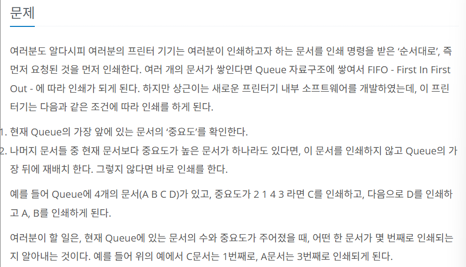
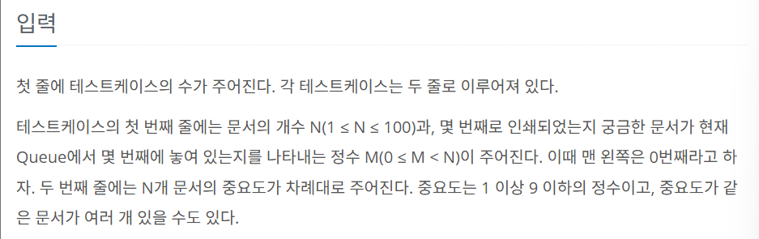
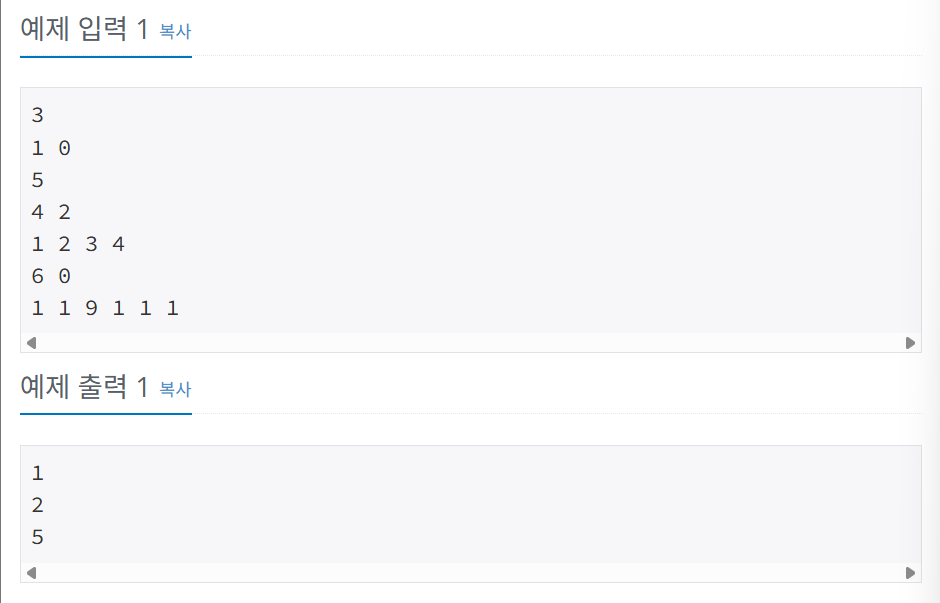

# 1966 프린터 큐
출처: <https://www.acmicpc.net/problem/1966>

## 문제


## 입력


## 예제


## 풀이
```java
// 입출력 모듈
import java.io.BufferedReader;
import java.io.BufferedWriter;
import java.io.IOException;
import java.io.InputStreamReader;
import java.io.OutputStreamWriter;
import java.util.StringTokenizer;
// 객체 모듈
import java.util.ArrayList;
import java.util.Collections;
import java.util.HashMap;

public class Main {
    // 중요도와 타켓 여부 저장
    public static class Node {
        int value;
        boolean target;

        public Node(int value, boolean isTarget) {
            this.value = value;
            this.target = isTarget;
        }

        public int getValue() {
            return this.value;
        }

        public boolean isTarget() {
            return this.target;
        }
    }

    public static int solve(ArrayList<Node> q, HashMap<Integer, Integer> map) {
        ArrayList<Integer> keys = new ArrayList<>(map.keySet()); // map의 key들을 배열로 바꿈
        Collections.reverse(keys); // 내림차순 정렬
        
        int cnt = 1;
        while(!q.isEmpty()) {
            Node curr = q.remove(0); // queue에서 가장 앞에 있는 원소를 꺼냄
            int max = keys.get(0); // 최댓값

            if (curr.getValue() == max) { // 현재 원소의 중요도가 최댓값일 때
                if (curr.isTarget()) break; // 현재 원소가 타켓이면 종료

                if (map.get(max) > 1) { // 중요도가 max인 원소가 더 있을 때
                    map.put(max, map.get(max)-1); // map의 value값을 1 줄임
                } else {
                    keys.remove(0); // key 배열에서 지움
                }

                cnt++;
            } else {
                q.add(curr); // queue의 맨 뒤에 원소를 집어넣음
            }
        }

        return cnt;
    }

    public static void main(String[] args) throws IOException {
        BufferedReader br = new BufferedReader(new InputStreamReader(System.in));
        BufferedWriter bw = new BufferedWriter(new OutputStreamWriter(System.out));
        StringBuilder sb = new StringBuilder();
        StringTokenizer st;
        
        // 초기화
        int T = Integer.parseInt(br.readLine());
        int N; // 문서의 개수
        int M; // 타켓의 idx
        ArrayList<Node> q;
        HashMap<Integer, Integer> map; // map = {중요도: 개수}
        for (int t = 0; t < T; t++) {
            st = new StringTokenizer(br.readLine());
            N = Integer.parseInt(st.nextToken());
            M = Integer.parseInt(st.nextToken());
            q = new ArrayList<>(N);
            map = new HashMap<>();

            st = new StringTokenizer(br.readLine());
            for (int n = 0; n < N; n++) {
                int value = Integer.parseInt(st.nextToken());
                boolean isTarget = (n == M) ? true : false;
                Node node = new Node(value, isTarget);
                
                q.add(node);

                if (map.containsKey(value)) { // key값이 있으면
                    map.put(value, map.get(value)+1); // value 1 증가
                } else { // 없으면
                    map.put(value, 1);
                }
            }

            sb.append(String.format("%d\n", solve(q, map)));
        }

        bw.write(sb.toString());
        bw.flush();
        bw.close();
        br.close();
    }
}
```

- Node라는 클래스를 통해 중요도와 타겟 여부.
- map을 통해서 중요도와 그 중요도를 가지고 있는 문서의 개수
- queue에 node들을 저장했다.

- 나머지 문서들 중 현재 문서보다 중요도가 높은 문서가 하나라도 있는 지 확인하기 위해 map을 사용했다.
- 중요도와 그 중요도를 가지고 있는 문서의 개수를 저장하여 내림차순으로 정렬했다.
- 그렇게 되면 맨 앞에서부터 높은 중요도를 확인할 수 있고, queue에서 원소를 뽑을 때 map의 value도 1 줄여서 그 다음 최댓값을 확인할 수 있게 했다.