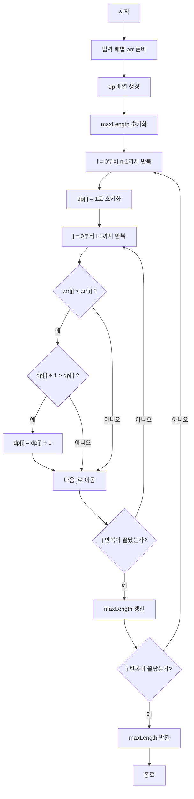
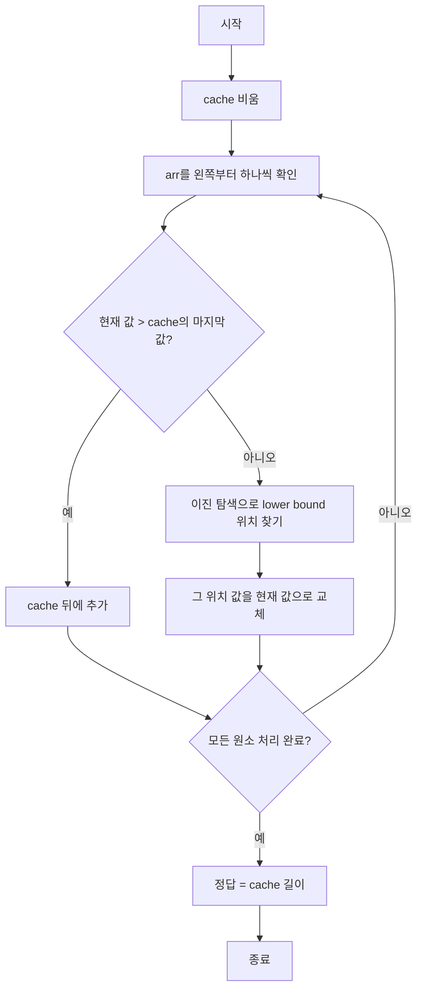

<!-- markdownlint-disable MD010 MD025 MD033 MD051 MD052 -->

<script src="https://cdn.jsdelivr.net/npm/mermaid/dist/mermaid.min.js"></script>

# LIS(Longest Increasing Subsequence) Algorithm

## 목차

1. [LIS란?](#1-lis란)
1. [DP → $O(n^2)$](#2-dp-)
	1. [아이디어](#21-아이디어)
	1. [점화식](#22-점화식)
	1. [코드](#23-코드)
1. [이진 탐색 → $O(nlogn)$](#3-이진-탐색-)
	1. [아이디어](#31-아이디어)
	1. [동작 방식](#32-동작-방식)
	1. [코드](#33-코드)
1. [참고](#참고)

---

## 1. LIS란?

**LIS, Longest Increasing Subsequence(최장 증가 수열, 최대 증가 부분 수열)**: 어떤 수열에서 특정 부분을 지워서 만들어낼 수 있는 가장 긴 증가하는 부분 수열

- 부분 수열: 원래 순서를 유지하면서 몇 개를 골라 만든 수열

> 10, 20, 40, 25, 20, 50, 30, 70, 85 라는 수열이 있을 때,  
> LIS는 10, 20, 40, 50, 70, 85가 된다.

## 2. DP → $O(n^2)$

### 2.1. 아이디어

`dp[i]`: i번째 원소를 마지막으로 하는 LIS의 길이

즉, `arr[i]`에서 끝나는 가장 긴 LIS 길이

### 2.2. 점화식

`arr[j] < arr[i]`인 이전 원소들 중에서 이어붙일 수 있으므로:

```text
dp[i] = max(dp[j] + 1) (단, j < i 이고 arr[j] < arr[i])
```

초기값은 자기 자신만 선택하는 경우이므로:

```text
dp[i] = 1
```

### 2.3. 동작흐름



### 2.4. 코드

<details>
<summary>파이썬 코드 접기/펼치기</summary>
<div markdown="1">

```python
def lis_dp(arr):
    n = len(arr)
    dp = [1] * n

    for i in range(n):
        for j in range(i):
            if arr[j] < arr[i]:
                dp[i] = max(dp[i], dp[j] + 1)

    return max(dp) if arr else 0
```

</div>
</details>

<details>
<summary>자바 코드 접기/펼치기</summary>
<div markdown="1">

```java
int lisDP (int[] arr) {
	if (arr == null || arr.length == 0) return 0;

	int n = arr.length;
	int[] dp = new int[n];
	int maxLength = 0;
	
	for (int i = 0; i < n; i++) {
		dp[i] = 1;
		
		for (int j = 0; j < i; j++) {
			if (arr[j] < arr[i] && dp[j]+1 > dp[i]) dp[i] = dp[j]+1;
		}
		
		if (maxLength < dp[i]) maxLength = dp[i];
	}
	
	return maxLength;
}
```

</div>
</details>

## 3. 이진 탐색 → $O(nlogn)$

### 3.1. 아이디어

`lis` 배열을 유지

```text
lis[k] = 길이가 k+1인 LIS의 마지막 값들 중 가능한 최소값
```

실제 LIS 자체를 저장하는 게 아니라 각 길이에 대해 마지막 값을 최대한 작게 유지한다

### 3.2. 동작 방식

수열을 왼쪽부터 보면서:

1. 현재 값이 `lis`의 마지막 값보다 크면 뒤에 붙인다
2. 작다면 이분 탐색으로 들어갈 위치를 찾아서 교체한다

### 3.3. 동작 흐름



### 3.4. 코드

<details>
<summary>파이썬 코드 접기/펼치기</summary>
<div markdown="1">

```python
def lower_bound(arr, target):
    left = 0
    right = len(arr)

    while left < right:
        mid = (left + right) // 2

        if arr[mid] < target:
            left = mid + 1
        else:
            right = mid

    return left

def lis_binary(arr):
    lis = []

    for x in arr:
        pos = lower_bound(lis, x)

        if pos == len(lis):
            lis.append(x)
        else:
            lis[pos] = x

    return len(lis)
```

</div>
</details>

<details>
<summary>자바 코드 접기/펼치기</summary>
<div markdown="1">

```java
int binarySearch(ArrayList<Integer> arr, int l, int r, int trg) {
    while (l < r) {
        int c = (l + r) / 2;

        if (trg > arr.get(c)) {
            l = c + 1;
        } else {
            r = c;
        }
    }

    return r;
}

int lisBS(int[] arr) {
    if (arr == null || arr.length == 0) return 0;

    ArrayList<Integer> lis = new ArrayList<>();
    lis.add(arr[0]);

    for (int i = 1; i < arr.length; i++) {
        if (arr[i] > lis.get(lis.size() - 1)) {
            lis.add(arr[i]);
        } else {
            int pos = binarySearch(lis, 0, lis.size() - 1, arr[i]);
            lis.set(pos, arr[i]);
        }
    }

    return lis.size();
}
```

</div>
</details>

---

## 참고

- [Github Pages: LIS의 길이를 구하는 3가지 알고리즘](https://shoark7.github.io/programming/algorithm/3-LIS-algorithms)
- [Tistory: [최장 증가 수열] LIS(Longest Increasing Subsequence)](https://jason9319.tistory.com/113)
- [Tistory: [1][LIS : 최장 증가 수열 알고리즘] - DP를 이용한 알고리즘 (Longest Increasing Subsequence Algorithm)](https://source-sc.tistory.com/14)
- [Tistory: [2][LIS : 최장 증가 수열 알고리즘] - Lower Bound를 이용한 알고리즘 (Longest Increasing Subsequence Algorithm)](https://source-sc.tistory.com/15)
- [Tistory: 최장 증가 수열 (LIS, Longest Increasing Subsequence) 2](https://4legs-study.tistory.com/106)

<script>
mermaid.initialize({startOnLoad:true});
window.mermaid.init(undefined, document.querySelectorAll('.language-mermaid'));
</script>
