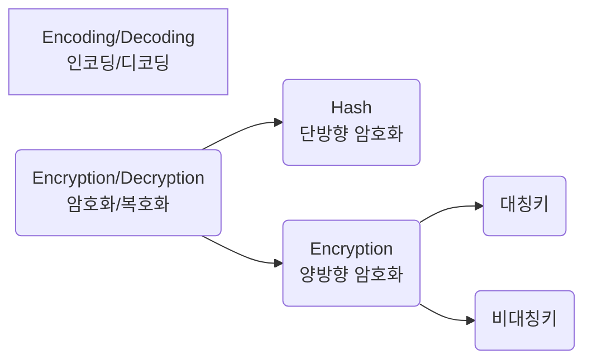
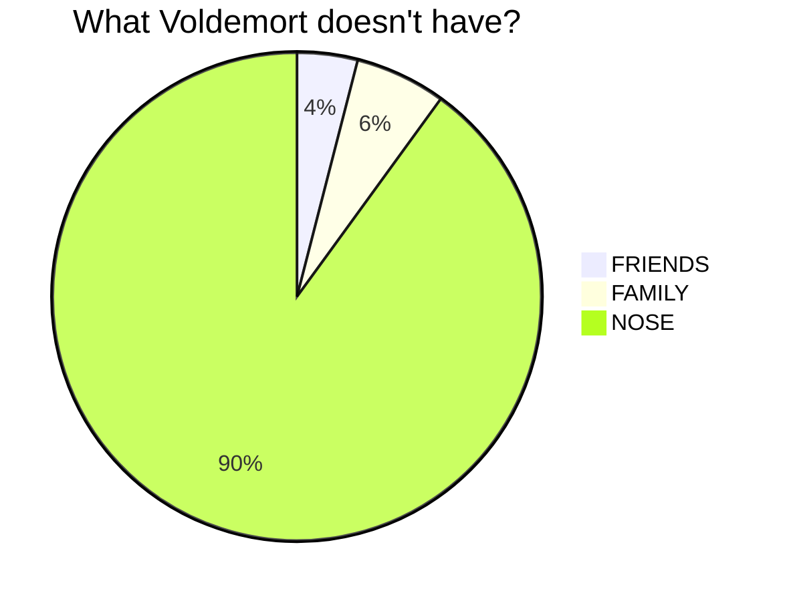
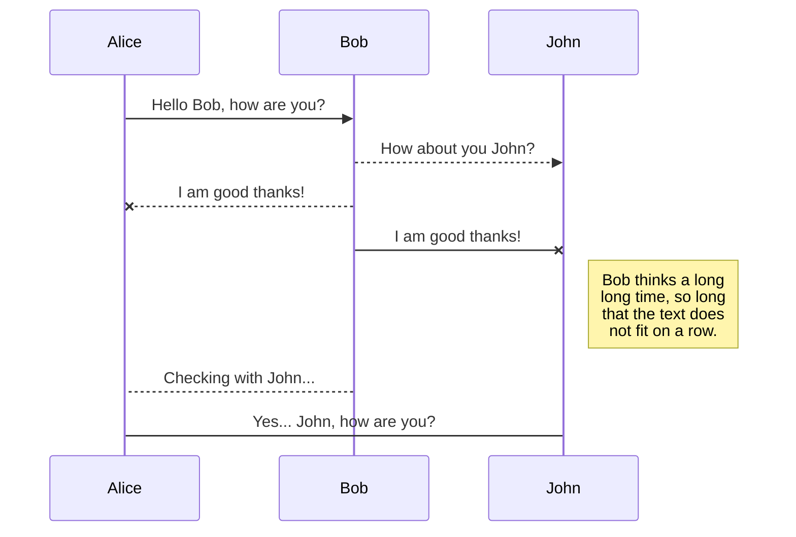
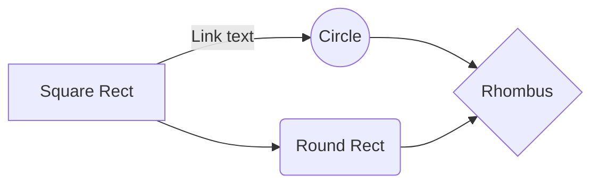
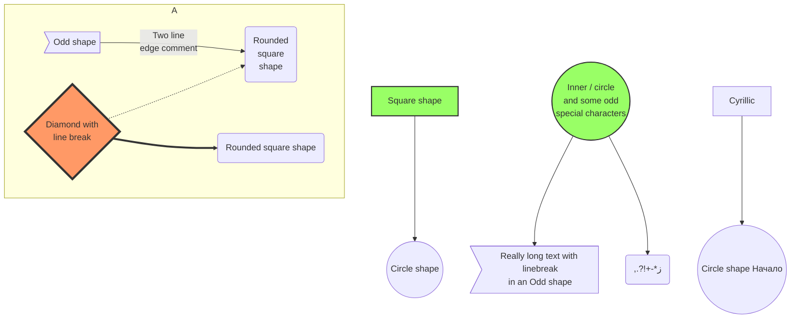

<!-- markdownlint-disable MD004 MD007 MD022 MD025 MD029 MD032 MD033 MD034 MD035 MD048 MD059 -->

<script src="https://cdn.jsdelivr.net/npm/mermaid/dist/mermaid.min.js"></script>

# 마크다운 문법 총정리

> 시리즈: [Index]()
| [Part 1]()
| [Part 2]()
| [Part 3]()

## 목차

1. [이미지(Image)](#1-이미지image)
2. [Emoji](#2-emoji)
    1. [Emoji 붙여넣기](#21-emoji-붙여넣기)
    2. [Shortcode 사용하기](#22-shortcode-사용하기)
3. [다이어그램(mermaid)](#3-다이어그램mermaid)
4. [HTML, CSS, JS](#4-html-css-js)

---

## 1. 이미지(Image)

CDN을 적용하면 이미지를 빠르게 로딩시킬 수 있다.
CDN 적용 사이트: [JSDELIVR](https://www.jsdelivr.com/github)

```md
")
```

")

---

```md

```


---

```md
![세 번째 이미지][이미지 링크]

[이미지 링크]: https://cdn.pixabay.com/photo/2023/01/14/18/17/hot-air-balloon-7718789_960_720.jpg  "세 번째 이미지"
```

![세 번째 이미지][이미지 링크]

[이미지 링크]: https://cdn.pixabay.com/photo/2023/01/14/18/17/hot-air-balloon-7718789_960_720.jpg  "세 번째 이미지"

---

```md
<!-- 이 넘은 사진 클릭하면 링크 탐 -->
[](https://www.google.no/)
```

이 넘은 사진 클릭하면 링크 탐
[](https://www.google.no/)

---

```html

```


---

## 2. Emoji

정적 사이트 생성기를 사용하고 있다면, HTML page 인코딩을 UTF-8로 해야 한다.

### 2.1. Emoji 붙여넣기

1. [Emojipedia](https://emojipedia.org/): img 형태로 복사된다.
    
2. [twitter-symbols](https://kr.piliapp.com/twitter-symbols/): emoji 형태로 복사된다
    🙃

### 2.2. Shortcode 사용하기

~~Jekyll에서 적용 안 되는 듯~~

```md
Gone camping! :tent: Be back soon.
That is so funny! :joy:
```

Gone camping! :tent: Be back soon.  
That is so funny! :joy:  
[Emoji Shortcodes 목록](https://gist.github.com/rxaviers/7360908)

## 3. 다이어그램(mermaid)

Pages는 Mermaid가 적용되지 않아서 HTML 요소를 사용해서 처리해야 한다

그렇기 때문에 포스트 맨 위와

```HTML
<script src="https://cdn.jsdelivr.net/npm/mermaid/dist/mermaid.min.js"></script>
```

맨 아래에

```HTML
<script>
mermaid.initialize({startOnLoad:true});
window.mermaid.init(undefined, document.querySelectorAll('.language-mermaid'));
</script>
```

를 적용해줘야 한다

---

````md

````


---

```md
~~~ mermaid
graph LR
A[Encoding/Decoding<br>인코딩/디코딩]
B(Encryption/Decryption<br>암호화/복호화) --> C(Hash<br>단방향 암호화)
B --> D(Encryption<br>양방향 암호화)
D --> E(대칭키)
D --> F(비대칭키)
~~~
```

~~~ mermaid
graph LR
A[Encoding/Decoding<br>인코딩/디코딩]
B(Encryption/Decryption<br>암호화/복호화) --> C(Hash<br>단방향 암호화)
B --> D(Encryption<br>양방향 암호화)
D --> E(대칭키)
D --> F(비대칭키)
~~~

---

````md

````


---

````md

````


---

````md

````


---

````md

````



[참고 사이트](https://mermaid.js.org/syntax/examples.html)에 종류가 더 있으니 직접 확인하는 걸 추천한다

## 4. HTML, CSS, JS

마크다운에 HTML, CSS, JS 문법을 적용시킬 수 있다.  
HTML의 각종 태그, `<style>`, `<script>`로 감싸고 그 안에 각각의 문법에 맞는 코드를 작성하면 된다.  
태그로 감싸져 있는 부분은 마크다운 문법 적용이 안 된다.

<script>
mermaid.initialize({startOnLoad:true});
window.mermaid.init(undefined, document.querySelectorAll('.language-mermaid'));
</script>
