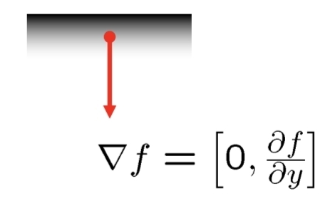

# 목차

1. [에지(Edge)](#7-에지edge)
	1. [에지 검출 기초](#71-에지-검출-기초)
		1. [연속/이산 미분](#711-연속이산-미분)
		2. [에지 모델과 1차/2차 미분](#712-에지-모델과-1차2차-미분)
		3. [잡음과 스무딩: 가우시안/가우시안 미분](#713-잡음과-스무딩-가우시안가우시안-미분)
		4. [에지 모델과 연산자](#714-에지-모델과-연산자)
		5. [에지 강도와 에지 방향](#715-에지-강도와-에지-방향)
	2. [영(0)교차 이론](#72-영0교차-이론)
		1. [가우시안](#721-가우시안)
			1. [가우시안 사용 이유](#7211-가우시안-사용-이유)
			2. [가우시안 수식](#7212-가우시안-수식)
		2. [LOG 필터](#722-log-필터)
	3. [컬러 에지](#73-컬러-에지)
		1. [채널별 처리의 한계](#731-채널별-처리의-한계)
		2. [디 젠조(Di Zenzo) 접근](#732-디-젠조di-zenzo-접근)

---

# 7. 에지(Edge)

- **유용성:** 물체 경계를 안정적으로 표시, 매칭·정합·분할의 핵심 단서.
- **어려움:** 잡음 증폭, 약한/누락(edge miss)·거짓 에지(false edge), 조명/질감 변화, 스케일 의존성.

## 7.1. 에지 검출 기초

### 7.1.1. 연속/이산 미분

- 연속 공간 미분: $$\displaystyle f'(x)=\frac{ds}{dx} = \lim_{\Delta x\to 0} \frac {s(x + \Delta x) - s(x))}{\Delta x}$$ 는 **밝기 변화율** → 에지에서 극값(피크).
- 이산 공간 미분: $$f'(x) = \frac{df}{dx} = \lim_{\Delta x\to 0} \frac {f(x + \Delta x) - f(x))}{\Delta x} = f(x{+}1)-f(x)$$
	- → 에지 연산자 마스크: $\begin{bmatrix} -1 & 1\end{bmatrix}$
- 

- 2차 미분: $$\begin{align}
			f''(x) &= \frac{d^2f}{dx^2}= f'(x) - f'(x-1) \\
			&= (f(x+1)-f(x)) - (f(x)-f(x-1)) \\
			&=f(x+1)+f(x-1)-2f(x)
			\end{align}$$
	- 마스크: $\begin{bmatrix} 1 & -2 & 1\end{bmatrix}$

- 에지 검출 과정
	- 1차 미분에서 봉우리, 2차 미분에서 영교차를 찾음

### 7.1.2 에지 모델과 1차/2차 미분

- **계단(step) 에지**: 밝기 불연속. 1차 미분=피크(±), 2차 미분=**0-교차(zero-crossing)**.
- **램프(ramp) 에지**: 실제 영상은 주로 램프(기울기 완만). 잡음 때문에 **스무딩 선행** 필요.
- **선(line) 에지**: 밝기 얇은 봉우리/골. 2차 미분 응답 유용.

### 7.1.3 잡음과 스무딩: 가우시안/가우시안 미분

- 
- 미분은 **고주파(잡음) 증폭** → **가우시안 스무딩 $G_\sigma$** 선행:
	- $I_\sigma = G_\sigma * I,\quad \partial_x I_\sigma = (\partial_x G_\sigma) * I$
- 가우시안은 **분리 가능** → $O(k^2)$ → $O(2k)$로 연산량 감소.
- **커널 크기**: $\text{size} \approx 6\sigma+1$ (가장 작은 홀수) 권장.

### 7.1.4. 에지 모델과 연산자

- $\Delta x = 1$이 잡음에 너무 민감 → $\Delta x = 2$로 확장
	- $$f'(x) = \frac{df}{dx}  = \frac{f(x+1)-f(x-1)}{2}$$
	- 마스크: $\begin{bmatrix} -1 & 0 & 1\end{bmatrix}$
- 2차원으로 확장
	- $$\begin{align}
\nabla f(y,x)
&= (\frac{\partial f}{\partial y}, \frac{\partial f}{\partial x})
= (d_y , d_x) \\
&= (f(y{+}1,x)-f(y{-}1,x)), (f(y,x{+}1)-f(y,x-1))
\end{align}
$$
	- 마스크: $$m_y=\begin{bmatrix}-1\\0\\1\end{bmatrix},\qquad
m_x=\begin{bmatrix}-1&0&1\end{bmatrix}$$

- **기본 미분 커널**
	- 
    - _Roberts_: 매우 작은 2×2 대각 미분(노이즈 취약, 오래된 방식)
    - _Prewitt_: 3×3, 미분 + 단순 평균 스무딩
    - _Sobel_: 3×3, 중앙 가중 → Prewitt보다 **스무딩 효과↑**, $G_y=G_x^\top$

- Haar Filter
- Ada Boost

### 7.1.5. 에지 강도와 에지 방향

- 
- 2D 그레이스케일 $I(x,y)$에서 **기울기(gradient)**
	- gradient: $$\nabla f=(\frac{\partial f}{\partial y}, \frac{\partial f}{\partial x})=(d_y, d_x)$$
	- 에지 강도: $$S(y, x) = |\nabla f|=\sqrt{d_y^2+d_x^2}$$
	- gradient 방향: $$D(y, x) = \theta=\operatorname{arctan}(\frac{d_y}{d_x})$$
	- 
	- 
	- 
- 예제
	- 

## 7.2. 영(0)교차 이론

- **핵심 아이디어:** 가우시안으로 스무딩 후 **라플라시안 $\nabla^2$**(2차 미분) 적용 → **0 교차** 위치를 에지로. 
	- $\nabla^2 (G_\sigma * I) = (\nabla^2 G_\sigma) * I = LoG_\sigma * I$
- **장점:** 스케일 $\sigma$로 에지의 **세밀도** 조절, 얇고 닫힌 경계 추출 용이.
- **구현 팁**
    - LoG 직접 컨볼루션 또는 **DoG(차분 가우시안)** 로 근사.
    - **제로 교차 판정** 시, 이웃 픽셀 간 **부호 변화**와 **2차 미분 크기 임계**를 함께 사용해 잡음 억제.

### 7.2.1. 가우시안
#### 7.2.1.1. 가우시안 사용 이유

- 미분은 잡음을 증폭 → 스무딩 적용
- 스케일 로 에지의 **세밀도** 조절
	- 

#### 7.2.1.2. 가우시안 수식

- 1차원: $$G(x)=\frac{1}{\sqrt{2\pi}\,\sigma} e ^{-\frac{x^{2}}{2\sigma^{2}}}$$
- 
- 2차원: $$G(y,x)=\frac{1}{2\pi\sigma^{2}} e^{-\frac{y^{2}+x^{2}}{2\sigma^{2}}}$$
- 
- **커널 크기**: $\text{size} \approx 6\sigma+1$ (가장 작은 홀수) 권장

### 7.2.2. LOG 필터

- 2차 미분에서 영교차 검출
	- 
- $$\begin{align}
\nabla^{2}f(y,x)&=\frac{\partial^{2}f}{\partial y^{2}}+\frac{\partial^{2}f}{\partial x^{2}} \\
&= \big(f(y{+}1,x)+f(y{-}1,x)-2f(y,x)\big) + \big(f(y,x{+}1)+f(y,x{-}1)-2f(y,x)\big) \\
&= f(y{+}1,x)+f(y{-}1,x)+f(y,x{+}1)+f(y,x{-}1)-4f(y,x)
\end{align}$$
- LOG 필터: $$L=\begin{bmatrix}
0&1&0\\
1&-4&1\\
0&1&0
\end{bmatrix}$$
- Sharpening 필터: $$L=\begin{bmatrix}
0&-1&0\\
-1&4&-1\\
0&-1&0
\end{bmatrix}$$
- LoG 필터: 입력 영상에 가우시안 G를 적용한 후, 결과에 라플라시안을 다시 적용하는 두 단계의 비효율성
	- LoG (convolution: `*`): $$\mathrm{LoG}(y,x)=\nabla^{2}\!\big(G(y,x)*f(y,x)\big)
	= \big(\nabla^{2}G(y,x)\big)*f(y,x)$$
	- 가우시안의 라플라시안: $$\nabla^{2}G(y,x)=\left(\frac{y^{2}+x^{2}-2\sigma^{2}}{\sigma^{4}}\right)G(y,x)$$
	- 
	- 
	- 

## 7.3. 컬러 에지

### 7.3.1. 채널별 처리의 한계

- 
- 
- RGB **각 채널에 독립 적용 후 OR** 하면 **채널마다 에지 위치가 달라** 불일치/중복 발생.

### 7.3.2. 디 젠조(Di Zenzo) 접근

- 컬러(벡터) 기울기 성분 (채널 r,g,b): $$\begin{aligned}
g_{yy} &= (d_{yr})^{2}+(d_{yg})^{2}+(d_{yb})^{2},\\
g_{xx} &= (d_{xr})^{2}+(d_{xg})^{2}+(d_{xb})^{2},\\
g_{yx} &= d_{yr}d_{xr}+d_{yg}d_{xg}+d_{yb}d_{xb}.
\end{aligned}$$
- 기울기(주고유벡터) 방향: $$D(y,x)=\tfrac{1}{2}\,\arctan\!\left(\frac{2\,g_{yx}}{\,g_{xx}-g_{yy}\,}\right)$$
- 에지 강도(주고유값의 제곱근): $$S(y,x)=\sqrt{\tfrac{1}{2}\Big((g_{yy}+g_{xx})
+(g_{xx}-g_{yy})\cos\!\big(2D(y,x)\big)
+2g_{yx}\sin\!\big(2D(y,x)\big)\Big)}$$

