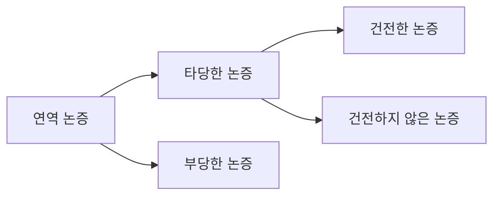
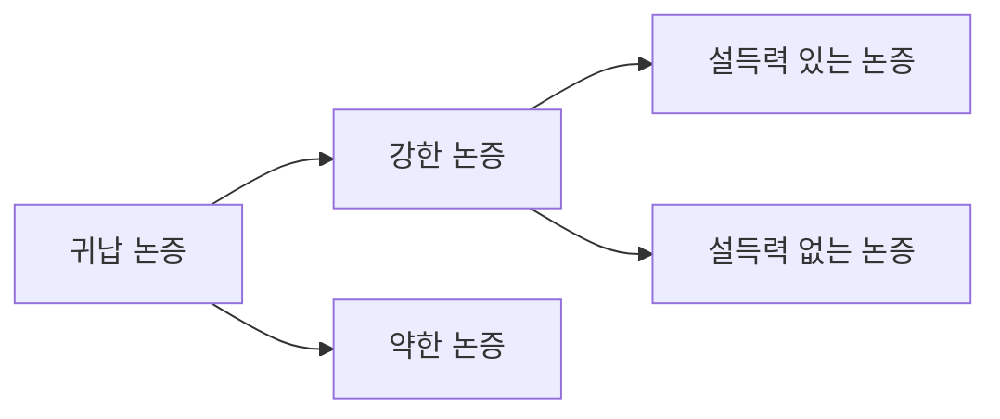
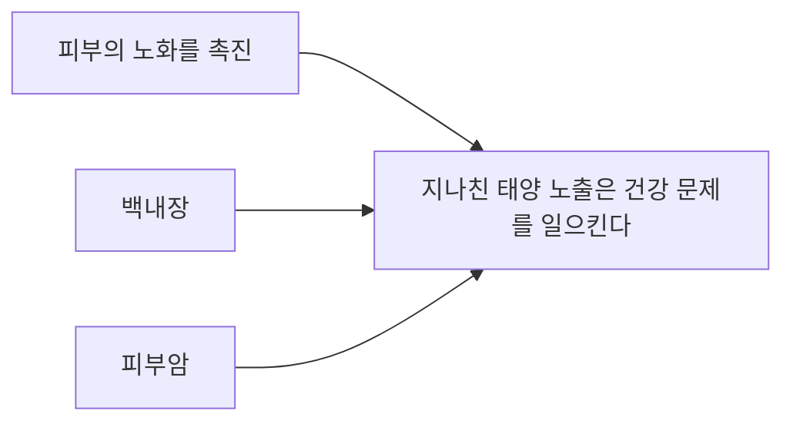
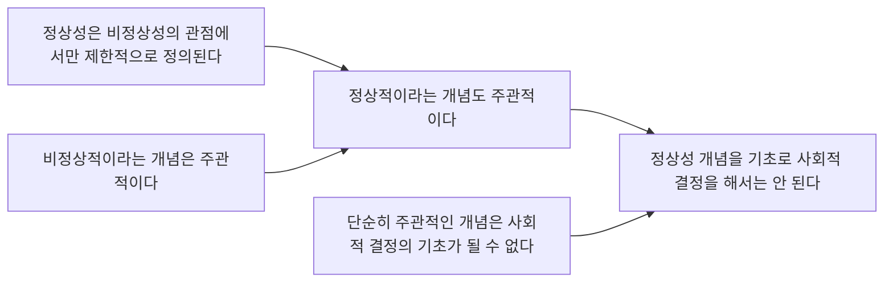

<!-- markdownlint-disable MD025 MD033 -->

<script src="https://cdn.jsdelivr.net/npm/mermaid/dist/mermaid.min.js"></script>

# 논증의 분류와 평가

## 1. 논증

### 1.1. 논증이란

논증: **어떤 주장(결론)** 과 그 주장을 뒷받침하는 **근거(전제)** 로 이루어진 말들의 집합이다.
→ 단순히 말을 나열하는 것이 아니라, **왜 그 결론을 받아들여야 하는지**를 보여주는 구조를 가진다.

### 1.2. 기본 예시

연역:

```text
모든 사람은 죽는다.
소크라테스는 사람이다.
그러므로 소크라테스는 죽는다.
```

귀납:

```text
소크라테스는 죽었다.
플라톤도 죽었다.
아리스토텔레스도 죽었다.
…
그러므로 모든 사람은 죽는다.
```

## 2. 연역 논증과 귀납 논증

편협한 정의:

- 연역: 일반 → 특수 (X)
- 귀납: 특수 → 일반 (X)

실제 구분 기준: **전제가 결론을 어떤 방식으로 뒷받침**하는가?

### 2.1. 연역 논증

연역 논증:

- **전제로부터 결론을 논리적 필연성 또는 확실성을 가지고 이끌어낼 수 있다고 기대되는 논증**이다.
- 성공적인 연역 논증에서는 **결론이 이미 전제 속에 함축**되어 있다.

예:

```text
모든 교수들은 교육자이다.
민정이는 교수이다.
그러므로 민정이는 교육자이다.
```

### 2.2. 귀납 논증

귀납 논증:

- **결론이 옳다는 것을 증명하기 위해 그럴듯한 증거를 전제로 제시하는 논증**이다.
- 귀납에서는 결론의 내용이 전제의 내용을 **넘어서며**, 결론은 확실한 참이라기보다 **개연성 있게 지지**된다.

예:

```text
교수들은 대부분 보수적이다. p → q
민정이는 교수이다. r → p
그러므로 아마도 민정이는 보수적일 것이다. r → q
```

## 3. 연역 논증과 귀납 논증 구분 예시

```text
비가 올 때는 언제나 길이 젖는다. p → q
그런데 지금 비가 온다. p
그러므로 지금 틀림없이 길이 젖을 것이다. q
```

이 경우 전제가 참이라면 결론도 반드시 참이므로 연역 논증의 형태에 가깝다.

```text
비가 왔을 때는 언제나 길이 젖는다. p → q
그런데 지금 길이 젖어 있다. p
그러므로 비가 왔음에 틀림없다. q
```

이 논증은 길이 젖은 다른 이유가 있을 수 있으므로, 전제가 결론을 필연적으로 보장하지 못한다. 따라서 연역적으로는 문제가 있다.

## 4. 연역 논증의 평가 기준

**타당성(validity)** 과 **건전성(soundness)** 으로 평가한다.

### 4.1. 타당성

타당성:

- **논리적 관계에 대한 기준**이다.  
- **전제를 참이라고 가정했을 때 결론의 참이 반드시 보장되는가**

#### 타당한 논증

```text
모든 사람은 포유류이다. p -> q
모든 포유류는 온혈 동물이다. q -> r
따라서 모든 사람은 온혈 동물이다. p -> r
```

#### 내용이 이상해도 타당할 수 있음

```text
모든 개는 깃털을 가지고 있다. p -> q
모든 새는 개이다. r -> p
그러므로 모든 새는 깃털을 가지고 있다. r -> q
```

전제 내용은 사실과 다르지만, **형식상** 전제가 참이라면 결론도 따라 나오므로 타당하다.

### 4.2. 부당성

타당하지 않은 연역 논증은 **부당한 논증**이다.

예:

```text
모든 사람은 두 발로 걷는다. p → q
개구리는 사람이 아니다. r → ~p
그러므로 개구리는 두 발로 걷지 않는다. r → ~q
```

이 경우 사람이 아니다라는 사실만으로 두 발로 걷지 않는다를 결론낼 수 없다.

### 4.3. 건전성

건전한 논증: **타당하면서 전제가 모두 참인 논증**이다.  
건전하지 않은 논증:

1. 타당하지만 전제가 거짓인 경우
2. 애초에 타당하지 않은 경우

정리하면 다음과 같다.



## 5. 귀납 논증의 평가 기준

**강도(strength)** 와 **설득력(cogency)** 으로 평가

### 5.1. 강도

강도: **전제를 참이라고 가정했을 때 결론의 참이 얼마나 그럴듯하게 보장되는가**를 평가하는 기준이다. 연역과 달리 **정도의 차이**를 허용한다.

예:

```text
독감 예방 접종을 한 사람들의 80%가 그해 겨울 독감에 걸리지 않았다.
현이는 독감 예방 접종을 받았다.
그러므로 현이는 이번 겨울에 독감에 걸리지 않을 것이다.
```

이 논증은 결론을 필연적으로 보장하지는 않지만, 어느 정도 강한 지지를 제공한다.

### 5.2. 설득력

설득력 있는 논증: **강한 귀납 논증 중에서 전제가 실제로 모두 참인 논증**이다.  

설득력 없는 논증은 다음 경우를 포함한다.

1. 강하지만 거짓 전제가 섞여 있는 경우
2. 애초에 약한 논증인 경우



### 5.3. 귀납 논증 평가 시 주의점

귀납 논증의 강도를 평가하는 일은 쉽지 않다. **추가 정보나 전문지식**이 필요할 수도 있다. 또한 단순한 사례 수집만으로는 부족하고, **연관 관계**와 **충분한 양의 증거**가 중요하다.

예:

```text
1970년과 1997년 우리나라의 경제 상황이 좋지 않을 때 미니스커트가 유행했다.
따라서 경제 불황기가 되면 여성들의 치마 길이가 짧아진다.
```

이 논증은 사례 수가 너무 적고 인과나 상관의 근거도 약해 설득력이 낮다.

## 6. 논증의 재구성과 분석

### 6.1. 숨은 전제 보충

실제 언어생활에서 논증은 종종 **생략된 전제**를 포함한다. 따라서 논증을 정확히 분석하려면 숨겨진 전제를 보충해야 한다.

예:

```text
나는 이번 주말에 스키를 타러 가려고 한다.
그러므로 나는 내일 강원도에 있을 것이다.
```

이 논증에는 다음과 같은 전제가 보충되어야 한다.

```text
내일부터가 주말이다.
내가 가려고 하는 스키장이 강원도에 있다.
```

### 6.2. 자비의 원리

자비의 원리(principle of charity):

- 상대방이 합리적이라고 가정하고, 그의 논의를 가장 그럴듯하게 해석해야 한다
- 상대의 말을 일부러 가장 약하게 해석하거나 허술하게 만들지 말고, 가능한 한 **최선의 의미로 복원**해야 한다.

### 6.3. 논증 구조도

논증은 단순히 전제-결론 한 줄 구조가 아니라, **복수의 전제가 결합**하거나 **중간 결론을 거쳐 최종 결론에 이르는 구조**를 가질 수 있다.

## 7. 대표 예시 분석

```text
많은 사람들은 선탠한 몸이 매력적이며, 건강의 상징이라 생각한다.
그러나 지나친 태양 노출은 건강 문제를 일으킨다. (결론)
가장 눈에 띄는 부작용 중 하나는 자외선이 피부의 노화를 촉진하는 것이다. (전제)
태양은 또한 일종의 백내장을 일으킨다. (전제)
그리고 가장 걱정스러운 것은 피부암 발생에 어떤 역할을 하는 것이다. (전제)
```



```text
정상성은 비정상성의 관점에서만 제한적으로 정의된다. (전제)
비정상적이라는 개념은 주관적이다. (전제)
따라서 정상적이라는 개념도 주관적이다. (결론 1)
단순히 주관적인 개념은 사회적 결정의 기초가 될 수 없다. (전제)
그러므로 정상성 개념을 기초로 사회적 결정을 해서는 안 된다. (결론 2)
```



## 8. 연습문제

...

## 9. 언어와 정의

### 9.1. 언어의 사용과 언급

어떤 표현은 대상을 **사용**하는 것이고, 어떤 경우는 그 표현 자체를 **언급**하는 것이다.

예:

- 대한민국은 동아시아에 있다. → 대상을 사용
- 대한민국은 네 음절을 가진다. → 표현 자체를 언급

즉, 말이 가리키는 **대상**을 말하는지, 말이라는 **기호 자체**를 말하는지 구분해야 한다.

### 9.2. 내포와 외연

#### 9.2.1. 내포

내포: 단어가 적용되는 사물의 **속성들**이다.

예:

- 사람이란 이성을 가진 동물이다.
- 사람이란 깃털 없는 두 발 짐승이다.

#### 9.2.2. 외연

외연: 그 단어가 실제로 적용되는 **대상들의 집합**이다.

예:

- 사람이란 서태지, 윤도현, 이문세, 이승철, 이미자, 설운도 등이다.

#### 9.2.3. 관계

- 외연이 넓어질수록 내포는 줄어든다.
- 외연이 좁아질수록 내포는 늘어난다.

<script>
mermaid.initialize({startOnLoad:true});
window.mermaid.init(undefined, document.querySelectorAll('.language-mermaid'));
</script>
