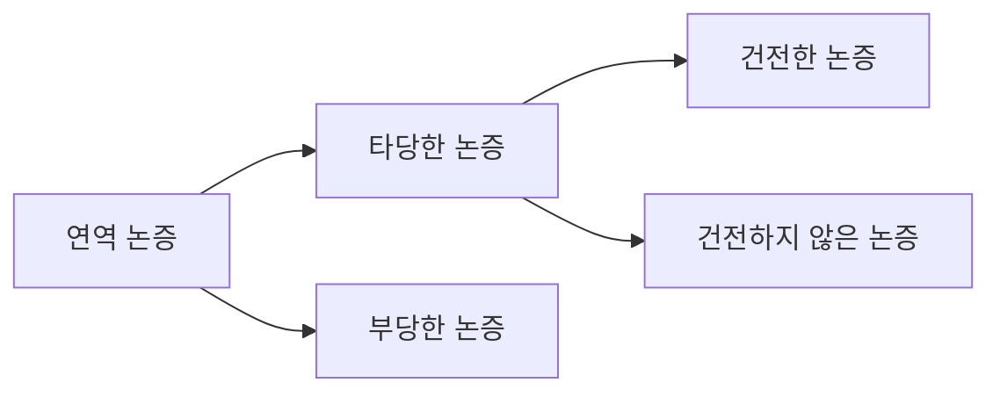
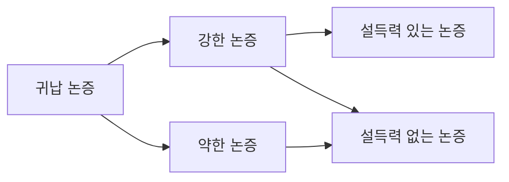
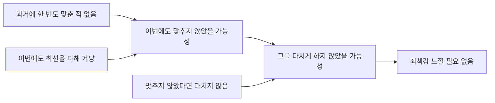
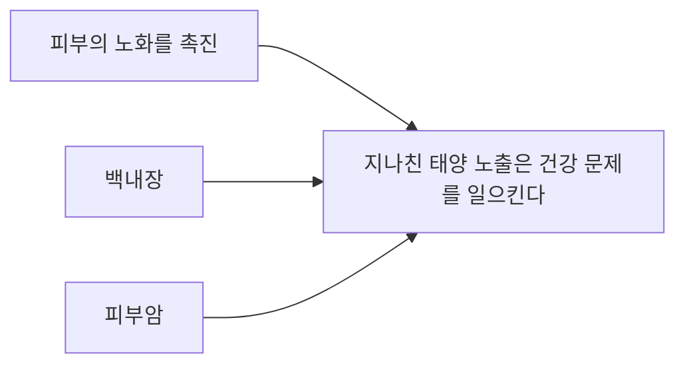
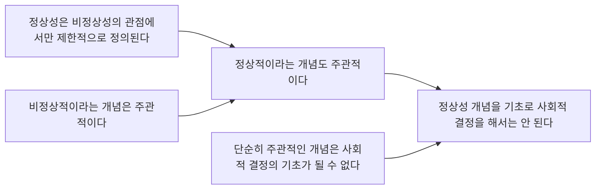

<!-- markdownlint-disable MD010 MD025 MD033 -->

<script src="https://cdn.jsdelivr.net/npm/mermaid/dist/mermaid.min.js"></script>

# 논증의 분류와 평가

## 목차

1. [논증](#1-논증)
    1. [논증이란](#11-논증이란)
    2. [예시](#12-예시)
2. [연역 논증과 귀납 논증](#2-연역-논증과-귀납-논증)
    1. [연역 논증](#21-연역-논증)
    2. [귀납 논증](#22-귀납-논증)
    3. [예시](#23-예시)
3. [연역 논증의 평가 기준](#3-연역-논증의-평가-기준)
    1. [타당성(Validity)](#31-타당성validity)
    2. [건전성(Soundness)](#32-건전성soundness)
4. [귀납 논증의 평가 기준](#4-귀납-논증의-평가-기준)
    1. [강도(Strength)](#41-강도strength)
        1. [귀납 논증 평가 시 주의점](#411-귀납-논증-평가-시-주의점)
    2. [설득력(Cogency)](#42-설득력cogency)
    3. [예시](#43-예시)
        1. [연역 논증 V.S. 귀납 논증](#431-연역-논증-vs-귀납-논증)
        2. [연역 논증의 타당성](#432-연역-논증의-타당성)
        3. [귀납 논증의 강도](#433-귀납-논증의-강도)
5. [논증의 재구성과 분석](#5-논증의-재구성과-분석)
    1. [숨은 전제 보충](#51-숨은-전제-보충)
    2. [자비의 원리](#52-자비의-원리)
    3. [논증 구조도](#53-논증-구조도)
    4. [예시](#54-예시)
6. [예제](#6-예제)

---

## 1. 논증

### 1.1. 논증이란

논증: **어떤 주장(결론)** 과 그 주장을 뒷받침하는 **근거(전제)** 로 이루어진 말들의 집합이다.  
→ 단순히 말을 나열하는 것이 아니라, **왜 그 결론을 받아들여야 하는지**를 보여주는 구조를 가진다.

### 1.2. 예시

연역:

```text
모든 사람은 죽는다.
소크라테스는 사람이다.
그러므로 소크라테스는 죽는다.
```

귀납:

```text
소크라테스는 죽었다.
플라톤도 죽었다.
아리스토텔레스도 죽었다.
…
그러므로 모든 사람은 죽는다.
```

## 2. 연역 논증과 귀납 논증

편협한 정의:

- 연역: 일반 → 특수 (X)
- 귀납: 특수 → 일반 (X)

실제 구분 기준: **전제가 결론을 어떤 방식으로 뒷받침**하는가?

### 2.1. 연역 논증

연역 논증:

- **전제로부터 결론을 논리적 필연성 또는 확실성을 가지고 이끌어낼 수 있다고 기대되는 논증**이다.
- 성공적인 연역 논증에서는 **결론이 이미 전제 속에 함축**되어 있다.

예:

```text
모든 교수들은 교육자이다.
민정이는 교수이다.
그러므로 민정이는 교육자이다.
```

### 2.2. 귀납 논증

귀납 논증:

- **결론이 옳다는 것을 증명하기 위해 그럴듯한 증거를 전제로 제시하는 논증**이다.
- 귀납에서는 결론의 내용이 전제의 내용을 **넘어서며**, 결론은 확실한 참이라기보다 **개연성 있게 지지**된다.

> 전제 < 결론 → 비약

예:

```text
교수들은 대부분 보수적이다. p → q
민정이는 교수이다. r → p
그러므로 아마도 민정이는 보수적일 것이다. r → q
```

### 2.3. 예시

```text
지금까지 해는 항상 동쪽에서 떴다.
그러므로 내일도 해는 동쪽에서 뜰 것이다.
```

<details>
<summary>답 접기/펼치기</summary>
<div markdown="1">

해가 동쪽에서 뜨지 않을 수도 있음 → 귀납

</div>
</details>

```text
비가 올 때는 언제나 길이 젖는다. p → q
그런데 지금 비가 온다. p
그러므로 지금 틀림없이 길이 젖을 것이다. q
```

<details>
<summary>답 접기/펼치기</summary>
<div markdown="1">

전제가 참이면 결론도 반드시 참 → 연역

</div>
</details>

```text
비가 왔을 때는 언제나 길이 젖는다. p → q
그런데 지금 길이 젖어 있다. p
그러므로 비가 왔음에 틀림없다. q
```

<details>
<summary>답 접기/펼치기</summary>
<div markdown="1">

길이 젖은 다른 이유가 있을 수 있음 → 귀납

</div>
</details>

## 3. 연역 논증의 평가 기준

**타당성(validity)** 과 **건전성(soundness)** 으로 평가한다.

### 3.1. 타당성(Validity)

**타당성**:

- **논리적 관계**에 대한 기준
- **전제를 참이라고 가정했을 때 결론의 참이 반드시 보장되는가**

예시:

```text
모든 사람은 포유류이다. p → q
모든 포유류는 온혈 동물이다. q → r
따라서 모든 사람은 온혈 동물이다. p → r
```

**내용이 이상해도 타당할 수 있음**:

```text
모든 개는 깃털을 가지고 있다. p → q
모든 새는 개이다. r → p
그러므로 모든 새는 깃털을 가지고 있다. r → q
```

전제 내용은 사실과 다르지만, **형식상** 전제가 참이라면 결론도 따라 나오므로 타당하다.

---

**부당성**:

- 타당하지 않은 연역 논증은 **부당한 논증**이다.

예:

```text
모든 사람은 두 발로 걷는다. p → q
개구리는 사람이 아니다. r → ~p
그러므로 개구리는 두 발로 걷지 않는다. r → ~q
```

"사람이 아니다"라는 사실만으로 두 발로 걷지 않는다를 결론낼 수 없다.

### 3.2. 건전성(Soundness)

건전한 논증: **타당하면서 전제가 모두 참인 논증**이다.  
건전하지 않은 논증:

1. 타당하지만 전제가 거짓인 경우
2. 애초에 타당하지 않은 경우



## 4. 귀납 논증의 평가 기준

**강도(strength)** 와 **설득력(cogency)** 으로 평가

### 4.1. 강도(Strength)

**강도**:

- **전제를 참이라고 가정했을 때 결론의 참이 얼마나 그럴듯하게 보장되는가**를 평가하는 기준이다.
- **정도의 차이**를 허용

예:

```text
독감 예방 접종을 한 사람들의 80%가 그해 겨울 독감에 걸리지 않았다.
현이는 독감 예방 접종을 받았다.
그러므로 현이는 이번 겨울에 독감에 걸리지 않을 것이다.
```

결론을 필연적으로 보장 X, 강한 지지 제공

```md
내 주변의 70세가 넘은 사람들 중 80%가 6시 이전에 일어난다.
그러므로 나도 70세가 넘으면 6시 이전에 일어날 것이다.
```

결론을 필연적으로 보장 X, 약한 지지 제공

#### 4.1.1. 귀납 논증 평가 시 주의점

귀납 논증의 강도를 평가하는 일은 쉽지 않다. **추가 정보나 전문지식**이 필요할 수도 있다. 또한 단순한 사례 수집만으로는 부족하고, **연관 관계**와 **충분한 양의 증거**가 중요하다.

예:

```text
1970년과 1997년 우리나라의 경제 상황이 좋지 않을 때 미니스커트가 유행했다.
따라서 경제 불황기가 되면 여성들의 치마 길이가 짧아진다.
```

사례 수가 너무 적고 인과나 상관의 근거도 약해 설득력이 낮다.

### 4.2. 설득력(Cogency)

설득력 있는 논증: **강한 귀납 논증 중에서 전제가 실제로 모두 참인 논증**이다.  

설득력 없는 논증:

1. 강하지만 거짓 전제가 섞여 있는 경우
2. 애초에 약한 논증인 경우



### 4.3. 예시

#### 4.3.1. 연역 논증 V.S. 귀납 논증

```md
근본적으로 나는 내가 그를 다치게 했다고 생각하지 않는다.
확률의 법칙에 따랐을 때 나는 죄책감을 느낄 필요가 없다.
왜냐하면 나는 언제나 내가 총으로 맞추려는 대상을 결코 정확하게 맞춘 적이 없기 때문이다.
그리고 나는 내가 그를 정확하게 겨냥하려고 최선을 다했음을 알고 있다.
```

<details>
<summary>답 접기/펼치기</summary>
<div markdown="1">



과거 경험을 근거로 현재 상황을 추론 → 확실성 X → 귀납

</div>
</details>

```md
동성애적인 성향은 유전에 의한 것이거나 아니면 문화적인 것이다.
그런데 문화적인 것이 아니라는 것이 확실히 밝혀졌다.
그러므로 동성애적 성향은 유전적인 것이다.
```

<details>
<summary>답 접기/펼치기</summary>
<div markdown="1">

```md
A ∨ B
~B
∴ A
```

선택 삼단논법(Disjunctive Syllogism) → 연역

</div>
</details>

#### 4.3.2. 연역 논증의 타당성

```md
만일 신이 존재한다면, 삶은 의미가 있을 것이다.
그리고 만일 신이 존재하지 않는다면, 삶은 불가사의한 것이 된다.
따라서 만일 삶이 의미가 없다면, 삶은 불가사의한 것이 된다.
```

<details>
<summary>답 접기/펼치기</summary>
<div markdown="1">

```md
P → Q
~P → R
~Q → R
```

- 삶이 의미 없다면 (~Q)
- P → Q 이므로 → Q가 거짓이면 P도 거짓(~P)
- 따라서 ~P → R에 의해 R이 성립한다.

타당

</div>
</details>

#### 4.3.3. 귀납 논증의 강도

```md
한 대학병원의 정신과 의사들은 혈전증 환자의 건강에 영향을 미치는 사회적 요소에 대한 연구를 하였다.
94명의 환자들을 조사하였는데, 그들 중 50%가 애완동물을 기르고 있었다.
애완동물을 기르지 않은 환자의 약 3분의 1이 1년 내에 죽었지만,
애완동물을 기른 환자는 단지 3명이 죽었을 뿐이다.
그 정신과 의사들은 애완동물을 기르는 것이 환자의 건강에 긍정적인 영향을 미친다는 결론을 내렸다.
```

<details>
<summary>답 접기/펼치기</summary>
<div markdown="1">

1. 상관관계와 인과관계의 혼동
	- 애완동물을 기르는 사람들의 건강 상태가 더 좋았다 → 애완동물 때문에 건강이 좋아졌다 (X)
2. 표본 규모와 통제 부족
	- 질병의 중증도, 나이, 생활습관 등 같은 변수를 통제했는지 제시 X
3. 결론이 너무 강함
	- "긍정적인 영향을 미친다"라고 원인적 표현을 사용함

→ 약하다

</div>
</details>

## 5. 논증의 재구성과 분석

### 5.1. 숨은 전제 보충

실제 언어생활에서 논증은 종종 **생략된 전제**를 포함한다. 따라서 논증을 정확히 분석하려면 숨겨진 전제를 보충해야 한다.

예:

```text
나는 이번 주말에 스키를 타러 가려고 한다.
그러므로 나는 내일 강원도에 있을 것이다.
```

이 논증에는 다음과 같은 전제가 보충되어야 한다.

```text
내일부터가 주말이다.
내가 가려고 하는 스키장이 강원도에 있다.
```

### 5.2. 자비의 원리

**자비의 원리(principle of charity)**:

- 상대방이 합리적이라고 가정하고, 그의 논의를 가장 그럴듯하게 해석해야 한다
- 상대의 말을 일부러 가장 약하게 해석하거나 허술하게 만들지 말고, 가능한 한 **최선의 의미로 복원**해야 한다.

예:

```md
영국의 왕실은 폐지되어야 한다.
그것은 불평등의 상징이다.
```

암묵적 전제: `불평등의 상징인 제도는 폐지되어야 한다`

### 5.3. 논증 구조도

논증은 단순히 전제-결론 한 줄 구조가 아니라, **복수의 전제가 결합**하거나 **중간 결론을 거쳐 최종 결론에 이르는 구조**를 가질 수 있다.

1. 직접 지지 (P → C)
2. 연쇄 구조 (P → C1 → C2)
3. 독립 지지 (P1, P2 각각 → C)
4. 결합 지지 (P1 + P2 함께 → C)

### 5.4. 예시

```text
많은 사람들은 선탠한 몸이 매력적이며, 건강의 상징이라 생각한다.
그러나 지나친 태양 노출은 건강 문제를 일으킨다. (결론)
가장 눈에 띄는 부작용 중 하나는 자외선이 피부의 노화를 촉진하는 것이다. (전제)
태양은 또한 일종의 백내장을 일으킨다. (전제)
그리고 가장 걱정스러운 것은 피부암 발생에 어떤 역할을 하는 것이다. (전제)
```

<details>
<summary>답 접기/펼치기</summary>
<div markdown="1">



독립적 지지

</div>
</details>

```text
정상성은 비정상성의 관점에서만 제한적으로 정의된다. (전제)
비정상적이라는 개념은 주관적이다. (전제)
따라서 정상적이라는 개념도 주관적이다. (결론 1)
단순히 주관적인 개념은 사회적 결정의 기초가 될 수 없다. (전제)
그러므로 정상성 개념을 기초로 사회적 결정을 해서는 안 된다. (결론 2)
```

<details>
<summary>답 접기/펼치기</summary>
<div markdown="1">



연쇄 논증(Serial Structure): 전제 -> 중간 결론 -> 최종 결론

</div>
</details>

## 6. 예제

```md
시험을 치른 학생은 모두 50명이다.
그러므로 시험 답안지는 모두 50장이어야 한다.
```

<details>
<summary>답 접기/펼치기</summary>
<div markdown="1">

암묵적 전제: `각 학생은 하나의 답안지를 제출한다`

</div>
</details>

```md
알려진 최초의 수를 표현하는 기호는 뼈와 돌에 파거나 긁어서 새긴 단순한 자국들로 2만 년 이상 이전으로 거슬러 올라간다.
그럼에도 숫자를 기록하는 체계적인 방법이 발면된 것은 5천 5백 년 전이므로,
그때에 이르러서야 계산이란 것이 가능해졌을 것이다.
```

<details>
<summary>답 접기/펼치기</summary>
<div markdown="1">

암묵적 전제: `계산은 체계적인 숫자 체계가 있어야 가능하다`

</div>
</details>

```md
미토콘드리아의 가장 큰 변이가 아프리카 사람들 속에서 일어났기 때문에,
과학자들은 그들이 가장 긴 진화의 역사를 가졌다는 결론을 내렸다.
이러한 결론은 곧 현대 인간의 기원이 아프리카인일 가능성이 높다는 것을 지시하고 있다.
```

<details>
<summary>답 접기/펼치기</summary>
<div markdown="1">

암묵적 전제: `유전적 변이가 많을수록 더 오래된 집단이다`, `가장 오래된 집단이 기원이다`

</div>
</details>

<script>
mermaid.initialize({startOnLoad:true});
window.mermaid.init(undefined, document.querySelectorAll('.language-mermaid'));
</script>
