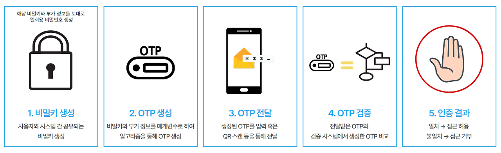
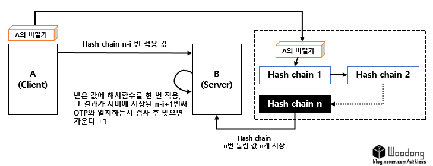
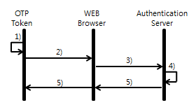
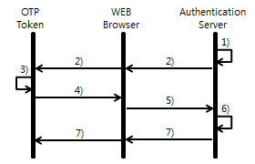

# One Time Password, OTP

## 목차

1. [정의](#1-정의)
2. [특징](#2-특징)
3. [장점](#3-장점)
4. [단점](#4-단점)
5. [동작 방식](#5-동작-방식)
6. [인증 방식](#6-인증-방식)
    1. [S/KEY(= Lamport 해시 체인) OTP](#61-skey-lamport-해시-체인-otp)
    2. [Time-based OTP](#62-time-based-otp)
    3. [Challenge-Response OTP](#63-challenge-response-otp)
    4. [Event-Synchronous OTP](#64-event-synchronous-otp)
7. [참고](#참고)

---

## 1. 정의

OTP(One-Time Password)는 **한 번만 사용하도록 설계된 비밀번호(또는 인증 코드)** 를 의미한다. 일반적으로 다음과 같은 이름으로도 불린다.

- 일회용 비밀번호(One-Time Password/PIN, OTP)
- 일회용 인증번호(One-Time Authorization Code, OTAC)
- 동적 암호(Dynamic Password)

OTP는 **매번 바뀌는 값**을 만들어 내는 인증 방식이며, 사용자와 서버가 **사전에 공유한 비밀 값(Seed/Key)** 을 기반으로 동작한다. 시스템은 이 비밀 값에 **시간(Time Stamp)** 또는 **카운터(Counter)** 같은 변하는 입력을 결합해, 그 시점(또는 그 순번)에서만 유효한 코드를 생성한다.
즉, 매 요청마다 동일한 비밀을 직접 전송하는 대신, 그 비밀로부터 “지금 이 순간에만 맞는 코드”를 생성해 인증에 사용한다. 한 번 사용된 코드는 재사용이 어렵고 유효 시간이 짧기 때문에 **재사용 공격(Replay Attack)** 에 상대적으로 강한 편이다.

## 2. 특징

- 일회성: 생성된 비밀번호는 단 한 번만 사용 가능하며, 이후에는 무효화된다.
- 시간 또는 사용 제한: 일정 시간이 지나거나 사용 후 자동으로 만료된다.
- 무작위성: 고유 알고리즘으로 무작위로 생성되며, 예측이 어렵다.
- 추가 보안 계층: 고정된 비밀번호 외에도 추가 인증 요소로 사용되어 보안을 강화한다.

## 3. 장점

- 높은 보안성: 일회성으로 비밀번호 유출 위험을 최소화한다.
- 다양한 응용 가능성: 로그인, 은행 거래, 데이터 접근 등 다양한 상황에서 사용 가능하다.
- 예측 불가능성: 무작위 생성으로 인해 공격자가 OTP를 추측하기 어렵다.
- 다중 인증(MFA) 구현: OTP를 기존 비밀번호와 결합해 이중 보안 계층을 제공할 수 있다.

## 4. 단점

- 의존성: SMS나 이메일 기반 OTP는 네트워크나 서버에 의존적이다.
- 전송 지연: SMS 전송 지연으로 인해 인증이 실패할 가능성이 있다.
- 도난 가능성: 하드웨어 토큰 도난 또는 SMS 스니핑 공격 위험이 있다.
- 사용자 경험 저하: OTP 입력은 번거로울 수 있어 사용자 편의성이 떨어질 수 있다.

## 5. 동작 방식

*출처: [Tistory: OTP의 동작 원리, HOTP와 TOTP 이해하기](https://danyoujeong.tistory.com/223)*

1. 비밀키 생성
	1. 사용자와 시스템 간 공유되는 비밀키를 생성한다.
2. 시간 정보 또는 카운터 사용
	1. TOTP: 특정 시간(예: 1분)마다 새로운 OTP를 생성한다. 시간 정보와 비밀키를 조합해 OTP를 계산한다.
	2. HOTP: 사용자의 세션 또는 이벤트가 발생할 때마다 새로운 OTP를 생성한다. 일정한 카운터와 비밀키를 조합해 OTP를 계산한다.
3. OTP 생성
4. OTP 전달
	1. 사용자에게 생성된 OTP를 안전하게 전달한다.
	2. 일반적으로 모바일 앱(예: Google Authenticator)를 통해 QR 코드를 스캔하거나, 텍스트 형식의 OTP를 입력하도록 유도한다.
5. OTP 검증
	1. 사용자가 입력한 OTP와 시스템에서 생성한 OTP 를 비교해 일치 여부를 확인한다.
6. 인증 결과
	1. OTP가 일치하면 인증이 성공하고 사용자에게 접근을 허용한다.
	2. OTP가 불일치하면 인증이 실패하고 접근을 거부한다.

## 6. 인증 방식

### 6.1. S/KEY OTP

S/KEY OTP는 **해시 함수를 연쇄 적용한 값(Lamport 해시 체인)** 을 역순으로 한 번씩 제출해 인증하는 방식으로, 매번 값이 소모되어 재사용이 불가능하다.

*출처: [Tistory: OTP (One Time Password) 인증](https://plummmm.tistory.com/311)*

1. 클라이언트 A : 임의의 비밀키를 서버로 전송한다.
2. 서버 S : 클라이언트 A로부터 받은 비밀키를 첫 값으로 사용하여, 해시 체인 방식으로, 이전 결과 값에 대한 해시 값을 구하는 작업을 n번 반복한다.
	- 해시 체인 방식 : 해시된 값에 다시 해시함수를 반복적으로 적용하는 것이다. (예, H(H(s)))
3. 서버 S : 생성된 $n$ 개의 클라이언트 인증키를 서버에 저장한다.

또한 이를 통해, 클라이언트에서 i번째로 서버에 인증을 요구할 때의 인증 방식은 아래와 같다.

1. 클라이언트 A : 클라이언트에서 정한 최초의 비밀키에 해시 함수를 $n-i$ 번 중첩 적용하여 서버로 전송한다.
2. 서버 S : 클라이언트로부터 받은 값에 해시 함수를 한 번 적용한다. 그 결과가 서버에 저장된 $n-i+1$ 번째 해시값(인증키)와 일치하는지 검사한다.
3. 일치하면 인증에 성공한 것으로, 카운트($i$)를 1 증가시킨다.

### 6.2. Time-based OTP

Time-based OTP(TOTP)는 **현재 시간(고정된 시간 간격)** 을 입력으로 사용해 공유 비밀키로 OTP를 생성하며, 짧은 유효시간 내에서만 인증되는 방식이다.

*출처: [Naver D2: 2차 인증 소개](https://d2.naver.com/helloworld/279640)*

1. 클라이언트 : OTP 토큰 내부의 자체 시간 정보를 이용해서 OTP를 생성한다.
2. 클라이언트 : 생성된 OTP값을 입력한다. OTP 값을 웹서버로 전달한다.
3. 웹서버 : OTP를 인증 서버로 검증요청한다.
4. 인증서버 : 서버의 자체 시간 정보를 이용해서 OTP를 생성하고 검증한다.
5. 인증서버 및 웹서버 : OTP 검증 결과를 전송한다.

### 6.3. Challenge-Response OTP

Challenge-Response OTP는 서버가 제시한 **난수(Challenge)** 에 대해 사용자가 공유 비밀키로 **일회성 응답(Response)** 을 계산해 제출함으로써 인증하는 방식이다.

*출처: [Naver D2: 2차 인증 소개](https://d2.naver.com/helloworld/279640)*

1. 인증서버 : 시도 값을 생성한다.
2. 인증서버 및 웹서버 : 생성된 시도 값을 전달한다.
3. 클라이언트 : 시도 값을 이용해서 OTP를 생성한다.
4. 클라이언트 : 생성된 OTP를 입력한다. OTP를 웹서버에 전달한다.
5. 웹서버 : OTP 인증 서버로 검증을 요청한다.
6. 인증서버 : 시도 값을 이용해서 OTP를 생성하고 검증한다.
7. 인증버서 및 웹서버 : OTP 검증 결과를 전송한다.

### 6.4. Event-Synchronous OTP

Event-Synchronous OTP는 시간 대신 **이벤트/카운터(예: 버튼 누름, 로그인 시도 횟수)** 를 기준으로 OTP를 생성하고, 사용자·서버의 카운터가 동기화되어 있을 때만 인증되는 방식이다.

*출처: [Naver D2: 2차 인증 소개](https://d2.naver.com/helloworld/279640)*

1. 클라이언트 : 토큰 내부의 이벤트 정보를 이용해서 OTP를 생성한다.
2. 클라이언트 : 생성된 OTP 값을 입력한다.
3. 웹서버 : OTP 인증 서버로 검증요청한다.
4. 인증서버: 서버의 자체 이벤트 정보를 이용해서 OTP를 생성하고 검증한다.
5. 인증서버 및 웹서버 : OTP 검증 결과를 전송한다.

---

## 참고

- [Auth Wiki: OTP는 무엇인가요?](https://auth-wiki.logto.io/ko/otp)
- [ENTRUST: OTP란 무엇입니까?](https://www.entrust.com/ko/resources/learn/what-is-a-one-time-password)
- [Wikipedia: OTP](https://ko.wikipedia.org/wiki/%EC%9D%BC%ED%9A%8C%EC%9A%A9_%EB%B9%84%EB%B0%80%EB%B2%88%ED%98%B8)
- [Naver D2: 2차 인증 방식](https://d2.naver.com/helloworld/279640)
- [Tistory: OTP(One-Time Password)에 대해 알아보겠습니다.](https://feccle.tistory.com/329)
- [Tistory: OTP의 동작 원리, HOTP와 TOTP 이해하기](https://danyoujeong.tistory.com/223)
- [Tistory: OTP (One Time Password) 인증](https://plummmm.tistory.com/311)
