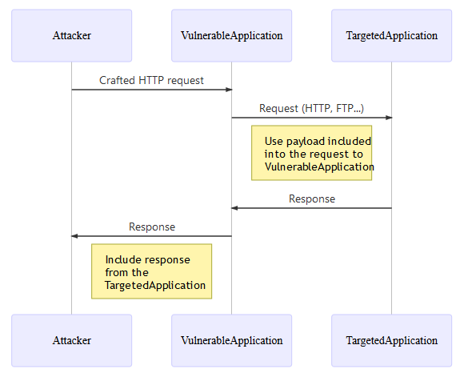
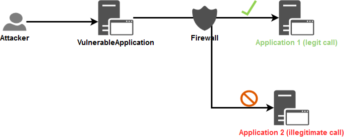
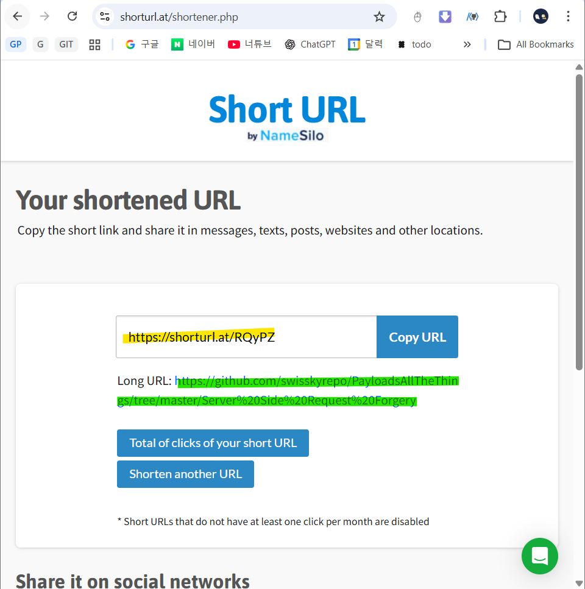
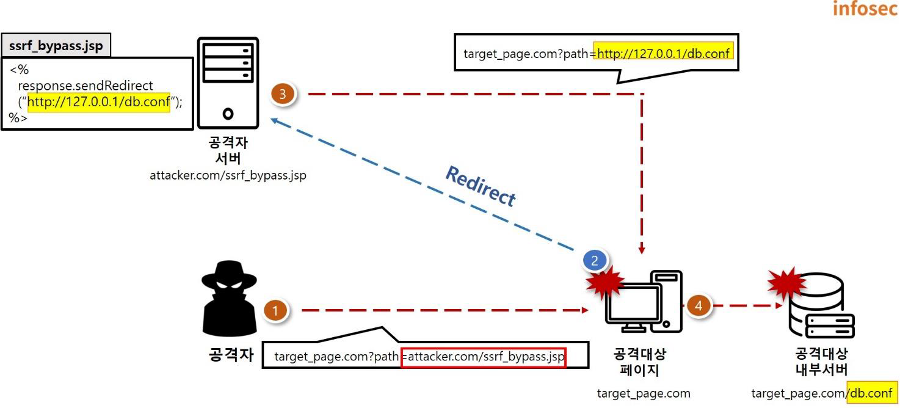

<!-- markdownlint-disable MD007 MD010 MD024 MD025 MD033 -->

# SSRF, Server Side Request Forgery

## 목록

1. [정의](#1-정의)
1. [동작 원리](#2-동작-원리)
1. [CSRF v.s. SSRF](#3-csrf-vs-ssrf)
1. [공격 시나리오](#4-공격-시나리오)
1. [보안대책](#5-보안대책)
    1. [“식별된 신뢰 시스템”만 호출하면 되는 경우](#51-식별된-신뢰-시스템만-호출하면-되는-경우)
        1. [애플리케이션 계층](#511-애플리케이션-계층)
        1. [네트워크 계층](#512-네트워크-계층)
    1. [“어떤 외부 IP/도메인”도 호출해야 하는 경우](#52-어떤-외부-ip도메인도-호출해야-하는-경우)
        1. [애플리케이션 계층에서 URL 차단이 어려운 이유](#521-애플리케이션-계층에서-url-차단이-어려운-이유)
        1. [애플리케이션 계층](#522-애플리케이션-계층)
        1. [네트워크 계층](#523-네트워크-계층)
    1. [클라우드 환경: IMDSv2(AWS)](#53-클라우드-환경-imdsv2aws)
1. [우회 기법](#6-우회-기법)
    1. [Short URL 기능을 이용](#61-short-url-기능을-이용)
    1. [Redirect 기능을 이용](#62-redirect-기능을-이용)
1. [출처](#출처)

---

## 1. 정의

**SSRF(Server Side Request Forgery, 서버 측 요청 위조)**: 공격자가 서버에서 이루어지는 요청을 변조하는 웹 취약점 공격이다.
CSRF(Client Side Request Forgery)는 클라이언트의 권한을 이용해 악의적인 요청을 전송한 것과 달리, SSRF는 **서버의 권한을 이용**해 **악의적인 요청을 전송**한다.
즉, 서버로부터 공격이 시작되기 때문에 외부에서 직접 접근이 불가한 **내부 서버 및 시스템에 접근**할 수 있으며, **내부 네트워크 내에서 악의적인 행위를 수행**할 수 있다.

## 2. 동작 원리

*출처: [OWASP: Server-Side Request Forgery Prevention Cheat Sheet](https://cheatsheetseries.owasp.org/cheatsheets/Server_Side_Request_Forgery_Prevention_Cheat_Sheet.html)*

대상 애플리케이션에는 다음과 같은 기능이 있을 수 있다.

- URL로부터 데이터 가져오기
- URL로 데이터를 발행하기
- URL에서 데이터를 읽기

1. 공격자가 SSRF에 취약한 애플리케이션에 **조작된  HTTP 요청을 전송**했을 때
2. 이에 대한 검증이 미흡할 경우, **공격 대상 애플리케이션에 요청이 전달**된다.
3. 공격 대상 애플리케이션은 **공격자의 요청에 대한 응답을 취약한 애플리케이션에 전송**하고,
4. **취약한 애플리케이션은 해당 요청에 대한 응답을 공격자에게 전달**한다.

공격자는 조작한 HTTP 요청을 통해 인터넷에 직접 노출되지 않은 서비스로부터 데이터를 읽을 수 있다. 예:

- **클라우드 서버 메타데이터**: AWS 같은 클라우드 서비스는 `http://169.254.169.254/`에 REST 인터페이스를 제공하며, 여기서 중요한 구성 정보(때로는 인증 키까지) 추출될 수 있다.
- **데이터베이스의 HTTP 인터페이스**: MongoDB 같은 NoSQL DB는 HTTP 포트에서 REST 인터페이스를 제공하기도 한다. 내부에서만 접근될 것으로 가정되면 인증이 꺼져 있을 수 있어, 공격자가 데이터를 빼낼 수 있다.
- **내부 REST 인터페이스**
- **파일**: `file://` URI를 사용해 파일을 읽을 수 있는 경우도 있다.

또한 공격자는 이 기능을 이용해, 신뢰받은 소스에서만 데이터를 읽는다고 가정하는 코드에 신뢰할 수 없는 데이터를 주입해, 결과적으로 입력 검증을 우회할 수도 있다.

## 3. CSRF v.s. SSRF

CSRF와 SSRF의 가장 큰 차이점은 **위조된 요청을 보내도록 하는 주체**에 있다.

- CSRF는 **클라이언트 측**에서 서버에 위조된 요청을 전송하도록 유도하여 공격자의 의도대로 서버가 동작하게끔 유도한다.
- SSRF는 **서버 측**에서 위조된 요청을 보내는 것으로 웹 서버 자체를 대상으로 하는 공격이며, 주로 외부에서 접근할 수 없는 내부 시스템을 대상으로 공격을 진행한다.

|구분|CSRF|SSRF|
|---|---|---|
|발생 원인|웹 서버가 클라이언트를 신용하여 발생|사용자 입력값 검증이 미흡하여 발생|
|공격 대상|웹 서버|내부 서버 및 시스템|
|공격 목적|권한 도용, 권한 상승 등 공격자가 원하는 행위 수행|내부 서버 및 시스템 접근 후 중요 정보 유출 등|
|공격 행위|서버에서 제공하는 기능을 페이지에 포함시킨 후 실행 유도|외부 서버 자원을 요청하는 서비스를 변조된 요청을 전송하여 내부 서버로 요청을 보내도록 유도|

## 4. 공격 시나리오

1. **로컬서버 파일 접근**
	공격자는 URL Schema를 활용해 외부에서 접근할 수 없는 `/etc/passwd/`, `/etc/shadow`, 데이터베이스 설정 파일과 같은 내부 서버의 시스템 파일에 접근할 수 있다.
2. **내부 웹 서버 정보 획득**
	외부에서 비인가자의 접근이 제한된 웹 서버에 요청을 전송해 SSRF 공격에 성공한다면, 내부 웹서버 자원에 접근해 내부 정보 획득이 가능하다.
3. **내부 네트워크 스캔**
	URL 뒤에 IP 대역 범위를 지정하여 요청하면 응답 시간, 길이, 데이터 등의 차이를 통해 내부 네트워크에 존재하는 포트 스캔이 가능하다. 이를 통해 열린 IP와 포트의 정보를 파악할 수 있다.
4. **외부 접근이 차단된 관리자 페이지 접근**
	관리자 페이지는 허용된 IP만이 접근할 수 있도록 설정하는 것이 일반적이지만, 이에 대한 설정이 미흡할 경우 SSRF 취약점을 통해 외부에서 관리자 페이지로의 접근이 가능하다.

## 5. 보안대책

Case 1. 애플리케이션이 요청을 보낼 대상이 “식별되고 신뢰되는 시스템”으로 한정된 경우
Case 2. 애플리케이션이 “어떤 외부 IP/도메인”으로도 요청을 보낼 수 있는 경우

### 5.1. “식별된 신뢰 시스템”만 호출하면 되는 경우

#### 5.1.1. 애플리케이션 계층

**입력 검증**과 **WhiteList**, HTTP 클라이언트에서 **Redirect 추적을 비활성화**해 입력 검증 우회를 줄인다.

1. 문자열 검증
	- 형식이 단순한 경우(토큰, 우편번호 등)에는 정규식으로 검증할 수 있으나,
	- 복잡한 형식은 정규식이 유지보수/오류에 취약하므로 문자열 라이브러리 기반 검증을 권장한다.
2. IP 주소 검증
	1. 입력이 정상적인 IPv4/IPv6 형식인지 확인한다.
	2. 그 IP가 신뢰 대상(내부 서비스) IP WhiteList에 포함되는지 확인한다.
3. 도메인 검증
	1. 제공된 데이터가 유효한 도메인 이름인지 확인한다.
	2. 제공된 도메인 이름이 신뢰 대상(내부 서비스)의 도메인 이름 중 하나에 속하는지 확인한다.
4. 전체 URL 입력은 지양
	전체 URL은 파싱/검증이 어렵고 파서 악용 가능성이 있으므로, 가능하면 완전한 URL을 받지 말고, IP 또는 도메인만 받는 것을 권장한다.

#### 5.1.2. 네트워크 계층

목표는 SSRF 취약 애플리케이션이 임의의 목적지로 나가지 못하게(**egress 제한**) 하는 것이다. 방화벽/OS 방화벽을 활용해 허용된 경로만 열고, **네트워크 분리**도 권장한다.

*출처: [OWASP: Server-Side Request Forgery Prevention Cheat Sheet](https://cheatsheetseries.owasp.org/cheatsheets/Server_Side_Request_Forgery_Prevention_Cheat_Sheet.html)*

### 5.2. “어떤 외부 IP/도메인”도 호출해야 하는 경우

#### 5.2.1. 애플리케이션 계층에서 URL 차단이 어려운 이유

- 사설망 대역(IPv4/IPv6). localhost, 링크-로컬 등을 코드 레벨에서 정확히 판별해야 하며 SDK가 이를 충분히 지원하지 않는 경우가 많다.
- 도메인명도 “내부 도메인 전체 목록” 및 중앙 검증 체계가 필요하고, 내부 DNS resolver 설계도 까다롭다.

#### 5.2.2. 애플리케이션 계층

[5.1.1.](#511-애플리케이션-계층)의 형식 검증은 재사용하되, 2차 검증은 **BlackList** 접근으로 전환한다.

유효성 검사 흐름:

- 입력(IP/도메인)에 대해 라이브러리/정규식을 사용해 1차 형식 검증([5.1.1.](#511-애플리케이션-계층)과 동일)
- 2차 검증(차단 중심):
    - IP는 “공인(public) IP인지” 확인
    - 도메인은
	    - “내부 도메인만 해석하는 DNS 리졸버”에 질의했을 때 **해석되지 않아야**(= 공용 도메인) 하며,
	    - DNS pinning 방지를 위해 A/AAAA로 나온 모든 IP에 대해 공인 IP 여부를 재검증
- 프로토콜은 `HTTP/HTTPS`만 허용
- 토큰 파라미터명은 제한된 문자셋(예: `[a-z]{1,10}`)만 허용
- 토큰 값도 제한된 형식(예: 길이/문자셋)만 허용
- 비즈니스 데이터도 보안 관점에서 검증
- 검증된 값만으로 **HTTP POST 요청을 구성**하고, **Redirect는 비활성화**

#### 5.2.3. 네트워크 계층

[5.1.2.](#512-네트워크-계층)와 유사

### 5.3. 클라우드 환경: IMDSv2(AWS)

클라우드에서 SSRF는 메타데이터 서비스에서 자격 증명 및 엑세스 토큰에 접근해 탈취하는 데 자주 사용된다.
[IMDSv2](https://aws.amazon.com/ko/blogs/security/defense-in-depth-open-firewalls-reverse-proxies-ssrf-vulnerabilities-ec2-instance-metadata-service/)는 AWS의 SSRF 공격을 완화하는 방어 메커니즘이다. 이를 사용하기 위해 IMDSv2로 변환하고 기존 IMDSv1을 비활성화를 권장한다.

## 6. 우회 기법

더 많은 우회 기법: [github: Server-Side Request Forgery](https://github.com/swisskyrepo/PayloadsAllTheThings/tree/master/Server%20Side%20Request%20Forgery)

### 6.1. Short URL 기능을 이용

BlackList로 지정한 URL 문자열에 대해 검증하기 때문에 URL을 변형해 주는 Short URL 기능을 이용해 URL 문자열 검증을 우회할 수 있다.
서버 측에서 내부 서버의 관리자 페이지로 직접 접근이 불가능하도록 관리자 페이지 URL을 BlackList로 지정했을 경우, Short URL을 통해 해당 문자열을 포함하지 않도록 변형할 수 있다.

*[Short URL](https://www.shorturl.at/shortener.php)로 변형*

### 6.2. Redirect 기능을 이용

공격자의 웹 서버에서 Redirect 시키는 페이지에 접근하도록 해 BlackList로 지정한 문자열 필터링을 우회할 수 있다. 공격자의 서버에 공격 대상 서버의 페이지로 Redirect하는 페이지를 만들어서 해당 URL을 통해 공격 대상 서버에 접근하므로 BlackList 필터를 우회할 수 있다.

*출처: [SK Shieldus: 웹 취약점과 해킹 메커니즘#10 SSRF](https://www.skshieldus.com/download/files/download.do?o_fname=EQST%20insight_%20Special%20Report_202302.pdf&r_fname=20230213095955405.pdf)*

---

## 출처

- [SK Shieldus: 웹 취약점과 해킹 메커니즘#10 SSRF](https://www.skshieldus.com/download/files/download.do?o_fname=EQST%20insight_%20Special%20Report_202302.pdf&r_fname=20230213095955405.pdf)
- [github: Server-Side Request Forgery](https://github.com/swisskyrepo/PayloadsAllTheThings/tree/master/Server%20Side%20Request%20Forgery)
- [OWASP: Server Side Request Forgery](https://owasp.org/www-community/attacks/Server_Side_Request_Forgery)
- [OWASP: Server-Side Request Forgery Prevention Cheat Sheet](https://cheatsheetseries.owasp.org/cheatsheets/Server_Side_Request_Forgery_Prevention_Cheat_Sheet.html)
- [AWS: IMDSv2](https://aws.amazon.com/ko/blogs/security/defense-in-depth-open-firewalls-reverse-proxies-ssrf-vulnerabilities-ec2-instance-metadata-service/)
