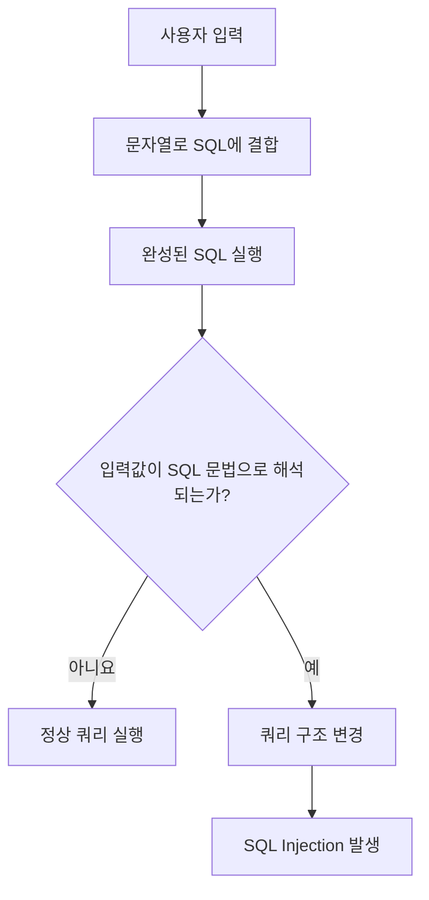
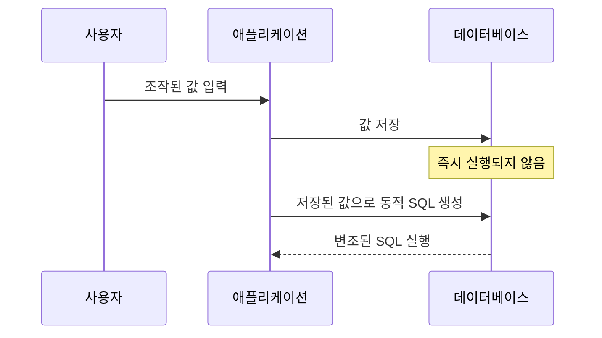

<!-- markdownlint-disable MD004 MD025 MD033 -->

# SQL Injection

## 목차

1. [개요](#개요)
2. [발생 원인](#발생-원인)
3. [작동 원리](#작동-원리)
4. [SQL 연산자와 주석](#sql-연산자와-주석)
5. [공격 유형](#공격-유형)
6. [발생 가능한 위치](#발생-가능한-위치)
7. [SQL Injection 진단 절차](#sql-injection-진단-절차)
8. [영향](#영향)
9. [대응 방안](#대응-방안)
10. [인증 공격과의 차이](#인증-공격과의-차이)
11. [모의해킹 시 주의사항](#모의해킹-시-주의사항)
12. [참고](#참고)

---

## 1. 개요

SQL Injection은 외부 입력값이 SQL 쿼리에 안전하지 않은 방식으로 결합될 때, 공격자가 원래 쿼리의 구조나 실행 의도를 변경할 수 있는 취약점이다.

공격자는 SQL Injection을 이용해 다음과 같은 행위를 시도할 수 있다.

- 인증 우회
- 데이터 조회 및 유출
- 데이터 추가·수정·삭제
- 데이터베이스 구조 파악
- 데이터베이스 권한 상승
- 데이터베이스 서비스 거부
- 데이터베이스 서버 또는 운영체제 침해

SQL Injection은 MITRE의 취약점 분류에서 `CWE-89`로 관리된다.

## 2. 발생 원인

SQL Injection의 핵심 원인은 **SQL 코드와 사용자 입력 데이터가 구분되지 않는 것**이다.

다음과 같이 사용자 입력을 문자열 연결로 쿼리에 직접 삽입하면 취약점이 발생할 수 있다.

```javascript
const sql =
    "SELECT * FROM member " +
    "WHERE user_id = '" + inputId + "' " +
    "AND user_pw = '" + inputPw + "'";
````

사용자 입력이 단순한 문자열이 아니라 SQL 문법의 일부로 해석될 수 있기 때문이다.



## 3. 작동 원리

### 3.1. 정상적인 로그인

사용자가 다음 정보를 입력했다고 가정한다.

```text
ID: admin
PW: 1234
```

애플리케이션에서 생성되는 SQL은 다음과 같다.

```sql
SELECT *
FROM member
WHERE user_id = 'admin'
  AND user_pw = '1234';
```

두 조건을 모두 만족하는 회원이 존재하면 로그인에 성공한다.

### 3.2. 취약한 로그인 쿼리

로그인 쿼리가 문자열 결합으로 작성되어 있다면 공격자가 따옴표, 논리 연산자, 주석 등을 입력하여 조건식을 변경할 수 있다.

개념적으로 공격자는 입력값을 이용해 쿼리를 다음과 같은 형태로 바꾸려고 한다.

```sql
SELECT *
FROM member
WHERE user_id = ''
   OR '1' = '1'
   -- ' AND user_pw = '';
```

`'1' = '1'`은 항상 참이므로 전체 `WHERE` 조건이 참이 될 수 있다. 뒤의 비밀번호 조건이 주석 처리되면 비밀번호 검증도 수행되지 않는다.

실제 성공 여부는 다음 요소에 따라 달라진다.

* 서버에서 사용하는 DBMS
* SQL 쿼리 작성 방식
* 주석 문법
* 따옴표와 괄호의 위치
* SQL Mode
* 데이터베이스 드라이버
* 입력값 전처리 여부
* 조회 결과 처리 방식

따라서 특정 문자열이 모든 환경에서 동일하게 작동하는 것은 아니다.

## SQL 연산자와 주석

### AND와 OR

일반적으로 SQL에서는 `AND`가 `OR`보다 먼저 계산된다.

```sql
A OR B AND C
```

위 조건은 다음과 같이 해석된다.

```sql
A OR (B AND C)
```

의도한 계산 순서를 명확히 하려면 괄호를 사용해야 한다.

```sql
(A OR B) AND C
```

SQL Injection을 분석할 때는 공격 문자열만 보는 것이 아니라, 입력값이 삽입된 이후 완성되는 전체 조건식을 확인해야 한다.

### 주석 문법

주석은 DBMS에 따라 차이가 있다.

| 주석          | MySQL | Oracle | SQL Server | PostgreSQL |
| ----------- | :---: | :----: | :--------: | :--------: |
| `-- `       |   O   |    O   |      O     |      O     |
| `#`         |   O   |    X   |      X     |      X     |
| `/* ... */` |   O   |    O   |      O     |      O     |

MySQL에서 `--` 뒤에는 공백이나 제어 문자가 필요하다는 점에 주의해야 한다.

주석은 쿼리 뒤쪽의 조건이나 구문을 무효화할 수 있으므로 SQL Injection에서 자주 악용된다.

## 4. 공격 유형

### 4.1. In-band SQL Injection

공격 요청과 결과 확인이 동일한 통신 채널에서 이루어지는 방식이다.

#### 4.1.1. UNION SQL Injection

`UNION` 연산자를 이용해 원래 조회 결과에 다른 `SELECT`문의 결과를 결합하는 방식이다.

```sql
SELECT title, content
FROM board
WHERE category = 'notice'

UNION

SELECT column1, column2
FROM another_table;
```

`UNION`을 사용하려면 일반적으로 다음 조건을 만족해야 한다.

* 두 `SELECT`문의 열 개수가 같아야 한다.
* 대응하는 열의 자료형이 서로 호환되어야 한다.
* 결과가 웹페이지 등에 출력되어야 한다.

[Union SQL Injection](/Union-SQL-Injection/)

#### 4.1.2. Error-based SQL Injection

의도적으로 데이터베이스 오류를 발생시키고, 오류 메시지에 포함된 정보를 통해 데이터베이스 구조나 값을 추론하는 방식이다.

오류 메시지를 통해 다음과 같은 정보가 노출될 수 있다.

* DBMS 종류 및 버전
* 테이블 또는 열 이름
* SQL 구문의 일부
* 데이터 형식
* 내부 파일 경로
* 애플리케이션 구조

운영 환경에서는 상세한 데이터베이스 오류를 사용자에게 직접 반환하지 않아야 한다.

[Error-Based SQL Injection](/Error-Based-SQL-Injection/)

### 4.2. Inferential SQL Injection

조회 결과가 직접 출력되지 않지만, 서버 응답의 차이를 이용해 정보를 한 글자 또는 한 비트씩 추론하는 방식이다.

#### 4.2.1. Boolean-based Blind SQL Injection

참과 거짓 조건에 따라 응답 내용, HTTP 상태 코드, 페이지 길이 등이 달라지는 것을 이용한다.

```sql
조건이 참인 경우  → 정상 페이지
조건이 거짓인 경우 → 다른 페이지 또는 빈 결과
```

판단에 활용되는 응답 차이는 다음과 같다.

* 특정 문구의 존재 여부
* 응답 본문 길이
* HTTP 상태 코드
* 리다이렉션 여부
* 조회 결과 개수

[Blind SQL Injection](/Blind-SQL-Injection/)

#### 4.2.2. Time-based Blind SQL Injection

조건이 참일 때 데이터베이스가 일정 시간 동안 응답을 지연하도록 만들고, 응답 시간을 측정해 참과 거짓을 판단하는 방식이다.

DBMS별 대표적인 지연 함수는 다음과 같다.

| DBMS       | 대표 지연 방식                        |
| ---------- | ------------------------------- |
| MySQL      | `SLEEP()`                       |
| PostgreSQL | `pg_sleep()`                    |
| SQL Server | `WAITFOR DELAY`                 |
| Oracle     | `DBMS_PIPE.RECEIVE_MESSAGE()` 등 |

네트워크 지연도 응답 시간에 영향을 줄 수 있으므로 한 번의 측정만으로 취약점을 단정해서는 안 된다. 기준 응답을 여러 번 측정하고 반복 가능한 차이가 있는지 확인해야 한다.

### 4.3. Out-of-band SQL Injection

애플리케이션의 HTTP 응답이 아니라 DNS 또는 외부 네트워크 요청과 같은 별도의 통신 경로를 통해 결과를 확인하는 방식이다.

다음 조건이 필요할 수 있다.

* 데이터베이스 서버의 외부 통신 허용
* 관련 DBMS 기능 활성화
* 데이터베이스 계정에 필요한 권한 부여
* 방화벽 또는 DNS 정책 허용

일반적인 웹 애플리케이션 환경에서는 네트워크 정책과 권한 제한으로 인해 사용할 수 없는 경우가 많다.

### 4.4. Stacked Query

하나의 입력에서 여러 SQL 문을 연속으로 실행시키는 방식이다.

```sql
SELECT ...;
UPDATE ...;
```

실행 가능 여부는 DBMS와 데이터베이스 드라이버가 다중 쿼리를 허용하는지에 따라 달라진다.

데이터 변조 가능성이 있으므로 실제 모의해킹에서도 사전 승인 없이 시도해서는 안 된다.

### 4.5. Second-order SQL Injection

입력 시점에는 SQL이 실행되지 않고 데이터베이스에 저장되지만, 이후 해당 값이 다른 쿼리에 결합될 때 SQL Injection이 발생하는 방식이다.



저장된 데이터도 항상 안전하다고 가정할 수 없으며, 다시 쿼리에 사용할 때 매개변수화해야 한다.

## 5. 발생 가능한 위치

SQL Injection은 로그인 페이지에만 발생하는 취약점이 아니다.

다음과 같이 SQL 쿼리에 영향을 주는 모든 외부 입력이 진단 대상이 될 수 있다.

* URL 쿼리 파라미터
* HTTP 요청 본문
* 로그인 및 검색 입력창
* 정렬 조건
* 필터 및 카테고리
* 페이지 번호
* 쿠키
* HTTP 헤더
* JSON 또는 XML 요청값
* 파일명과 메타데이터
* 데이터베이스에 저장되었다가 다시 사용되는 값
* REST API 및 GraphQL 인자

특히 다음과 같은 동적 SQL 요소는 Prepared Statement만으로 처리하기 어려울 수 있다.

* 테이블 이름
* 열 이름
* `ASC`, `DESC`와 같은 정렬 방향
* SQL 키워드
* 동적으로 생성되는 `ORDER BY` 절

이러한 값은 외부 입력을 그대로 사용하지 말고 서버에서 미리 정의한 값으로 매핑해야 한다.

## 6. SQL Injection 진단 절차

SQL Injection 진단은 허가받은 범위 안에서 비파괴적으로 수행해야 한다.

### 1. 입력 지점 식별

웹 요청에서 서버 측 SQL에 사용될 가능성이 있는 입력값을 찾는다.

```text
GET /board?id=10
GET /search?keyword=test
POST /login
Cookie: user_id=10
```

### 2. 정상 응답 기준 수집

먼저 정상 입력에 대한 응답을 여러 번 확인한다.

* HTTP 상태 코드
* 응답 길이
* 주요 문구
* 조회 결과 개수
* 평균 응답 시간
* 리다이렉션 위치

### 3. 입력 형식 확인

해당 입력이 어떤 문맥에서 사용되는지 추론한다.

* 숫자형
* 문자열형
* 검색 조건
* 정렬 조건
* 테이블 또는 열 이름
* `LIKE` 구문
* `LIMIT`, `OFFSET` 구문

### 4. 응답 차이 비교

입력 변화에 따라 다음 항목이 달라지는지 확인한다.

* 오류 메시지
* 출력 데이터
* 페이지 구조
* HTTP 상태 코드
* 응답 시간

### 5. DBMS 추정

오류 메시지, 함수 동작, 주석 처리 방식 등을 이용해 DBMS 종류를 추정한다.

단, 하나의 특징만으로 DBMS를 확정하지 않고 여러 결과를 교차 확인해야 한다.

### 6. 최소한의 영향만 검증

취약점 확인에 필요한 최소 수준까지만 검증한다.

* 데이터 수정 금지
* 데이터 삭제 금지
* 계정 생성 금지
* 운영체제 명령 실행 금지
* 대량 데이터 조회 금지
* 서비스 지연 유발 금지

## 7. 영향

SQL Injection 취약점이 실제로 악용되면 다음과 같은 피해가 발생할 수 있다.

| 보안 요소 | 발생 가능한 영향                     |
| ----- | ----------------------------- |
| 기밀성   | 개인정보, 계정정보, 인증정보 유출           |
| 무결성   | 데이터 추가·수정·삭제                  |
| 가용성   | 대량 연산, 테이블 삭제, 잠금으로 인한 서비스 장애 |
| 인증    | 로그인 및 접근제어 우회                 |
| 권한    | 데이터베이스 권한 상승                  |
| 시스템   | DBMS 기능을 통한 파일 접근 또는 명령 실행    |

실제 영향은 다음 요소에 따라 달라진다.

* 애플리케이션 DB 계정의 권한
* DBMS 종류와 설정
* 네트워크 접근 정책
* 다중 쿼리 허용 여부
* 오류 메시지 노출 여부
* 운영체제 연동 기능의 활성화 여부

## 8. 대응 방안

### 1. Prepared Statement 사용

가장 중요한 대응 방법은 SQL 구조와 사용자 입력을 분리하는 것이다.

#### 1.1. 취약한 코드

```javascript
const sql =
    "SELECT * FROM member " +
    "WHERE user_id = '" + inputId + "' " +
    "AND user_pw = '" + inputPw + "'";
```

#### 1.2. 안전한 코드

Node.js의 `mysql2`를 사용하는 예시는 다음과 같다.

```javascript
const sql = `
    SELECT member_id, user_id, password_hash
    FROM member
    WHERE user_id = ?
`;

const [rows] = await connection.execute(sql, [inputId]);
```

Prepared Statement를 사용하면 입력값은 SQL 코드가 아니라 하나의 데이터로 처리된다.

비밀번호는 평문으로 SQL에서 직접 비교하지 않고, 애플리케이션에서 안전한 비밀번호 해시 알고리즘을 이용해 검증해야 한다.

```javascript
const isValid = await argon2.verify(
    rows[0].password_hash,
    inputPw
);
```

권장되는 비밀번호 저장 알고리즘은 다음과 같다.

* Argon2id
* scrypt
* bcrypt
* PBKDF2

### 2. Allow-list 검증

Prepared Statement는 값에는 사용할 수 있지만 테이블명, 열 이름, 정렬 방향 등의 SQL 구조에는 일반적으로 사용할 수 없다.

정렬 방향을 외부 입력으로 받는 경우 다음과 같이 허용 목록을 사용한다.

```javascript
const allowedSortOrders = {
    asc: "ASC",
    desc: "DESC"
};

const order = allowedSortOrders[inputOrder] ?? "ASC";

const sql = `
    SELECT post_id, title
    FROM post
    ORDER BY created_at ${order}
`;
```

입력값이 허용 목록에 없다면 기본값을 사용하거나 요청을 거부한다.

### 3. 입력값 형식 검증

입력값이 예상한 형식과 범위를 만족하는지 검증한다.

```javascript
const postId = Number.parseInt(req.params.id, 10);

if (!Number.isInteger(postId) || postId < 1) {
    return res.status(400).send("잘못된 요청");
}
```

입력값 검증은 Prepared Statement를 대체하는 방법이 아니라 추가적인 방어 계층이다.

### 4. 최소 권한 적용

애플리케이션에서 사용하는 데이터베이스 계정에는 필요한 권한만 부여한다.

예를 들어 조회 전용 기능의 DB 계정에는 다음 권한을 부여하지 않는다.

* `INSERT`
* `UPDATE`
* `DELETE`
* `DROP`
* `CREATE`
* `FILE`
* 관리자 권한

기능별로 데이터베이스 계정을 분리하면 SQL Injection이 발생하더라도 피해 범위를 줄일 수 있다.

### 5. 오류 메시지 통제

상세한 데이터베이스 오류를 사용자에게 직접 노출하지 않는다.

#### 5.1. 사용자 응답

```text
요청을 처리하지 못했습니다.
```

#### 5.2. 서버 로그

```text
SQLSTATE, 요청 식별자, 발생 위치, 내부 예외 정보
```

로그에는 비밀번호, 세션 토큰, 주민등록번호 등의 민감정보를 기록하지 않아야 한다.

### 6. 안전한 저장 프로시저 사용

저장 프로시저도 매개변수를 안전하게 사용하면 SQL Injection 방어에 도움이 될 수 있다.

그러나 저장 프로시저 내부에서 문자열을 연결해 동적 SQL을 생성하면 동일하게 SQL Injection이 발생할 수 있다.

```sql
SET @query = CONCAT(
    'SELECT * FROM member WHERE user_id = ''',
    input_id,
    ''''
);
```

따라서 저장 프로시저 사용 자체를 SQL Injection 방어로 간주해서는 안 된다.

### 7. 단순 필터링에 의존하지 않기

다음과 같은 문자열을 제거하는 블랙리스트 방식만으로는 충분하지 않다.

```text
OR
UNION
SELECT
--
'
```

우회 가능한 원인은 다음과 같다.

* 대소문자 차이
* 공백 및 주석 변형
* 인코딩
* DBMS별 문법 차이
* 동등한 함수 및 연산자
* 문자열 조합

입력값 이스케이프 역시 문자 집합, SQL Mode, DBMS에 따라 문제가 발생할 수 있으므로 주요 방어 방법으로 사용하지 않는다.

### 8. ORM 사용 시 주의사항

ORM을 사용한다고 해서 SQL Injection이 자동으로 모두 방지되는 것은 아니다.

다음 기능을 사용할 때는 별도로 확인해야 한다.

* Raw Query
* 문자열로 생성한 조건식
* 동적 정렬
* 동적 테이블 또는 열 이름
* ORM 고유 쿼리 언어
* 저장 프로시저 호출

ORM에서도 외부 입력은 바인딩 변수로 전달해야 한다.

### 9. 다중 방어 계층

효과적인 대응은 다음 방식을 함께 적용하는 것이다.

1. Prepared Statement
2. Allow-list 입력값 검증
3. 최소 권한
4. 안전한 오류 처리
5. 민감정보 비노출
6. 보안 로깅 및 모니터링
7. 코드 리뷰와 정적 분석
8. 정기적인 취약점 진단

## 9. 모의해킹 시 주의사항

### 1. 허용 범위 확인

테스트 전에 다음 사항을 확인한다.

* 대상 도메인과 IP
* 테스트 가능 시간
* 허용된 취약점 유형
* 자동화 도구 사용 가능 여부
* 요청 속도 제한
* 데이터 접근 및 저장 범위
* 서비스 장애 발생 시 연락처
* 테스트 종료 후 데이터 폐기 방법

### 2. 비파괴적 검증

운영 환경에서는 다음 구문의 사용을 지양하거나 사전 승인을 받아야 한다.

```text
INSERT
UPDATE
DELETE
DROP
ALTER
TRUNCATE
CREATE
```

또한 다음 행위도 피해야 한다.

* 대량 데이터 조회
* 개인정보 및 인증정보 열람
* 비밀번호 해시 탈취
* 시간 지연 요청 반복
* 대량 자동화 스캔
* 데이터베이스 파일 접근
* 운영체제 명령 실행
* 외부 서버로 데이터 전송

### 3. 증적 기록

취약점이 확인되면 다음 내용을 기록한다.

* 대상 URL과 파라미터
* HTTP 요청 및 응답
* 정상 요청과 변조 요청의 차이
* 재현 절차
* 영향
* 위험도
* 대응 방안
* 테스트 시각
* 민감정보 마스킹 여부

개인정보나 인증정보는 보고서에서 마스킹하고, 취약점을 입증할 수 있는 최소한의 정보만 남긴다.

---

## 참고

* [SQL Injection](https://developer.mozilla.org/ko/docs/Glossary/SQL_Injection)
* [OWASP: SQL Injection](https://owasp.org/www-community/attacks/SQL_Injection)
* [OWASP: SQL Injection Prevention Cheat Sheet](https://cheatsheetseries.owasp.org/cheatsheets/SQL_Injection_Prevention_Cheat_Sheet.html)
* [OWASP: Query Parameterization Cheat Sheet](https://cheatsheetseries.owasp.org/cheatsheets/Query_Parameterization_Cheat_Sheet.html)
* [MITRE CWE-89: Improper Neutralization of Special Elements used in an SQL Command](https://cwe.mitre.org/data/definitions/89.html)
* [PortSwigger Web Security Academy: SQL Injection](https://portswigger.net/web-security/sql-injection)
* [PortSwigger Web Security Academy: SQL Injection Labs](https://portswigger.net/web-security/all-labs#sql-injection)

<div class="obsidian-links" style="display: none;">

[\[SECURITY\] SQL Injection Tip](2024-12-04-SQL-Injection-Tip.md)
[\[CTF\] CTF 풀이: Cookie, SQL Injection](../CTF/2024-11-18-CTF-SQL-Injection-1.md)
[\[CTF\] CTF 문제 풀이: SQL Injection w. UNION](../CTF/2024-11-25-CTF-SQL-Injection-2.md)
[\[CTF\] CTF 문제 풀이: SQL Injection](../CTF/2024-11-26-CTF-SQL-Injection-3.md)
[\[CTF\] CTF 문제 풀이: SQL Injection](../CTF/2024-11-28-CTF-SQL-Injection-4.md)
[\[CTF\] CTF 문제 풀이: Error Based SQL Injection](../CTF/2024-11-28-CTF-SQL-Injection-5.md)
[\[CTF\] CTF 문제 풀이: Blind SQL Injection](../CTF/2024-11-29-CTF-SQL-Injection-6.md)
[\[CTF\] CTF 문제 풀이: SQL Injection](../CTF/2024-12-09-CTF-SQL-Injection-7.md)
[\[CTF\] Dreamhack 문제 풀이: Really Not SQL](../CTF/2026-07-24-Really-Not-SQL.md)
[\[SECURITY\] WEB 취약점](2025-02-21-WEB-Secure-Weak-Points.md)

</div>
