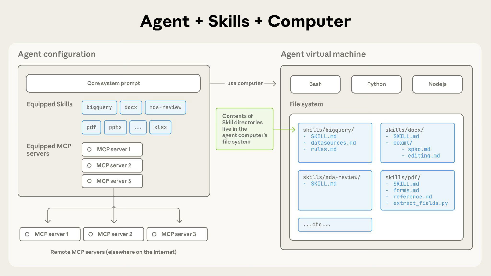

# Agent Skills

## 1. Agent Skills란?

> **Agent Skills는 AI 에이전트가 특정 작업을 일관되게 수행하도록 `SKILL.md`를 중심으로 지침, 절차, 코드, 참고자료, 템플릿을 묶어 제공하는 파일 기반 업무 패키지다.**

단순히 프롬프트를 저장하는 기능이 아니라, 특정 업무를 수행하기 위한 다음 요소들을 하나의 디렉터리로 묶는 방식이다.

```text
Agent Skill =
작업 지침
+ 사용 조건
+ 참고 문서
+ 스크립트
+ 템플릿
+ 예시 파일
+ 도구 사용 절차
```

가장 중요한 파일은 보통 `SKILL.md`다.

```text
my-skill/
├── SKILL.md
├── scripts/
├── references/
├── assets/
└── ...
```

> **매번 긴 프롬프트를 다시 쓰지 않기 위해, 반복 업무의 처리 방식과 기준을 AI가 필요할 때 불러올 수 있게 만든 작업 매뉴얼이다.**

### 1.1. Skills, Prompt, MCP의 차이

Agent Skills를 이해하려면 비슷한 개념과 구분해야 한다.

| 개념 | 핵심 역할 |
| ------------------ | ------------------------------ |
| Prompt | 한 번의 요청에 주는 일회성 지시 |
| MCP | 외부 시스템과 도구를 연결하는 프로토콜 |
| Skill | 특정 작업을 어떤 절차로 수행할지 알려주는 업무 패키지 |

비유하면 다음과 같다.

```text
Prompt = 지금 이 일을 이렇게 해줘
MCP = 외부 시스템에 연결해
Skill = 이 업무는 이 절차와 기준에 따라 처리해
```

가장 중요한 차이는 이것이다.

> MCP가 “무엇을 사용할 수 있는가”에 가깝다면,
> Skill은 “그것을 어떻게 잘 사용할 것인가”에 가깝다.

예를 들어 GitHub MCP가 있으면 AI가 GitHub에 접근할 수 있다.
하지만 “우리 팀 방식으로 PR 리뷰를 어떻게 해야 하는가”는 Skill에 담는 것이 적합하다.

## 2. 왜 Agent Skills가 필요한가?

LLM은 범용적으로 똑똑하지만, 실제 업무에 바로 적용하면 반복 지시, 출력 품질 편차, 도메인 지식 부족 같은 문제가 자주 발생한다. Agent Skills는 이런 문제를 `SKILL.md` 중심의 재사용 가능한 작업 패키지로 해결한다.

- **반복 지시 문제**
    - **문제:** 매번 같은 형식, 기준, 절차를 다시 설명해야 한다.
    - **해결방안:** 반복 지시를 `SKILL.md`에 저장해 재사용한다.
    - **장점:** 좋은 프롬프트와 절차를 패키지화할 수 있어 **재사용성**이 높아진다.
- **일관성 부족 문제**
    - **문제:** 같은 요청이라도 대화마다 출력 형식이나 판단 기준이 달라질 수 있다.
    - **해결방안:** 출력 템플릿, 작성 규칙, 검토 기준을 Skill에 고정한다.
    - **장점:** 팀의 작업 방식을 AI가 일관되게 따르므로 **업무 표준화**가 가능하다.
- **도메인 지식 부족 문제**
    - **문제:** 회사 내부 규칙, 프로젝트 구조, 팀 컨벤션은 모델이 기본적으로 알지 못한다.
    - **해결방안:** 도메인 규칙, 프로젝트 맥락, 팀 컨벤션을 `references/`나 `SKILL.md`에 포함한다.
    - **장점:** 모델을 특정 업무와 조직 환경에 맞게 보정할 수 있어 **도메인 전문화**가 가능하다.
- **컨텍스트 낭비 문제**
    - **문제:** 긴 매뉴얼이나 반복 지침을 매번 프롬프트에 넣으면 토큰을 많이 사용한다.
    - **해결방안:** Skill의 `name`, `description`만 먼저 로드하고, 필요할 때만 본문과 참고 파일을 불러온다.
    - **장점:** 필요한 정보만 단계적으로 로드하므로 **컨텍스트를 절약**할 수 있다.
- **복잡한 작업 처리 어려움**
    - **문제:** 여러 단계의 절차, 파일 처리, 코드 실행이 섞이면 실수가 늘어난다.
    - **해결방안:** 단계별 workflow를 Skill에 명시하고, 반복 계산이나 파일 처리는 `scripts/`로 분리한다.
    - **장점:** MCP, CLI, 스크립트 사용 절차를 명확히 할 수 있어 **도구 사용이 안정화**된다.
- **반복 계산·파일 처리 오류 문제**
    - **문제:** LLM이 계산, 파싱, 변환, 파일 처리 같은 결정적 작업에서 실수할 수 있다.
    - **해결방안:** 계산, 검증, 변환 로직을 `scripts/`에 넣어 코드로 처리한다.
    - **장점:** 반복 작업의 정확성과 품질이 높아지고, 체크리스트와 예시를 통해 **결과 품질을 고정**할 수 있다.
- **재사용 어려움 문제**
    - **문제:** 한 번 만든 좋은 프롬프트나 절차를 개인이나 팀 단위로 체계적으로 관리하기 어렵다.
    - **해결방안:** Skill을 디렉터리 단위로 구성하고 Git으로 버전 관리한다.
    - **장점:** 팀원 간 **공유와 협업**이 가능하고, 업무 노하우를 지속적으로 개선할 수 있다.

## 3. Progressive Disclosure

Agent Skills의 가장 중요한 설계 원리는 **Progressive Disclosure**, 즉 **점진적 공개**다.

AI가 모든 Skill 내용을 처음부터 다 읽는 것이 아니라, 필요한 만큼만 단계적으로 불러온다.

| 단계 | 로드되는 내용 | 설명 |
| --- | ------------------------------------ | ----------------------- |
| 1단계 | `name`, `description` | 세션 시작 시 가볍게 로드 |
| 2단계 | `SKILL.md` 본문 | 해당 Skill이 필요하다고 판단되면 로드 |
| 3단계 | `references/`, `scripts/`, `assets/` | 작업 중 필요할 때만 접근 |

이 구조의 장점은 **컨텍스트 효율**이다.

```text
모든 업무 매뉴얼을 매번 프롬프트에 넣지 않고,
필요한 Skill의 필요한 부분만 불러온다.
```

즉, Agent Skills는 모델 컨텍스트 창을 무작정 늘리는 방식이 아니라, **파일 시스템을 외부 기억장치처럼 활용하는 구조**다.

### 3.1. Skills Architecture

Skills는 agent가 파일시스템 접근, bash 명령, 코드 실행 기능을 갖춘 코드 실행 환경에서 실행된다.



**Claude가 Skill 콘텐츠에 접근하는 방법:**

Skill이 트리거되면 Claude는 bash를 사용하여 파일시스템에서 SKILL.md를 읽어 지침을 컨텍스트 창에 가져온다. 해당 지침이 다른 파일(FORMS.md나 데이터베이스 스키마 등)을 참조하면 Claude는 추가 bash 명령을 사용하여 해당 파일도 읽는다. 지침에서 실행 가능한 스크립트를 언급하면 Claude는 bash를 통해 실행하고 출력만 받는다(스크립트 코드 자체는 컨텍스트에 들어오지 않는다).

**이 아키텍처가 가능하게 하는 것:**

**온디맨드 파일 접근**: Claude는 각 특정 작업에 필요한 파일만 읽는다. Skill에 수십 개의 참조 파일이 포함될 수 있지만, 작업에 판매 스키마만 필요하다면 Claude는 해당 파일만 로드한다. 나머지는 파일시스템에 남아 토큰을 전혀 소비하지 않는다.

**효율적인 스크립트 실행**: Claude가 `validate_form.py`를 실행할 때 스크립트의 코드는 컨텍스트 창에 로드되지 않는다. 스크립트의 출력(예: "Validation passed" 또는 특정 오류 메시지)만 토큰을 소비한다. 이는 Claude가 즉석에서 동등한 코드를 생성하는 것보다 스크립트를 훨씬 더 효율적으로 만든다.

**번들 콘텐츠에 대한 실질적인 제한 없음**: 파일은 접근될 때까지 컨텍스트를 소비하지 않으므로, Skills는 포괄적인 API 문서, 대용량 데이터셋, 광범위한 예제, 또는 필요한 참조 자료를 포함할 수 있다. 사용되지 않는 번들 콘텐츠에 대한 컨텍스트 패널티가 없다.

이 파일시스템 기반 모델이 점진적 공개를 가능하게 한다. 온보딩 가이드의 특정 섹션을 참조하듯이 Skill을 탐색하여 각 작업에 필요한 것만 정확히 접근한다.

## 4. Skills 구조

Agent Skills 표준에서 자주 쓰이는 구조는 다음과 같다.

```text
skill-name/
├── SKILL.md
├── scripts/
├── references/
├── assets/
├── examples/
└── evals/
```

각 디렉터리의 역할은 다음과 같다.

| 디렉터리          | 역할                       |
| ------------- | ------------------------ |
| `SKILL.md`    | 필수. Skill의 메타데이터와 핵심 지침  |
| `scripts/`    | 선택. 실행 가능한 코드            |
| `references/` | 선택. 긴 참고 문서, 규칙, 매뉴얼     |
| `assets/`     | 선택. 템플릿, 이미지, 샘플 파일, 스키마 |
| `examples/`   | 선택. 입력/출력 예시             |
| `evals/`      | 선택. Skill 테스트 케이스, 평가 자료 |

공식 표준에서 핵심적으로 언급되는 것은 `SKILL.md`, `scripts/`, `references/`, `assets/`다.
`examples/`, `evals/`는 실무적으로 유용한 확장 구조라고 보면 된다.

### 4.1. 핵심 구조: `SKILL.md`

Agent Skills의 중심은 `SKILL.md`다.

기본 형태는 다음과 같다.

```md
---
name: spring-boot-refactor
description: Use this skill when refactoring Java Spring Boot services, controllers, clients, exception handling, response structures, and commit boundaries.
---

# Instructions

1. Identify controller, service, client, resolver responsibilities.
2. Remove duplicated null checks and repeated validation logic.
3. Preserve existing API response format.
4. Suggest safe commit boundaries.
5. Provide before/after code when needed.
```

`SKILL.md`는 보통 두 부분으로 구성된다.

| 부분 | 역할 |
| ---------------- | ----------------------- |
| YAML frontmatter | Skill 이름, 설명, 메타데이터 |
| Markdown 본문 | 실제 작업 지침, 절차, 예시, 출력 형식 |

가장 중요한 필드는 `description`이다.
`description`은 단순 설명이 아니라 **AI가 이 Skill을 언제 사용할지 판단하는 트리거 조건**에 가깝다.

## 5. 플랫폼별 비교

| 항목 | Claude | Gemini CLI | OpenAI / Codex |
| ----- | -------------------------------------- | ---------------------------------- | -------------------------- |
| 핵심 파일 | `SKILL.md` | `SKILL.md` | `SKILL.md` |
| 주요 경로 | `.claude/skills` | `.agents/skills`, `.gemini/skills` | `.agents/skills` |
| 주요 용도 | 문서 생성, Claude Code 워크플로 | CLI 개발·배포 작업 | ChatGPT 반복 업무, Codex 개발 작업 |
| 자동 호출 | 지원 | 지원 | 지원 |
| 명시 호출 | 지원 | 지원 | 지원 |
| 코드 실행 | Claude API/Code에서 강함 | CLI 명령과 결합 | Codex 작업과 결합 |
| 표준 기반 | Anthropic 시작, 표준화 확산 | Agent Skills 표준 | Agent Skills 표준 |
| 배포 방식 | API 업로드, Claude.ai 업로드, Claude Code 로컬 | 로컬/설치 명령 | `.agents/skills`, Plugin |

### 5.1. Claude Skills

#### 5.1.1. Claude Agent Skills

Claude의 Agent Skills는 Anthropic에서 시작된 대표적인 Skills 구현이다.

Claude에서 Skills는 다음 환경에서 사용된다.

| 환경 | 지원 |
| ----------- | ------------------------------- |
| Claude API | built-in Skills + Custom Skills |
| Claude.ai | built-in Skills + Custom Skills |
| Claude Code | Custom Skills 중심 |

Claude API의 built-in Skills는 대표적으로 다음 4개다.

| Skill ID | 용도 |
| -------- | --------------------- |
| `pptx` | PowerPoint 생성, 편집, 분석 |
| `xlsx` | Excel 생성, 분석, 차트 작성 |
| `docx` | Word 문서 생성, 편집 |
| `pdf` | PDF 문서 생성, 처리 |

Claude API에서는 `container.skills`로 사용할 Skill을 지정한다.

```json
{
  "container": {
    "skills": [
      {
        "type": "anthropic",
        "skill_id": "pptx",
        "version": "latest"
      }
    ]
  }
}
```

대부분의 파일 생성 작업은 Code Execution과 함께 동작한다.

```text
사용자 요청
→ Claude가 관련 Skill 판단
→ Skill 지침 로드
→ Code Execution으로 파일 생성
→ file_id 반환
→ Files API로 다운로드
```

#### 5.1.2. Claude Code Skills

Claude Code에서는 Skills가 개발 워크플로우와 강하게 결합된다.

대표 위치는 다음과 같다.

```text
~/.claude/skills/
.claude/skills/
```

일반적으로 다음처럼 구성한다.

```text
.claude/
└── skills/
    └── spring-boot-refactor/
        ├── SKILL.md
        ├── references/
        │   ├── exception-policy.md
        │   └── response-format.md
        └── examples/
            └── refactor-example.md
```

Claude Code는 Agent Skills 표준을 따르면서 몇 가지 확장 기능을 제공한다.

| 필드/기능 | 의미 |
| -------------------------- | --------------------------------- |
| `disable-model-invocation` | 모델의 자동 호출 방지 |
| `user-invocable` | slash menu 노출 여부 제어 |
| `allowed-tools` | 특정 도구를 승인 없이 사용하도록 허용 |
| `context: fork` | 별도 subagent context에서 실행 |
| `agent` | 특정 subagent 지정 |
| `$ARGUMENTS` | 사용자가 전달한 인자 삽입 |
| `!`command` | shell command 결과를 Skill 본문에 동적 주입 |

주의할 점은 `allowed-tools`다.
이것은 “이 도구만 쓰도록 제한”하는 필드가 아니라, **나열된 도구를 사전 승인하는 목록**에 가깝다.

### 5.2. Gemini CLI Skills

Gemini CLI도 Agent Skills 표준을 지원한다.

대표 경로는 다음과 같다.

```text
.agents/skills/
.gemini/skills/
~/.agents/skills/
~/.gemini/skills/
```

Gemini CLI에서는 `/skills` 명령으로 Skill 목록을 확인할 수 있다.

```text
/skills
```

또는 터미널에서 다음처럼 관리한다.

```bash
gemini skills list --all
gemini skills install <repo-url>
gemini skills uninstall <skill-name>
```

Gemini CLI에서 중요한 비교 대상은 `GEMINI.md`다.

| 구분 | `GEMINI.md` | Agent Skills |
| -- | --------------- | ---------------------- |
| 역할 | 프로젝트 전체 배경 지식 | 특정 작업 절차 |
| 적용 | 지속적으로 참고 | 필요할 때만 활성화 |
| 예시 | 프로젝트 구조, 코딩 스타일 | 배포, 보안 감사, Firebase 설정 |
| 성격 | 일반 컨텍스트 | 온디맨드 전문성 |

즉:

```text
GEMINI.md = 이 프로젝트는 무엇인가
Skill = 이 작업은 어떻게 수행하는가
```

### 5.3. OpenAI Skills와 Codex Skills

OpenAI도 Skills 개념을 도입했다.
OpenAI Academy에서는 Skills를 **ChatGPT가 특정 작업을 일관되게 수행하도록 하는 재사용 가능한 워크플로**로 설명한다.

Codex에서는 Agent Skills가 개발 작업에 특화되어 사용된다.

Codex Skill 구조도 기본적으로 `SKILL.md` 기반이다.

```text
my-skill/
├── SKILL.md
├── scripts/
├── references/
├── assets/
└── agents/
    └── openai.yaml
```

Codex의 특징은 다음과 같다.

| 특징 | 설명 |
| ----------------------------- | --------------------------------- |
| open agent skills standard 기반 | Agent Skills 공개 표준을 따름 |
| explicit invocation | 사용자가 `$skill` 등으로 직접 호출 |
| implicit invocation | Codex가 description을 보고 자동 호출 |
| `.agents/skills` 사용 | repo/user/admin/system scope 지원 |
| Plugin과 구분 | Skill은 워크플로, Plugin은 배포 단위 |
| `agents/openai.yaml` | UI, 정책, MCP 의존성 등 OpenAI 전용 메타데이터 |

Codex에서는 저장 위치가 여러 범위로 나뉜다.

| Scope | 예시 경로 |
| ---------- | ---------------------- |
| Repository | `.agents/skills` |
| User | `$HOME/.agents/skills` |
| Admin | `/etc/codex/skills` |
| System | Codex에 번들된 Skills |

## 6. 보안 주의사항

Agent Skills는 사실상 **소프트웨어 패키지**처럼 취급해야 한다.

왜냐하면 Skill 안에는 단순 지침뿐 아니라 다음이 포함될 수 있기 때문이다.

```text
scripts/
shell command
MCP 설정
hooks
파일 접근 지침
외부 API 호출
템플릿 파일
동적 명령 실행
```

위험 요소는 다음과 같다.

| 위험 | 설명 |
| ------- | --------------------------------- |
| 악성 지침 | AI가 의도하지 않은 행동을 하도록 유도 |
| 파일 유출 | 로컬 파일, API 키, 민감 문서 접근 |
| 명령 실행 | 삭제, 전송, 외부 요청 등 위험한 shell command |
| MCP 오용 | 외부 서비스에 민감 데이터 전달 |
| Hook 위험 | 이벤트 발생 시 자동 명령 실행 |
| 공급망 위험 | 외부 Skill 저장소에 악성 코드 포함 |

외부 Skill을 설치하기 전에는 다음을 확인해야 한다.

```text
SKILL.md
scripts/
references/
assets/
allowed-tools
MCP 설정
hooks
외부 URL
패키지 의존성
```

특히 `npx skills add`, `gemini skills install`, `claude-code-templates` 같은 명령으로 설치할 때는 바로 적용하지 말고 테스트 디렉터리에서 먼저 확인하는 것이 좋다.

---

## 참고

- [Claude API Docs: Agent Skills](https://platform.claude.com/docs/ko/agents-and-tools/agent-skills/overview)
- [Anthropic: Equipping agents for the real world with Agent Skills](https://www.anthropic.com/engineering/equipping-agents-for-the-real-world-with-agent-skills)
- [Claude API Docs: API에서 Agent Skills 시작하기](https://platform.claude.com/docs/ko/agents-and-tools/agent-skills/quickstart)
- [Claude API Docs: Create Skill](https://platform.claude.com/docs/en/api/beta/skills/create)
- [Cookbook: Introduction to Claude Skills](https://platform.claude.com/cookbook/skills-notebooks-01-skills-introduction)
- [AgentSkills: Agent Skills](https://agentskills.io/home)
- [Codelabs: AI Agent Skills 사용 방법](https://codelabs.developers.google.com/gemini-cli/how-to-create-agent-skills-for-gemini-cli?hl=ko#0)
- [Agentskills: Specification](https://agentskills.io/specification)
- [Gemini CLI: Agent Skills](https://geminicli.com/docs/cli/skills/)
- [Tistory: OpenAI ChatGPT와 Codex CLI에 도입된 Skills 기능 정리와 활용 사례](https://digitalbourgeois.tistory.com/2444)
- [OpenAI Developers: Agent Skills](https://developers.openai.com/codex/skills)
- [Tistory: 클로드 스킬(Claude Skills) 사용방법 - Docs,Pptx,Xlsx 스킬 활용 + Custom Skill 등록 해보기](https://goddaehee.tistory.com/411)
- [Aitmpl: Skills](https://www.aitmpl.com/skills)
