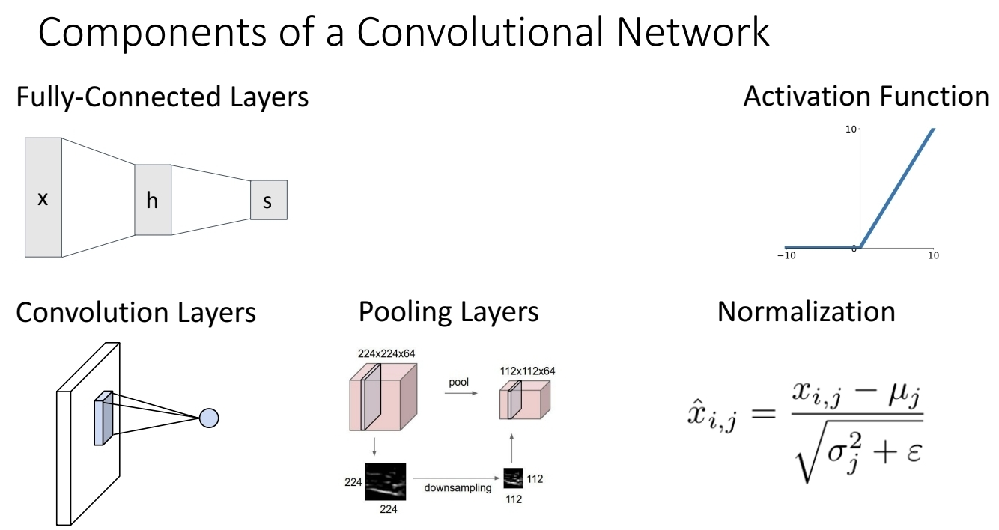
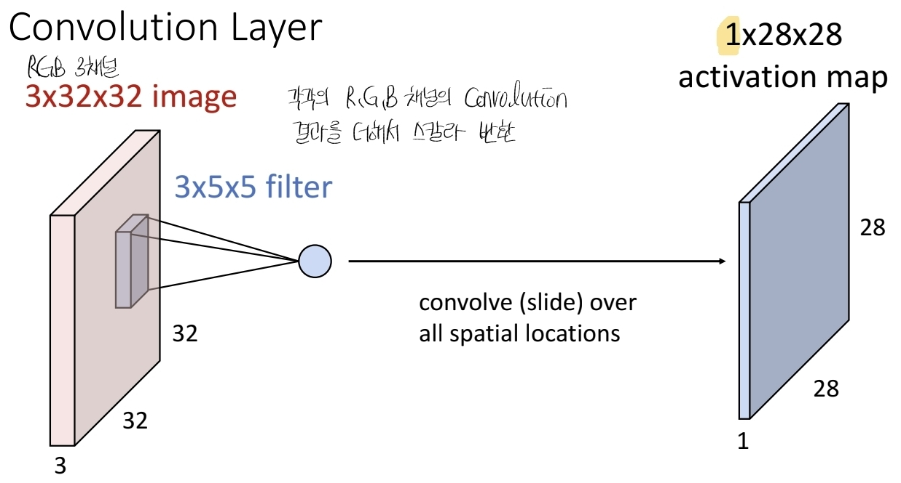
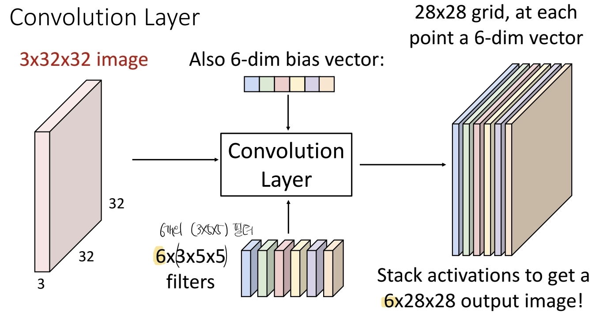
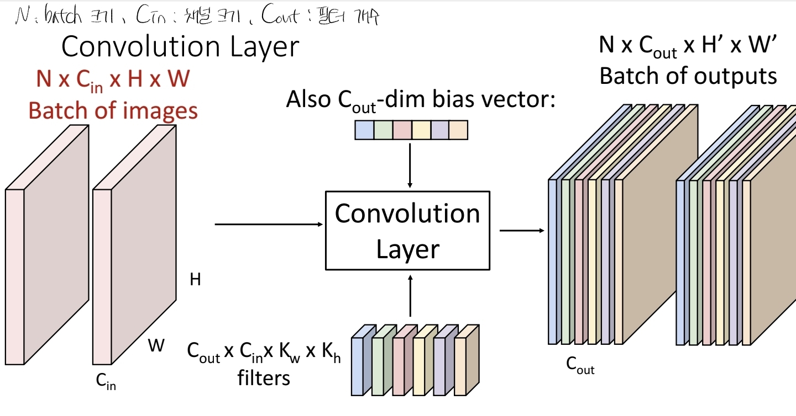
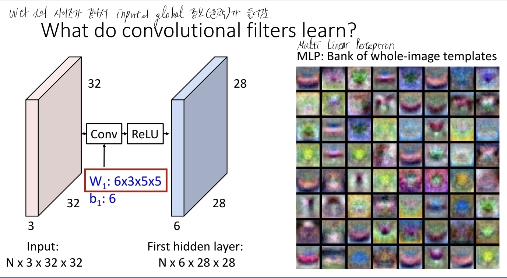
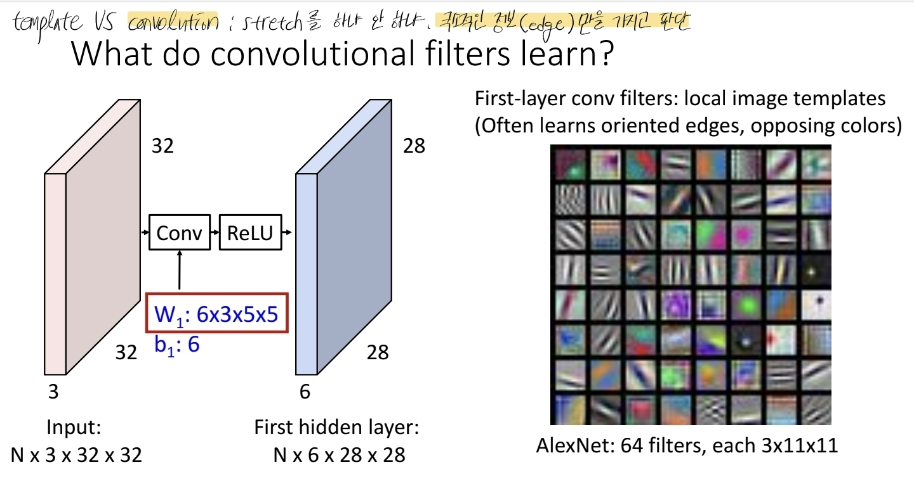
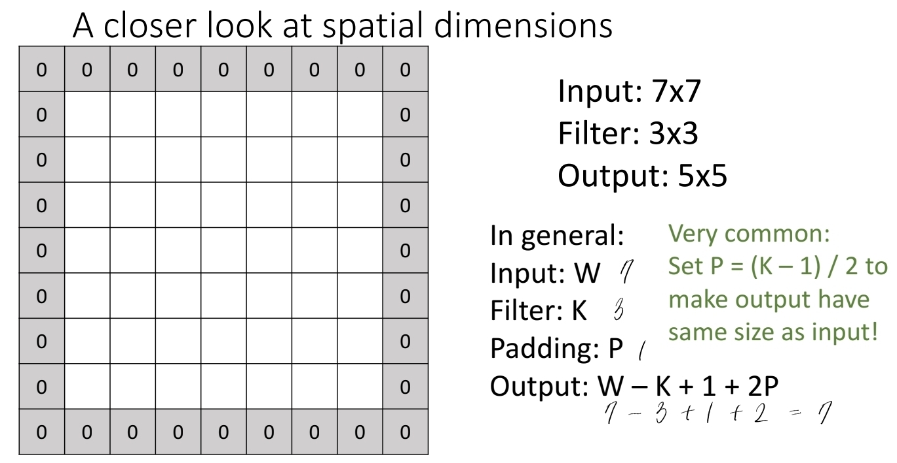
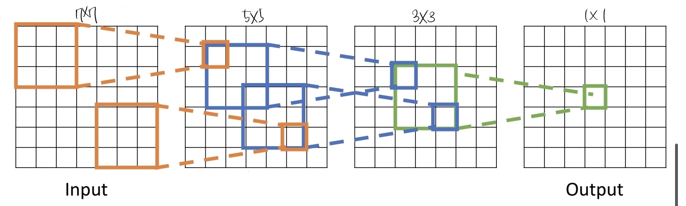
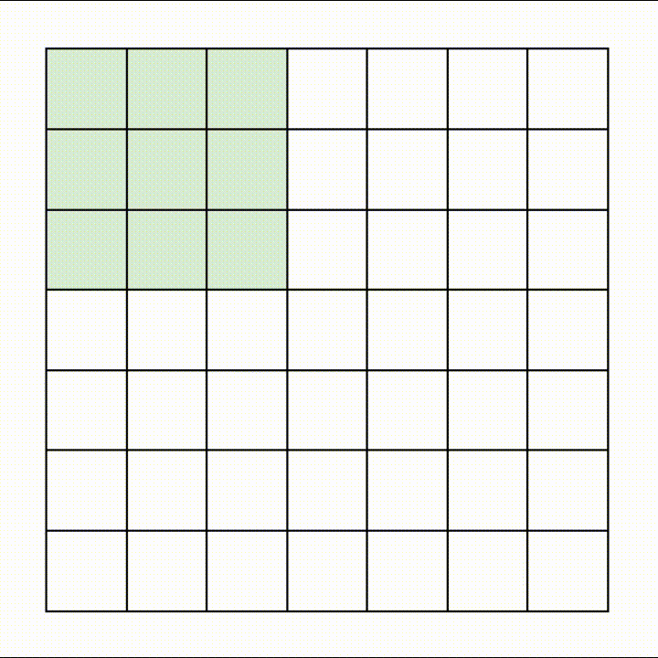
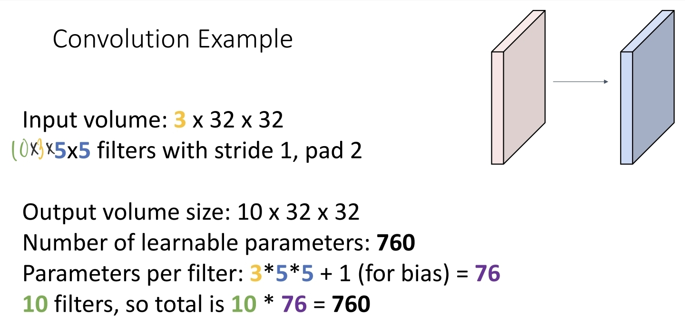

# Convolutional Neural Networks
## 1. 왜 CNN이 필요한가?

기존 **완전연결 신경망(FC, MLP)** 은 이미지를 다룰 때
- $32\times32\times3$ 이미지를 한 줄로 **펼쳐서(Flatten)**  
    $3072$차원 벡터로 만든 뒤
- 가중치 행렬 $W$ 와 내적 $f(x,W)=Wx$ 로 분류를 수행한다.

문제점:
- 픽셀의 **공간 구조(위치 관계)** 를 전혀 고려하지 못한다.
- 입력 크기가 커질수록 파라미터 수가 폭발한다.

그래서 “이미지 구조를 보존하면서” 연산하는 **새로운 연산 노드 → Convolution layer** 를 정의한 것이 CNN이다.

## 2. CNN의 기본 구성 요소

- **Convolution layer**
- **Pooling layer
- **Activation function (ReLU 등)**
- **Normalization (예: BatchNorm)**
- 마지막에 **Fully-Connected layer** 로 분류 수행

## 3. Convolution Layer 동작
### 3.1. 입력/출력 텐서 형태

색깔 이미지 예시:
- 입력 이미지: $3\times 32\times 32$  
    (채널 $3$ = R, G, B / 높이 32 / 너비 32)
배치까지 포함하면:
- 입력: $N \times C_{\text{in}} \times H \times W$
- 출력: $N \times C_{\text{out}} \times H' \times W'$
여기서
- $N$: 배치 크기 (한 번에 처리할 이미지 개수)
- $C_{\text{in}}$: 입력 채널 수
- $C_{\text{out}}$: 필터(커널) 개수 = 출력 채널 수
- $H, W$: 입력의 높이·너비
- $H', W'$: 출력의 높이·너비

**배치 크기 $N$ 이 커져도 필터 크기나 모델 파라미터는 변하지 않는다.**  
모델은 “한 장” 기준 구조를 그대로 유지한 채, 여러 장을 동시에 처리할 뿐이다.

### 3.2. 필터(커널)와 채널 결합

예: 입력 $3\times32\times32$, 필터 $3\times5\times5$ 하나를 사용하면
- 필터는 항상 **입력 깊이 $C_{\text{in}}$ 전체를 덮는** 모양  
    (여기선 $3\times5\times5$)
- 이미지의 한 위치에 필터를 올려  
    **$3\times5\times5 = 75$ 차원 내적 + 바이어스** 를 계산 → **스칼라 1개** 생성
- 이 연산을 공간 전체를 슬라이딩하며 반복 → 하나의 **activation map** 생성
    - 예: 출력 크기 $1\times28\times28$

강의 녹취에서도 “각 채널(R,G,B)에서 나온 컨볼루션 결과(스칼라)를 **모두 더해서 하나의 값**으로 만든다 → 깊이에 있는 정보가 하나의 스칼라로 합쳐진다” 라고 설명한다.

즉, **한 개 필터당 항상 출력 채널 1개**(depth 1)이다.

### 3.3. 여러 개의 필터

필터를 여러 개 쓰면, 필터 개수만큼 서로 다른 activation map 을 얻는다.

- 예: 필터 6개, 각 필터 크기 $3\times5\times5$
    - 각 필터 → $1\times28\times28$ activation map
    - 6개를 쌓아 올리면 출력 텐서: $6\times28\times28$
- 필터 집합(가중치 텐서)의 형태:
    - $6 \times 3 \times 5 \times 5$
- 바이어스는 **필터당 1개** → 바이어스 벡터 크기: $6$

## 4. CNN에서의 배치(Batch)

여러 이미지를 한 번에 처리하면,
- 입력: $N\times 3 \times 32 \times 32$
- 출력: $N\times 6 \times 28 \times 28$ (위 예시)

배치가 1장이든, 2장이든, 128장이든 **필터 모양 $6\times3\times5\times5$ 는 그대로**이고,  
단지 출력 텐서 앞에 $N$ 차원이 붙어 “묶음”으로 나올 뿐이다.  
그래서 배치를 늘리면 **연산량은 늘지만, 파라미터 수는 그대로**이고,  
하드웨어가 허용하는 선에서 **처리량(throughput)** 을 높이는 효과가 있다.

## 5. Convolution은 선형 연산, 비선형성이 필수

컨볼루션은 **곱셈+덧셈으로만 구성된 선형 연산**이다.
- 컨볼루션 레이어만 여러 층 쌓으면,  
    $y = W_2 W_1 x$ 와 같은 하나의 큰 선형 변환과 동일해진다.
- 그러면 표현력은 **단일 선형 분류기** 와 다르지 않다.

따라서 CNN에서도 각 컨볼루션 뒤에 **ReLU 같은 비선형 활성화 함수**를 넣어  
네트워크 전체를 **비선형 함수**로 만들어야 한다.  

## 6. 컨볼루션 필터는 무엇을 학습하나?

- MLP(완전연결)에서의 가중치 템플릿은 **이미지 전체를 한 번에 본 “전역 템플릿”** 을 형성한다.

- 반면, 첫 번째 컨볼루션 레이어의 필터는 **국소(local) 영역**만 보기 때문에
    - **방향성 엣지, 색 대비, 간단한 패턴** 등의 **로컬 템플릿** 을 주로 학습한다.
    - AlexNet의 예: $3\times 11\times 11$ 크기의 필터 64개가 첫 레이어에 존재하며,  
        학습된 필터를 시각화하면 엣지/색 필터로 보인다.

> “글로벌 정보를 다 담는 템플릿 매칭(MLP) vs  로컬 구조(엣지, 색) 위주로 보는 컨볼루션 필터”로 구분하며, CNN의 장점은 **로컬 정보 + 깊은 레이어에서 점진적으로 넓은 영역(글로벌 정보)을 함께 보게 되는 것**이라고 설명한다.

## 7. 공간 차원, 패딩, 출력 크기
### 7.1. 패딩 없는 경우

1D 로 단순화하면, 입력 길이 $W$, 필터 크기 $K$ 일 때
- 출력 길이: $$W_{\text{out}} = W - K + 1$$
2D 이미지 $W\times W$ 에 $K\times K$ 필터를 적용하면, 출력은 $(W-K+1)\times(W-K+1)$ 이 되어 **공간 크기가 계속 줄어드는 문제**가 생긴다.

### 7.2. 패딩(Padding)

이를 해결하기 위해 입력 주변에 0을 둘러싸는 **제로 패딩** 을 사용한다.
- 패딩 크기 $P$ 를 양쪽에 추가하면: $$W_{\text{out}} = W - K + 1 + 2P$$
- 많이 사용하는 설정: $P = \dfrac{K-1}{2}$  
    → 입력과 출력의 공간 크기를 **같게 유지(same convolution)**

예: 입력 $7\times7$, 필터 $3\times3$, 패딩 $P=1$
- $W_{\text{out}} = 7 - 3 + 1 + 2 = 7$

## 8. Receptive Field (수용영역)

**Receptive field**: 출력의 한 픽셀이 **입력 공간에서 보고 있는 영역의 크기**.
1. Receptive field in the **previous layer**: 어떤 레이어 $l$의 뉴런 하나가, **직전 레이어 $l-1$에서 참고하는 셀(픽셀)들의 영역**
2. Receptive field in the **input**: 똑같은 레이어 $l$의 뉴런 하나가, **원본 입력 이미지(맨 처음 input)** 에서 간접적으로 “보고 있는” 픽셀들의 영역

- 단일 컨볼루션 (커널 크기 $K$) 에서는 한 픽셀이 $K\times K$ 영역을 본다.
- 컨볼루션 레이어를 $L$개 쌓으면, 입력 기준 수용영역 크기는  
    $$  
    R = 1 + L,(K-1)  
    $$
    (stride=1, padding 적절히 설정 가정)

문제:
- 큰 이미지(예: $3000\times3000$) 에서  
    전체 이미지를 다 보려면 $R$ 이 매우 커야 하므로  
    **레이어 수를 많이 늘려야 한다** → 비효율적

해결 아이디어:
- 네트워크 안에서 **다운샘플링(해상도 줄이기)** 를 통해  
    더 적은 레이어로도 넓은 영역을 보게 만든다.
- 이때 쓰이는 기법 중 하나가 **strided convolution** 이다.

## 9. Strided Convolution과 다운샘플링

기본 컨볼루션은 슬라이딩 윈도우를 **한 칸(stride=1)** 씩 움직인다.  
**Strided convolution** 은 한 번에 $S$칸씩 점프한다.
- 입력 크기 $W$
- 필터 크기 $K$
- 패딩 $P$
- 스트라이드 $S$

일 때, 출력 크기: $$W_{\text{out}} = \frac{W - K + 2P}{S} + 1$$

예: 입력 $7\times7$, 필터 $3\times3$, 스트라이드 $S=2$, 패딩 없음
- $W_{\text{out}} = \dfrac{7-3+0}{2}+1 = 3$
- 따라서 출력은 $3\times3$ 이 되어,  
    **해상도가 줄어들면서 receptive field 비율은 커진다.**

## 10. 예제: 3×32×32 입력, 5×5 필터 10개

슬라이드 마지막 부분의 예제를 정리하면 다음과 같다.
- 입력: $3\times 32\times 32$
- 필터: $10$개, 각 필터 크기 $3\times 5\times 5$
- 스트라이드 $S=1$, 패딩 $P=2$

### 10.1. 출력 크기

공간 차원: $$W_{\text{out}} = \frac{32 - 5 + 2\cdot2}{1} + 1 = 32$$
- 따라서 출력: $10 \times 32 \times 32$

### 10.2. 학습 가능한 파라미터 수

필터 한 개당 파라미터:
- 가중치: $3 \times 5 \times 5 = 75$
- 바이어스: $1$
총 $76$개.

필터가 $10$개 있으므로 총 파라미터 수: $10 \times 76 = 760$
일반식: $\text{params} = (C_{\text{in}} \cdot K_h \cdot K_w + 1) \times  C_{\text{out}}$

### 10.3. Multiply-Add 연산 수

- 출력 위치(스칼라) 개수: $10 \times 32 \times 32 = 10,240$
- 각 스칼라는 필터와 입력 조각 사이의 내적
    - 차원: $3\times5\times5 = 75$
따라서 총 **multiply-add 연산 횟수**: $75 \times 10,240 = 768,000$

## 11. 컨볼루션 vs 상관(Correlation)

마지막으로, 수업에서 신호 처리 관점도 잠깐 짚고 넘어간다.
- **엄밀한 의미의 컨볼루션(convolution)** 은 필터(함수)를 **시간/공간 축으로 뒤집은 후** 곱해 적분(또는 합)하는 연산이다.
- 반면, 딥러닝에서 구현하는 “컨볼루션”은 실제로는 **뒤집지 않고** 그대로 곱해 더하는 **상관(correlation)** 에 가깝다.
- 하지만 딥러닝 커뮤니티에서는 관습적으로 이것을 “convolution” 이라고 부르고 있다.