# 목차

1. [히스토그램](#4-히스토그램)
	1. [히스토그램](#41-히스토그램)
	2. [히스토그램 평활화 (Histogram Equalization)](#42-히스토그램-평활화-histogram-equalization)
	3. [히스토그램 역투영 & 얼굴 검출](#43-히스토그램-역투영--얼굴-검출)
	4. [이진 영상: 임계값 & 오츠(Otsu) 알고리즘](#44-이진-영상-임계값--오츠otsu-알고리즘)
		1. [Otsu 알고리즘](#441-otsu-알고리즘)
	5. [연결 요소(Connected Components) 라벨링](#45-연결-요소connected-components-라벨링)

---

# 4. 히스토그램
## 4.1 히스토그램

- 정의: $[0, \, L-1]$ 사이의 명암값이 각각 영상 등장 빈도 계산, 밝기(또는 색상) 값의 **분포**를 세는 함수
- 히스토그램: $$h(k)=|\{(i,j)∣f(i,j)=k\}|$$
- 정규화 히스토그램: $$0 \leq p(k)=\frac{h(k)}{MN} \leq 1$$
- 누적 히스토그램: $$c(k)=\sum_{t=0}^{k}p(t)$$
- 알고리즘:
	- 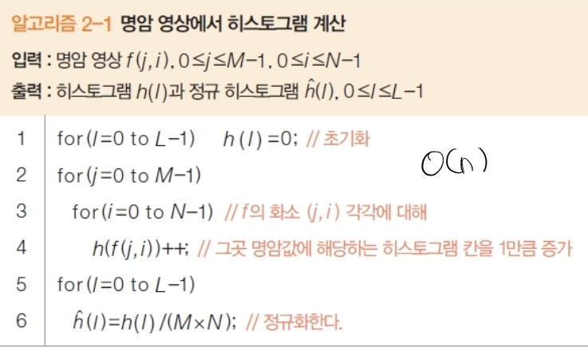
- 예제
	- 
- **용도:** 영상 특성 파악(밝기/대비/노출), 이진화 임계값 선정의 사전 지표.
	- 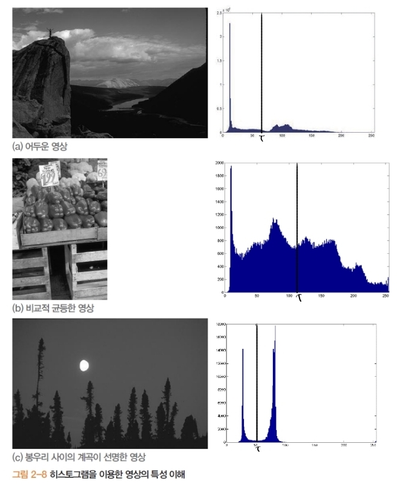

## 4.2. 히스토그램 평활화 (Histogram Equalization)

- 히스토그램을 평평하게 만들어 주는 연산
- 명암의 동적 범위 확장 → 영상 품질 향상
- **누적 히스토그램 ($c(\cdot)$)** 을 매핑 함수로 사용
- $$l_{out} = T(l_{in}) = \text {round} (c(l_{in}) \times (L-1))$$
	- $round$: 정수형 변환
	- $c(l_{in})$: 누적합
	- $L-1$: 0 ~ 255
- $$c(l_{in}) = \sum ^ {l_{in}} _ {l = 0} \hat h (l) $$
	- $l = 0$: 가중치
* 예제
	- 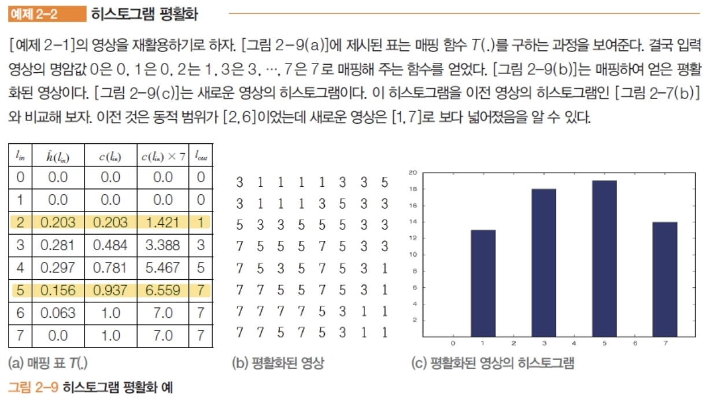
* Histogram Stretching V.S. Histogram Equalization
	* Histogram Stretching: min ~ max 값을 0 ~ 255로 선형적으로 늘려줌 → min 값이 0, max 값이 255 면 의미가 없음
	* Histogram Equalization: 분포가 몰린 부분을 비선형적으로 늘려줌
* 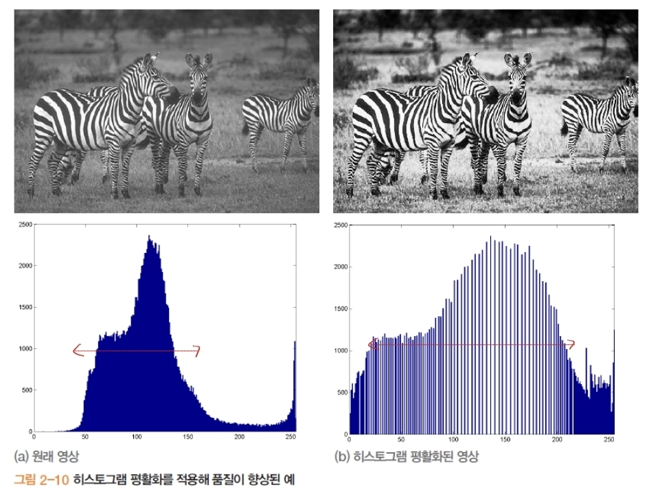
* 적용 여부 판단 조건
	* 영상의 밝기 분포
	* 영상 처리 목적: 시각적 개선(대비 향상 목적), 후처리 전처리 단계(명암 대비 균질화), 원본 톤 유지 필요 여부
	* 영상 종류 및 채널 특성: 단일 채널 영상, 컬러 영상(밝기 성분만), 영상 크기와 양자화 수준
	* 잠재적 부작용: 노이즈 증폭, 밴딩 현상, 원본 분위기 상실

> “히스토그램과 **누적 히스토그램**을 만든 뒤, 픽셀값을 매핑해 밝기 분포를 재조정한다”

## 4.3. 히스토그램 역투영 & 얼굴 검출

- **아이디어:** 학습(또는 모델) 영상의 히스토그램을 **매핑 함수**로 사용하여, 입력 영상의 각 화소를 **신뢰도 맵**으로 변환. 보통 2개의 차원 분포를 확인함.
- **절차:** 대상 모델의 (정규화) 히스토그램 ($h_r$) 계산 → 입력 화소값을 ($h_r$)로 사상하여 **back-projection 맵** 생성 → 평활화/후처리 → 최대값/영역 추출.
- 2차원 히스토그램 계산 알고리즘
	- 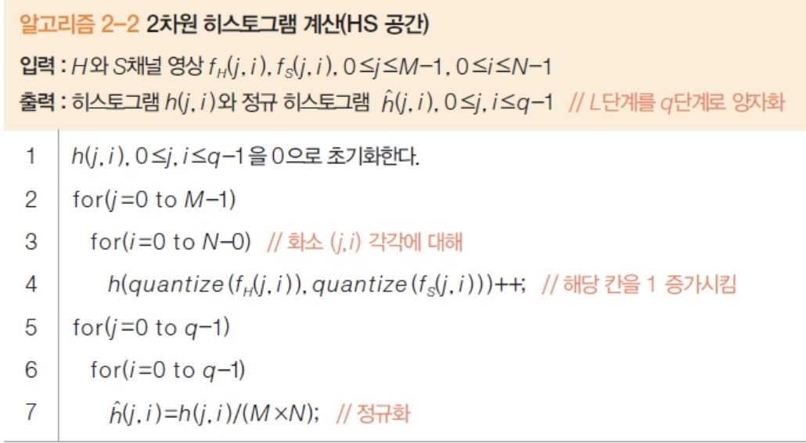
- **예시:** 2D 히스토그램(예: 피부색) 기반 얼굴 검출.
	- $$h_r(i, j) = min(\frac{\hat h_m(i, j)}{\hat h_j(i, j)}, 1), \; 0 \leq i, \; j \leq q-1$$
	- $h_r(i, j)$: 모델과 입력 영상의 유사도
	- $\hat h_m(i, j)$: 모델에 대한 정규화 히스토그램
	- $\hat h_j(i, j)$: 입력 영상에 대한 정규화 히스토그램
- **특성**:
	- 장점: **배경 제어가 가능**한 상황에서 유리, **이동/회전 불변, 가림에도 비교적 강건**.
	- 한계: **유사 분포물 혼동**(비슷한 색 분포를 갖는 다른 물체 구별 못함), 대상 색 분포가 여러 개인 경우 오류 증가.
* 히스토그램 역투영 알고리즘
	* 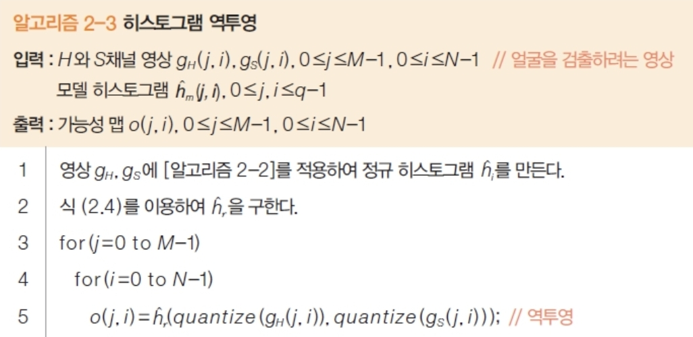

> “경계/질감이 약한 영역도 **분포 기반**으로 찾아낼 수 있다”

## 4.4. 이진 영상: 임계값 & 오츠(Otsu) 알고리즘

- **이진화:**
	- 그레이스케일 → **흑/백**으로 변환.
	- $$b(j,i) =
		\begin{cases}
		1, & f(j,i) \ge T,\\[4pt]
		0, & f(j,i) < T
		\end{cases}$$
- 임계값 방법
	- **두 봉우리 사이의 계곡**에 임계값 T로 결정
	- 자연영상은 계곡 탐지가 어려움

### 4.4.1. Otsu 알고리즘

- 흑 그룹과 백 그룹 각각이 균일할수록 좋다
- 균일성은 분산으로 측정 → **클래스 내 분산 최소(= 클래스 간 균일성 최대)**
- 분산의 가중치 합 $v_{within}(t)$을 목적 함수로 이용한 최적화 알고리즘
- 조명 균일·배경/전경 분리가 비교적 명확할 때 강력.
- 수식
	- $$T' = \arg\min_{t \in \{0,1,\dots,L-1\}} v_{\text{within}}(t)$$
	- $$v_{\text{within}}(t) = w_0(t) v_0(t) + w_1(t) v_1(t)$$
	- $$w_0(t) = \sum_{i=0}^{t} \hat{h}(i), \qquad
		w_1(t) = \sum_{i=t+1}^{L-1} \hat{h}(i)$$
	- $$\mu_0(t) = \frac{1}{w_0(t)} \sum_{i=0}^{t} i \hat{h}(i), \qquad
		\mu_1(t) = \frac{1}{w_1(t)} \sum_{i=t+1}^{L-1} i \hat{h}(i)$$
	- $$v_0(t) = \frac{1}{w_0(t)} \sum_{i=0}^{t} \hat{h}(i)\big(i - \mu_0(t)\big)^2, \qquad
		v_1(t) = \frac{1}{w_1(t)} \sum_{i=t+1}^{L-1} \hat{h}(i)\big(i - \mu_1(t)\big)^2$$
- 최적화 수식
	- $$T' = \arg\max_{t \in \{0,1,\dots,L-1\}} v_{\text{between}}(t)$$
	- $$v_{\text{between}}(t) = w_0(t)\big(1 - w_0(t)\big)\big(\mu_0(t) - \mu_1(t)\big)^2$$
	- 초깃값: $$(t=0):\quad w_0(0) = \hat{h}(0),\quad \mu_0(0) = 0$$
	- 순환식 (t>0): $$\begin{align}
		& w_0(t) = w_0(t-1) + \hat{h}(t) \\
		& \mu_0(t) = \frac{w_0(t-1)\mu_0(t-1) + t\,\hat{h}(t)}{w_0(t)} \\
		& \mu_1(t) = \frac{\mu - w_0(t)\mu_0(t)}{1 - w_0(t)}
		\end{align}$$
- 알고리즘
	- 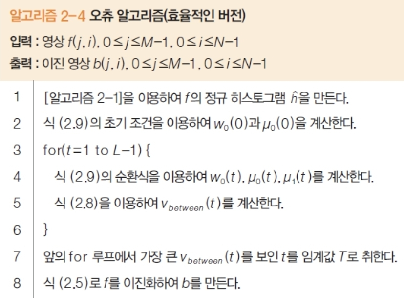

> **실전 팁:** 조명 변화가 크면 **적응 임계값(블록별 T)** 나 **선행 평활화**를 병행.

### 4.5. 연결 요소(Connected Components) 라벨링

- **연결성 정의:** **4-연결/8-연결**로 화소 이웃을 규정, 동일 라벨로 군집화.
	- 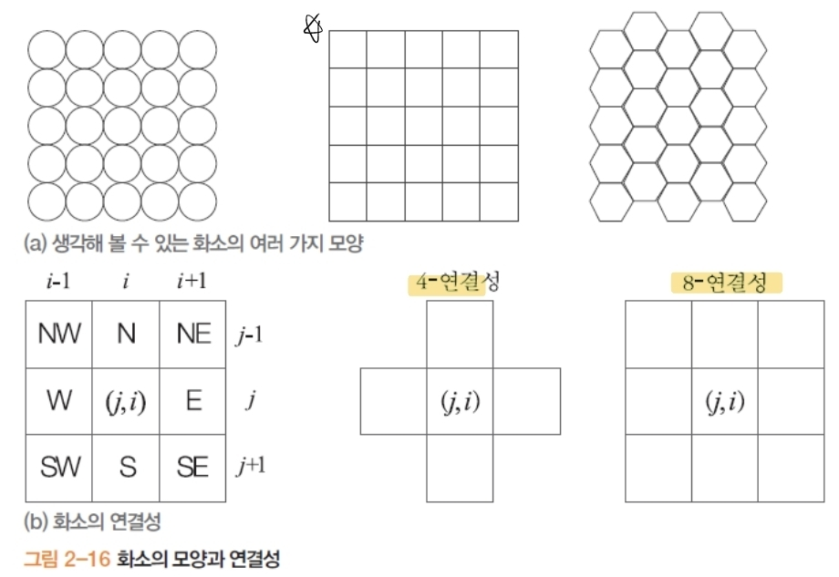
	- 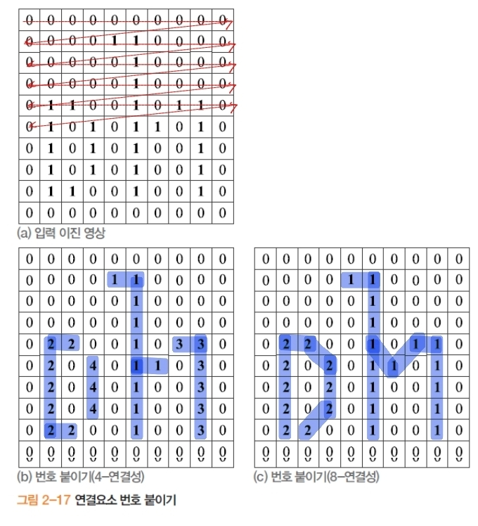
- **구현 관점:**
    - **Flood-fill(범람 채움):** 직관적이나 재귀 사용 시 **스택 오버플로** 주의.
	    - 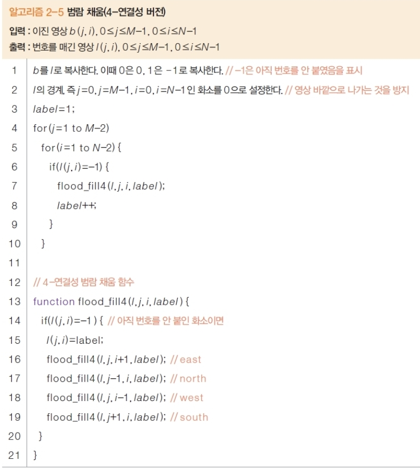
	    - 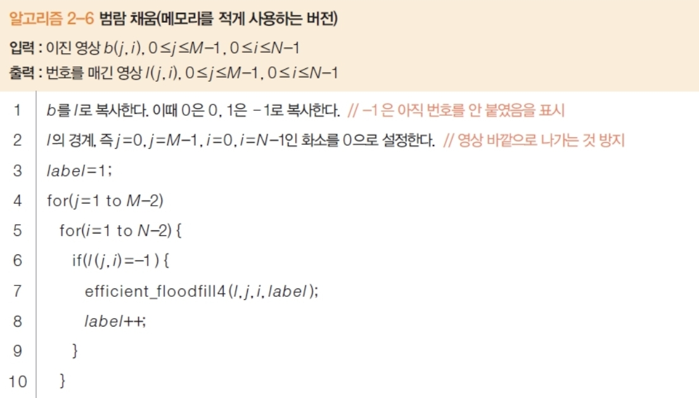
	    - 