# 목차

1. [기하 연산](#6-기하-연산)
	1. [정의](#61-정의)
	2. [변환 종류와 성질](#62-변환-종류와-성질)
	3. [동차좌표·행렬](#63-동차좌표행렬)
	4. [전방 vs 후방 매핑](#64-전방-vs-후방-매핑)
	5. [보간(Interpolation)과 반(反)에일리어싱](#65-보간interpolation과-반反에일리어싱)
	6. [다해상도](#66-다해상도)
	7. [모폴로지(Morphology)](#67-모폴로지morphology)
		1. [이진 모폴로지 (Binary)](#671-이진-모폴로지-binary)
		2. [명암(그레이스케일) 모폴로지](#672-명암그레이스케일-모폴로지)

---

# 6. 기하 연산
## 6.1. 정의

- **정의:** “일정한 기하 연산으로 결정된 **화소 위치**의 값을 가져와 새 값을 만든다.” 즉, 좌표를 변환해 **어디서 샘플링할지**를 정하는 연산이다.
- **대표 변환:**
- 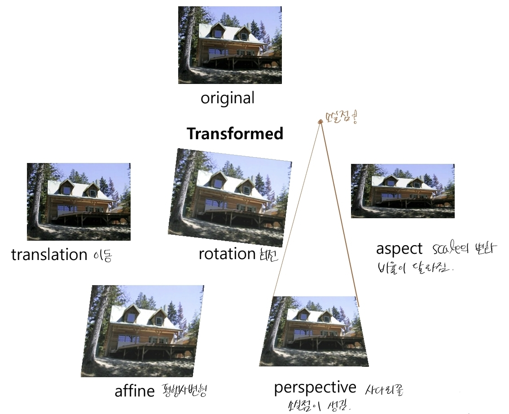
	- translation(이동)
	- rotation(회전)
	- aspect(scale/크기/비율의 변화)
	- affine(평행사변형)
	- perspective(사다리꼴)

## 6.2. 변환 종류와 성질

- 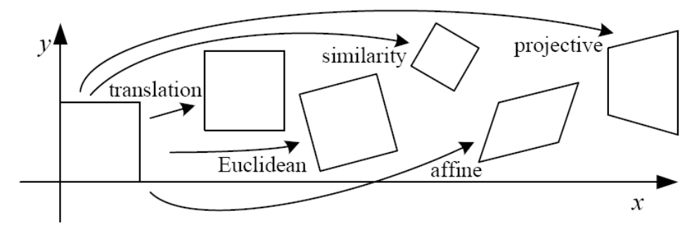
- 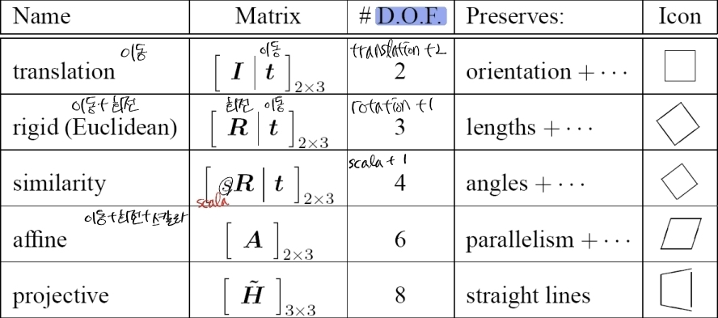
- Scaling: 각각의 요소에 스칼라를 곱한다. 변수 $a, b$ → 자유도: 2
	- Uniform -: 각각의 요소를 같은 스칼라를 곱한다.
		- 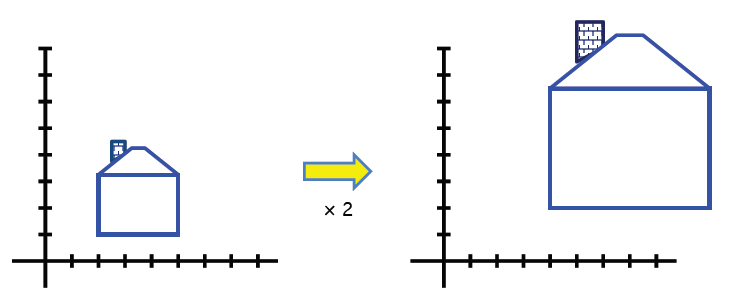
	- Non-uniform -: 각각의 요소를 다른 스칼라로 곱한다.
		- 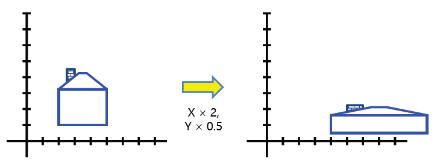
	- $$x' = a\,x,\qquad y' = b\,y$$
	- $$\begin{bmatrix} x' \\[2pt] y' \end{bmatrix}
		=
		\begin{bmatrix}
		s_x & 0\\
		0 & s_y
		\end{bmatrix}
		\begin{bmatrix} x \\[2pt] y \end{bmatrix}$$
- Rotation: 회전. 변수 $\theta$ → 자유도: 1
	- $$\begin{aligned}
		x' &= x\cos\theta - y\sin\theta,\\
		y' &= x\sin\theta + y\cos\theta
		\end{aligned}$$
	- $$\begin{bmatrix} x' \\[2pt] y' \end{bmatrix}
		=
		\begin{bmatrix}
		\cos\theta & -\sin\theta\\
		\sin\theta & \cos\theta
		\end{bmatrix}
		\begin{bmatrix} x \\[2pt] y \end{bmatrix}$$
- Translation: 이동. 변수 $t_x, t_y$ → 자유도: 2
	- $$\begin{bmatrix} x' \\[2pt] y' \end{bmatrix}
		=
		\begin{bmatrix}
		1 & 0 & t_x\\
		0 & 1 & t_y
		\end{bmatrix}
		\begin{bmatrix} x \\[2pt] y \\ 1 \end{bmatrix}$$
	- 1, 0 // 0, 1: I
- Shear: Scaling + Rotation. 변수 $\alpha_x, \alpha_y$ → 자유도: 2
	- $$\begin{bmatrix} x' \\[2pt] y' \end{bmatrix}
		=
		\begin{bmatrix}
		1 & \alpha_x\\
		\alpha_y & 1
		\end{bmatrix}
		\begin{bmatrix} x \\[2pt] y \end{bmatrix}$$
- **Affine:** Scale + Rotate + Translate + Shear. 변수 $a, b, c, d, e, f$ → 자유도: 6
	- 평행성·선형성 유지(직선→직선, 평행 유지, 선분 비율 보존).
	- $$\begin{bmatrix} x' \\[2pt] y' \end{bmatrix}
		=
		\begin{bmatrix}
		a & b & c\\
		d & e & f
		\end{bmatrix}
		\begin{bmatrix} x \\[2pt] y \\ 1 \end{bmatrix}$$
		- a, b, d, e: scale + shear + rotate
		- c, f: traslate
	- $$\begin{bmatrix} x' \\[2pt] y' \\ 1 \end{bmatrix} =
			\begin{bmatrix}
			a & b & c\\
			d & e & f\\
			0 & 0 & 1
			\end{bmatrix}
			\begin{bmatrix} x \\[2pt] y \\ 1 \end{bmatrix}$$
- **Projective(투시/호모그래피):**
	- 직선→직선이지만 **평행·비율 불보존**
	- 평행성이 깨지면서 소실점 발생
	- 행렬은 **스케일까지 정의** 변수: $a, b, c, d, e, f ,g, h, i$ → 자유도: 8
	- $$\begin{bmatrix} x'\\ y'\\ w' \end{bmatrix}
		=
		\begin{bmatrix}
		a & b & c\\
		d & e & f\\
		g & h & i
		\end{bmatrix}
		\begin{bmatrix} x\\ y\\ w \end{bmatrix}$$

---

## 6.3. 동차좌표·행렬

- 동치 좌표: $\dot{x}=(\,y\;\; x\;\; 1\,)$
	-  예: $(3,5)\to(3,5,1)$
- **동차행렬:** $(x,y)\to(x,y,1)$로 확장하면 2D 변환을 **3×3 행렬** 하나로 통일적으로 표현·조합 가능.
	- 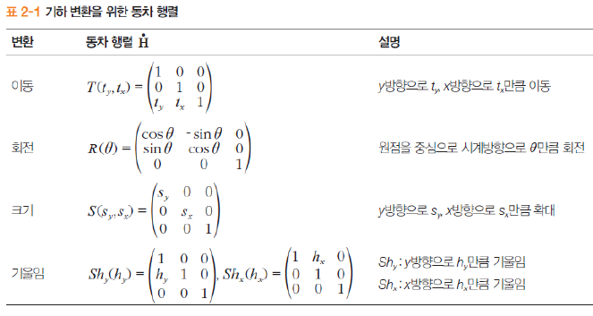
- e.g. 평행이동 행렬(행-벡터 우측곱 규약):  T(3,2)
	- $$\dot{H}=T(3,2)=
		\begin{pmatrix}
		1 & 0 & 0\\
		0 & 1 & 0\\
		3 & 2 & 1
		\end{pmatrix}$$
	- $$\dot{x}'=(\,y'\;\; x'\;\; 1\,)=
		\dot{x}\,\dot{H}=
		(\,y\;\; x\;\; 1\,)
		\begin{pmatrix}
		a_{11} & a_{12} & 0\\
		a_{21} & a_{22} & 0\\
		a_{31} & a_{32} & 1
		\end{pmatrix}$$
	- $$y' = a_{11}y + a_{21}x + a_{31}, \qquad
x' = a_{12}y + a_{22}x + a_{32}$$
- 예제: 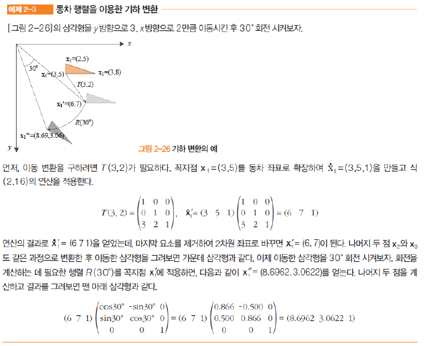
- **동차좌표 사용하는 이유**: 여러 변환을 **곱으로 결합**해 한 번에 적용 (**계산 효율↑**)

## 6.4. 전방 vs 후방 매핑

- 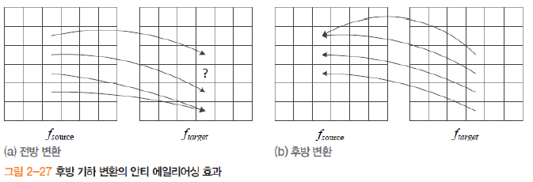
- **전방(forward) 매핑:** 원 영상의 픽셀을 변환해 타깃 위치에 찍기
	- **구멍(hole)/겹침**·**에일리어싱** 심함.
- **후방(backward) 매핑** 타깃의 각 픽셀에서 **역변환**으로 원 영상의 **실수 좌표**를 찾아 **보간**
	- 역행렬을 미리 구해 두고 후방 매핑으로 샘플링한다
	- **안티에일리어싱** 효과.
- 알고리즘
	- 전방 기하 변환: 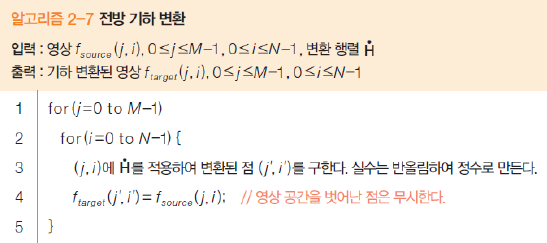
	- 후방 기하 변환: 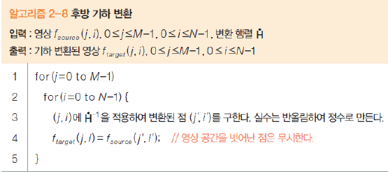

## 6.5. 보간(Interpolation)과 반(反)에일리어싱

- **왜 보간이 필요한가:** 실수 좌표를 정수로 **반올림**하면 에일리어싱 발생
	- **주변 화소로 보간**해 완화 → 거리에 대한 비율
- **방법과 비교:**
    - **최근접(nearest):** 가장 빠르나 **블록/톱니** 아티팩트.
    - **양선형(bilinear):** 4이웃 가중 평균(균형 잡힌 화질/속도)
	    - 1차원 보간식 유도: $f(x')=(1-\alpha)\,f(x)+\alpha\,f(x+1)$
		    - 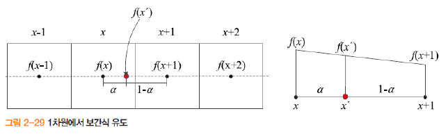
	    - 2차원 보간식 유도: $$\begin{aligned}
			f(y, x') &= (1-\alpha) f(y,x) + \alpha f(y, x+1),\\
			f(y+1, x') &= (1-\alpha) f(y+1,x) + \alpha f(y+1, x+1),\\
			f(y', x') &= (1-\beta) f(y, x') + \beta f(y+1, x')
			\end{aligned}$$
			- 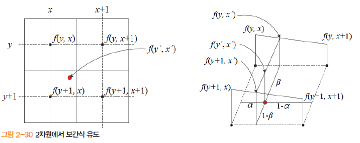
    - **양삼차(bicubic):** 16이웃, **부드러움/에지 보존**↑(연산량↑).

## 6.6. 다해상도

- 해상도를 줄이거나 늘리는 연산
	- 다양한 응용
		- 멀티미디어 장치에 디스플레이
		- 물체 크기 변환에 강인한 인식 등
		- 스케일이 다양한 물체 처리 가능
	- 업샘플링과 다운샘플링
- 피라미드
	- 피라미드 구축 연산식: $$f_k(j,i)
		= f_{k-1}\!\left(\frac{j}{r},\,\frac{i}{r}\right),
		\qquad r=\frac{1}{2},\; 1\le k \le q$$
	- 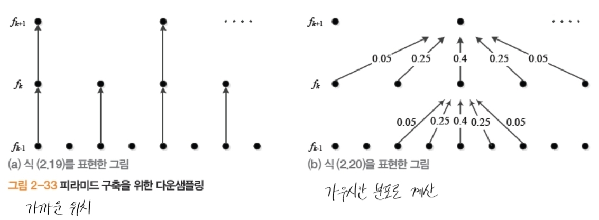
- Burt & Adelson 방법
	- 수식: $$f_k(j,i)
		= \sum_{y=-2}^{2}\sum_{x=-2}^{2} w(y,x)\;
		  f_{k-1}\!\left(\frac{j}{r}+y,\; \frac{i}{r}+x\right),
		\qquad r=\frac{1}{2},\; 1\le k \le q$$
	- 모든 화소가 50%씩 공헌
	- 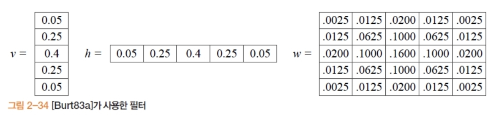

## 6.7. 모폴로지(Morphology)

- **모폴로지**: 본래 생물학의 ‘형태 변화’ 개념에서 시작
- **수학적 모폴로지**는 영상을 원하는 형태로 바꾸는 규칙적 연산의 집합 → 패턴을 원하는 형태로 변환하는 기법

### 6.7.1. 이진 모폴로지 (Binary)

- **대상**: 값이 0/1(또는 0/255)인 **이진 영상**.
- 구조요소
	- 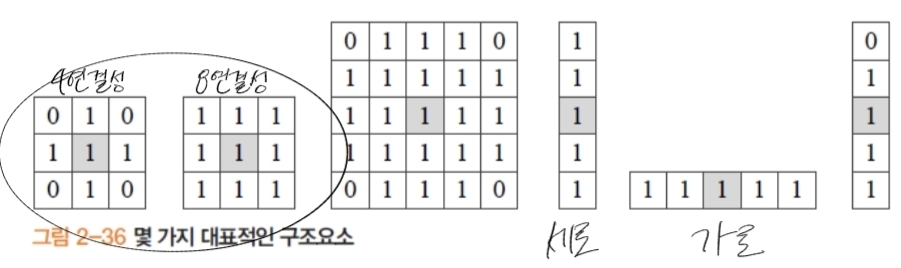
- 연산
	- $S_t=\{\,s+t \mid s\in S\,\}$
	- 팽창: 두꺼워짐/커짐(틈 메움·연결 강화)
		- $f\oplus S=\bigcup_{x\in f} S_x$
	- 침식: 얇아짐/작아짐(작은 점·돌기 제거에 유리)
		- $f\ominus S=\{\,x \mid x+s\in f,\ \forall s\in S\,\}$
	- **열기(침식→팽창)**: **작은 잡음 제거**·가느다란 돌기 제거
		- $f\circ S=(f\ominus S)\oplus S$
	- **닫기(팽창→침식)**: **작은 구멍 메움**·틈새 채움
		- $f\bullet S=(f\oplus S)\ominus S$
- 예제
	- 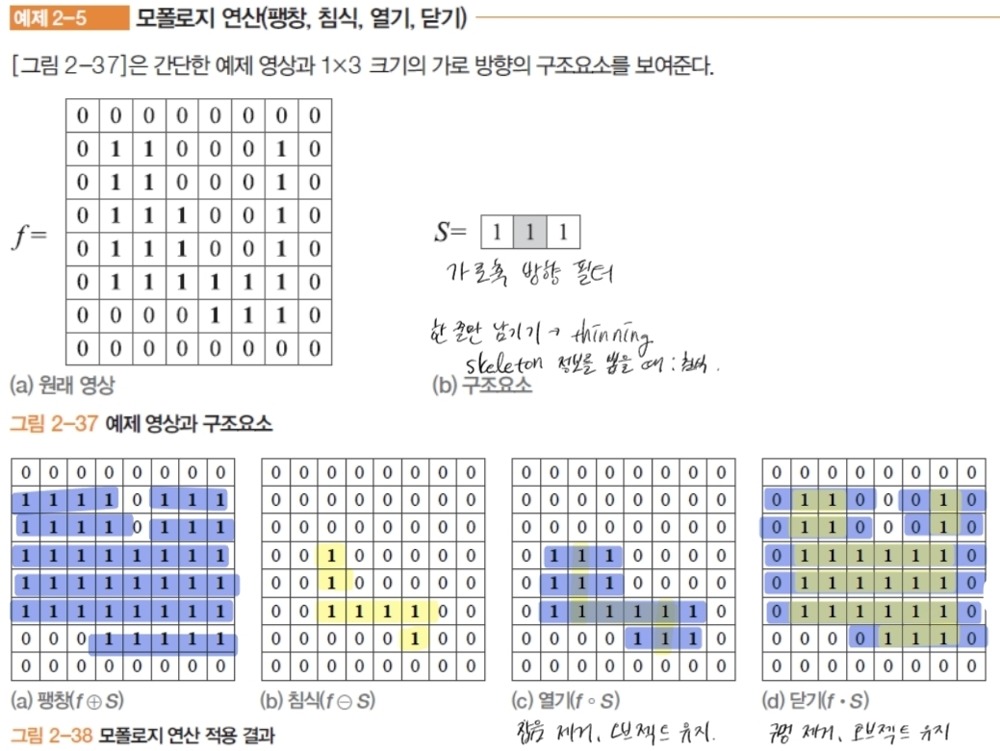

### 6.7.2. 명암(그레이스케일) 모폴로지

- **대상**: 0–255 등 **연속 톤(그레이스케일)** 영상.
- 구조 요소
	- 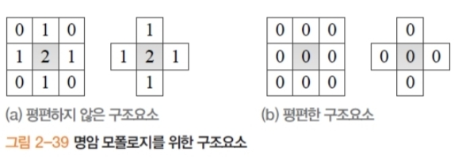
- 연산
	- 명암 팽창(평편 X 구조요소)
		- $(f \oplus S)(j,i)= \max_{(y,x)\in S}\big(f(j-y,i-x)+S(y,x)\big)$
	- 명암 침식(평편 X 구조요소)
		- $(f \ominus S)(j,i) = \min_{(y,x)\in S}\big(f(j+y,i+x)-S(y,x)\big)$
	- 명암 팽창(평편 O 구조요소)
		- $(f \oplus S)(j,i) = \max_{(y,x)\in S} f(j-y,i-x)$
	- 명암 침식(평편 O 구조요소)
		- $(f \ominus S)(j,i) = \min_{(y,x)\in S} f(j+y,i+x)$
	- 열기
		- $f \circ S = (f \ominus S) \oplus S$
	- 닫기
		- $f \bullet S = (f \oplus S) \ominus S$
- **명암 모폴로지(특히 closing 등)의 실전 활용 빈도·효익이 낮다**
- 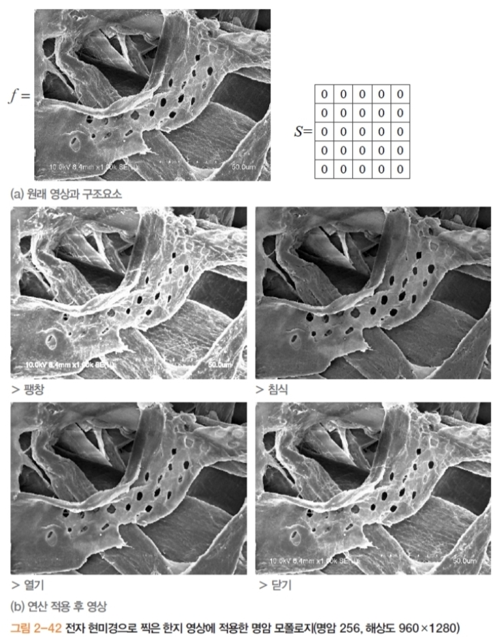