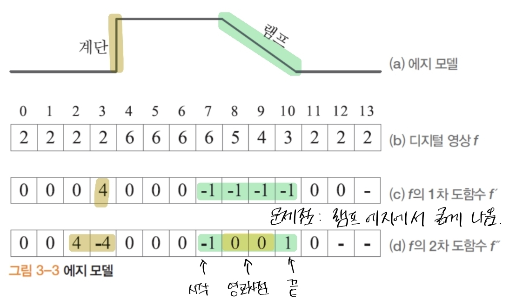
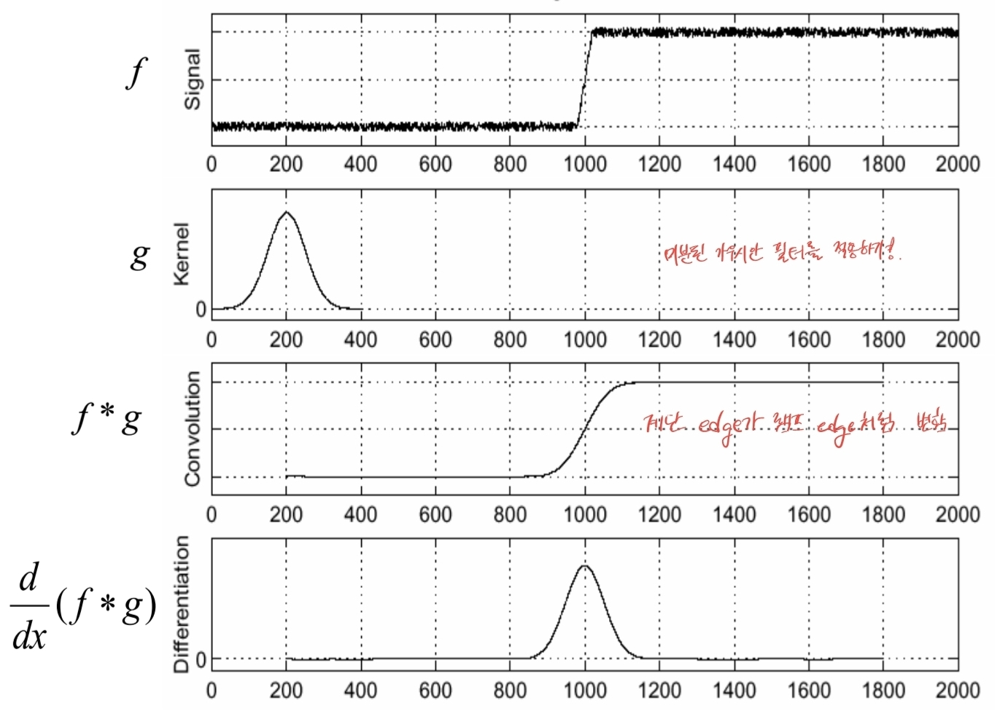

# 7장. 에지(Edge)

- **유용성:** 물체 경계를 안정적으로 표시, 매칭·정합·분할의 핵심 단서.
- **어려움:** 잡음 증폭, 약한/누락(edge miss)·거짓 에지(false edge), 조명/질감 변화, 스케일 의존성.

## 7.1. 에지 검출 기초

### 7.1.1. 연속/이산 미분

- 연속 공간 미분: $$\displaystyle f'(x)=\frac{ds}{dx} = \lim_{\Delta x\to 0} \frac {s(x + \Delta x) - s(x))}{\Delta x}$$ 는 **밝기 변화율** → 에지에서 극값(피크).
- 이산 공간 미분: $$f'(x) = \frac{df}{dx} = \lim_{\Delta x\to 0} \frac {f(x + \Delta x) - f(x))}{\Delta x} = f(x{+}1)-f(x)$$
	- → 에지 연산자 마스크: $\begin{bmatrix} -1 & 1\end{bmatrix}$
- 

- 2차 미분: $$\begin{align}
			f''(x) &= \frac{d^2f}{dx^2}= f'(x) - f'(x-1) \\
			&= (f(x+1)-f(x)) - (f(x)-f(x-1)) \\
			&=f(x+1)+f(x-1)-2f(x)
			\end{align}$$
	- 마스크: $\begin{bmatrix} 1 & -2 & 1\end{bmatrix}$

- 에지 검출 과정
	- 1차 미분에서 봉우리, 2차 미분에서 영교차를 찾음

### 7.1.2 에지 모델과 1차/2차 미분

- **계단(step) 에지**: 밝기 불연속. 1차 미분=피크(±), 2차 미분=**0-교차(zero-crossing)**.
- **램프(ramp) 에지**: 실제 영상은 주로 램프(기울기 완만). 잡음 때문에 **스무딩 선행** 필요.
- **선(line) 에지**: 밝기 얇은 봉우리/골. 2차 미분 응답 유용.

### 7.1.3 잡음과 스무딩: 가우시안/가우시안 미분

- 
- 미분은 **고주파(잡음) 증폭** → **가우시안 스무딩 $G_\sigma$** 선행:
	- $I_\sigma = G_\sigma * I,\quad \partial_x I_\sigma = (\partial_x G_\sigma) * I$
- 가우시안은 **분리 가능** → $O(k^2)$ → $O(2k)$로 연산량 감소.
- **커널 크기**: 실무적으로 $\text{size} \approx 6\sigma+1$ (가장 작은 홀수) 권장.

## 7.2. 에지 모델과 연산자

- $\Delta x = 1$이 잡음에 너무 민감 → $\Delta x = 2$로 확장
	- $$f'(x) = \frac{df}{dx}  = \frac{f(x+1)-f(x-1)}{2}$$
	- 마스크: $\begin{bmatrix} -1 & 0 & 1\end{bmatrix}$
- 2차원으로 확장
	- $$\begin{align}
\nabla f(y,x)
&= (\frac{\partial f}{\partial y}, \frac{\partial f}{\partial x})
= (d_y , d_x) \\
&= (f(y{+}1,x)-f(y{-}1,x)), (f(y,x{+}1)-f(y,x-1))
\end{align}
$$
	- 마스크: $$m_y=\begin{bmatrix}-1\\0\\1\end{bmatrix},\qquad
m_x=\begin{bmatrix}-1&0&1\end{bmatrix}$$

- **기본 미분 커널**
	- 
    - _Roberts_: 매우 작은 2×2 대각 미분(노이즈 취약, 오래된 방식)
    - _Prewitt_: 3×3, 미분 + 단순 평균 스무딩
    - _Sobel_: 3×3, 중앙 가중 → Prewitt보다 **스무딩 효과↑**, $G_y=G_x^\top$

- Haar Filter
- Ada Boost

## 7.3. 에지 강도와 에지 방향

- 
- 2D 그레이스케일 $I(x,y)$에서 **기울기(gradient)**
	- gradient: $$\nabla f=(\frac{\partial f}{\partial y}, \frac{\partial f}{\partial x})=(d_y, d_x)$$
	- 에지 강도: $$S(y, x) = |\nabla f|=\sqrt{d_y^2+d_x^2}$$
	- gradient 방향: $$D(y, x) = \theta=\operatorname{arctan}(\frac{d_y}{d_x})$$
	- 
	- 
	- 
- 예제
	- 

