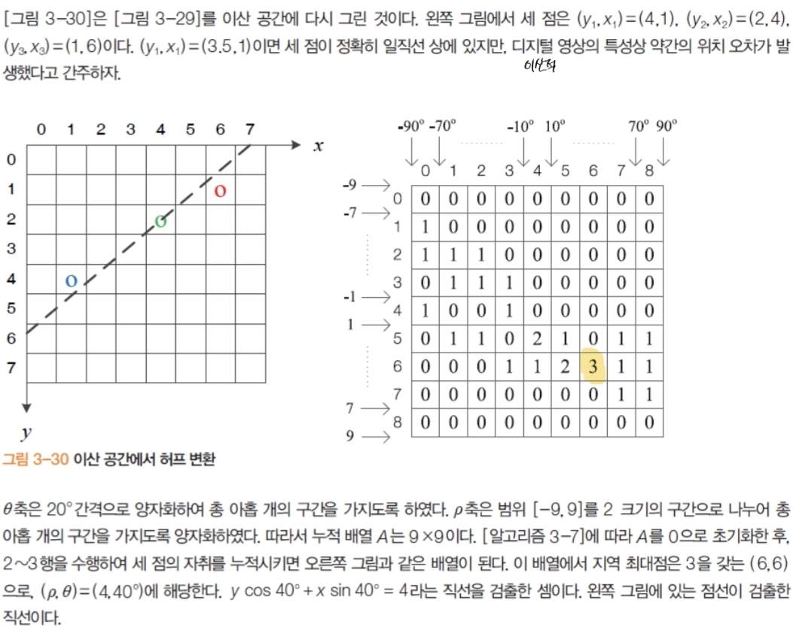

# 8. 선분 검출
## 8.1. 에지 연결과 표현

- 

| 성분  | 주변 에지 성분 개수 |
| --- | ----------- |
| 끝점  | 1           |
| 분기점 | 3개 이상       |
| 통과점 | 2           |

- 에지 성분만 표현하는 방법
	- 체인 코드: 에지(또는 이진 경계)를 **순회하며 방향만 기록**해 경계를 표현하는 방식이다
	- 에지 토막: 연결된 에지 픽셀을 **짧은 곡선/선분 단위의 폴리라인**으로 묶어 표현한다

> poly line: 여러 개의 선 부분이 연속적으로 연결된 곡선 또는 직선 형태의 경로

## 8.2. 선분 근사

- 
- 두 끝점을 잇는 직선으로부터 가장 먼 점까지의 거리 $h$가 임계값 이내가 될 때까지 선분 분할을 재귀적으로 반복한다

## 8.3. Voting Schemes

**투표(voting) 기반 모델 추정**: 특징(feature)들이 자신과 **양립 가능한 모델들**에 표를 던지고, 표가 많이 모인 모델을 정답으로 뽑는다
e.g. **허프 변환(Hough transform)**, **RANSAC의 합의 집합(consensus set)**

### 8.3.1. 개념

- 각 특징 $f_i$가 “나와 **부합(compatible)** 하는” 모든 모델 파라미터 $\theta$에 **표를 던짐** → 누적기(accumulator)에 카운트
- **잡음(outlier)** 특징은 표를 여기저기 흩뿌려서 **어느 한 모델에도 표가 집중되지 않음**
- 일부 특징이 **누락(occlusion, missing data)** 되어도, 남은 특징들이 **같은 좋은 모델에 표를 몰아주면** 검출 가능

### 8.3.2. 동작

1. **모델 정의**: 예) 직선 $\rho = x\cos\theta + y\sin\theta$ (극좌표)
2. **파라미터 공간 분할**: $(\rho,\theta)$ 격자 만들기
3. **투표**: 에지 픽셀 등 특징점 $(x,y)$마다 가능한 $\theta$를 훑으며 해당 $\rho$ 계산 → 해당 버킷 $(\rho,\theta)$에 +1
4. **피크 찾기**: 누적기가 큰 버킷(피크)을 모델 후보로 선택
5. **정제(refine)**: 피크에 투표한 점들을 모아 최소자승 등으로 파라미터 미세 조정

### 8.3.3. 특징

### 8.3.1. 장점

- 잡음/가림(occlusion)·부분적 누락에 **매우 강건**
	- **잡음 특징**: 호환 가능한 모델이 제각각 → 표가 **분산** → 큰 피크를 못 만듦
	- **누락 데이터**: 일부 표가 빠져도 **남은 표가 임계치 이상** 모이면 피크 유지 → 검출 가능
- **복수 개**의 모델(여러 직선/원)도 피크 여러 개로 동시에 검출
- 병렬화 쉬움

### 8.3.2. 단점

- 파라미터 차원이 커질수록 **격자 수 폭증**(계산·메모리 부담, 양자화 오차)
- **버킷 크기/임계치**에 민감(과도한 스무딩은 피크 손실, 너무 세분화하면 잡음 피크 증가)
- 근접한 피크 병합/해석이 필요

## 8.4. 허프 변환(Hough Transform)

- 
- 허프 변환: 차원의 변환, 좌표계의 변환
	- 에지 연결 과정 없이 선분 검출 (전역 연산을 이용한 지각 군집화)
	- 영상 공간 _y-x_ 를 기울기 절편 공간 _b-a_ 로 매핑
	- **일반 절차**: 파라미터 공간을 **격자(bin)** 로 이산화 → 영상의 각 에지점이 가능한 모든 파라미터 bin에 **투표** → 누적배열의 **피크**를 검출.
- 
- 파라미터 범위가 무한, **수직선**에서 $m\to\infty$ 문제가 발생.
	- **극좌표** 대안: $\rho=x\cos\theta+y\sin\theta$
	- 

- 원 검출: 3차원 누적 배열 사용
	- $(y - b)^2 + (x-a)^2 = r^2$
- **해석 관점**: 영상의 한 점 $(x_0,y_0)$은 허프 공간에서 **사인곡선**이며, **두 점 곡선의 교차**가 두 점을 지나는 직선의 파라미터.
- 

~~*8 * 8 사이즈에서 9 * 9 사이즈가 된 걸 보면 허프 변환이 모든 상황에서 더 효율적인 것은 아닌 것 같다*~~ 

## 8.5. RANSAC — 불량치(outlier) 견고 추정

- **정의/배경**: Fischler & Bolles(1981). 인라이어 집합을 찾아 **모델을 견고하게 적합**(무작위 표본 기반). 선분 검출에선 모델을 $y=ax+b$로 둔다.
- **기본 루프(가설–검증 반복)**
    1. **최소 표본** 무작위 선택 → 2) **모델 가설** → 3) **오차함수** 계산 → 4) **일치(inlier) 집합** 선택 → 5) **반복**.
- **확장 포인트**: **점-점 매칭쌍** $X={(a_i,b_i)}$ 입력도 처리하도록 일반화(기하 추정에 활용).
- 
# RANSAC와의 비교(언제 뭘 쓰나)

- **허프**: 파라미터가 **저차원**이고 폐형식(직선·원 등)이 있을 때 단순·효율적.
- **RANSAC**: 복잡하거나 고차원 모델, 불균일한 불확실성에서 유리. 표본 추출 → 가설 모델 → 인라이어 카운트로 **투표와 유사한 합의**를 구함.

## 3) 누적배열의 잡음·격자 이슈

- **잡음 효과**: 균일 잡음이 증가하면 **최대 득표 수치도 증가**하여 피크가 퍼지고 위치가 애매해진다. → bin 크기 선택, **누적배열 평활화(이웃 bin 증가)**, **강한 경사만 사용** 등으로 대응.

---

## 4) 원/일반 곡선 검출

- **원 검출**: 중심 $(a,b)$, 반지름 $r$로 **3차원 누적공간** 사용; 각 에지점·법선 정보로 투표(개념적으로는 $(x,y,r)$마다 원을 그려 **지지 정도** 평가).
- **일반화 허프(GHT)**: 템플릿의 기준점(센터)과 **랜드마크의 변위 벡터 분포**를 저장해 새로운 영상의 특징이 해당 분포로 **센터 후보에 투표**.

---

## 

- **장점**: 비국소성/가림(occlusion) 처리, **복수 인스턴스** 검출, 잡음에 어느 정도 **강건**.
- **단점**: 파라미터 수가 늘면 **연산량이 지수적 증가**, **비목표 피크** 가능, **격자 크기 선택**이 어렵다.

---

