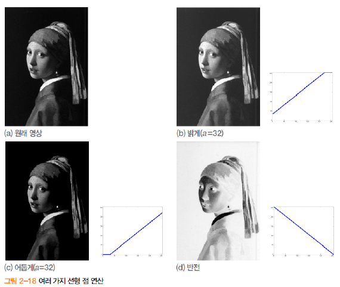

# 5. 영상 처리 연산
## 5.1. 점 연산(Point operation)

- **정의**: 한 픽셀의 새 값이 **오직 그 픽셀 자신의 명암값**만으로 결정되는 변환
	- $$f_{out}(i, j) = t(f_1(i, j), \, f_2(i, j), \, ..., \, f_k(i, j))$$
- **형태**
    - **선형 점 연산**: 밝기·대비 조절 등
	    - 
	    - $$f_{out}(i, j) = t(f(i, j))
	    = \begin{cases}
		min(f(i, j) + a, \, L-1), \quad \text{(밝게)} \\
		max(f(i, j) - a, \, 0), \quad \text{(어둡게)} \\
		(L-1) - f(i, j), \quad \text{(반전)}
		\end{cases}$$
    - **비선형 점 연산**: **감마 수정**(표시 장치 보정 등)
	    - 
	    - $$f_{out}(i, j) = (L-1) \times (\hat f(i, j))^\gamma \quad \text {이때} \; \hat f(i, j) = \frac {f(i, j)}{L-1}$$
    - **디졸브(dissolve)**: 두 영상 섞기(점 연산이지만 **(k=2)** 입력) e.g. fade in/out
	    - 
	    - $$f_{out}(i, j) = \alpha f_1(i, j) + (1 - \alpha)f_2(i, j)$$
- **특징/용도 요약**: 국소 문맥을 보지 않으므로 **빠르고 단순**, 명암 재매핑(밝기/대비/감마), 영상 간 블렌딩에 효과적.

## 5.2. 영역 연산(Spatial/Neighborhood operation, Filtering)

- **정의**: 한 픽셀의 새 값이 **이웃 화소들의 명암값 함수**로 정해짐.
- ==**무엇에 쓰나?**==
    - **향상**(노이즈 감소(denoise), 사이즈 조정(resize), 대조 강화(contrast))
    - **정보 추출**(texture, **edges**, keypoints)
    - **패턴 검출**(템플릿 매칭)

### 5.2.1. 상관(correlation) vs 컨볼루션(convolution)

- **상관**: “원시적인 매칭 연산(윈도우 형태 템플릿으로 물체 검출)”
- **컨볼루션**: **커널을 좌우·상하 뒤집은 후** 상관을 적용 → 내가 원하는 윈도우와 동일하게 출력시키기 위해 적용
- “컨볼루션은 커널을 **뒤집어** 적용, 상관/컨볼루션은 **유사도 최대 위치를 찾는** 동일한 맥락”.
- 
- 수식
	- 상관: $$g(i) = u \otimes f = \sum_{x=-\frac{(w-1)}{2}}^{\frac{(w-1)}{2}} u(x)\,f(i+x)$$
	- 컨볼루션: $$g(i) = u \ast f
		= \sum_{x=-\frac{(w-1)}{2}}^{\frac{(w-1)}{2}}
		  u(x)\,f(i-x)$$
- 
- 수식
	- 상관: $$g(j,i) = u \otimes f
		= \sum_{y=-\frac{(h-1)}{2}}^{\frac{(h-1)}{2}}
		  \sum_{x=-\frac{(w-1)}{2}}^{\frac{(w-1)}{2}}
		  u(y,x)\,f(j+y,i+x)$$
	- 컨볼루션: $$g(j,i) = u \ast f
		= \sum_{y=-\frac{(h-1)}{2}}^{\frac{(h-1)}{2}}
		  \sum_{x=-\frac{(w-1)}{2}}^{\frac{(w-1)}{2}}
		  u(y,x)\,f(j-y,i-x)$$

### 2.2 선형 필터의 핵심 성질(LSI)

- **선형성·시프트 불변성**: “어떤 **선형·시불변 연산자도 컨볼루션**으로 표현 가능”.
	- $F(Shift(f)) = Shift(F(f))$
- **대수 성질**: 교환·결합·분배·항등(임펄스) 등
	- $F(f_1 + f_2) = F(f_1) + F(f_2)$
- **결론**: 여러 필터를 연속 적용 ≡ **하나의 등가 필터**(성능·설계 단순화).

### 2.3 대표 필터와 효과

- $$h[m, n] = \sum _{k, l} f[m+k, n+l]$$
- **Smoothing, 스무딩(저역통과)**
    - **박스/가우시안**: 노이즈 저감, 부드러워짐.
	    - 박스 필터 사진
	    - 가우시안 필터 사진
	- 박스 특징: 각 픽셀의 인접 픽셀의 평균값으로 교체, 격자 무늬
    - **가우시안 특징**: 고주파 제거, **자기 컨볼루션 → 폭 증가**($\sigma !\to! \sigma\sqrt{2}$), **분리 가능**(2D = 1D×1D).
    - 5×5 **가중 커널 예시**(중심 가중, 주변 작음).
- **Sharpening, 샤프닝(고주파 강조)**
	- 특징: 자기 자신의 명암 강조 - 주변의 평균값
    - “**지역 평균과의 차**를 강조”하는 샤프닝 필터 예시.
- **에지 검출(1차 미분형)**
    - **Sobel**: 수직/수평 마스크로 **경계 강조**.
    - (연계) 미분은 노이즈에 민감 → **스무딩 후 미분**이 정석
- **비선형 필터**
    - **Median**: **임펄스(솔트 페퍼) 노이즈**에 강함.
	    - 최소, 최대 제외 후 중앙값 사용

### 2.4 구현·응용 메모

- **컨볼루션은 선형 연산** — 박스/가우시안(스무딩), 샤프닝, **수평·수직 에지** 효과를 한 슬라이드에서 비교 제시.
- **상관→템플릿 매칭**: 누적값 **최댓값 위치**가 후보(예시에서 위치 6).
- (녹음) CNN 맥락에서 **컨볼루션→풀링**으로 차원 축소·지역 정보 보존을 설명.

---

## 3) 한눈에 비교: 점 vs 영역

- **의존성**: 점 = **자기 픽셀만** / 영역 = **이웃 픽셀들**
- **표현력**: 점 = 밝기 재매핑/블렌딩 중심(감마, 디졸브) / 영역 = **스무딩·샤프닝·에지·질감** 등 구조적 정보 처리
- **연산 관점**: 점 = 픽셀 독립, (O(1)) / 영역 = 커널 크기 (k\times k)에 비례, **분리 가능** 가우시안으로 (O(k)) 최적화 가능.
