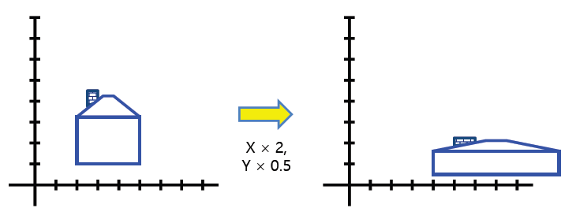

# 6. 기하 연산

## 6.1. 정의

- **정의:** “일정한 기하 연산으로 결정된 **화소 위치**의 값을 가져와 새 값을 만든다.” 즉, 좌표를 변환해 **어디서 샘플링할지**를 정하는 연산이다.
- **대표 변환:**
- 그림
	- translation(이동)
	- rotation(회전)
	- aspect(scale/크기/비율의 변화)
	- affine(평행사변형)
	- perspective(사다리꼴)

---

## 6.2. 변환 종류와 성질(요점)

- 표
- Scaling: 각각의 요소에 스칼라를 곱한다
	- Uniform -: 각각의 요소를 같은 스칼라를 곱한다.
		- 
	- Non-uniform -: 각각의 요소를 다른 스칼라로 곱한다.
		- 
	- $x' = a\,x,\qquad y' = b\,y$
	- 
- Rotation: 회전
	- 행렬식
- Translation: 이동
	- 행렬식
- Shear: Scaling + Rotation
	- 행렬식
- **Affine:** Scale + Rotate + Translate + Shear
	- 평행성·선형성 유지(직선→직선, 평행 유지, 선분 비율 보존).
	- 행렬식
- **Projective(투시/호모그래피):** 직선→직선이지만 **평행·비율 불보존**, 행렬은 **스케일까지 정의(8자유도)**.
	- 행렬식

---

## 6.3. 동차좌표·행렬

- **동차좌표/행렬:** $(x,y)!\to!(x,y,1)$로 확장하면 2D 변환을 **3×3 행렬** 하나로 통일적으로 표현·조합 가능.
	- 예: $(3,5)!\to!(3,5,1)$
	- 각 변환들의 동차 행렬 표
	- 동차 행렬을 이용한 기하 변환 예시
- **왜 동차좌표?** 여러 변환을 **곱으로 결합**해 한 번에 적용(계산 효율↑)

---

## 6.4. 전방 vs 후방 매핑

- 전방/후방 매핑 그림
- **전방(forward) 매핑:** 원 영상의 픽셀을 변환해 타깃 위치에 찍기 → **구멍(hole)/겹침**·**에일리어싱** 심함.
- **후방(backward) 매핑** 타깃의 각 픽셀에서 **역변환**으로 원 영상의 **실수 좌표**를 찾아 **보간** → **안티에일리어싱** 효과.
	- 역행렬을 미리 구해 두고 후방 매핑으로 샘플링한다
- 알고리즘

---

## 6.5. 보간(Interpolation)과 반(反)에일리어싱

- **왜 보간이 필요한가:** 실수 좌표를 정수로 **반올림**하면 에일리어싱 발생 → **주변 화소로 보간**해 완화.
- **방법과 비교:**
    - **최근접(nearest):** 가장 빠르나 **블록/톱니** 아티팩트.
    - **양선형(bilinear):** 4이웃 가중 평균(균형 잡힌 화질/속도)
	    - 수식과 그림
    - **양삼차(bicubic):** 16이웃, **부드러움/에지 보존**↑(연산량↑).

---

## 6.6. 다해상도

- 해상도를 줄이거나 늘리는 연산
	- 다양한 응용
		- 멀티미디어 장치에 디스플레이
		- 물체 크기 변환에 강인한 인식 등
	- 업샘플링과 다운샘플링
- 피라미드
	- 구축 연산
- Burt & Adelson 방법

---

## 6.7. 모폴로지(Morphology)

- **모폴로지**: 본래 생물학의 ‘형태 변화’ 개념에서 시작
- **수학적 모폴로지**는 영상을 원하는 형태로 바꾸는 규칙적 연산의 집합

### 6.7.1. 이진 모폴로지 (Binary)

- **대상**: 값이 0/1(또는 0/255)인 **이진 영상**.
- 구조요소
- 연산
	- 팽창: 두꺼워짐/커짐(틈 메움·연결 강화)
		- 수식
	- 침식: 얇아짐/작아짐(작은 점·돌기 제거에 유리)
		- 수식
	- **열기(침식→팽창)**: **작은 잡음 제거**·가느다란 돌기 제거
		- 수식
	- **닫기(팽창→침식)**: **작은 구멍 메움**·틈새 채움
		- 수식

### 6.7.2. 명암(그레이스케일) 모폴로지

- **대상**: 0–255 등 **연속 톤(그레이스케일)** 영상.
- **연산 항목**: **구조요소, 팽창·침식·열기·닫기**
- **명암 모폴로지(특히 closing 등)의 실전 활용 빈도·효익이 낮다**