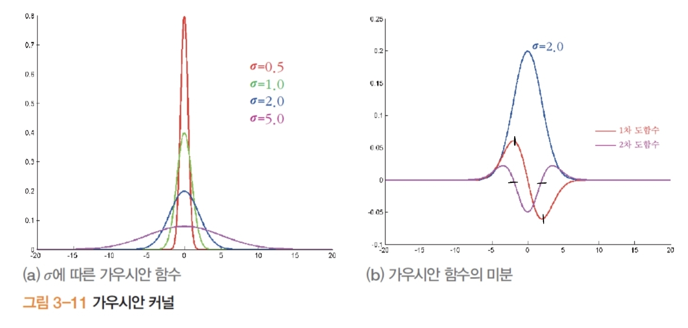
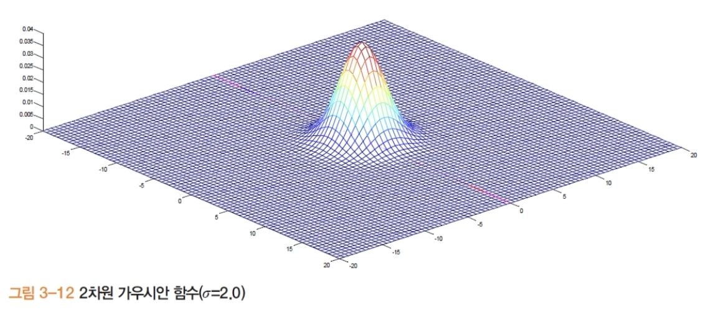

# 0 교차 이론

- **핵심 아이디어:** 가우시안으로 스무딩 후 **라플라시안 $\nabla^2$**(2차 미분) 적용 → **0 교차** 위치를 에지로. 
	- $\nabla^2 (G_\sigma * I) = (\nabla^2 G_\sigma) * I = LoG_\sigma * I$
- **장점:** 스케일 $\sigma$로 에지의 **세밀도** 조절, 얇고 닫힌 경계 추출 용이.
- **구현 팁**
    - LoG 직접 컨볼루션 또는 **DoG(차분 가우시안)** 로 근사.
    - **제로 교차 판정** 시, 이웃 픽셀 간 **부호 변화**와 **2차 미분 크기 임계**를 함께 사용해 잡음 억제.

## 1. 가우시안
### 1.1. 가우시안 사용 이유

- 미분은 잡음을 증폭 → 스무딩 적용
- 스케일 로 에지의 **세밀도** 조절
	- 

### 1.2. 가우시안 수식

- 1차원: $$G(x)=\frac{1}{\sqrt{2\pi}\,\sigma} \e ^{-\frac{x^{2}}{2\sigma^{2}}}$$
- 
- 2차원: $$$$
- 

## 4) 컬러 에지

### 4.1 채널별 처리의 한계

- RGB **각 채널에 독립 적용 후 OR** 하면 **채널마다 에지 위치가 달라** 불일치/중복 발생.

### 4.2 벡터-값 영상의 기울기(디젠조(Di Zenzo) 접근 요지)

- R/G/B 각 채널에서 ((I_{x,c}, I_{y,c}))를 구해 **구조 텐서** 유사 형태를 구성: 
	- $$J=\begin{bmatrix}  
	    \sum_c I_{x,c}^2 & \sum_c I_{x,c}I_{y,c}\  
	    \sum_c I_{x,c}I_{y,c} & \sum_c I_{y,c}^2  
	    \end{bmatrix}$$
- **고유값/고유벡터**로 **가장 큰 변화 방향**과 강도를 추정 → **단일 방향/강도**의 에지로 정리 가능.

---

