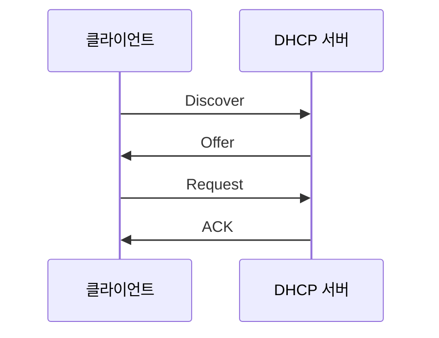
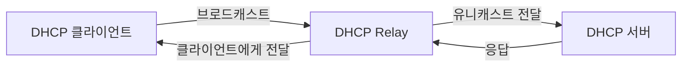

<!-- markdownlint-disable md060 -->

# DHCP(Dynamic Host Configuration Protocol)

## 목차

1. [DHCP 정의](#1-정의)
2. [DHCP가 제공하는 정보](#2-dhcp가-제공하는-정보)
3. [DHCP 동작 과정: DORA](#3-동작-과정-dora)
    1. [DHCP Discover](#31-dhcp-discover)
    2. [DHCP Offer](#32-dhcp-offer)
    3. [DHCP Request](#33-dhcp-request)
    4. [DHCP ACK](#34-dhcp-ack)
    5. [DHCP NAK](#35-dhcp-nak)
    6. [임대 갱신 과정](#36-임대-갱신-과정)
    7. [임대 만료](#37-임대-만료)
    8. [IP 주소 반환](#38-ip-주소-반환)
4. [DHCP 메시지 종류](#4-dhcp-메시지-종류)
5. [주요 DHCP 옵션](#5-주요-dhcp-옵션)
6. [주요 포트](#6-주요-포트)
7. [DHCP Relay](#7-dhcp-relay)
8. [DHCP 보안 위협과 대응](#8-dhcp-보안-위협과-대응)
9. [핵심 정리](#9-핵심-정리)
10. [참고](#참고)

---

## 1. 정의

**DHCP(Dynamic Host Configuration Protocol)**: 네트워크에 접속한 장비에 IP 설정을 자동으로 할당하는 프로토콜이다.

DHCP가 없으면 사용자가 IP 주소, 서브넷 마스크, 기본 게이트웨이, DNS 서버를 직접 설정해야 한다.

## 2. DHCP가 제공하는 정보

* IP 주소
* 서브넷 마스크
* 기본 게이트웨이
* DNS 서버 주소
* IP 주소 임대 시간(Lease Time)

## 3. 동작 과정: DORA



1. DHCP Discover: 클라이언트가 “사용할 수 있는 DHCP 서버가 있나요?”라는 브로드캐스트 메시지를 보낸다.
2. DHCP Offer: DHCP 서버가 할당 가능한 IP 주소와 네트워크 설정을 제안한다.
3. DHCP Request: 클라이언트가 사용할 IP 주소와 선택한 DHCP 서버를 알린다.
4. DHCP ACK: DHCP 서버가 할당을 승인하고, 클라이언트는 해당 IP 주소를 일정 시간 동안 사용한다.

### 3.1. DHCP Discover

네트워크에 처음 연결된 클라이언트는 다음 정보를 모른다.

* 자신의 IP 주소
* DHCP 서버 주소
* 기본 게이트웨이
* DNS 서버

따라서 DHCP 서버를 찾기 위해 `DHCP Discover`를 브로드캐스트로 전송한다.

| 항목      | 값                   |
| ------- | ------------------- |
| 출발지 MAC | 클라이언트 MAC           |
| 목적지 MAC | `FF:FF:FF:FF:FF:FF` |
| 출발지 IP  | `0.0.0.0`           |
| 목적지 IP  | `255.255.255.255`   |
| UDP 포트  | 68 → 67             |

Discover에는 일반적으로 다음 정보가 들어간다.

* 클라이언트 MAC 주소
* DHCP 메시지 유형
* 트랜잭션 ID(`XID`)
* 이전에 사용했던 IP 주소
* 필요한 DHCP 옵션 목록

트랜잭션 ID는 여러 클라이언트의 요청과 응답을 구분하는 데 사용된다.

### 3.2. DHCP Offer

Discover를 받은 DHCP 서버는 주소 풀에서 사용 가능한 IP 주소를 선택하고 `DHCP Offer`를 보낸다.

Offer에는 다음과 같은 정보가 포함된다.

* 제안하는 IP 주소
* 서브넷 마스크
* 기본 게이트웨이
* DNS 서버
* 임대 시간
* DHCP 서버 식별자

예:

```text
IP 주소:        192.168.10.100
서브넷 마스크:   255.255.255.0
기본 게이트웨이: 192.168.10.1
DNS 서버:       8.8.8.8
임대 시간:       8시간
```

클라이언트가 아직 제안된 IP를 정식으로 할당받은 것은 아니므로 Offer도 브로드캐스트로 전달될 수 있다.

DHCP 서버가 여러 대라면 클라이언트는 여러 Offer를 받을 수 있다.

### 3.3. DHCP Request

클라이언트는 받은 Offer 중 하나를 선택하고 `DHCP Request`를 브로드캐스트로 전송한다.

Request에는 다음 내용이 포함된다.

* 선택한 DHCP 서버
* 요청하는 IP 주소
* 클라이언트 식별 정보
* 최초 Discover와 동일한 트랜잭션 ID

브로드캐스트로 보내는 이유는 선택된 서버뿐 아니라 선택되지 않은 DHCP 서버에도 결과를 알리기 위해서이다.

```text
DHCP 서버 A: Offer 선택됨 → 할당 진행
DHCP 서버 B: Offer 선택 안 됨 → 예약했던 주소 회수
```

이 단계에서도 클라이언트는 아직 IP 주소를 완전히 사용할 수 없다.

### 3.4. DHCP ACK

선택된 서버는 요청을 승인하면 `DHCP ACK`를 전송한다.

ACK에는 최종 네트워크 설정이 포함된다.

* 할당된 IP 주소
* 서브넷 마스크
* 기본 게이트웨이
* DNS 서버
* 임대 시간
* 임대 갱신 시간

클라이언트는 ACK를 받은 후 설정을 인터페이스에 적용한다.

일부 운영체제는 IP 주소를 사용하기 전에 `ARP Probe` 또는 `Gratuitous ARP`를 보내 같은 IP를 사용하는 장비가 있는지 확인한다.

```text
충돌 없음 → IP 사용 시작
충돌 발견 → DHCP Decline 전송
```

### 3.5. DHCP NAK

서버가 클라이언트의 요청을 허용할 수 없으면 `DHCP NAK`를 보낸다.

주요 원인은 다음과 같다.

* 요청한 IP가 이미 사용 중
* 클라이언트가 다른 네트워크로 이동
* 이전 임대 정보가 유효하지 않음
* 요청한 주소가 DHCP Pool 범위 밖에 있음

NAK를 받은 클라이언트는 기존 설정을 버리고 Discover부터 다시 시작한다.

### 3.6. 임대 갱신 과정

DHCP 주소는 영구 할당이 아니라 일정 시간 동안 빌려주는 **Lease 방식**이다.

임대 시간이 8시간이라면 일반적으로 다음과 같이 동작한다.

|    시점 | 이름    | 동작                 |
| ----: | ----- | ------------------ |
|    0% | 임대 시작 | DHCP ACK를 받고 주소 사용 |
|   50% | T1    | 기존 서버에 갱신 요청       |
| 87.5% | T2    | 모든 DHCP 서버에 재할당 요청 |
|  100% | 만료    | 주소 사용 중단           |

#### T1: Renewal

임대 시간의 약 50%가 지나면 클라이언트는 기존 DHCP 서버에 `DHCP Request`를 유니캐스트로 전송한다.

```text
클라이언트 → 기존 DHCP 서버: DHCP Request
기존 서버 → 클라이언트: DHCP ACK
```

ACK를 받으면 임대 시간이 다시 시작된다.

#### T2: Rebinding

T1에서 기존 서버가 응답하지 않고 임대 시간의 약 87.5%가 지나면 클라이언트는 모든 DHCP 서버를 대상으로 Request를 브로드캐스트한다.

다른 DHCP 서버가 갱신을 승인할 수도 있다.

### 3.7. 임대 만료

임대가 끝날 때까지 ACK를 받지 못하면 클라이언트는 해당 IP의 사용을 중단하고 Discover부터 다시 시작한다.

### 3.8. IP 주소 반환

클라이언트가 정상적으로 네트워크 사용을 종료하면 `DHCP Release`를 서버에 전송할 수 있다.

```text
클라이언트 → DHCP 서버: DHCP Release
```

서버는 해당 주소를 회수해 다른 클라이언트에게 할당할 수 있다. 하지만 갑작스러운 전원 종료나 케이블 분리 시 Release가 전송되지 않을 수 있으므로, 서버는 임대 시간이 끝날 때까지 주소를 유지한다.

## 4. DHCP 메시지 종류

DHCP는 주소 할당 과정 외에도 충돌 통보, 주소 반환, 추가 설정 요청 등을 위한 여러 메시지를 사용한다. DHCP 메시지 유형은 DHCP Option 53으로 구분된다.

| 메시지            | 전송 방향      | 역할                          |
| -------------- | ---------- | --------------------------- |
| `DHCPDISCOVER` | 클라이언트 → 서버 | 사용 가능한 DHCP 서버 탐색           |
| `DHCPOFFER`    | 서버 → 클라이언트 | 사용할 수 있는 IP 주소와 설정 제안       |
| `DHCPREQUEST`  | 클라이언트 → 서버 | 특정 서버와 IP 주소 선택 또는 임대 갱신 요청 |
| `DHCPDECLINE`  | 클라이언트 → 서버 | 제안된 IP 주소가 이미 사용 중임을 통보     |
| `DHCPACK`      | 서버 → 클라이언트 | IP 주소 할당 또는 갱신 승인           |
| `DHCPNAK`      | 서버 → 클라이언트 | IP 주소 요청 또는 갱신 거부           |
| `DHCPRELEASE`  | 클라이언트 → 서버 | 사용하던 IP 주소 반환               |
| `DHCPINFORM`   | 클라이언트 → 서버 | IP 주소를 제외한 추가 네트워크 설정 요청    |

> `DORA`는 최초 주소 할당 과정에서 사용되는 네 메시지인 Discover, Offer, Request, ACK의 앞 글자를 조합한 표현이다.

## 5. 주요 DHCP 옵션

DHCP는 메시지의 Options 영역을 통해 클라이언트에 필요한 네트워크 설정을 전달한다. RFC 2132는 서브넷 마스크, 라우터, DNS 서버, 임대 시간, 서버 식별자 등의 옵션을 정의한다.

| 옵션 번호 | 옵션 이름                   | 역할                                |
| ----: | ----------------------- | --------------------------------- |
|     1 | Subnet Mask             | 클라이언트가 사용할 서브넷 마스크                |
|     3 | Router                  | 기본 게이트웨이로 사용할 라우터 주소              |
|     6 | Domain Name Server      | DNS 서버 주소                         |
|    50 | Requested IP Address    | 클라이언트가 요청하는 IP 주소                 |
|    51 | IP Address Lease Time   | IP 주소 임대 시간                       |
|    53 | DHCP Message Type       | Discover, Offer, Request 등 메시지 종류 |
|    54 | Server Identifier       | DHCP 서버 식별 주소                     |
|    55 | Parameter Request List  | 클라이언트가 요청하는 옵션 목록                 |
|    58 | Renewal Time Value      | 임대 갱신 시점인 T1                      |
|    59 | Rebinding Time Value    | 재바인딩 시점인 T2                       |
|    61 | Client Identifier       | 클라이언트 식별 정보                       |
|    82 | Relay Agent Information | DHCP Relay가 전달하는 회선·포트 식별 정보      |

모든 DHCP 서버가 위 옵션을 전부 제공하는 것은 아니다. 실제로 전달되는 옵션은 서버 설정과 네트워크 정책에 따라 달라진다.

## 6. 주요 포트

DHCPv4는 UDP를 사용한다.

| 구분         | UDP 포트 |
| ---------- | -----: |
| DHCP 서버    |     67 |
| DHCP 클라이언트 |     68 |

일반적인 클라이언트 요청은 `UDP 68 → 67`, 서버 응답은 `UDP 67 → 68` 방향으로 전달된다.

참고로 DHCPv6는 별도의 포트를 사용한다.

| 구분                    | UDP 포트 |
| --------------------- | -----: |
| DHCPv6 클라이언트          |    546 |
| DHCPv6 서버·Relay Agent |    547 |

## 7. DHCP Relay

DHCP Discover는 기본적으로 브로드캐스트이므로 라우터를 통과하지 못한다. 따라서 DHCP 서버가 클라이언트와 다른 네트워크에 있으면 라우터나 멀티레이어 스위치에 **DHCP Relay Agent**를 설정해야 한다.



Cisco IOS에서는 일반적으로 클라이언트가 속한 인터페이스에 `ip helper-address`를 설정한다.

```cisco
interface GigabitEthernet0/0
 ip address 192.168.10.1 255.255.255.0
 ip helper-address 192.168.100.10
```

위 설정에서:

* 클라이언트 네트워크: `192.168.10.0/24`
* 기본 게이트웨이 및 Relay: `192.168.10.1`
* DHCP 서버: `192.168.100.10`

Relay Agent는 클라이언트의 브로드캐스트 요청을 받아 DHCP 서버에 전달한다. 서버는 Relay 정보로 클라이언트가 속한 네트워크를 판단하고 적절한 주소 풀을 선택한다.

## 8. DHCP 보안 위협과 대응

### 8.1. 주요 보안 위협

| 공격                | 원리                           | 영향                  |
| ----------------- | ---------------------------- | ------------------- |
| Rogue DHCP Server | 공격자가 비인가 DHCP 서버를 운영         | 잘못된 게이트웨이·DNS 정보 제공 |
| DHCP Starvation   | 가짜 MAC 주소를 대량 생성해 주소 요청      | DHCP 주소 풀 고갈        |
| DHCP 기반 중간자 공격    | 공격자 주소를 기본 게이트웨이로 제공         | 트래픽 감청·변조           |
| DNS 설정 변조         | 악성 DNS 서버 주소 제공              | 피싱 사이트 또는 악성 서버로 유도 |
| DHCP Spoofing     | 정상 DHCP 서버보다 빠르게 위조 Offer 전송 | 공격자가 원하는 네트워크 설정 적용 |

DHCP 자체에는 서버를 강력하게 인증하는 기본 구조가 없기 때문에, 공격자가 같은 브로드캐스트 영역에 접근할 수 있으면 위조 DHCP 응답을 보낼 수 있다.

### 8.2. DHCP Snooping

DHCP Snooping은 스위치가 DHCP 메시지를 검사하여 비인가 DHCP 서버의 응답을 차단하는 기능이다.

스위치 포트는 다음과 같이 구분된다.

| 포트 상태     | 용도                     | 처리                 |
| --------- | ---------------------- | ------------------ |
| Trusted   | 정상 DHCP 서버 또는 Relay 방향 | DHCP 서버 응답 허용      |
| Untrusted | 일반 사용자·클라이언트 방향        | 서버가 보내는 DHCP 응답 차단 |

Cisco 스위치의 포트는 기본적으로 DHCP Snooping 관점에서 `untrusted`이며, 정상 DHCP 서버 또는 Relay 방향의 포트만 명시적으로 `trusted`로 설정해야 한다.

```cisco
ip dhcp snooping
ip dhcp snooping vlan 10,20

interface GigabitEthernet0/1
 description DHCP_SERVER_UPLINK
 ip dhcp snooping trust
```

사용자 포트에는 필요에 따라 DHCP 패킷 전송률 제한을 적용할 수 있다.

```cisco
interface range GigabitEthernet0/2-24
 ip dhcp snooping limit rate 15
```

DHCP Snooping은 정상적으로 승인된 임대 정보를 바인딩 테이블에 저장한다.

```text
MAC 주소 ↔ IP 주소 ↔ VLAN ↔ 스위치 포트 ↔ 임대 시간
```

바인딩 테이블은 다음 보안 기능의 신뢰 정보로도 활용될 수 있다.

* Dynamic ARP Inspection
* IP Source Guard

## 9. 핵심 정리

* DHCP는 클라이언트에 IP 주소와 네트워크 설정을 자동으로 제공한다.
* 최초 주소 할당은 일반적으로 `Discover → Offer → Request → ACK` 순서로 진행된다.
* DHCPv4는 서버 UDP 67번, 클라이언트 UDP 68번 포트를 사용한다.
* IP 주소는 영구적으로 제공되는 것이 아니라 임대 방식으로 할당된다.
* T1과 T2를 서버가 별도로 지정하지 않았다면 기본값은 각각 임대 시간의 50%와 87.5%이다.
* 서버가 다른 네트워크에 있으면 DHCP Relay가 필요하다.
* Rogue DHCP Server와 DHCP Starvation을 방어하기 위해 DHCP Snooping을 사용할 수 있다.
* DHCP 서버나 Relay 방향만 `trusted`로 설정하고 사용자 포트는 `untrusted`로 유지한다.

---

## 참고

1. [RFC 2131—Dynamic Host Configuration Protocol](https://www.rfc-editor.org/rfc/rfc2131)
2. [RFC 2132—DHCP Options and BOOTP Vendor Extensions](https://www.rfc-editor.org/rfc/rfc2132)
3. [RFC 3046—DHCP Relay Agent Information Option](https://www.rfc-editor.org/rfc/rfc3046)
4. [RFC 8415—Dynamic Host Configuration Protocol for IPv6](https://www.rfc-editor.org/rfc/rfc8415)
5. [Cisco—Configuring DHCP Snooping](https://www.cisco.com/en/US/docs/general/Test/dwerblo/broken_guide/snoodhcp.html)
