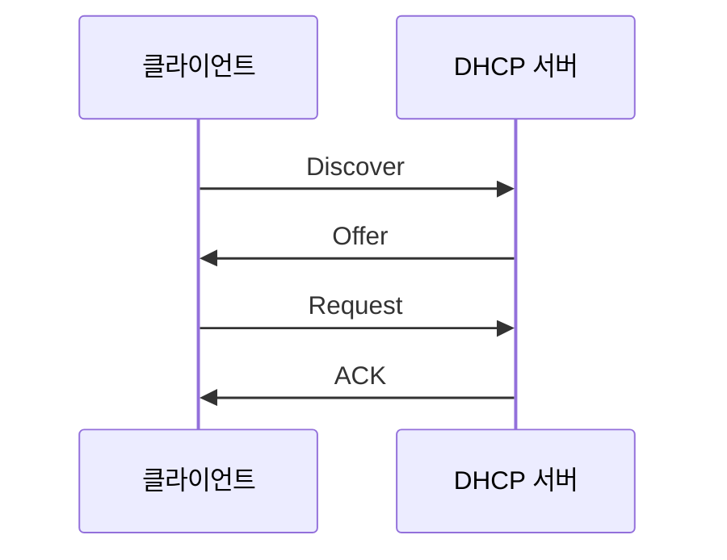

# DHCP(Dynamic Host Configuration Protocol)

## 1. 정의

**DHCP(Dynamic Host Configuration Protocol)**: 네트워크에 접속한 장비에 IP 설정을 자동으로 할당하는 프로토콜이다.

DHCP가 없으면 사용자가 IP 주소, 서브넷 마스크, 기본 게이트웨이, DNS 서버를 직접 설정해야 한다.

## 2. DHCP가 제공하는 정보

* IP 주소
* 서브넷 마스크
* 기본 게이트웨이
* DNS 서버 주소
* IP 주소 임대 시간(Lease Time)

## 3. 동작 과정: DORA



1. DHCP Discover: 클라이언트가 “사용할 수 있는 DHCP 서버가 있나요?”라는 브로드캐스트 메시지를 보낸다.
2. DHCP Offer: DHCP 서버가 할당 가능한 IP 주소와 네트워크 설정을 제안한다.
3. DHCP Request: 클라이언트가 사용할 IP 주소와 선택한 DHCP 서버를 알린다.
4. DHCP ACK: DHCP 서버가 할당을 승인하고, 클라이언트는 해당 IP 주소를 일정 시간 동안 사용한다.

### 3.1. DHCP Discover

네트워크에 처음 연결된 클라이언트는 다음 정보를 모른다.

* 자신의 IP 주소
* DHCP 서버 주소
* 기본 게이트웨이
* DNS 서버

따라서 DHCP 서버를 찾기 위해 `DHCP Discover`를 브로드캐스트로 전송한다.

| 항목      | 값                   |
| ------- | ------------------- |
| 출발지 MAC | 클라이언트 MAC           |
| 목적지 MAC | `FF:FF:FF:FF:FF:FF` |
| 출발지 IP  | `0.0.0.0`           |
| 목적지 IP  | `255.255.255.255`   |
| UDP 포트  | 68 → 67             |

Discover에는 일반적으로 다음 정보가 들어간다.

* 클라이언트 MAC 주소
* DHCP 메시지 유형
* 트랜잭션 ID(`XID`)
* 이전에 사용했던 IP 주소
* 필요한 DHCP 옵션 목록

트랜잭션 ID는 여러 클라이언트의 요청과 응답을 구분하는 데 사용된다.

### 3.2. DHCP Offer

Discover를 받은 DHCP 서버는 주소 풀에서 사용 가능한 IP 주소를 선택하고 `DHCP Offer`를 보낸다.

Offer에는 다음과 같은 정보가 포함된다.

* 제안하는 IP 주소
* 서브넷 마스크
* 기본 게이트웨이
* DNS 서버
* 임대 시간
* DHCP 서버 식별자

예:

```text
IP 주소:        192.168.10.100
서브넷 마스크:   255.255.255.0
기본 게이트웨이: 192.168.10.1
DNS 서버:       8.8.8.8
임대 시간:       8시간
```

클라이언트가 아직 제안된 IP를 정식으로 할당받은 것은 아니므로 Offer도 브로드캐스트로 전달될 수 있다.

DHCP 서버가 여러 대라면 클라이언트는 여러 Offer를 받을 수 있다.

### 3.3. DHCP Request

클라이언트는 받은 Offer 중 하나를 선택하고 `DHCP Request`를 브로드캐스트로 전송한다.

Request에는 다음 내용이 포함된다.

* 선택한 DHCP 서버
* 요청하는 IP 주소
* 클라이언트 식별 정보
* 최초 Discover와 동일한 트랜잭션 ID

브로드캐스트로 보내는 이유는 선택된 서버뿐 아니라 선택되지 않은 DHCP 서버에도 결과를 알리기 위해서이다.

```text
DHCP 서버 A: Offer 선택됨 → 할당 진행
DHCP 서버 B: Offer 선택 안 됨 → 예약했던 주소 회수
```

이 단계에서도 클라이언트는 아직 IP 주소를 완전히 사용할 수 없다.

### 3.4. DHCP ACK

선택된 서버는 요청을 승인하면 `DHCP ACK`를 전송한다.

ACK에는 최종 네트워크 설정이 포함된다.

* 할당된 IP 주소
* 서브넷 마스크
* 기본 게이트웨이
* DNS 서버
* 임대 시간
* 임대 갱신 시간

클라이언트는 ACK를 받은 후 설정을 인터페이스에 적용한다.

일부 운영체제는 IP 주소를 사용하기 전에 `ARP Probe` 또는 `Gratuitous ARP`를 보내 같은 IP를 사용하는 장비가 있는지 확인한다.

```text
충돌 없음 → IP 사용 시작
충돌 발견 → DHCP Decline 전송
```

### 3.5. DHCP NAK

서버가 클라이언트의 요청을 허용할 수 없으면 `DHCP NAK`를 보낸다.

주요 원인은 다음과 같다.

* 요청한 IP가 이미 사용 중
* 클라이언트가 다른 네트워크로 이동
* 이전 임대 정보가 유효하지 않음
* 요청한 주소가 DHCP Pool 범위 밖에 있음

NAK를 받은 클라이언트는 기존 설정을 버리고 Discover부터 다시 시작한다.

### 3.6. 임대 갱신 과정

DHCP 주소는 영구 할당이 아니라 일정 시간 동안 빌려주는 **Lease 방식**이다.

임대 시간이 8시간이라면 일반적으로 다음과 같이 동작한다.

|    시점 | 이름    | 동작                 |
| ----: | ----- | ------------------ |
|    0% | 임대 시작 | DHCP ACK를 받고 주소 사용 |
|   50% | T1    | 기존 서버에 갱신 요청       |
| 87.5% | T2    | 모든 DHCP 서버에 재할당 요청 |
|  100% | 만료    | 주소 사용 중단           |

#### T1: Renewal

임대 시간의 약 50%가 지나면 클라이언트는 기존 DHCP 서버에 `DHCP Request`를 유니캐스트로 전송한다.

```text
클라이언트 → 기존 DHCP 서버: DHCP Request
기존 서버 → 클라이언트: DHCP ACK
```

ACK를 받으면 임대 시간이 다시 시작된다.

#### T2: Rebinding

T1에서 기존 서버가 응답하지 않고 임대 시간의 약 87.5%가 지나면 클라이언트는 모든 DHCP 서버를 대상으로 Request를 브로드캐스트한다.

다른 DHCP 서버가 갱신을 승인할 수도 있다.

### 3.7. 임대 만료

임대가 끝날 때까지 ACK를 받지 못하면 클라이언트는 해당 IP의 사용을 중단하고 Discover부터 다시 시작한다.

### 3.8. IP 주소 반환

클라이언트가 정상적으로 네트워크 사용을 종료하면 `DHCP Release`를 서버에 전송할 수 있다.

```text
클라이언트 → DHCP 서버: DHCP Release
```

서버는 해당 주소를 회수해 다른 클라이언트에게 할당할 수 있다. 하지만 갑작스러운 전원 종료나 케이블 분리 시 Release가 전송되지 않을 수 있으므로, 서버는 임대 시간이 끝날 때까지 주소를 유지한다.

## 4. 주요 포트

DHCP는 **UDP**를 사용한다.

| 구분         | UDP 포트 |
| ---------- | -----: |
| DHCP 서버    |     67 |
| DHCP 클라이언트 |     68 |

## 5. DHCP의 보안 위협

* Rogue DHCP Server: 공격자가 가짜 DHCP 서버를 설치해 잘못된 게이트웨이와 DNS 주소를 제공
* DHCP Starvation: 대량의 가짜 MAC 주소로 DHCP 주소를 모두 소진
* 중간자 공격: 공격자 주소를 기본 게이트웨이로 제공해 트래픽을 가로챔

스위치에서는 DHCP Snooping으로 방어할 수 있다.

```cisco
ip dhcp snooping
ip dhcp snooping vlan 10,20

interface GigabitEthernet0/1
 ip dhcp snooping trust
```

DHCP 서버로 연결되는 포트만 `trust`로 지정하고, 사용자 포트는 기본 상태인 `untrusted`로 유지해야 한다.
