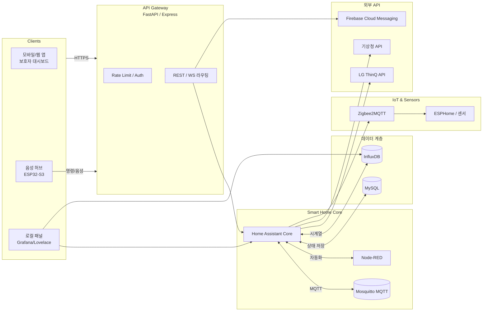

---
tags:
  - "#ESW"
---
# 1) 요구사항 정리 (개략)

- **데이터원**: Home Assistant(웹훅/REST/WS), LG ThinQ(공식/비공식 API), ESP32(MQTT/HTTP).

- **데이터종류**
    - 시계열: 센서값(온/습도, 전력, 상태), 이벤트(문 열림, 낙상 탐지 등).
    - 정형: 사용자/권한, 디바이스 메타·설정, 자동화 규칙, 알림 로그.

- **핵심기능**
    - 데이터 수집(ingest)·정규화·저장(MySQL/InfluxDB)
    - 제어/명령 API(디바이스 제어, 자동화 트리거)
    - 알림(FCM/Email/SMS) & 룰 엔진(조건/임계치)
    - 대시보드용 집계 API(Grafana/Frontend)
    - 보안: 인증·인가, 키 관리, 감사 로그, 속도 제한

- **비기능**
    - 가용성(무중단 배포), 관측성(log/metric/trace), 백업/복구, 테스트 자동화.

# 2) 아키텍처 (개략 → 세부)

## 2.1 전체 구조

- [**API Gateway**](APIGateway.md)(FastAPI/Express)  
    ↔ **Auth 서비스**(JWT/OAuth2)  
    ↔ **Core 서비스**(디바이스/자동화/알림)  
    ↔ **[Ingest 서비스](Ingest.md)**(MQTT/WebHook/ThinQ Poller)  
    ~~↔ **작업큐**(Redis + Celery/RQ)~~
    ↔ **DB**: MySQL(정형) / InfluxDB(시계열)  
    ↔ **메시지 브로커**: MQTT(Mosquitto)  
    ↔ **관측성**: Prometheus + Loki + Grafana
    

## 2.2 데이터 흐름

- ESP32 → **MQTT** → Ingest → 정규화 → InfluxDB(센서), MySQL(메타/이벤트)
- Home Assistant → **Webhook/REST/WS** → Ingest → 동일
- LG ThinQ → **Poller(스케줄러)** → Ingest → 동일
- Core 서비스 → 자동화 룰 평가 → 알림/명령 발행 → MQTT/ThinQ API

# 3) 저장소 설계 (세부)

## 3.1 [MySQL](MySQL.md) 

## 3.2 [InfluxDB](InfluxDB.md) (시계열)

- **bucket**: `sensors` (retention: 원시 30~90일), `sensors_agg` (retention: 1년+)
    
- **measurement 예시**
    - `power` tags: device_id, room; fields: power_w(float), energy_wh(float)
    - `climate` tags: device_id, room; fields: temp_c(float), humid_pct(float)
    - `state` tags: device_id, kind; fields: value(float|int|bool), status(string)
        
- **다운샘플 태스크**
    - 1m→5m→1h 평균/최대/최소/합계 파이프라인 구성

# 4) API 설계 (핵심 엔드포인트)

- **Auth**
    - `POST /auth/login` (MFA 옵션), `POST /auth/refresh`, `POST /auth/logout`
    - `POST /auth/magic-link`(선택), `POST /auth/mfa/verify`

- **Users/Profiles**
    - `GET/PUT /me`, `GET /users/:id`(admin)

- **Devices**
    - `GET /devices?source&type&room`, `GET /devices/:id`, `POST /devices`(등록/바인딩), `PUT /devices/:id`
        
- **Telemetry**
    - `GET /telemetry/query` (Influx Flux pass-through 제한형, 사전 정의 쿼리 preset)
    - `GET /devices/:id/series?measurement&range=...`
        
- **Automations**
    - `GET/POST /automations`, `PUT /automations/:id`, `POST /automations/:id/test`
        
- **Alerts**
    - `GET /alerts?since=...`, `POST /alerts/:id/read`
        
- **Control**
    - `POST /devices/:id/command` (payload: capability/params) → MQTT/ThinQ 라우팅
        
- **Ingest(Webhook)**
    - `POST /ingest/ha/:client_id` (HMAC Header 검증)
    - `POST /ingest/mqtt-bridge` (필요 시)
        
- **Admin**
    - `GET /health`, `GET /metrics`, `GET /logs(restricted)`
        

# 5) Ingest & 통합 (세부)

- **MQTT**: topic 규칙 `care/{device_id}/{measurement}`. 예: `care/aircon_1/power`.
    - 메시지 스키마: `{ ts, fields:{...}, tags:{...} }` (ts ISO8601/epoch)
    - 인증: per-device username/password 또는 mTLS(선호)
        
- **Home Assistant**:
    - 옵션 A) 이벤트 웹훅(HA Automation → REST)
    - 옵션 B) WebSocket 이벤트 스트림(고빈도용)
    - 옵션 C) REST 폴링(백업)
        
- **LG ThinQ**:
    - **Poller 스케줄러**(APScheduler): 15~60s 주기(기기별 조절), 토큰 자동갱신, 백오프/재시도
    - 응답 맵핑: 원시 → 정규화(장치 capability → measurement/fields)
        
# 6) 보안 설계 (우선순위 적용)

1. **인증/인가**: OAuth2 Password + **JWT(짧은 만료) + Refresh 토큰 회전**. 서버측 토큰 블랙리스트(로그아웃/탈취 차단).
2. **전송암호화**: 내부/외부 **모든** 트래픽 TLS. MQTT는 mTLS 권장.
3. **비밀관리**: `.env` 금지, **Vault/SSM/Secrets Manager**. ThinQ 토큰·웹훅 시크릿 암호화 저장(서버측 키 관리, KMS).
4. **입력검증**: Ingest JSON 스키마 검증(pydantic/zod). Flux/SQL는 **프리셋/화이트리스트**만 허용.
5. **속도제한**: `IP+user` 레이트리밋, `ingest`는 `client_id`별 쿼터.
6. **권한분리**: 서비스 계정 최소권한, DB 계정 읽기/쓰기 분리, 자동화 엔진은 제한된 스코프 토큰으로 내부 호출.
7. **감사/탐지**: `audit_logs` 필수 기록, 관리자행위 추가 태깅, 알림 임계치 변경 시 서명/이중기록.
8. **백업/복구**: MySQL 일일 스냅샷+Binlog, InfluxDB bucket 내보내기 주간, 주기적 **복구 리허설**.
    
# 7) 운영/배포 (세부)

- **배포**: Docker Compose(초기) → k8s(성장 시).
	- ()[https://seosh817.tistory.com/387]
- **서비스 구성**
    - api, auth, core, ingest, scheduler, worker, mqtt, mysql, influxdb, redis, grafana, prom, loki, promtail
        
- **헬스체크**: `/health`(DB/브로커/외부API), liveness/readiness 분리.
    
- **관측성**
    - Metrics: 요청지연/오류율/큐깊이/ingest 처리량/ThinQ 호출 성공율
    - Logs: JSON 구조, 필수 필드(trace_id, user_id, device_id)
    - Traces: OpenTelemetry(ingest→DB→API end-to-end)
        
- **구성관리**: GitOps(브랜치 전략, .env.sample, secret 템플릿).
    
- **마이그레이션**: Alembic/Prisma Migration, 데이터 계약 테스트.
    

# 8) 자동화 룰 엔진 (실행)

- **룰 모델**: IF(조건) THEN(행동) + 옵션(지속시간, 재발 차단 쿨다운).
    
- **조건**: 시계열(최근 N분 평균/최대), 상태변화(edge), 복합(AND/OR, 시간대).
    
- **행동**: 알림, 장치제어(MQTT/ThinQ), 웹훅 호출.
    
- **평가 방식**:
    - 이벤트 드리븐(ingest 시 트리거) + 주기 집계 태스크.
    - 컨텍스트 캐시(최근 상태 메모리/Redis).
    
# 9) 테스트 전략 (실행)

- **단위**: 파서/정규화/권한/레이트리밋/토큰회전.
    
- **통합**: Ingest→DB 파이프라인, ThinQ 모의서버, MQTT 에코.
    
- **계약**: API 스키마(OpenAPI) 고정 + 프런트/HA 시뮬 통신.
    
- **부하**: ingest 1k msg/s 가정, Influx write 성능, API p95 지연 < 200ms.
    
- **DR 연습**: 백업으로 신규 인스턴스 복구, 포인트인타임.
    
# 10) 구현 우선순위(마일스톤)

**M1. 기반(2주)**
- Compose 템플릿, 서비스 스캐폴딩(FastAPI/Express), MySQL/Influx/Redis/MQTT 기동
- Auth(JWT/Refresh), Users/Devices CRUD, /health, 관측성 베이스
    

**M2. 수집(2주)**
- MQTT Ingest(스키마 검증) → InfluxDB write
- HA Webhook & WS 수집
- LG ThinQ Poller(토큰 회전, 재시도, 속도제한)

**M3. 시계열/조회(1~2주)**
- 사전정의 시계열 조회 API(+다운샘플 태스크)
- 대시보드용 집계 API(preset)
    
**M4. 자동화/알림(2주)**
- 룰 엔진 v1(조건/행동), 알림 채널(FCM/Email)
- 감사로그/알림 로그
    
**M5. 하드닝/DR(1주)**
- mTLS MQTT, 키관리 연동, 백업/복구 리허설
    
# 11) 중단 조건(즉시 실행 포인트)

- **스키마 확정**: 위 MySQL 테이블 정의를 기준으로 마이그레이션 파일 생성(Alembic/Prisma).
    
- **MQTT 토픽/페이로드 규격 고정**: `care/{device_id}/{measurement}` + JSON 스키마 배포.
    
- **HA Webhook 시크릿/HMAC 규격 고정**: 헤더 `X-Client-Id`, `X-Signature(sha256)`.
    
- **LG ThinQ Poll 주기 및 재시도 정책 고정**: 기기군별 기본 간격/백오프.
    

# 12) 리스크 & 대응

- **ThinQ 비공식 API 변경**: 어댑터 계층 분리, e2e 테스트 + 기능토글.
    
- **Influx write 폭주**: 배치쓰기, 샘플링, 다운샘플 태스크, 버퍼(큐) 도입.
    
- **센서 불량/드리프트**: 이상치 필터(3σ, IQR), 장치상태 모니터링 지표 분리.
    
- **권한오용**: 스코프 기반 액세스 토큰, 관리자 행위 추가 인증(MFA/just-in-time).
    

---

## 즉시 실행 체크리스트

-  ~~Docker Compose 초안 생성(서비스 12종)~~
-  ~~MySQL 마이그레이션 v1(users/devices/…/audit_logs)~~
-  ~~InfluxDB bucket/retention/다운샘플 태스크 정의~~
-  MQTT 브로커 기동 + 토픽 규약 공지
-  Auth(JWT/Refresh) + 레이트리밋 미들웨어
-  Ingest(HA Webhook, MQTT) 파이프라인 1차 완성
-  LG ThinQ Poller 스켈레톤 + 토큰 암호화 저장
-  /metrics, 구조화 로그, tracing 베이스 라인