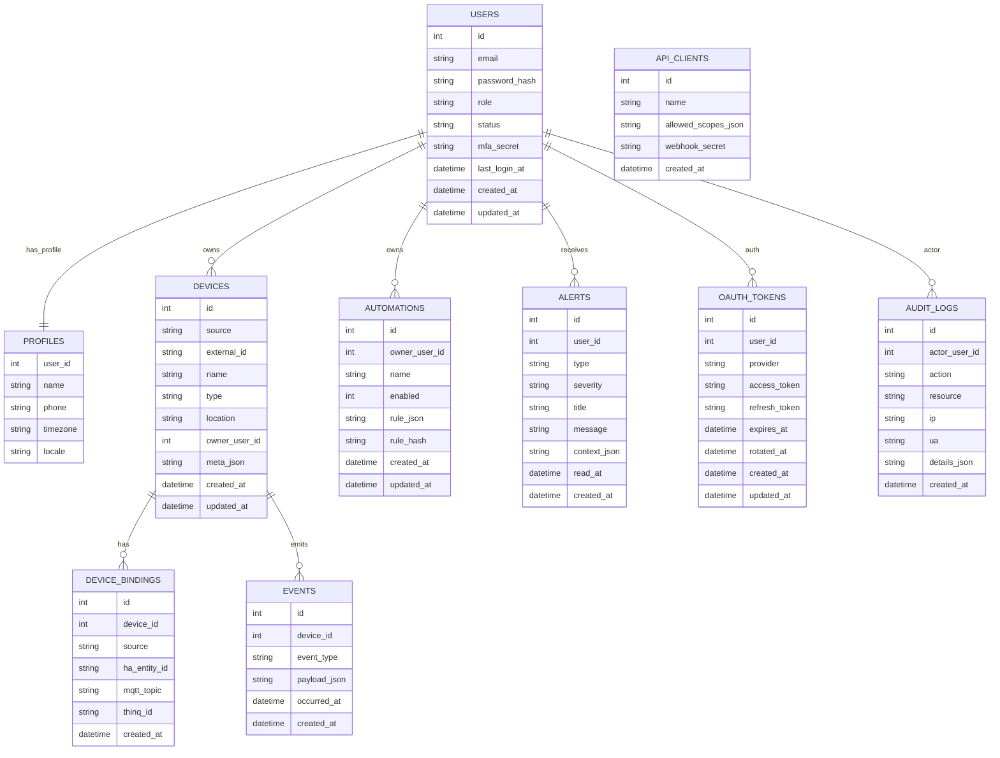

---
tags:
  - ESW
---
# 다이어그램(Mermaid)

# 표

# 0) 세션 기본값

| 설정          | 값                    |
| ----------- | -------------------- |
| `SET NAMES` | `utf8mb4`            |
| `COLLATE`   | `utf8mb4_general_ci` |
| `time_zone` | `+09:00`             |

---

# 1) users

| 컬럼                                  | 타입                                   | NULL | 기본값/규칙                           | 설명      |
| ----------------------------------- | ------------------------------------ | ---- | -------------------------------- | ------- |
| id                                  | BIGINT UNSIGNED                      | NO   | PK, AUTO_INCREMENT               | 사용자 키   |
| email                               | VARCHAR(190)                         | NO   | UNIQUE                           | 로그인 이메일 |
| password_hash                       | VARCHAR(255)                         | NO   |                                  | 비밀번호 해시 |
| role   | ENUM('admin','operator','user')      | NO   | 'user'                           | 역할      |
| status | ENUM('active','suspended','deleted') | NO   | 'active'                         | 상태      |
| mfa_secret                          | VARBINARY(255)                       | YES  |                                  | MFA 비밀값 |
| last_login_at                       | DATETIME(6)                          | YES  |                                  | 마지막 로그인 |
| created_at                          | DATETIME(6)                          | NO   | `CURRENT_TIMESTAMP(6)`           | 생성 시각   |
| updated_at                          | DATETIME(6)                          | NO   | `CURRENT_TIMESTAMP(6)` ON UPDATE | 갱신 시각   |

**인덱스**
- PK: `(id)`
- UNIQUE: `uq_users_email (email)`

---

# 2) profiles (1:1 users)

| 컬럼       | 타입              | NULL | 기본값/규칙                      | 설명     |
| -------- | --------------- | ---- | --------------------------- | ------ |
| user_id  | BIGINT UNSIGNED | NO   | PK, FK→`users.id` (CASCADE) | 사용자 키  |
| name     | VARCHAR(120)    | NO   |                             | 이름     |
| phone    | VARCHAR(40)     | YES  |                             | 전화     |
| timezone | VARCHAR(64)     | NO   | 'Asia/Seoul'                | 표준 시간대 |
| locale   | VARCHAR(16)     | NO   | 'ko_KR'                     | 로케일    |

**제약/인덱스**
- PK: `(user_id)`
- FK: `fk_profiles_user (user_id) → users(id) ON DELETE CASCADE ON UPDATE CASCADE`

---

# 3) devices

| 컬럼                                       | 타입                                                       | NULL | 기본값/규칙                           | 설명     |
| ---------------------------------------- | -------------------------------------------------------- | ---- | -------------------------------- | ------ |
| id                                       | BIGINT UNSIGNED                                          | NO   | PK, AUTO_INCREMENT               | 디바이스 키 |
| source      | ENUM('esp32','ha','thinq', 'smartthings', 'google home') | NO   |                                  | 기원     |
| external_id | VARCHAR(190)                                             | NO   |                                  | 외부 식별자 |
| name                                     | VARCHAR(190)                                             | NO   |                                  | 디바이스명  |
| type                                     | VARCHAR(100)                                             | NO   |                                  | 유형     |
| location                                 | VARCHAR(100)                                             | YES  |                                  | 위치     |
| owner_user_id                            | BIGINT UNSIGNED                                          | YES  | FK→`users.id` (SET NULL)         | 소유자    |
| meta        | JSON                                                     | YES  |                                  | 메타     |
| created_at                               | DATETIME(6)                                              | NO   | `CURRENT_TIMESTAMP(6)`           | 생성     |
| updated_at                               | DATETIME(6)                                              | NO   | `CURRENT_TIMESTAMP(6)` ON UPDATE | 갱신     |

**인덱스**

- PK: `(id)`
- UNIQUE: `uq_devices_source_external (source, external_id)`
- KEY: `idx_devices_owner (owner_user_id)`

**FK**
- `fk_devices_owner (owner_user_id) → users(id) ON DELETE SET NULL ON UPDATE CASCADE`
    

---

## 3-1) device_bindings

| 컬럼           | 타입                         | NULL | 기본값/규칙                    | 설명       |
| ------------ | -------------------------- | ---- | ------------------------- | -------- |
| id           | BIGINT UNSIGNED            | NO   | PK, AUTO_INCREMENT        | 키        |
| device_id    | BIGINT UNSIGNED            | NO   | FK→`devices.id` (CASCADE) | 디바이스     |
| source       | ENUM('esp32','ha','thinq') | NO   |                           | 바인딩 소스   |
| ha_entity_id | VARCHAR(190)               | YES  |                           | HA 엔티티   |
| mqtt_topic   | VARCHAR(255)               | YES  |                           | MQTT 토픽  |
| thinq_id     | VARCHAR(190)               | YES  |                           | ThinQ ID |
| created_at   | DATETIME(6)                | NO   | `CURRENT_TIMESTAMP(6)`    | 생성       |

**인덱스/제약**

- PK: `(id)`
    
- UNIQUE: `uq_device_source (device_id, source)`
    
- KEY: `idx_bindings_device (device_id)`
    
- FK: `fk_bindings_device (device_id) → devices(id) ON DELETE CASCADE ON UPDATE CASCADE`
    

---

# 4) automations

|컬럼|타입|NULL|기본값/규칙|설명|
|---|---|---|---|---|
|id|BIGINT UNSIGNED|NO|PK, AUTO_INCREMENT|키|
|owner_user_id|BIGINT UNSIGNED|NO|FK→`users.id` (CASCADE)|소유자|
|name|VARCHAR(190)|NO||이름|
|enabled|TINYINT(1)|NO|1|활성 여부|
|rule|JSON|NO||규칙(JSON)|
|rule_hash|CHAR(64)|NO||규칙 해시|
|created_at|DATETIME(6)|NO|`CURRENT_TIMESTAMP(6)`|생성|
|updated_at|DATETIME(6)|NO|`CURRENT_TIMESTAMP(6)` ON UPDATE|갱신|

**인덱스/제약**

- PK: `(id)`
- KEY: `idx_automations_owner (owner_user_id, enabled)`
- KEY: `idx_automations_rule_hash (rule_hash)`
- FK: `fk_automations_owner (owner_user_id) → users(id) ON DELETE CASCADE ON UPDATE CASCADE`

---

# 5) alerts

|컬럼|타입|NULL|기본값/규칙|설명|
|---|---|---|---|---|
|id|BIGINT UNSIGNED|NO|PK, AUTO_INCREMENT|키|
|user_id|BIGINT UNSIGNED|NO|FK→`users.id` (CASCADE)|대상 사용자|
|type|VARCHAR(64)|NO||타입|
|severity|ENUM('info','warning','critical')|NO|'info'|심각도|
|title|VARCHAR(190)|NO||제목|
|message|TEXT|NO||내용|
|context|JSON|YES||컨텍스트|
|read_at|DATETIME(6)|YES||읽음 시각|
|created_at|DATETIME(6)|NO|`CURRENT_TIMESTAMP(6)`|생성|

**인덱스/제약**
- PK: `(id)`
- KEY: `idx_alerts_user_created (user_id, created_at)`
- KEY: `idx_alerts_unread (user_id, read_at)`
- FK: `fk_alerts_user (user_id) → users(id) ON DELETE CASCADE ON UPDATE CASCADE`
    

---

# 6) events

|컬럼|타입|NULL|기본값/규칙|설명|
|---|---|---|---|---|
|id|BIGINT UNSIGNED|NO|PK, AUTO_INCREMENT|키|
|device_id|BIGINT UNSIGNED|NO|FK→`devices.id` (CASCADE)|디바이스|
|event_type|VARCHAR(64)|NO||이벤트 유형|
|payload|JSON|YES||페이로드|
|occurred_at|DATETIME(6)|NO||발생 시각|
|created_at|DATETIME(6)|NO|`CURRENT_TIMESTAMP(6)`|생성|

**인덱스/제약**
- PK: `(id)`
- KEY: `idx_events_device_time (device_id, occurred_at)`
- KEY: `idx_events_type_time (event_type, occurred_at)`
- FK: `fk_events_device (device_id) → devices(id) ON DELETE CASCADE ON UPDATE CASCADE`
    

---

# 7) api_clients

|컬럼|타입|NULL|기본값/규칙|설명|
|---|---|---|---|---|
|id|BIGINT UNSIGNED|NO|PK, AUTO_INCREMENT|키|
|name|VARCHAR(120)|NO|UNIQUE|클라이언트명|
|allowed_scopes|JSON|NO||허용 스코프|
|webhook_secret|VARBINARY(255)|NO||웹훅 시크릿|
|created_at|DATETIME(6)|NO|`CURRENT_TIMESTAMP(6)`|생성|

**인덱스**
- PK: `(id)`
- UNIQUE: `uq_api_clients_name (name)`

---

# 8) oauth_tokens

|컬럼|타입|NULL|기본값/규칙|설명|
|---|---|---|---|---|
|id|BIGINT UNSIGNED|NO|PK, AUTO_INCREMENT|키|
|user_id|BIGINT UNSIGNED|NO|FK→`users.id` (CASCADE)|사용자|
|provider|VARCHAR(32)|NO||공급자|
|access_token|VARBINARY(4096)|NO||액세스 토큰|
|refresh_token|VARBINARY(4096)|NO||리프레시 토큰|
|expires_at|DATETIME(6)|NO||만료 시각|
|rotated_at|DATETIME(6)|YES||로테이션 시각|
|created_at|DATETIME(6)|NO|`CURRENT_TIMESTAMP(6)`|생성|
|updated_at|DATETIME(6)|NO|`CURRENT_TIMESTAMP(6)` ON UPDATE|갱신|

**인덱스/제약**

- PK: `(id)`
- UNIQUE: `uq_oauth_user_provider (user_id, provider)`
- KEY: `idx_oauth_expires (expires_at)`
- FK: `fk_oauth_user (user_id) → users(id) ON DELETE CASCADE ON UPDATE CASCADE`

---

# 9) audit_logs

|컬럼|타입|NULL|기본값/규칙|설명|
|---|---|---|---|---|
|id|BIGINT UNSIGNED|NO|PK, AUTO_INCREMENT|키|
|actor_user_id|BIGINT UNSIGNED|YES|FK→`users.id` (SET NULL)|행위자|
|action|VARCHAR(64)|NO||액션|
|resource|VARCHAR(190)|NO||리소스|
|ip|VARBINARY(16)|YES||IP(IPv4/IPv6 바이너리)|
|ua|VARCHAR(255)|YES||User-Agent|
|details|JSON|YES||상세|
|created_at|DATETIME(6)|NO|`CURRENT_TIMESTAMP(6)`|생성|

**인덱스/제약**

- PK: `(id)`
- KEY: `idx_audit_resource_time (resource, created_at)`
- KEY: `idx_audit_actor_time (actor_user_id, created_at)`
- FK: `fk_audit_actor (actor_user_id) → users(id) ON DELETE SET NULL ON UPDATE CASCADE`

---

# 10) 관계 요약(ER 개요)

- `users` 1 — 1 `profiles` (PK=FK)
- `users` 1 — 0..N `devices` (`owner_user_id` nullable → ‘소유자 없는 디바이스’ 허용)
- `devices` 1 — 0..N `device_bindings` (디바이스별 소스 1개 유니크)
- `users` 1 — 0..N `automations`
- `users` 1 — 0..N `alerts`
- `devices` 1 — 0..N `events`
- `users` 1 — 0..N `oauth_tokens` (사용자·프로바이더 1:1 유니크)
- `users` 1 — 0..N `audit_logs` (행위자 NULL 허용)
- `api_clients` 독립 테이블 (외래키 없음)

### 인덱스·제약 핵심
- 고유(UK):
    - `users.email`, `devices(source,external_id)`, `device_bindings(device_id,source)`, 
        `oauth_tokens(user_id,provider)`, `api_clients.name`
- FK:
    - `profiles.user_id → users.id` (CASCADE),  
        `devices.owner_user_id → users.id` (SET NULL),  
        `device_bindings.device_id → devices.id` (CASCADE),  
        `automations.owner_user_id → users.id` (CASCADE),  
        `alerts.user_id → users.id` (CASCADE),  
        `events.device_id → devices.id` (CASCADE),  
        `oauth_tokens.user_id → users.id` (CASCADE),  
        `audit_logs.actor_user_id → users.id` (SET NULL)

# 참고

* [ubuntu mysql 설치 및 초기 세팅](https://jongsky.tistory.com/79)
* [Docker에 MySQL 띄우기](https://hipopatamus.tistory.com/109)
* [PuTTY](obsidian://open?vault=memo&file=ESW%2FPuTTY)
* [MySQL과 AWS EC2 연결하기](https://woojin.tistory.com/37)
* [[MySQL] SHOW 명령어](https://extbrain.tistory.com/59)