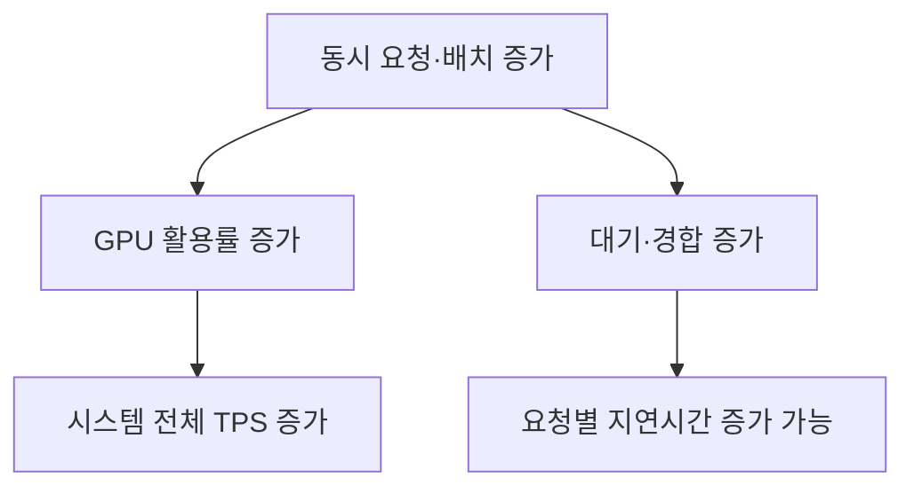

# TPS(Tokens Per Second) 종합 정리

TPS는 LLM 추론 성능을 나타내는 대표 지표로, 일반적으로 **1초 동안 생성한 출력 토큰 수**를 의미합니다. 다만 자료나 벤치마크에 따라 단일 요청 속도와 서버 전체 처리량을 모두 TPS라고 부르므로, 결과를 볼 때 반드시 측정 기준을 확인해야 합니다.

## 1. TPS의 기본 개념

가장 단순한 계산식은 다음과 같습니다.

$$
TPS=\frac{\text{생성한 출력 토큰 수}}{\text{생성 시간}}
$$

예를 들어 출력 토큰 100개를 5초 동안 생성했다면:

$$
TPS=\frac{100}{5}=20\text{ tokens/s}
$$

TPS가 20이라는 것은 모델이 평균적으로 초당 20개 토큰을 생성한다는 뜻입니다.

여기서 토큰은 글자나 단어와 정확히 일치하지 않습니다. 사용하는 토크나이저와 언어에 따라 같은 문장도 토큰 수가 달라집니다. 따라서 서로 다른 모델의 TPS를 비교할 때는 **동일한 토크나이저 또는 동일한 입력·출력 조건**을 적용해야 합니다.

## 2. TPS는 하나의 지표가 아니다

실무에서는 TPS를 크게 세 가지로 구분해야 합니다.

| 지표         | 계산 방식                     | 의미                          |
| ---------- | ------------------------- | --------------------------- |
| 요청당 TPS    | 개별 요청의 출력 토큰 ÷ 생성 시간      | 한 사용자가 체감하는 출력 속도           |
| 시스템 출력 TPS | 모든 요청의 출력 토큰 합계 ÷ 벤치마크 시간 | 서버 전체의 생성 처리량               |
| 전체 토큰 TPS  | 입력 토큰과 출력 토큰 합계 ÷ 시간      | Prefill과 Decode를 포함한 전체 처리량 |

vLLM 벤치마크도 `Output token throughput`과 `Total token throughput`을 별도로 표시합니다. NVIDIA NIM은 Total TPS를 동시에 실행되는 모든 요청에서 생성된 출력 토큰의 합산 처리량으로 정의합니다. [vLLM Benchmark CLI](https://docs.vllm.ai/en/latest/benchmarking/cli/), [NVIDIA NIM TPS 정의](https://docs.nvidia.com/nim/benchmarking/llm/latest/metrics.html)

따라서 다음 두 결과는 같은 의미가 아닙니다.

* 단일 사용자: 요청당 40 TPS
* 서버 전체: 동시 사용자 100명의 합계 2,000 TPS

두 번째 시스템의 전체 처리량은 훨씬 크지만, 사용자 한 명이 체감하는 속도는 20 TPS일 수도 있습니다.

## 3. LLM 응답은 Prefill과 Decode로 나뉜다

LLM 추론 과정은 크게 두 단계로 구분됩니다.

### Prefill 단계

사용자가 입력한 프롬프트 전체를 처리하고 KV Cache를 만들며 첫 번째 출력 토큰을 준비합니다.

* 입력 토큰을 병렬로 처리
* 행렬 연산 비중이 큼
* 일반적으로 GPU 연산 성능의 영향을 많이 받음
* 입력이 길어질수록 첫 토큰이 늦어질 수 있음

### Decode 단계

첫 토큰 이후 출력 토큰을 하나씩 순차적으로 생성합니다.

* 이전 토큰과 KV Cache를 사용
* 자동회귀 방식이므로 토큰을 순차 생성
* 일반적으로 메모리 대역폭의 영향을 많이 받음
* 이 단계의 속도가 사용자가 보는 스트리밍 속도와 밀접함

NVIDIA는 Prefill을 병렬화가 잘되는 연산 중심 단계, Decode를 모델 가중치와 KV Cache 접근 비용이 중요한 메모리 중심 단계로 설명합니다. [NVIDIA LLM Inference Optimization](https://developer.nvidia.com/blog/mastering-llm-techniques-inference-optimization/)

## 4. TPS와 함께 봐야 하는 핵심 지표

TPS만으로는 사용자가 실제로 빠르다고 느끼는지 판단하기 어렵습니다.

| 지표                 | 의미                      | 사용자 경험           |
| ------------------ | ----------------------- | ---------------- |
| TTFT               | 요청부터 첫 토큰까지 걸린 시간       | 답변이 시작되기까지의 대기시간 |
| TPOT               | 첫 토큰 이후 출력 토큰 하나당 평균 시간 | 평균 생성 속도         |
| ITL                | 연속된 두 토큰 사이의 시간         | 스트리밍이 매끄러운 정도    |
| E2E Latency        | 요청부터 답변 완료까지 걸린 전체 시간   | 전체 응답시간          |
| Request Throughput | 초당 완료한 요청 수             | 서버 처리 용량         |
| Output TPS         | 초당 생성한 출력 토큰 수          | 생성 처리량           |

vLLM 역시 운영 지표로 TTFT, TPOT, 요청 지연시간, 입력·출력 토큰 수, 대기 중인 요청 수를 각각 제공합니다. [vLLM Metrics](https://docs.vllm.ai/en/stable/design/metrics/)

### TPS와 TPOT의 관계

첫 번째 토큰을 제외한 Decode 구간에서 평균적으로 다음 관계가 성립합니다.

$$
TPS \approx \frac{1}{TPOT}
$$

TPOT가 밀리초 단위라면:

$$
TPS \approx \frac{1000}{TPOT_{ms}}
$$

| TPOT | 대략적인 TPS |
| ---: | ---: |
| 100ms | 10 TPS |
| 50ms | 20 TPS |
| 25ms | 40 TPS |
| 10ms | 100 TPS |

단, 이것은 일반적인 자동회귀 텍스트 생성 기준입니다. Speculative Decoding처럼 한 번에 여러 토큰을 처리하는 기법에서는 단순 역수 관계가 정확하지 않을 수 있습니다.

### 전체 응답시간 추정

출력 토큰 수가 (N)개라면 전체 응답시간은 대략 다음과 같습니다.

$$
E2E \approx TTFT+(N-1)\times TPOT
$$

예를 들어:

* TTFT: 0.8초
* 출력: 101토큰
* TPOT: 0.04초, 즉 약 25 TPS

라면:

$$
E2E \approx 0.8+100\times0.04=4.8초
$$

따라서 TPS가 높아도 TTFT가 지나치게 길면 사용자는 느리다고 느낄 수 있습니다.

## 5. 처리량과 지연시간의 상충관계

동시 요청 수나 배치 크기를 늘리면 GPU 활용도가 높아져 시스템 전체 TPS는 증가합니다. 하지만 각 요청이 실행 순서를 기다리면서 TTFT나 TPOT가 나빠질 수 있습니다.



즉, 다음 두 목표는 서로 다릅니다.

* **처리량 최적화:** 같은 장비로 최대한 많은 토큰 생성
* **지연시간 최적화:** 개별 사용자가 빠르게 응답받도록 설정

서비스에서는 단순 최대 TPS보다 **TTFT·TPOT 기준을 충족하면서 처리할 수 있는 최대 TPS**, 즉 유효 처리량 또는 goodput이 더 유용합니다. NVIDIA 벤치마킹 도구도 TTFT·TPOT·E2E 제한을 만족하는 최대 처리량과 동시성 지점을 측정하도록 지원합니다. [NVIDIA AIPerf Parameter Sweeps](https://docs.nvidia.com/aiperf/tutorials/metrics-analysis/parameter-sweeps)

## 6. TPS에 영향을 주는 요소

### 모델 구조와 크기

일반적으로 모델이 클수록 매번 읽고 계산해야 할 가중치가 많아져 TPS가 낮아집니다. 다만 MoE, GQA, MLA와 같은 구조가 적용되면 전체 파라미터 수만으로 속도를 판단하기 어렵습니다.

### 입력 및 출력 길이

* 입력이 길어지면 Prefill 시간이 증가해 TTFT가 커짐
* 출력이 길어지면 KV Cache가 커져 Decode가 느려질 수 있음
* 짧은 출력에서는 초기화와 TTFT가 결과에 크게 반영됨

따라서 `입력 128토큰·출력 128토큰`과 `입력 8,000토큰·출력 1,000토큰`의 TPS는 직접 비교하기 어렵습니다.

### 동시 요청 수와 배치

배치를 늘리면 시스템 TPS는 보통 증가하지만 요청당 TPS와 지연시간은 나빠질 수 있습니다. GPU가 포화점을 넘으면 전체 TPS까지 감소할 수 있습니다. [NVIDIA NIM TPS 정의](https://docs.nvidia.com/nim/benchmarking/llm/latest/metrics.html)

### 하드웨어와 메모리 대역폭

Decode는 모델 가중치와 KV Cache를 반복적으로 읽기 때문에 GPU 메모리 대역폭과 메모리 용량이 중요합니다. GPU의 FLOPS만 높다고 반드시 Decode TPS가 같은 비율로 증가하지는 않습니다.

### 양자화

FP16/BF16을 FP8, INT8, INT4 등으로 줄이면:

* 모델 메모리 사용량 감소
* 메모리 전송량 감소
* 더 큰 배치 사용 가능
* TPS 증가 가능

하지만 모델 정확도, 출력 품질, 커널 지원과 변환 비용을 함께 평가해야 합니다. 특정 양자화가 모든 모델과 하드웨어에서 무조건 빠른 것은 아닙니다.

### KV Cache 관리

긴 문맥과 높은 동시성에서는 KV Cache가 GPU 메모리를 많이 차지합니다. PagedAttention은 KV Cache를 페이지 단위로 관리해 메모리 낭비를 줄이고 더 많은 요청을 배치할 수 있도록 합니다.

vLLM 논문에서는 PagedAttention을 적용한 시스템이 동일한 지연시간 수준에서 기존 시스템 대비 2~4배의 처리량 개선을 보였지만, 이는 논문에서 실험한 모델과 워크로드 조건에 한정된 결과입니다. [PagedAttention 논문](https://arxiv.org/abs/2309.06180)

### 추론 엔진과 스케줄링

vLLM, TensorRT-LLM, TGI 등의 추론 엔진은 다음 기법으로 성능을 개선합니다.

* Continuous Batching
* Prefix Caching
* Chunked Prefill
* PagedAttention
* Speculative Decoding
* Tensor·Pipeline Parallelism
* 최적화된 Attention 및 GEMM 커널

다만 일부 기법은 시스템 TPS를 높이면서 TTFT를 조금 악화시키는 등 서로 다른 영향을 줄 수 있습니다. NVIDIA의 TensorRT-LLM 결과에서도 설정에 따라 처리량, TTFT, 토큰 간 지연시간이 서로 다르게 변합니다. [TensorRT-LLM 성능 튜닝](https://nvidia.github.io/TensorRT-LLM/performance/performance-tuning-guide/benchmarking-default-performance.html)

## 7. 어느 정도 TPS가 적절한가?

절대적인 합격 기준은 없지만, MLCommons는 사용자와 상호작용하는 LLM 환경에서 약 20~50 tokens/s, 즉 TPOT 20~50ms 수준을 매끄러운 경험을 위한 참고 범위로 제시했습니다. 또한 소형 LLM의 대화형 시나리오에서는 TTFT 0.5초 이하, TPOT 30ms 이하를 더 엄격한 조건으로 사용했습니다. [MLCommons LLM Inference v5.0](https://mlcommons.org/2025/04/llm-inference-v5/), [MLPerf Small LLM Inference 5.1](https://mlcommons.org/2025/09/small-llm-inference-5-1/)

이를 단순화하면 다음과 같이 해석할 수 있습니다.

| 요청당 생성 속도 | 일반적인 체감              |
| --------: | -------------------- |
|  5 TPS 미만 | 상당히 느림               |
|  5~15 TPS | 읽을 수 있지만 답답할 수 있음    |
| 15~30 TPS | 일반 대화에 사용 가능한 수준     |
| 30~50 TPS | 비교적 자연스럽고 빠름         |
| 50 TPS 이상 | 대부분의 텍스트 대화에서 충분히 빠름 |

이는 참고 범위일 뿐입니다. 코드 생성, 음성 대화, 긴 추론 답변, 백그라운드 문서 처리 등 사용 사례에 따라 기준이 달라집니다.

## 8. TPS 벤치마크를 올바르게 비교하는 방법

TPS 결과에는 최소한 다음 조건이 함께 제시되어야 합니다.

* 모델명과 정확한 버전
* 파라미터 수 및 모델 구조
* 정밀도·양자화 방식
* GPU 종류와 수량
* 추론 엔진과 버전
* 입력 토큰 길이(ISL)
* 출력 토큰 길이(OSL)
* 배치 크기 또는 동시 요청 수
* 요청 도착률
* 요청당 TPS인지 시스템 TPS인지
* TTFT·TPOT·ITL·E2E
* 평균뿐 아니라 P50·P95·P99
* 워밍업 여부와 측정 반복 횟수
* Prefix Cache 사용 여부
* 네트워크 시간을 포함했는지 여부

특히 평균 TPS만 제시하면 일부 사용자의 심각한 지연을 숨길 수 있으므로 P95·P99 지연시간을 함께 확인해야 합니다.

## 9. 간단한 측정 예시

스트리밍 응답에서는 첫 토큰 이전과 이후를 분리해 측정하는 것이 좋습니다.

```python
import time

request_start = time.perf_counter()
token_times = []

for token in generate_stream(prompt):
    token_times.append(time.perf_counter())

ttft = token_times[0] - request_start
output_tokens = len(token_times)

if output_tokens > 1:
    decode_time = token_times[-1] - token_times[0]
    tps = (output_tokens - 1) / decode_time
    tpot = decode_time / (output_tokens - 1)
else:
    tps = 0
    tpot = 0

e2e = token_times[-1] - request_start

print(f"TTFT: {ttft:.3f}s")
print(f"Decode TPS: {tps:.2f} tokens/s")
print(f"TPOT: {tpot * 1000:.2f}ms")
print(f"E2E: {e2e:.3f}s")
```

단순히 `토큰 수 ÷ 요청 전체 시간`으로 계산하면 TTFT까지 TPS에 포함되므로 순수한 Decode 속도와 차이가 생깁니다.

## 10. Edge AI Agent 관점에서의 의미

Edge AI Agent에서는 서버 전체 TPS보다 다음 항목이 더 중요할 수 있습니다.

1. **낮은 TTFT**

   * 음성 명령이나 위험 안내에 즉시 반응해야 합니다.

2. **안정적인 요청당 TPS**

   * 평균 TPS보다 발열이나 배터리 상태가 나빠졌을 때의 최저 속도가 중요합니다.

3. **짧은 지연시간의 일관성**

   * P95·P99 지연시간이 급격히 증가하면 실시간 에이전트로 사용하기 어렵습니다.

4. **전력 효율**

   * 단순 TPS보다 `tokens/s/W` 또는 토큰당 에너지가 중요합니다.

5. **메모리 사용량**

   * 모바일·엣지 장치에서는 모델 가중치와 KV Cache가 제한된 메모리에 들어가야 합니다.

6. **전체 파이프라인 지연시간**

   * 음성 인식 → 에이전트 판단 → LLM 생성 → TTS까지 모두 측정해야 합니다.
   * LLM TPS가 높아도 센서 처리나 네트워크, TTS가 느리면 서비스 전체는 느립니다.

따라서 Edge AI Agent의 평가지표는 다음처럼 구성하는 것이 적절합니다.

* TTFT
* 요청당 Decode TPS
* E2E 응답시간
* P95·P99 지연시간
* 메모리 최대 사용량
* 평균·최대 소비전력
* 발열 이후 성능 유지율
* 정확도 또는 과제 성공률
* 오프라인 실행 가능 여부

## 결론

TPS는 LLM의 출력 생성 속도를 보여주는 중요한 지표지만, **TPS가 높다고 항상 사용자 경험이나 시스템 성능이 좋은 것은 아닙니다.**

핵심은 다음과 같습니다.

* 요청당 TPS와 시스템 전체 TPS를 구분해야 함
* TPS와 함께 TTFT·TPOT·ITL·E2E를 측정해야 함
* 입력·출력 길이, 동시성, 하드웨어 조건이 같아야 비교 가능
* 최대 처리량보다 지연시간 기준을 만족하는 유효 처리량이 중요
* Edge AI Agent에서는 TPS뿐 아니라 전력, 발열, 메모리, 전체 파이프라인 지연시간을 함께 평가해야 함

### 참고 출처

* [TPS (Tokens Per Second) – junegood.log](https://velog.io/@junegood/TPS-Tokens-Per-Second)
* [vLLM Metrics](https://docs.vllm.ai/en/stable/design/metrics/)
* [vLLM Benchmark CLI](https://docs.vllm.ai/en/latest/benchmarking/cli/)
* [NVIDIA NIM LLM Benchmark Metrics](https://docs.nvidia.com/nim/benchmarking/llm/latest/metrics.html)
* [NVIDIA – Mastering LLM Inference Optimization](https://developer.nvidia.com/blog/mastering-llm-techniques-inference-optimization/)
* [NVIDIA – LLM Benchmarking Fundamental Concepts](https://developer.nvidia.com/blog/llm-benchmarking-fundamental-concepts/)
* [TensorRT-LLM Performance Tuning Guide](https://nvidia.github.io/TensorRT-LLM/performance/performance-tuning-guide/benchmarking-default-performance.html)
* [PagedAttention·vLLM 논문](https://arxiv.org/abs/2309.06180)
* [MLCommons LLM Inference v5.0](https://mlcommons.org/2025/04/llm-inference-v5/)
* [MLPerf Small LLM Inference 5.1](https://mlcommons.org/2025/09/small-llm-inference-5-1/)
