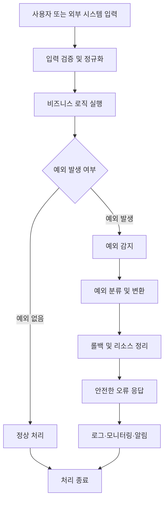
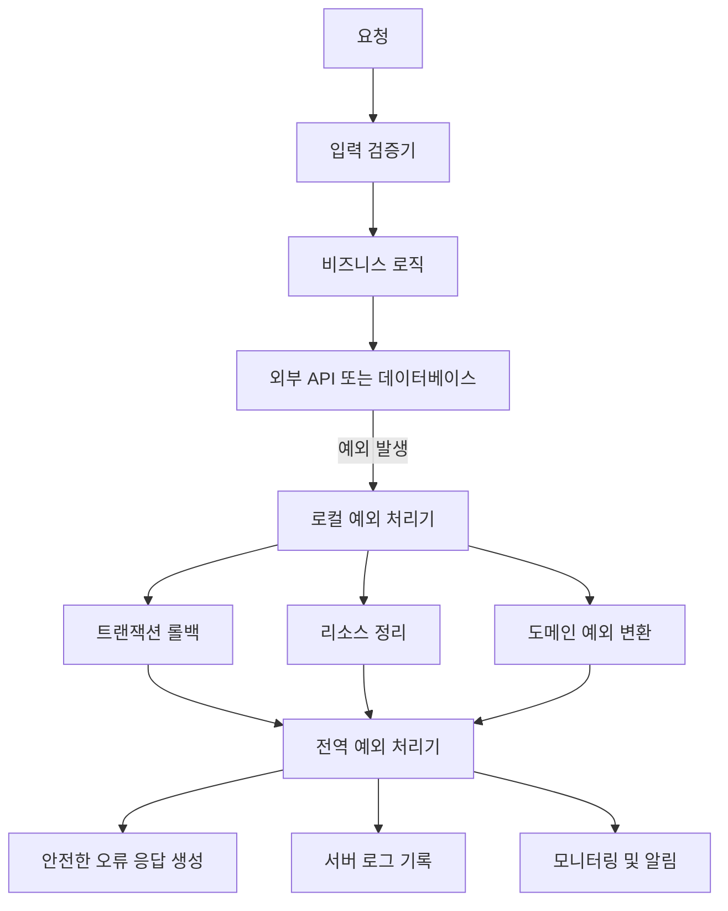

---

layout: post
comments: true
sitemap: true

title: "[SECURITY] Mishandling of Exceptional Conditions"
excerpt: "OWASP Top 10:2025 A10 Mishandling of Exceptional Conditions의 정의, 발생 원인, 공격 사례와 안전한 예외 처리 방법을 정리한다."

date: 2026-07-22
last_modified_at: 2026-07-22

categories:
    - SECURITY
tags:
    - OWASP
    - OWASP-TOP-10
    - EXCEPTION-HANDLING
    - WEB-SECURITY
    - FAIL-CLOSED

---

<!-- markdownlint-disable MD025 MD033 MD060 -->

<script src="https://cdn.jsdelivr.net/npm/mermaid/dist/mermaid.min.js"></script>

# Mishandling of Exceptional Conditions

> **Mishandling of Exceptional Conditions**: 애플리케이션이 오류·예외·비정상 상태를 적절히 예방, 감지, 처리 또는 복구하지 못해 보안 취약점이나 시스템 장애가 발생하는 문제이다.

---

## 목차

1. [개요](#1-개요)
   1. [정의](#11-정의)
   2. [해결하려는 문제](#12-해결하려는-문제)
   3. [핵심 특징](#13-핵심-특징)
2. [등장 배경](#2-등장-배경)
   1. [기존 방식](#21-기존-방식)
   2. [기존 방식의 한계](#22-기존-방식의-한계)
   3. [등장 목적](#23-등장-목적)
3. [핵심 개념](#3-핵심-개념)
   1. [Exceptional Condition](#31-exceptional-condition)
      1. [정의](#311-정의)
      2. [주요 유형](#312-주요-유형)
   2. [Fail-Open과 Fail-Closed](#32-fail-open과-fail-closed)
      1. [정의](#321-정의)
      2. [보안상 차이](#322-보안상-차이)
   3. [대표 CWE](#33-대표-cwe)
4. [동작 원리](#4-동작-원리)
   1. [전체 처리 흐름](#41-전체-처리-흐름)
   2. [단계별 동작](#42-단계별-동작)
      1. [예외 발생 단계](#421-예외-발생-단계)
      2. [예외 감지 및 분류 단계](#422-예외-감지-및-분류-단계)
      3. [복구 및 응답 단계](#423-복구-및-응답-단계)
5. [구성 요소](#5-구성-요소)
   1. [주요 구성 요소](#51-주요-구성-요소)
   2. [구성 요소 간 관계](#52-구성-요소-간-관계)
6. [유사 개념 비교](#6-유사-개념-비교)
   1. [비교 기준](#61-비교-기준)
   2. [개념별 비교](#62-개념별-비교)
   3. [선택 기준](#63-선택-기준)
7. [활용 사례](#7-활용-사례)
   1. [파일 업로드 자원 고갈 공격](#71-파일-업로드-자원-고갈-공격)
      1. [사용 맥락](#711-사용-맥락)
      2. [공격 결과](#712-공격-결과)
   2. [오류 메시지를 이용한 정보 수집](#72-오류-메시지를-이용한-정보-수집)
      1. [사용 맥락](#721-사용-맥락)
      2. [공격 결과](#722-공격-결과)
   3. [금융 트랜잭션 상태 불일치](#73-금융-트랜잭션-상태-불일치)
      1. [사용 맥락](#731-사용-맥락)
      2. [공격 결과](#732-공격-결과)
8. [장단점](#8-장단점)
   1. [안전한 예외 처리의 장점](#81-안전한-예외-처리의-장점)
   2. [구현상의 한계](#82-구현상의-한계)
9. [주의사항](#9-주의사항)
   1. [기술적 주의사항](#91-기술적-주의사항)
   2. [보안 및 운영상 주의사항](#92-보안-및-운영상-주의사항)
   3. [버전 및 호환성](#93-버전-및-호환성)
10. [참고](#참고)
    1. [공식 문서](#1-공식-문서)
    2. [관련 CWE](#2-관련-cwe)
    3. [추가 참고자료](#3-추가-참고자료)

---

## 1. 개요

### 1.1. 정의

**Mishandling of Exceptional Conditions**: 프로그램이 정상적인 실행 흐름에서 벗어난 오류, 예외 또는 비정상 상태를 적절히 예방·감지·처리·복구하지 못하는 보안 문제이다.

예외 상황이 잘못 처리되면 다음과 같은 결과가 발생할 수 있다.

* 애플리케이션 크래시
* 서비스 거부 상태
* 내부 정보 노출
* 인증·인가 우회
* 트랜잭션 상태 불일치
* 리소스 고갈
* 예측할 수 없는 프로그램 동작

OWASP Top 10:2025에서는 이 문제를 **A10: Mishandling of Exceptional Conditions**라는 독립적인 범주로 분류한다.

2021년 A10 항목은 Server-Side Request Forgery, 즉 SSRF였지만 2025년에는 해당 위치를 Mishandling of Exceptional Conditions가 대신한다.

이는 특정 공격 기법 하나를 다루는 것에서 벗어나, 애플리케이션이 실패 상황을 안전하게 처리하지 못하는 전반적인 설계 및 구현 문제를 별도의 보안 범주로 다루기 시작했다는 의미이다.

### 1.2. 해결하려는 문제

Mishandling of Exceptional Conditions는 다음과 같은 문제를 다룬다.

* 입력값이나 시스템 상태로 인해 발생하는 예외를 사전에 방지하지 못하는 문제
* 발생한 예외를 적절한 위치에서 감지하거나 분류하지 못하는 문제
* 예외 발생 후 트랜잭션, 파일, 네트워크 연결 등의 상태를 정리하지 못하는 문제
* 오류가 발생했을 때 요청을 차단하지 않고 허용하는 Fail-Open 문제
* 상세한 내부 오류 정보를 사용자에게 노출하는 문제
* 장애가 발생했는데도 비정상 상태에서 처리를 계속하는 문제
* 반복적인 예외로 인해 서버 자원이 고갈되는 문제

### 1.3. 핵심 특징

| 특징             | 설명                                                       |
| -------------- | -------------------------------------------------------- |
| 광범위한 적용 범위     | 입력 오류, 네트워크 장애, 권한 부족, 메모리 부족, DB 오류 등 다양한 비정상 상태를 포함한다. |
| 설계 단계와 관련      | 단순한 `try-catch` 누락뿐 아니라 트랜잭션, 권한 검사, 장애 복구 정책과도 관련된다.    |
| 다른 취약점과 연계     | 정보 노출, 접근 제어 실패, 서비스 거부, 로깅 실패 등 다른 보안 문제로 확장될 수 있다.     |
| Fail-Closed 요구 | 보안에 민감한 기능은 오류가 발생했을 때 기본적으로 차단하거나 롤백해야 한다.              |
| 운영 환경에서 발견     | 네트워크 지연, 저장 공간 부족, 외부 API 장애처럼 실제 운영 환경에서 드러나는 경우가 많다.   |

OWASP가 공개한 A10 관련 정량 지표는 다음과 같다.

| 항목               |       값 |
| ---------------- | ------: |
| 매핑된 CWE 수        |      24 |
| 최대 발생률           |  20.67% |
| 평균 발생률           |   2.95% |
| 최대 커버리지          | 100.00% |
| 평균 커버리지          |  37.95% |
| 가중 평균 Exploit 점수 |    7.11 |
| 가중 평균 Impact 점수  |    3.81 |
| 총 발생 건수          | 769,581 |
| 총 CVE 수          |   3,416 |

평균 발생률 자체는 2.95%이지만, 다양한 애플리케이션과 환경에서 광범위하게 검사되는 문제이며 하나의 잘못된 오류 처리가 전체 서비스 장애나 보안 통제 우회로 연결될 수 있다는 특징이 있다.

## 2. 등장 배경

### 2.1. 기존 방식

과거에는 예외 처리 문제가 주로 다음과 같이 다루어졌다.

* 일반적인 코드 품질 문제
* 개발자의 실수
* 안정성 또는 가용성 문제
* 개별 CWE 수준의 취약점
* 프레임워크 전역 예외 처리 설정
* 애플리케이션 장애 대응 문제

많은 프로젝트에서는 예외 처리를 비즈니스 로직보다 우선순위가 낮은 보조 기능으로 취급했다.

예외가 발생하더라도 다음과 같은 방식으로 단순하게 처리하는 경우가 많았다.

```java
try {
    process();
} catch (Exception e) {
    e.printStackTrace();
}
```

또는 예외를 무시하는 빈 `catch` 블록을 사용하기도 했다.

```java
try {
    process();
} catch (Exception e) {
    // 예외 무시
}
```

### 2.2. 기존 방식의 한계

기존 방식에는 다음과 같은 한계가 있다.

* 예외를 단순히 출력하고 후속 처리를 계속할 수 있다.
* 예외 발생 이전에 변경된 상태가 그대로 남을 수 있다.
* 파일, 소켓, DB 연결 등의 리소스가 해제되지 않을 수 있다.
* 오류 메시지에 내부 경로나 SQL 정보가 노출될 수 있다.
* 인증·인가 시스템 장애 시 접근을 허용하는 Fail-Open 상태가 발생할 수 있다.
* 동일한 오류가 서로 다른 코드와 메시지로 표현될 수 있다.
* 전역 예외 처리만으로는 로컬 자원 정리나 트랜잭션 복구가 어렵다.
* 반복되는 예외를 이용한 서비스 거부 공격이 가능하다.

### 2.3. 등장 목적

Mishandling of Exceptional Conditions가 별도의 OWASP Top 10 항목으로 분류된 목적은 예외 처리를 단순한 코드 품질 문제가 아니라 **보안 설계의 핵심 요소**로 다루기 위함이다.

핵심 목적은 다음과 같다.

1. 비정상 상태를 설계 단계에서 식별한다.
2. 예외 발생 가능성을 입력 검증과 제한 정책으로 줄인다.
3. 발생한 예외를 일관된 기준으로 분류한다.
4. 오류 발생 시 안전한 상태로 전환한다.
5. 부분적으로 변경된 데이터를 롤백한다.
6. 서버 내부 정보가 외부에 노출되지 않게 한다.
7. 장애와 공격 징후를 로깅하고 모니터링한다.

## 3. 핵심 개념

### 3.1. Exceptional Condition

#### 3.1.1. 정의

**Exceptional Condition**: 프로그램이 예상한 정상 실행 흐름을 유지할 수 없는 상태를 의미한다.

언어 수준에서 발생하는 예외뿐 아니라 외부 시스템 장애, 리소스 부족, 권한 변경과 같은 운영 환경의 비정상 상태도 포함한다.

#### 3.1.2. 주요 유형

| 유형        | 예시                           |
| --------- | ---------------------------- |
| 입력 예외     | 필수 파라미터 누락, 잘못된 형식, 범위 초과    |
| 프로그램 예외   | Null 참조, 배열 범위 초과, 0으로 나누기   |
| 인증·인가 예외  | 토큰 만료, 권한 부족, 인증 서버 장애       |
| 외부 시스템 예외 | 외부 API 타임아웃, DNS 오류, 네트워크 단절 |
| 데이터베이스 예외 | 제약 조건 위반, 교착 상태, 연결 실패       |
| 리소스 예외    | 메모리 부족, 디스크 부족, 커넥션 풀 고갈     |
| 비즈니스 예외   | 잔액 부족, 재고 부족, 이미 처리된 요청      |
| 동시성 예외    | 레이스 컨디션, 락 타임아웃, 중복 처리       |

### 3.2. Fail-Open과 Fail-Closed

#### 3.2.1. 정의

**Fail-Open**: 오류가 발생했을 때 기능이나 접근을 기본적으로 허용하는 방식이다.

```text
권한 검사 서비스 장애
→ 권한 확인 실패
→ 검사를 생략
→ 요청 허용
```

**Fail-Closed**: 오류가 발생했을 때 기능이나 접근을 기본적으로 차단하는 방식이다.

```text
권한 검사 서비스 장애
→ 권한 확인 실패
→ 요청 차단
→ 오류 기록 및 관리자 알림
```

#### 3.2.2. 보안상 차이

| 구분         | Fail-Open | Fail-Closed           |
| ---------- | --------- | --------------------- |
| 오류 시 기본 동작 | 허용        | 차단                    |
| 가용성        | 상대적으로 높음  | 일부 기능이 중단될 수 있음       |
| 보안성        | 낮음        | 높음                    |
| 주요 위험      | 인증·인가 우회  | 일시적인 서비스 제한           |
| 적합한 환경     | 비보안 부가 기능 | 인증, 결제, 권한 변경, 데이터 수정 |

인증, 인가, 결제, 파일 처리, 관리자 기능과 같이 보안에 민감한 기능에서는 Fail-Closed를 기본 원칙으로 적용해야 한다.

### 3.3. 대표 CWE

| CWE     | 이름                                                           | 설명                                        |
| ------- | ------------------------------------------------------------ | ----------------------------------------- |
| CWE-209 | Generation of Error Message Containing Sensitive Information | 오류 메시지에 내부 경로, SQL, 비밀값 등의 민감 정보가 포함되는 문제 |
| CWE-234 | Failure to Handle Missing Parameter                          | 필수 파라미터가 누락된 상황을 적절히 처리하지 못하는 문제          |
| CWE-274 | Improper Handling of Insufficient Privileges                 | 권한이 부족한 상황을 잘못 처리하는 문제                    |
| CWE-390 | Detection of Error Condition Without Action                  | 오류를 감지했지만 적절한 조치를 수행하지 않는 문제              |
| CWE-391 | Unchecked Error Condition                                    | 함수나 시스템의 오류 반환값을 확인하지 않는 문제               |
| CWE-476 | NULL Pointer Dereference                                     | Null 값을 역참조하여 프로그램 오류가 발생하는 문제            |
| CWE-636 | Not Failing Securely                                         | 오류 발생 시 안전한 상태로 실패하지 않는 문제                |
| CWE-703 | Improper Check or Handling of Exceptional Conditions         | 예외 상황을 부적절하게 검사하거나 처리하는 문제                |

## 4. 동작 원리

### 4.1. 전체 처리 흐름

안전한 예외 처리는 다음과 같은 순서로 구성된다.



### 4.2. 단계별 동작

#### 4.2.1. 예외 발생 단계

예외는 다음과 같은 상황에서 발생할 수 있다.

1. 사용자가 잘못된 입력값을 전달한다.
2. 필수 파라미터가 누락된다.
3. 프로그램이 Null 값이나 잘못된 인덱스를 참조한다.
4. DB 또는 외부 API가 응답하지 않는다.
5. 인증이나 권한 확인에 실패한다.
6. 메모리, 디스크, 스레드 또는 연결 자원이 부족해진다.
7. 다단계 처리 중 일부 단계가 실패한다.

입력 검증, 사전 조건 확인, 리소스 제한 등을 적용하면 일부 예외는 실행 전에 방지할 수 있다.

#### 4.2.2. 예외 감지 및 분류 단계

예외가 발생하면 해당 예외를 발생 지점과 가까운 계층에서 감지하고 의미 있는 예외로 변환해야 한다.

예를 들어 외부 API 클라이언트에서 발생한 예외를 다음과 같이 분류할 수 있다.

* 연결 실패
* 응답 타임아웃
* 잘못된 요청
* 인증 실패
* 서버 오류
* 응답 본문 파싱 실패

```java
try {
    return externalClient.request();
} catch (TimeoutException e) {
    throw new ExternalApiTimeoutException("외부 API 응답 시간이 초과되었습니다.", e);
} catch (ConnectException e) {
    throw new ExternalApiConnectionException("외부 API에 연결할 수 없습니다.", e);
}
```

모든 예외를 단순히 `Exception` 하나로 처리하면 오류별 복구 정책과 HTTP 응답 코드를 구분하기 어렵다.

#### 4.2.3. 복구 및 응답 단계

예외가 분류되면 다음과 같은 후속 조치를 수행한다.

1. 진행 중인 트랜잭션을 롤백한다.
2. 파일, 소켓, 락, DB 연결 등의 리소스를 해제한다.
3. 재시도 가능한 오류인지 판단한다.
4. 사용자에게 안전한 오류 메시지를 반환한다.
5. 서버 로그에 상세 원인을 기록한다.
6. 반복되는 오류나 중요 오류를 모니터링 시스템에 전달한다.
7. 보안 기능은 Fail-Closed 상태로 종료한다.

사용자에게는 다음과 같이 내부 정보가 제거된 응답을 반환할 수 있다.

```json
{
  "code": "EXTERNAL_API_TIMEOUT",
  "message": "외부 서비스 응답이 지연되고 있습니다.",
  "traceId": "77df2d18a584"
}
```

서버 로그에는 조사에 필요한 상세 정보를 기록한다.

```text
ERROR traceId=77df2d18a584
ExternalApiTimeoutException:
GET https://internal-api.example/v1/account timed out after 3000ms
```

## 5. 구성 요소

### 5.1. 주요 구성 요소

| 구성 요소     | 역할                                  | 비고               |
| --------- | ----------------------------------- | ---------------- |
| 입력 검증기    | 타입, 범위, 길이, 필수값과 형식을 검사한다.          | 예외 발생 자체를 줄인다.   |
| 로컬 예외 처리기 | 예외 발생 지점에서 롤백, 정리, 변환을 수행한다.        | 복구 가능한 예외를 처리한다. |
| 전역 예외 처리기 | 처리되지 않은 예외를 최종적으로 안전하게 응답한다.        | 마지막 방어선 역할을 한다.  |
| 트랜잭션 관리자  | 오류 발생 시 데이터 변경을 롤백한다.               | 원자성과 일관성을 보장한다.  |
| 리소스 관리자   | 파일, 소켓, 락, 연결을 해제한다.                | 리소스 고갈을 방지한다.    |
| 오류 응답 모델  | 사용자에게 일관된 오류 코드와 메시지를 제공한다.         | 내부 정보는 포함하지 않는다. |
| 로깅 시스템    | 예외 원인과 요청 식별 정보를 기록한다.              | 민감 정보는 마스킹해야 한다. |
| 모니터링 시스템  | 오류율과 반복 패턴을 탐지한다.                   | 임계치 기반 알림을 구성한다. |
| 복원력 정책    | 타임아웃, 재시도, Circuit Breaker 등을 적용한다. | 무한 재시도를 방지한다.    |

### 5.2. 구성 요소 간 관계



로컬 예외 처리기는 오류가 발생한 구성 요소의 상태를 가장 정확히 알 수 있기 때문에 자원 정리와 예외 변환을 담당한다.

전역 예외 처리기는 로컬에서 처리하지 못한 예외가 사용자에게 그대로 노출되지 않도록 하는 최종 방어선이다.

## 6. 유사 개념 비교

### 6.1. 비교 기준

* 목적
* 적용 계층
* 예외 처리 범위
* 보안성
* 복구 가능성
* 구현 복잡도
* 적합한 사용 환경

### 6.2. 개념별 비교

| 구분     | 로컬 예외 처리             | 전역 예외 처리              | 복원력 패턴                     |
| ------ | -------------------- | --------------------- | -------------------------- |
| 목적     | 발생 지점에서 예외를 복구하거나 변환 | 처리되지 않은 예외를 일관되게 응답   | 외부 시스템 장애의 영향을 제한          |
| 적용 위치  | 함수, 서비스, 어댑터         | 애플리케이션 최상위 계층         | 외부 API, 메시지 큐, DB 호출 계층    |
| 주요 처리  | 롤백, 자원 정리, 예외 변환     | 오류 코드, HTTP 응답, 공통 로깅 | 타임아웃, 재시도, Circuit Breaker |
| 장점     | 오류 원인과 상태를 정확히 판단 가능 | 일관된 사용자 응답 제공         | 연쇄 장애와 장시간 대기 방지           |
| 한계     | 코드 중복이 발생할 수 있음      | 세부 상태를 복구하기 어려움       | 잘못 설정하면 장애를 확대할 수 있음       |
| 적합한 상황 | 파일, 트랜잭션, 도메인 로직     | REST API, 웹 애플리케이션    | 분산 시스템, 외부 API 연동          |

### 6.3. 선택 기준

* `로컬 예외 처리`: 오류 발생 지점에서 롤백이나 자원 정리가 필요한 경우 사용한다.
* `전역 예외 처리`: API 전체에서 일관된 오류 형식과 상태 코드를 제공해야 할 때 사용한다.
* `복원력 패턴`: 외부 시스템의 지연이나 장애가 전체 시스템으로 전파되는 것을 막아야 할 때 사용한다.

세 방식은 서로 대체 관계가 아니다.

안전한 애플리케이션은 일반적으로 로컬 예외 처리, 전역 예외 처리, 복원력 패턴을 함께 사용한다.

## 7. 활용 사례

### 7.1. 파일 업로드 자원 고갈 공격

#### 7.1.1. 사용 맥락

웹 애플리케이션이 대용량 파일 업로드 기능을 제공한다고 가정한다.

업로드 중 잘못된 파일 형식이나 손상된 청크가 전달되면 예외가 발생하지만, 예외 처리 코드가 다음 리소스를 해제하지 않는다.

* 파일 핸들
* 임시 파일
* 버퍼 메모리
* 업로드 스레드
* DB 연결

공격자는 고의로 비정상적인 파일을 반복해서 업로드하여 지속적으로 예외를 발생시킨다.

#### 7.1.2. 공격 결과

* 서버 메모리 고갈
* 파일 디스크립터 고갈
* 디스크 공간 부족
* 스레드 풀 고갈
* 정상 사용자의 업로드 실패
* 전체 서비스 응답 불가

이 사례는 예외 발생 후 리소스를 정리하지 않은 문제를 이용한 서비스 거부 공격이다.

다음과 같은 대응이 필요하다.

* 파일 크기와 업로드 시간 제한
* 예외 발생 시 스트림과 임시 파일 정리
* 동시 업로드 요청 제한
* 사용자별 요청 속도 제한
* 실패 요청에 대한 모니터링

### 7.2. 오류 메시지를 이용한 정보 수집

#### 7.2.1. 사용 맥락

애플리케이션에서 데이터베이스 오류가 발생했을 때 다음과 같은 정보가 사용자 화면에 그대로 출력된다고 가정한다.

* 전체 스택 트레이스
* 실행된 SQL 쿼리
* 테이블과 컬럼 이름
* 데이터베이스 제품과 버전
* 서버 내부 파일 경로
* 프레임워크 클래스 이름

공격자는 따옴표나 특수문자가 포함된 요청을 반복해서 전송하여 의도적으로 오류를 발생시킨다.

#### 7.2.2. 공격 결과

공격자는 오류 메시지에서 수집한 정보를 이용해 다음 공격을 정교화할 수 있다.

* SQL Injection
* 경로 조작
* 데이터베이스 구조 추측
* 사용 중인 프레임워크 취약점 탐색
* 내부 서버 구조 파악

사용자에게는 일반화된 오류 메시지만 제공하고, 상세 원인은 서버 로그에만 기록해야 한다.

```json
{
  "code": "INTERNAL_SERVER_ERROR",
  "message": "요청을 처리하는 중 오류가 발생했습니다."
}
```

### 7.3. 금융 트랜잭션 상태 불일치

#### 7.3.1. 사용 맥락

송금 처리가 다음 세 단계로 구성되어 있다고 가정한다.

```text
발신자 계좌에서 금액 차감
→ 수신자 계좌에 금액 입금
→ 거래 로그 기록
```

각 단계가 하나의 원자적 트랜잭션으로 처리되지 않고 개별적으로 커밋된다면 중간 단계에서 오류가 발생했을 때 일부 작업만 반영될 수 있다.

공격자는 네트워크 연결을 중단하거나 동일한 요청을 반복하여 처리 순서와 오류 발생 시점을 조작할 수 있다.

#### 7.3.2. 공격 결과

* 출금만 처리되고 입금은 실패하는 상태
* 입금은 처리되었지만 출금되지 않은 상태
* 거래 로그가 남지 않는 상태
* 동일 요청이 여러 번 실행되는 상태
* 잔액과 거래 기록이 일치하지 않는 상태
* 재무적 손실과 사기성 거래 발생

다음과 같은 대응이 필요하다.

* 하나의 원자적 트랜잭션 적용
* 실패 시 전체 롤백
* 멱등성 키 적용
* 중복 요청 검사
* 분산 트랜잭션 보상 로직
* 거래 상태 검증 작업

## 8. 장단점

### 8.1. 안전한 예외 처리의 장점

* **보안 통제 우회 방지:** 인증·인가 과정의 오류를 기본 허용으로 처리하지 않는다.
* **데이터 일관성 보장:** 예외 발생 시 트랜잭션을 롤백하여 부분 반영을 방지한다.
* **서비스 안정성 향상:** 리소스 누수와 연쇄 장애를 줄일 수 있다.
* **정보 노출 방지:** 사용자에게 내부 구현 정보가 포함된 오류를 보여 주지 않는다.
* **운영 가시성 향상:** 오류 코드와 로그 형식을 통일하여 장애 원인을 빠르게 추적할 수 있다.
* **복구 가능성 향상:** 타임아웃, 제한된 재시도, Circuit Breaker 등을 통해 일시적인 장애에 대응할 수 있다.
* **테스트 가능성 향상:** 예외 유형과 처리 정책이 명확해져 실패 시나리오를 자동화할 수 있다.

### 8.2. 구현상의 한계

* **구현 복잡도 증가:** 정상 흐름뿐 아니라 다양한 실패 흐름을 함께 설계해야 한다.
* **테스트 범위 증가:** 네트워크 장애, DB 장애, 리소스 부족 등 다양한 조건을 검증해야 한다.
* **코드 중복 가능성:** 각 계층에서 유사한 예외 변환 코드가 반복될 수 있다.
* **과도한 재시도 위험:** 잘못된 재시도 설정은 장애와 부하를 확대할 수 있다.
* **Fail-Closed에 따른 기능 제한:** 보안을 우선하면 외부 시스템 장애 시 일부 기능을 중단해야 할 수 있다.
* **분산 트랜잭션의 어려움:** 여러 시스템이 연관된 작업은 단순한 DB 롤백만으로 복구하기 어렵다.
* **로그 관리 부담:** 상세한 로그를 남기면서도 개인정보와 비밀값을 제거해야 한다.

## 9. 주의사항

### 9.1. 기술적 주의사항

#### 입력 검증

입력값은 비즈니스 로직에 전달하기 전에 검증해야 한다.

* 필수 여부
* 데이터 타입
* 문자열 길이
* 숫자 범위
* 날짜 형식
* 파일 크기
* 허용 확장자
* 배열 원소 개수

단순히 예외를 발생시켜 처리하는 것보다 잘못된 입력을 경계 계층에서 미리 차단하는 것이 안전하다.

#### 예외를 무시하지 않기

다음과 같은 빈 `catch` 블록은 사용하지 않아야 한다.

```java
try {
    process();
} catch (Exception e) {
}
```

예외를 처리할 수 없다면 적절한 문맥을 추가하여 상위 계층으로 전달해야 한다.

```java
try {
    process();
} catch (IOException e) {
    throw new FileProcessingException("파일 처리에 실패했습니다.", e);
}
```

#### 너무 넓은 예외 포착 방지

모든 예외를 `Exception`이나 `Throwable`로 처리하면 오류별 대응이 어려워진다.

```java
catch (Exception e) {
    // 모든 오류를 같은 방식으로 처리
}
```

가능한 경우 구체적인 예외를 분리해서 처리해야 한다.

#### 리소스 자동 정리

Java에서는 `try-with-resources`를 사용해 예외 발생 여부와 관계없이 리소스를 정리할 수 있다.

```java
try (InputStream input = file.getInputStream()) {
    return process(input);
}
```

#### 제한된 재시도

재시도는 다음 조건을 만족해야 한다.

* 일시적인 오류에만 적용
* 최대 재시도 횟수 설정
* 지수 백오프 적용
* 요청의 멱등성 확인
* 재시도 실패 시 Circuit Breaker 적용

인증 실패, 잘못된 입력, 권한 부족과 같은 오류는 재시도해도 해결되지 않으므로 자동 재시도 대상에서 제외해야 한다.

### 9.2. 보안 및 운영상 주의사항

> 예외 처리의 목적은 오류를 숨기는 것이 아니라 시스템을 안전한 상태로 종료하고, 사용자에게는 필요한 정보만 제공하며, 운영자에게는 충분한 진단 정보를 남기는 것이다.

#### 안전한 오류 메시지

사용자 응답에는 다음 정보를 포함하지 않아야 한다.

* 스택 트레이스
* SQL 쿼리
* 데이터베이스 계정
* 내부 IP 주소
* 파일 시스템 경로
* API 키와 토큰
* 세션 정보
* 환경 변수
* 내부 클래스 및 패키지 구조

#### 로그의 민감 정보 제거

서버 로그에도 다음 정보는 원문 그대로 기록하지 않아야 한다.

* 비밀번호
* Access Token
* Refresh Token
* API 키
* 카드 번호
* 주민등록번호
* 세션 쿠키
* 인증 헤더

필요한 경우 일부만 남기고 마스킹해야 한다.

```text
Authorization: Bearer ****
cardNumber: 1234-****-****-5678
```

#### Fail-Closed 적용

다음 기능에서는 오류 발생 시 기본적으로 요청을 거부해야 한다.

* 인증
* 권한 검사
* 관리자 기능
* 결제
* 송금
* 개인정보 변경
* 비밀번호 변경
* 파일 실행
* 정책 검증

#### 중앙집중형 로깅과 모니터링

다음 지표를 모니터링하는 것이 좋다.

* HTTP 5xx 응답률
* 예외 유형별 발생 횟수
* 외부 API 타임아웃 비율
* DB 연결 실패 횟수
* 재시도 횟수
* Circuit Breaker 상태
* 커넥션 풀 사용량
* 메모리와 디스크 사용량
* 특정 사용자 또는 IP의 오류 반복 횟수

#### 예외 시나리오 테스트

기능 테스트 외에도 다음 테스트를 수행해야 한다.

* 잘못된 입력값 테스트
* 외부 API 타임아웃 테스트
* 네트워크 연결 중단 테스트
* DB 연결 실패 테스트
* 디스크 공간 부족 테스트
* 대용량 파일 처리 테스트
* 동시 요청 테스트
* 중복 요청 테스트
* 장애 주입 테스트
* 부하 및 스트레스 테스트
* 침투 테스트

### 9.3. 버전 및 호환성

* 언어와 프레임워크에 따라 Checked Exception과 Unchecked Exception 처리 방식이 다르다.
* 프레임워크 버전에 따라 기본 오류 응답에 포함되는 정보가 달라질 수 있다.
* 개발 환경에서는 상세 오류가 활성화되어 있어도 운영 환경에서는 비활성화해야 한다.
* 비동기 처리에서는 호출 스레드와 예외가 발생한 스레드가 다를 수 있으므로 별도의 예외 전달 방식이 필요하다.
* Reactive 환경에서는 일반적인 `try-catch` 대신 스트림의 오류 처리 연산자를 사용해야 할 수 있다.
* 분산 시스템에서는 단일 데이터베이스 트랜잭션만으로 전체 작업을 롤백할 수 없으므로 Saga 또는 보상 트랜잭션을 고려해야 한다.
* 재시도와 Circuit Breaker 라이브러리의 기본값은 시스템 특성에 맞게 조정해야 한다.
* 운영 환경에서 디버그 모드나 상세 오류 페이지가 활성화되지 않았는지 확인해야 한다.

---

## 참고

### 1. 공식 문서

* [OWASP Top 10:2025 A10 Mishandling of Exceptional Conditions](https://owasp.org/Top10/2025/A10_2025-Mishandling_of_Exceptional_Conditions/)
* [OWASP Top 10](https://owasp.org/www-project-top-ten/)
* [OWASP Error Handling Cheat Sheet](https://cheatsheetseries.owasp.org/cheatsheets/Error_Handling_Cheat_Sheet.html)
* [OWASP Logging Cheat Sheet](https://cheatsheetseries.owasp.org/cheatsheets/Logging_Cheat_Sheet.html)

### 2. 관련 CWE

* [CWE-209: Generation of Error Message Containing Sensitive Information](https://cwe.mitre.org/data/definitions/209.html)
* [CWE-234: Failure to Handle Missing Parameter](https://cwe.mitre.org/data/definitions/234.html)
* [CWE-274: Improper Handling of Insufficient Privileges](https://cwe.mitre.org/data/definitions/274.html)
* [CWE-390: Detection of Error Condition Without Action](https://cwe.mitre.org/data/definitions/390.html)
* [CWE-391: Unchecked Error Condition](https://cwe.mitre.org/data/definitions/391.html)
* [CWE-476: NULL Pointer Dereference](https://cwe.mitre.org/data/definitions/476.html)
* [CWE-636: Not Failing Securely](https://cwe.mitre.org/data/definitions/636.html)
* [CWE-703: Improper Check or Handling of Exceptional Conditions](https://cwe.mitre.org/data/definitions/703.html)

### 3. 추가 참고자료

* [OWASP Top 10 2025 vs 2021: What Has Changed?](https://equixly.com/blog/2025/12/01/owasp-top-10-2025-vs-2021/)
* [OWASP Releases 2025 Top 10 List](https://cyberpress.org/owasp-releases-2025-top-10-list/)
* [OWASP Top 10 2025 Changes for Developers](https://www.aikido.dev/blog/owasp-top-10-2025-changes-for-developers)
* [OWASP Top 10 2025 Key Changes](https://orca.security/resources/blog/owasp-top-10-2025-key-changes/)
* [OWASP Top 10 2025](https://blog.gitguardian.com/owasp-top-10-2025/)

<script>
mermaid.initialize({startOnLoad:true});
window.mermaid.init(undefined, document.querySelectorAll('.language-mermaid'));
</script>
