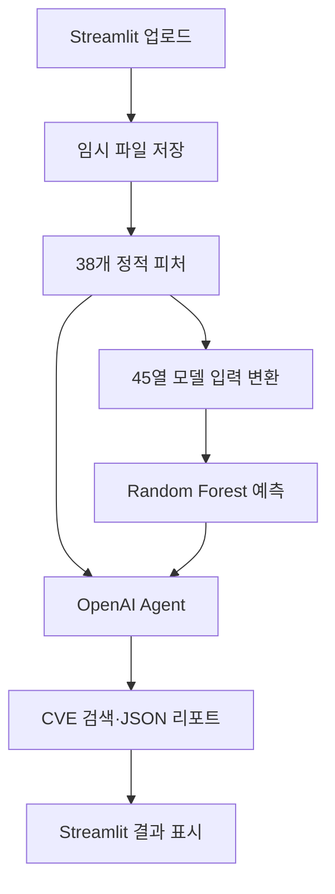

# FSD 프로젝트 회고 및 교차검증 보고서

작성 기준: 2026-08-18 첨부 자료 3종  
판단 기준: 실행 가능한 코드·산출물 > 최종 보고서 > 최종 PPT > 최신 수행일지·대화 > 초기 기획

## 0. 분석 범위와 자료 신뢰도

| 자료                       | 실제 확인 내용                                              | 성격·한계                                                                                                              |
| ------------------------ | ----------------------------------------------------- | ------------------------------------------------------------------------------------------------------------------ |
| `모듈_프로젝트_1_문서_모음(2).zip` | 23개 항목: 최종 DOCX·PPTX, 기획서, 수행일지, 명세, 실행 결과, 대본 등      | 최종 보고서와 PPT는 핵심 서술 근거. 일부 TXT는 같은 내용을 복제하며, 수행일지 8/13·8/14는 사실상 비어 있다.                                             |
| `모듈_프로젝트_1_소스코드(2).zip`  | 38개 ZIP 항목, 실제 파일 27개: Python 13개, CSV 9개, 모델·메타데이터 등 | 최종 구현 판단의 최우선 근거. ZIP 주석의 커밋 해시는 `f44ee3d27dbb3b7f1da4a189f7ce1c3f4f0c56df`이다. 원본 raw 데이터·테스트 코드·시연 영상·Git 이력은 없다. |

문서 ZIP의 최종 보고서와 PPT는 8월 18일 09:32경, 나머지 TXT는 17:19~17:26에 정리되어 있다. 소스 ZIP의 모든 파일 시각은 8월 15일 01:35:22로 동일하므로, ZIP 생성 과정에서 시간이 평탄화된 것으로 보고 파일 시간만으로 코드 작성 순서를 추정하지 않았다.

## 1. 프로젝트 전체 요약

FSD(File Sniffing Dog)는 웹 서비스에 업로드되는 파일을 실행하지 않고 파일명, 확장자, Magic Bytes·MIME, 바이트 분포, 위험 문자열, 압축 구조를 분석해 정상과 악성·이상을 분류하는 프로토타입이다.
1단계에서 38개 원천 피처를 추출하고, 2단계에서 Random Forest가 악성 확률과 위험 등급을 산출하며, 3단계에서 OpenAI Responses API와 CVE 검색을 결합해 설명형 리포트를 생성한다. Streamlit UI가 이 세 단계를 한 흐름으로 연결한다.
제공된 9개 CSV는 40,552행이며 정상 12,781개, 악성·이상 27,771개이다. 파일 확장자는 93종이며 무확장자 1종을 별도 유형으로 세면 문서의 94종이 맞다. 코드의 `FEATURE_ORDER`는 38개지만 모델은 `extension_category` 원핫인코딩 후 45개 열을 입력받는다. 저장된 독립 홀드아웃 성능의 가장 신뢰할 수 있는 근거는 `models/metadata.json`의 Accuracy 98.96%, 악성 Recall 97.96%, Precision 99.45%, F1 98.70%이다. 문서의 99.87%는 전체 40,552개 CSV를 저장 모델로 다시 추론한 재대입 평가로 재현되며, 독립 테스트 성능으로 해석하면 안 된다.
핵심 성과는 데이터 수집부터 정적 분석·ML·Agent·UI까지 연결한 실행 가능한 통합 프로토타입이고, 핵심 한계는 출처·확장자 편향, 독립 외부 검증 부재, 업로드 보안 정책 미구현, 파일별 오류 격리 부족이다.

## 2. 프로젝트 진행 흐름

| 단계 | 목표 | 수행 및 변화 | 문제·보완 | 최종 결과·근거 |
|---|---|---|---|---|
| 문제 정의 | 업로드 악성 파일 사전 탐지 | 웹셸 중심에서 다양한 문서·실행·압축·미디어로 범위 확대 | 동적 분석은 3~4일 개발 범위를 넘으므로 제외 | 정적 분석 기반 이진 분류. `기획서.txt`, `모듈프로젝트 OT.txt` |
| 초기 Feature | 최소 신호 설계 | 파일명·MIME·위험 함수·엔트로피 중심 약 10개 예상 | 위장·Polyglot·압축 위험을 표현하기 부족 | 최종 38개 원천 피처. `기획서 초안.txt`, `src/preprocessing/preprocessor.py` |
| 데이터 수집 | 정상·악성 양쪽 확보 | arXiv, MalwareBazaar, Dike, NapierOne, 웹셸, WordPress 등 결합 | 정상 스크립트와 이미지 이상 표본 부족 | 정상 스크립트 및 Mitra 이미지 이상 데이터 추가. `자료.txt`, 9개 CSV |
| 이미지 보완 | 이미지 위장·Polyglot 대응 | 정상 이미지와 payload를 Mitra로 결합 | `.pdf`·`.zip` 산출물이 일반 악성 PDF로 혼동될 위험 | 이미지 이상 2,301개(정상 444, 이상 1,857). `dataset_image_anomaly_41cols.csv` |
| 스키마 통합 | 동일 열 순서 유지 | 9개 CSV를 41열로 통일 | 신규 열 증가 방지 필요 | `label`, `filename`, `filepath` + 38 피처. 모든 CSV 스키마 동일 |
| 모델링 | 미탐 최소화 | 확장자별 2,000건 상한, 일부 악성 오버샘플링, Random Forest | 출처 단위 분할 없음; 오버샘플링이 분할 전에 수행됨 | 5-fold GridSearch + 80/20 계층 무작위 분할. `src/ml/trainer.py` |
| 추론 | 실시간 위험 확률 | 모델 피처명을 기준으로 자동 정렬·0 채움 | 모델 부재 시 규칙 기반 fallback | `src/ml/predict.py` |
| Agent | 근거·CVE·대응 생성 | 내부 Vector Store 우선, NVD 함수 보조, JSON Schema 출력 | API·벡터스토어 의존, 임계값 규칙 불일치 | 실패 시 같은 스키마의 fallback 리포트. `src/agent/agent.py` |
| UI 통합 | 한 화면에서 전체 흐름 제공 | 다중 업로드, 진행 표시, expander, 다시하기 | 파일 크기·허용 형식·경로 검사 미구현 | 임시 폴더 기반 1→2→3단계 연동. `src/ui/FSD_UI.py` |
| 발표·문서 | 결과 전달 | 19장 PPT, 최종 보고서, 대본 작성 | 성능 수치와 평가 집합이 혼재 | 발표 자료와 보고서의 정정 필요 |

## 3. 초기 계획 → 중간 변경 → 최종 결정 → 실제 구현

| 항목 | 초기 계획 | 중간 변경·최종 결정 | 실제 구현 판단 |
|---|---|---|---|
| 탐지 대상 | 웹셸·이중 확장자 중심 | 문서·이미지·압축·실행·스크립트·오디오·비디오·데이터로 확대 | 확인됨: 확장자 그룹과 공통 피처 구현 |
| 분류 | 위험도 점수 중심 | BENIGN/HIGH_RISK 이진 분류 + 상·중·하 | 확인됨 |
| Feature | 약 10개 예상 | 38개 원천 피처로 확장 | 확인됨. 단 docstring 일부는 아직 “37개”로 낡아 있음 |
| 모델 | 후보 탐색 가능 | Random Forest, Recall 최적화 | 확인됨 |
| 데이터 균형 | 미정 | 확장자별 상한·일부 오버샘플링 | 확인됨. 출처 균형은 미구현 |
| 이미지 이상 | 초기 범위 밖 | Mitra Polyglot 추가 | 데이터·생성 스크립트 확인됨. 모든 9개 이상 유형의 개별 구현은 확인 불가 |
| CVE | File Search | Vector Store + NVD 보조 | 코드 확인됨, 실제 외부 호출 검증 자료 없음 |
| 업로드 보안 | 500MB, 허용 형식, 경로 조작 검사 | 보고서에도 안전 원칙으로 유지 | 문서에만 존재. UI 코드에는 제한·검사 없음 |
| 동적 분석 | 고려 가능 | 정적 분석만 수행 | 미구현이며 의도적 범위 제외 |
| HWP/HWPX·중첩 압축 | 향후 강화 | 개선 과제로 유지 | 전용 심층 파서 미구현. ZIP 내부 재귀는 제한적으로 구현 |
| 대량 통계 | 초기 추가 아이디어 | 최종 UI 핵심에서 제외 | 구현 확인 안 됨 |

## 4. 시스템 구조와 데이터 흐름

| 구성요소 | 입력 | 주요 처리 | 출력 | 예외·오류 처리 |
|---|---|---|---|---|
| `FSD_UI.py` | `UploadedFile` | 임시 디렉터리에 저장, 단계 순차 호출 | 파일별 UI 리포트 | 단계별 예외 격리 없음. `TemporaryDirectory` 종료 시 삭제 |
| `preprocessor.py` | 파일 경로, 선택적 Content-Type | 파일명·형식·내용·통계·압축 분석 | 순서가 고정된 38개 dict | 하위 분석의 다수 I/O 오류를 0으로 치환; 파일 부재는 예외 |
| `dataset_builder.py` | benign/malware 디렉터리 | 파일 탐색, 라벨, 중복 스킵, CSV append | 41열 CSV | 기존 CSV 읽기 오류는 빈 집합 처리. 개별 분석 실패 격리 없음 |
| `trainer.py` | 모든 CSV | 라벨 매핑, 샘플링, 원핫, 분할, GridSearch | PKL·metadata | CSV별 읽기 실패는 건너뜀; 저장 실패는 예외 |
| `predict.py` | 38개 dict | 모델 열 자동 정렬, 결측 0, 예측 | 확률·클래스·등급 JSON | 모델 부재/로드 실패 시 규칙 fallback |
| `agent.py` | features + prediction | File Search/NVD, 구조화 응답 | 설명·CVE·대응 | 전체 실패 시 구조화 fallback |

### 파일·압축 예외의 실제 상태

- 빈 파일: 분석 자체는 가능하며 통계가 0 중심으로 생성될 수 있다. 명시적 “빈 파일 오류” 플래그는 없다.
- 손상·미지원 파일: Magic/구조 검증이 실패하면 일부 값이 0으로 반환된다. “분석 실패”와 “위험 신호 없음”이 구분되지 않을 수 있다.
- 암호화 ZIP: ZIP 예외가 0값 튜플로 흡수될 수 있으며 전용 `encrypted_archive` 피처는 없다.
- 중첩 ZIP: ZIP 내부의 ZIP 바이트를 재귀 확인하지만 깊이·항목·크기 제한 중심이다. RAR/7z는 제한적이며 tar/gz/bz2/xz 내부 분석은 구현되지 않았다.
- 과대 파일: 스트리밍 통계 읽기는 있으나 UI 업로드 상한과 전체 분석 타임아웃은 없다.

## 5. 최종 Feature와 모델 입력

| 그룹 | 피처 | 수 | 역할 |
|---|---|---:|---|
| 기본·파일명 | `file_size` ~ `special_char_ratio` | 7 | 파일명 우회·크기 신호 |
| 확장자 | `extension_category`, 실행·스크립트·매크로·압축·unknown | 6 | 파일 성격 및 고위험 유형 |
| 형식 검증 | Magic, MIME, Content-Type, 내장 시그니처 | 6 | 확장자 위장·Polyglot |
| 바이트 통계 | 전체/헤더 엔트로피, printable/null 비율, 고유 바이트 | 5 | 압축·암호화·텍스트/바이너리 성격 |
| 문자열 | URL, IP, Base64, 명령, 실행·네트워크 API, 난독화, 종합 | 8 | 웹셸·다운로더·난독화 신호 |
| 압축 | 항목·실행·스크립트 수, 깊이, 압축률, bomb | 6 | 은닉·자원 고갈 위험 |

총 38개 원천 피처이다. 학습에서는 `suspicious_string_count`를 제거하고 `extension_category` 9개 범주를 원핫인코딩한다. 따라서 모델 저장 산출물의 `n_features_in_`은 45이다. “38개 모델 입력 Feature”라는 보고서 표현은 원천 피처 수를 뜻할 때만 맞고, Random Forest에 실제 들어가는 열 수로는 부정확하다.

결측 처리와 순서는 `FEATURE_ORDER`, `pd.get_dummies`, 모델의 `feature_names_in_`, 누락 열 0 채움으로 유지된다. Content-Type 미제공 시 `has_content_type=0`, `claimed_mime_mismatch=0`이다. 데이터 누수 위험이 큰 항목은 확장자 범주, 파일명 길이, 특수문자 비율이며 실제 Top-10에서도 `filename_length`와 `special_char_ratio`가 1·2위다.

## 6. 데이터셋 총정리

| 데이터셋 | 성격 | 정상 | 악성·이상 | 합계 | 근거 |
|---|---|---:|---:|---:|---|
| ArXiv PDF | 정상 PDF | 285 | 0 | 285 | `dataset_arxiv_pdf.csv` |
| MalwareBazaar | 다형식 악성 | 0 | 1,296 | 1,296 | `dataset_bazaar.csv` |
| 정상 스크립트 | ASP/ASPX/JSP/JSPX/PS1 | 4,407 | 0 | 4,407 | `dataset_benign_scripts.csv` |
| CIC Evasive PDF | 악성·회피 PDF | 0 | 21,862 | 21,862 | `dataset_cic_evasive_pdf_mal.csv` |
| Dike | EXE·OLE | 1,000 | 1,000 | 2,000 | `dataset_dike.csv` |
| Image Anomaly | Mitra 중심 이미지 이상 | 444 | 1,857 | 2,301 | `dataset_image_anomaly_41cols.csv` |
| NapierOne | 정상 다형식 | 2,700 | 0 | 2,700 | `dataset_napierone.csv` |
| WebShell | 서버 스크립트 악성 | 0 | 1,756 | 1,756 | `dataset_webshell.csv` |
| WordPress PHP | 정상 웹 자산 | 3,945 | 0 | 3,945 | `dataset_wordpress_php.csv` |
| **합계** |  | **12,781** | **27,771** | **40,552** | 9개 CSV 직접 집계 |

주요 출처 링크는 `자료.txt`에 정리되어 있다: NapierOne, DikeDataset, MalwareBazaar API, WordPress, arXiv, tennc/webshell, JohnTroony/php-webshells, CIC PDFMal-2022, Apache Tomcat, ASP.NET 저장소, PowerShell 저장소 등.

### 데이터 품질 판단

- 전체 41열 스키마는 9개 CSV에서 완전히 동일하다.
- 정확히 동일한 전체 행 중복은 0개였지만, 같은 `filename`이 둘 이상인 행은 6,011개다. 내용 해시가 CSV에 없어 동일·파생 파일 중복 여부는 확인할 수 없다.
- `.pdf`가 22,892개(56.45%)로 절대적으로 크고, CIC 악성 PDF가 대부분이다.
- 일부 확장자는 한 라벨에만 존재해 확장자·출처가 라벨 대리변수가 될 수 있다.
- Image Anomaly의 `.pdf`·`.zip` 각 588개는 일반 PDF/ZIP 악성코드가 아니라 Mitra가 이미지와 payload를 결합해 만든 Polyglot 계열로 출처 보존이 필요하다.
- CSV만으로는 malformed, EXIF/XMP, decompression bomb, CVE 재현, 경로 순회 등 9개 세부 유형별 수를 식별할 열이 없다. 실제 포함 여부를 모두 확정할 수 없다.
- 분석 실패 파일 수·제외 파일 수·SHA-256 중복 결과는 최종 소스 ZIP에 manifest/log가 없어 확인 불가다.

## 7. 모델 개발과 성능 수치 정정

### 실제 학습 코드

- 모델: `RandomForestClassifier(class_weight={0:1.0, 1:1.5}, random_state=42)`
- 샘플링: 실제 확장자별 클래스당 최대 2,000개, 정상 수의 30% 목표로 일부 악성 오버샘플링
- 분할: 샘플링 후 `train_test_split(test_size=0.2, stratify=y, random_state=42)`
- 탐색: 3개 트리 수 × 7개 깊이 × 2개 기준 = 42조합, 5-fold이므로 210 fits
- 최적화: Recall
- 저장 모델 최적값: 100 trees, depth 30, gini

### 자료별 성능

| 수치 | 평가 대상 | 판단 |
|---|---|---|
| 99.30%, support 1,150 | `모델 학습.txt` 초기 실험 | 과거 실험 로그. 현재 모델과 직접 연결 불가 |
| 99.51%, support 1,220 | `모델 학습.txt` 후속 실험 | 과거 실험 로그. 보고서가 “최종”로 인용하지만 현재 metadata와 불일치 |
| Accuracy 98.96%, Recall 97.96%, Precision 99.45%, F1 98.70%, test 4,123 | `models/metadata.json` | 현재 제공 모델과 직접 연결된 가장 신뢰도 높은 홀드아웃 결과 |
| Accuracy 99.87%, 40,552건 | 전체 CSV에 저장 모델 재추론 | 직접 재현됨(99.8742%). 학습 원천 데이터 재평가이므로 독립 성능 아님 |
| 98.64%, Recall 97%, 독립 3,967건 | `대본.txt` | 해당 test set 파일·평가 산출물이 없어 확인 불가 |

전체 CSV 재추론의 혼동은 실제 정상 12,781개 중 9개를 악성으로, 실제 악성 27,771개 중 42개를 정상으로 예측한 결과이며 총 51개 오분류다. 이는 `predict.py` 배치 모드가 학습에 사용한 원천 CSV 전체를 다시 평가하기 때문에 높게 나온다.

또한 오버샘플링을 train/test 분할 전에 수행하므로 복제된 악성 샘플이 양쪽에 들어갈 가능성이 있다. 현재 코드는 출처·해시·Mitra pair 단위 그룹 분할, 독립 외부 테스트, ROC-AUC·PR-AUC·Calibration, 유형별 성능, 오탐·미탐 사례 분석을 구현하지 않는다.

## 8. 실제 구현 상태

| 기능 | 상태 | 근거 | 제한사항 |
|---|---|---|---|
| 38개 정적 피처 | 확인됨·실행 검증 | `preprocessor.py`; 첨부 ZIP/TXT 실분석 성공 | 일부 오류가 0값으로 흡수됨 |
| 9개 CSV 41열 통합 | 확인됨 | CSV 직접 집계 | raw 데이터와 재생성 전체 검증은 불가 |
| Random Forest 학습·저장 | 확인됨 | `trainer.py`, PKL, metadata | 평가 설계에 누수 위험 |
| 실시간 추론·피처 정렬 | 확인됨 | `predict.py` | 모델 버전 호환성 고정이 약함 |
| 모델 부재 fallback | 확인됨 | `predict.py` | 규칙 점수는 학습 모델과 교정되지 않음 |
| Agent JSON 리포트 | 코드 확인, 동작 검증 필요 | `agent.py` | API key·Vector Store·네트워크 필요 |
| NVD 재시도 | 확인됨 | `agent/tools.py` | 결과 캐시는 없음 |
| Streamlit 단계 연동 | 코드 확인 | `FSD_UI.py` | 실제 UI 실행·영상 파일은 제공되지 않음 |
| 임시 파일 격리·삭제 | 확인됨 | `TemporaryDirectory` | 원본 파일명 정제 없음 |
| 500MB·허용형식·경로 검사 | 구현되지 않음 | 기획서와 UI 비교 | 보고서의 안전 원칙과 불일치 |
| 업로드 정책 집행 | 구현되지 않음 | 정책표만 존재 | 탐지와 허용/차단 enforcement가 분리되지 않음 |
| 동적 분석 | 구현되지 않음 | 전체 코드 | 의도적 향후 과제 |
| HWP/HWPX 전용 분석 | 구현되지 않음 | 전처리 코드 | 확장자·일반 ZIP/OLE 신호 수준 |
| 전체 파일 통계 UI | 구현 확인 안 됨 | UI 코드 | 파일별 리포트만 존재 |

## 9. 주요 오류·예외와 해결 과정

첨부된 “대화 기록” 파일에는 실제 오류 로그가 없으므로 WinError 3, `fitz` 누락, Wikimedia 수집 예외 등은 분석 항목으로만 열거되어 있고 첨부 근거로 재구성할 수 없다. 최종 코드에서 확인되는 해결책은 다음과 같다.

| 문제 | 코드상 대응 | 남은 위험 |
|---|---|---|
| optional parser 미설치 | `magic`, `rarfile`, `py7zr` import 실패 시 기능 축소 | 사용자는 분석 축소 여부를 알기 어려움 |
| 파일 I/O 실패 | 여러 하위 함수가 0·빈 결과 반환 | 실패와 정상 0을 구분하는 상태 피처 없음 |
| CSV 읽기 실패 | 파일별 오류 출력 후 나머지 병합 | 실패 CSV 목록이 영구 로그로 남지 않음 |
| 모델 로드 실패 | `None` 후 fallback | fallback 결과임을 UI에 강하게 표시하지 않음 |
| NVD rate limit | 429 시 6초 배수 대기, 최대 2회 재시도 | 캐시·circuit breaker 없음 |
| Agent 실패 | 동일 JSON 스키마 fallback | 오류 문자열이 사용자에게 직접 노출될 수 있음 |
| Mitra 생성 실패 | timeout/OSError를 failure CSV에 기록하도록 구현 | 최종 failure CSV가 없어 실제 실패 건수 확인 불가 |

`preprocess_many`는 이름과 달리 파일별 예외를 격리하지 않는다. `preprocess()`에서 처리하지 않은 예외가 하나라도 발생하면 뒤 파일 처리가 중단된다. 문서의 “파일별 오류 격리·K. 오류 기록”은 현재 통합 빌더에는 구현되지 않았다.

## 10. UI·Agent 교차검증에서 발견한 추가 문제

1. `Path(tmp_dir) / uploaded_file.name`을 그대로 사용한다. 절대경로나 `../`를 정제하는 코드가 없으므로 Streamlit이 이름을 안전하게 보장한다는 전제에 의존한다.
2. 파일 업로드 크기·확장자 제한이 `file_uploader`에 설정되지 않았다.
3. `claimed_mime`을 UI에서 `preprocess()`로 전달하지 않아 서비스 실행에서는 `has_content_type=0`이 된다. Content-Type 불일치 피처가 사실상 비활성화된다.
4. `predict.py`는 HIGH_RISK를 50% 초과로 판정하고 위험 “상”을 80% 이상으로 정한다. `agent.py` 프롬프트는 “상”을 90% 이상으로 정의한다. 동일 파일의 단계별 등급이 충돌할 수 있다.
5. `agent.py`는 “file_search를 반드시 먼저”라고 프롬프트하지만 Vector Store ID가 없으면 NVD 함수만 제공하므로 해당 규칙을 충족할 수 없다.
6. requirements가 `scikit-learn>=1.9.0`처럼 하한만 있어 미래 버전에서 PKL 호환성이 깨질 수 있다. 모델·코드·라이브러리 버전을 함께 고정해야 한다.

## 11. 피드백 반영 평가

| 피드백 | 실제 반영 | 판정 |
|---|---|---|
| 확장자별 불균형 | 확장자별 상한·일부 악성 오버샘플링 | 반영됨 |
| 정상 스크립트 부족 | 4,407개 정상 스크립트 추가 | 반영됨 |
| 이미지 Polyglot 부족 | Mitra 데이터 2,301개 추가 | 반영됨 |
| 출처 편향 | 문서에서 한계 인식 | 코드상 source group split 없음 |
| 독립 외부 검증 | 개선 계획에 포함 | 미반영·검증 자료 없음 |
| HWP/HWPX 강화 | 개선 계획 | 미반영 |
| 중첩 압축 강화 | ZIP 재귀 일부 존재 | 일부 반영; RAR/7z/tar 계열 제한 |
| 오류·피처 순서 | 모델 열 자동 정렬, fallback | 반영됨 |
| Agent API 불안정 | 재시도·fallback | 일부 반영; 캐시 없음 |

## 12. 팀 역할과 협업

| 담당 | 역할 | 확인 근거 |
|---|---|---|
| 김성현·전예찬 | 정적 구조 검증, 데이터 수집·전처리 | 최종 보고서, PPT 4장 |
| 김승민·권지우 | ML 추론·Random Forest 학습 | 최종 보고서, PPT 4장 |
| 유지우·최세림 | Vector Store·Agent 리포트 | 최종 보고서, PPT 4장 |
| 김태경 | Streamlit UI·발표 자료 | 최종 보고서, PPT 4장 |

Git convention 문서는 `type: subject` 체계를 제시하고 소스 ZIP은 커밋 해시를 포함하지만, `.git` 이력과 브랜치가 없어 실제 커밋 흐름·리뷰·병합 과정은 확인할 수 없다.

## 13. 발표 자료와 시연

최종 PPT는 19장이다. 1~5장은 개요·역할·일정, 6장은 전체 파이프라인 이미지, 7~8장은 정적 분석, 9~11장은 ML, 12~13장은 Agent, 14장은 UI·시연, 15장은 피드백, 16~17장은 종료·부록 구분, 18~19장은 데이터셋·피처 부록이다. 렌더링 결과 14장의 큰 검은 영역은 임베디드 영상/미디어 자리로 보이지만 ZIP에 독립 MP4가 없어 재생 검증은 불가하다. 슬라이드 6의 XML에는 템플릿 문구가 남아 있으나 실제 화면에는 파이프라인 인포그래픽이 덮여 있다. 11장은 텍스트가 거의 없고 콘솔 스크린샷에 성능을 의존한다.

OT 문서는 질의응답 제외 최대 15분을 명시하고, 프로젝트 맥락상 시연은 약 2분으로 계획됐다. 보고서의 데이터·평가 한계는 PPT 15장에 압축되어 있으며, 성능 수치의 평가 집합 차이는 발표에서 충분히 구분되지 않는다.

## 14. 잘된 점과 아쉬운 점

| 관점 | 잘된 점 | 아쉬운 점·개선 |
|---|---|---|
| 기획 | 4단계 역할과 출력 계약이 명확 | 보안 정책과 탐지 기능을 같은 것으로 서술. enforcement를 별도 요구사항으로 관리 |
| 데이터 | 9개 출처, 40,552행, 정상 스크립트·이미지 이상 보완 | source_id·sha256·family/pair_id 열을 보존해야 함 |
| 전처리 | 38피처, 41열 스키마 일관성, 다양한 파일 공통 처리 | 오류 상태를 0과 분리하고 파일별 실패 로그 추가 |
| 모델 | Recall 중심 GridSearch, 피처 자동 정렬 | 그룹 분할·오버샘플링 순서 수정, 독립 외부 평가 필요 |
| 보안 | 파일 미실행, 임시 디렉터리 사용 | 크기·경로·형식·시간 제한과 안전한 파일명 생성 필요 |
| 설명 | 구조화 JSON, CVE 검색, fallback | 등급 임계값 통일, CVE 근거 식별자·불확실성 표시 |
| 문서 | 데이터 한계를 스스로 인식 | 38/45 피처와 98.96/99.87 성능을 정확히 분리 |
| 발표 | 파이프라인과 팀 역할이 한눈에 보임 | 스크린샷 의존 슬라이드의 수치를 텍스트·표로 명시 |

## 15. 권장 후속 우선순위

1. 평가 재설계: SHA-256·출처·Mitra pair/family를 보존하고 GroupShuffleSplit/GroupKFold로 완전 분리한다. 오버샘플링은 train fold 안에서만 수행한다.
2. 보고서 수치 정정: 현재 모델 홀드아웃은 98.96%/Recall 97.96%, 99.87%는 전체 데이터 재추론이라고 명시한다.
3. 업로드 보안 구현: 서버 생성 파일명 사용, 경로 정규화, 크기·파일 수·시간·메모리·압축 해제 제한, 허용 정책 enforcement를 추가한다.
4. 분석 신뢰도: 각 모듈에 `analysis_status`, `parser_available`, `read_error`, `archive_encrypted` 등을 추가해 0값과 실패를 구분한다.
5. 임계값 통일: ML 클래스 기준, UI 위험 등급, Agent 프롬프트를 하나의 설정 파일로 통합한다.
6. 외부 검증: 보지 않은 출처와 실제 업로드 트래픽으로 확장자별 FPR/FNR, PR-AUC, ROC-AUC, Calibration을 측정한다.

## 16. 필수 교차검증 결과

### 16.1 대화 기록과 문서가 일치하는 내용

- 회고 지시문이 요구한 핵심 범위(정적 분석, 데이터, 모델, UI, 오류, 피드백)는 최종 보고서의 장 구성과 대체로 일치한다.
- 다만 첨부 TXT는 실제 과거 대화 원문이 아니므로 구체적 요구 변화·오류 해결의 직접 일치 여부는 확인할 수 없다.

### 16.2 문서와 소스 코드가 일치하는 내용

| 확인 내용 | 판단 | 근거 자료 | 파일·경로 |
|---|---|---|---|
| Magic Bytes·MIME 검사 | 확인됨 | 코드·명세 | `src/preprocessing/preprocessor.py` |
| 38개 원천 피처 | 확인됨 | 코드·CSV | `FEATURE_ORDER`, 9개 CSV |
| Random Forest·Recall GridSearch | 확인됨 | 코드·metadata | `src/ml/trainer.py`, `models/metadata.json` |
| 피처 자동 정렬·fallback | 확인됨 | 코드·PPT | `src/ml/predict.py` |
| Agent File Search/NVD·JSON | 코드 확인 | 코드·PPT | `src/agent/agent.py`, `src/agent/tools.py` |
| Streamlit 1→2→3 연동 | 코드 확인 | 코드·PPT | `src/ui/FSD_UI.py` |
| Mitra 생성 파이프라인 | 코드·데이터 확인 | 코드·CSV·PPT | `apply_mitra_dataset.py`, 이미지 CSV |

### 16.3 문서에는 있으나 코드에서 확인되지 않는 내용

- 500MB 제한, 허용 파일 형식 제한, 경로 조작 검사, 업로드 정책 집행
- 출처·확장자별 독립 평가 데이터 분리와 `dataset_test`
- 3,967개 독립 테스트셋의 Accuracy 98.64%
- 모든 파일별 분석 오류 기록·격리
- HWP/HWPX 전용 분석, 완전한 중첩 압축 지원, 동적 분석
- UI 전체 통계와 악성 유형별 집계

### 16.4 코드에는 있으나 보고서나 PPT에서 약하게 다뤄진 내용

- Agent의 엄격한 JSON Schema와 전체 실패 fallback
- NVD 429 재시도 로직
- ZIP bomb 임계값: 100,000 entries, 1GB uncompressed, ratio 100
- optional parser 미설치 시 기능 축소
- 모델이 실제로 사용하는 45개 원핫 열과 `suspicious_string_count` 제외
- UI가 `claimed_mime`을 전달하지 않는 사실

### 16.5 자료마다 수치가 다른 내용

| 항목 | 자료별 값 | 최종 판단 |
|---|---|---|
| Feature 수 | 보고서 38, 대본 45 | 원천 38, 모델 입력 45 |
| 최종 Accuracy | 99.51%, 99.87%, 98.96%, 98.64% | 현재 모델 홀드아웃 98.96%; 전체 재추론 99.87%; 나머지는 과거/검증 불가 |
| 테스트 수 | 1,220, 4,123, 3,967, 40,552 | 현재 metadata 4,123; 40,552는 전체 재추론 |
| 파일 유형 | 94 | 93개 확장자 + 무확장자 = 94 유형으로 일치 |

### 16.6 최종 확인이 필요한 내용

- 실제 시연 영상 재생과 Agent·Vector Store의 온라인 정상 동작
- raw 데이터에서 9개 CSV를 처음부터 재생성할 수 있는지
- Mitra 세부 이상 유형별 수와 failure manifest
- 동일·파생 파일의 SHA-256 중복과 train/test 교차 여부
- 발표 대본의 독립 3,967건 테스트셋 실체
- Streamlit이 업로드 파일명을 어떤 수준으로 정제하는지와 운영 배포 설정
- 모델을 정확한 scikit-learn 버전에서 재로드·재학습했을 때의 재현성

## 결론

FSD는 “파일을 실행하지 않는 공통 정적 분석 → ML 분류 → 설명형 Agent → UI”를 실제 코드와 산출물로 연결한 완성도 높은 교육용 프로토타입이다. 데이터 규모와 스키마, 38개 피처, 모델·Agent·UI 모듈은 실체가 확인된다. 그러나 최종 성능은 평가 집합을 분리해 다시 서술해야 하고, 업로드 보안 정책은 문서가 아니라 코드로 구현해야 한다. 다음 반복에서 그룹 기반 외부 검증과 입력 안전성·오류 가시성을 우선 보완하면, 연구 결과의 신뢰성과 실서비스 가능성이 동시에 크게 향상된다.
