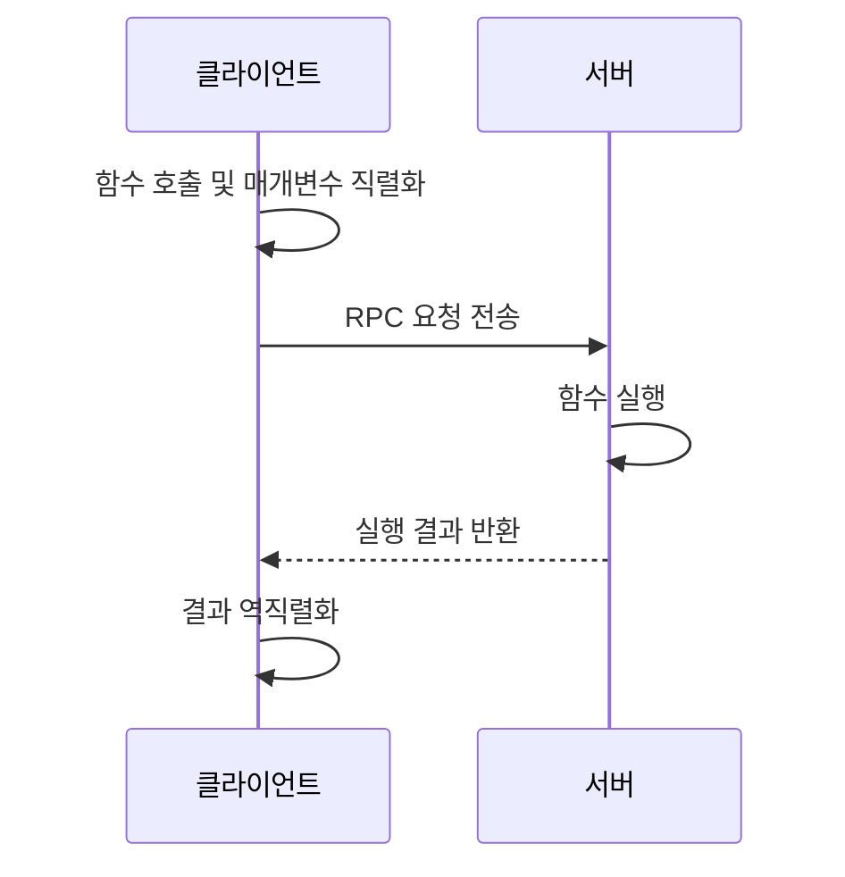

# RPC(Remote Procedure Call)란?

**RPC(Remote Procedure Call, 원격 프로시저 호출)**: 네트워크로 연결된 다른 컴퓨터의 함수나 서비스를 **마치 현재 프로그램의 로컬 함수를 호출하듯 사용하는 통신 방식**이다.

엄밀히 말하면 RPC는 분산 시스템에서 원격 기능을 호출하기 위한 **통신 모델 또는 기술 체계**다. 실제 구현에서는 HTTP/2, TCP, UDP 등의 전송 기술과 JSON, XML, Protocol Buffers 같은 데이터 형식을 조합한다.

## 1. 기본 개념

일반적인 로컬 함수 호출은 다음과 같다.

```python
result = add(10, 20)
```

RPC에서는 `add()` 함수가 다른 서버에 있어도 클라이언트 코드에서는 비슷한 형태로 호출할 수 있다.

```python
result = remote_server.add(10, 20)
```

내부적으로는 다음 과정이 진행된다.



## 2. RPC의 주요 구성요소

| 구성요소        | 역할                        |
| ----------- | ------------------------- |
| 클라이언트       | 원격 함수 호출을 요청한다.           |
| Client Stub | 함수 호출을 네트워크 메시지로 변환한다.    |
| RPC Runtime | 서버 탐색, 연결, 요청 전송 등을 처리한다. |
| Server Stub | 요청 메시지에서 함수명과 매개변수를 복원한다. |
| 서버 함수       | 실제 작업을 수행한다.              |
| IDL         | 호출 가능한 함수와 데이터 형식을 정의한다.  |

### Stub

**Stub**은 클라이언트와 서버 사이의 네트워크 통신을 대신 처리하는 대리 코드다.

클라이언트는 Stub 덕분에 직접 패킷을 만들거나 데이터를 변환하지 않고 일반 함수처럼 원격 서비스를 호출할 수 있다.

### IDL

**IDL(Interface Definition Language)**은 서버가 제공하는 함수와 메시지 구조를 정의하는 언어다.

예를 들어 gRPC의 `.proto` 파일은 다음과 같다.

```proto
service Calculator {
  rpc Add(AddRequest) returns (AddResponse);
}

message AddRequest {
  int32 a = 1;
  int32 b = 2;
}

message AddResponse {
  int32 result = 1;
}
```

이 정의를 기반으로 클라이언트와 서버의 Stub 코드를 자동으로 생성할 수 있다.

## 3. RPC 동작 과정

1. 클라이언트가 일반 함수처럼 Client Stub을 호출한다.
2. Stub이 함수명과 매개변수를 직렬화한다.
3. RPC Runtime이 요청을 네트워크로 전송한다.
4. 서버의 Stub이 메시지를 역직렬화한다.
5. 서버가 실제 함수를 실행한다.
6. 실행 결과를 직렬화하여 클라이언트로 보낸다.
7. 클라이언트가 결과를 역직렬화하여 프로그램에 반환한다.

이 과정에서 데이터를 전송 가능한 형태로 변환하는 것을 **직렬화(Serialization) 또는 마샬링(Marshalling)**이라고 한다.

## 4. 대표적인 RPC 기술

| 기술            | 전송 및 데이터 형식              | 특징                   |
| ------------- | ------------------------ | -------------------- |
| ONC RPC       | TCP 또는 UDP, XDR          | 유닉스·NFS 환경에서 사용      |
| XML-RPC       | HTTP, XML                | 구조가 단순하지만 데이터가 크다.   |
| JSON-RPC      | 다양한 전송 방식, JSON          | 가볍고 구현이 간단하다.        |
| SOAP          | 주로 HTTP, XML             | 엄격한 표준과 기업 시스템 기능 제공 |
| gRPC          | HTTP/2, Protocol Buffers | 빠른 성능과 스트리밍 지원       |
| Apache Thrift | 다양한 프로토콜                 | 여러 언어 간 RPC 코드 생성 지원 |
| Java RMI      | Java 직렬화                 | Java 객체 간 원격 호출      |
| DCE/RPC       | TCP, SMB 등               | Windows 서비스의 기반 기술   |

## 5. RPC와 REST API 비교

| 구분     | RPC                         | REST                          |
| ------ | --------------------------- | ----------------------------- |
| 중심 개념  | 동작 또는 함수 호출                 | 리소스 조작                        |
| 요청 예시  | `createUser()`, `getUser()` | `POST /users`, `GET /users/1` |
| 인터페이스  | 함수·서비스 중심                   | URI와 HTTP 메서드 중심              |
| 통신 방식  | HTTP 외에도 TCP·UDP 등 사용 가능    | 일반적으로 HTTP 사용                 |
| 데이터 형식 | Protobuf, JSON, XML 등       | 주로 JSON                       |
| 성능     | 바이너리 RPC는 매우 효율적            | 텍스트 기반일 때 상대적으로 부담이 큼         |
| 결합도    | 인터페이스 정의에 대한 의존도가 높음        | 비교적 느슨한 결합                    |
| 주요 용도  | 내부 서비스 간 통신                 | 공개 웹 API, 웹 서비스               |

예를 들어 사용자 정보를 조회할 때 다음처럼 표현한다.

```text
RPC
getUser(user_id=100)

REST
GET /users/100
```

RPC는 **무엇을 실행할 것인가**에 집중하고, REST는 **어떤 리소스를 어떻게 처리할 것인가**에 집중한다.

## 6. 장점과 한계

### 장점

* 원격 서비스를 일반 함수처럼 호출할 수 있다.
* 네트워크 통신 코드를 직접 작성할 필요가 줄어든다.
* gRPC처럼 바이너리 직렬화를 사용하면 통신 효율이 높다.
* IDL을 이용해 여러 언어의 클라이언트·서버 코드를 생성할 수 있다.
* 마이크로서비스 내부 통신에 적합하다.

### 한계

* 로컬 함수 호출과 달리 네트워크 장애와 지연이 발생할 수 있다.
* 서버가 함수를 실행했는지 불분명한 상태가 발생할 수 있다.
* 재시도 시 동일 작업이 중복 실행될 수 있다.
* 클라이언트와 서버가 동일한 인터페이스 정의를 공유해야 한다.
* 방화벽, 인증, 암호화, 서비스 탐색 등을 별도로 고려해야 한다.

특히 RPC는 외형상 함수 호출과 비슷하지만 실제로는 **실패할 수 있는 네트워크 요청**이다. 따라서 timeout, retry, idempotency, 인증 및 오류 처리 설계가 중요하다.

## 핵심 정리

> RPC는 네트워크상의 다른 시스템이 제공하는 함수를 로컬 함수처럼 호출하게 해주는 분산 통신 방식이다.

RPC 자체가 하나의 전송 프로토콜인 것은 아니며, 구체적인 구현에 따라 TCP, UDP, HTTP/2와 JSON, XML, Protocol Buffers 등을 사용한다. 현대적인 마이크로서비스 환경에서는 성능과 타입 안정성이 좋은 **gRPC**가 대표적으로 활용된다.

### 출처

* [RFC 5531 — Remote Procedure Call Protocol Version 2](https://www.rfc-editor.org/rfc/rfc5531)
* [gRPC 공식 문서](https://grpc.io/docs/what-is-grpc/introduction/)
* [JSON-RPC 2.0 Specification](https://www.jsonrpc.org/specification)
* [Microsoft Learn — Remote Procedure Call](https://learn.microsoft.com/windows/win32/rpc/rpc-start-page)
* Andrew S. Tanenbaum, Maarten van Steen, *Distributed Systems: Principles and Paradigms*, Pearson.
