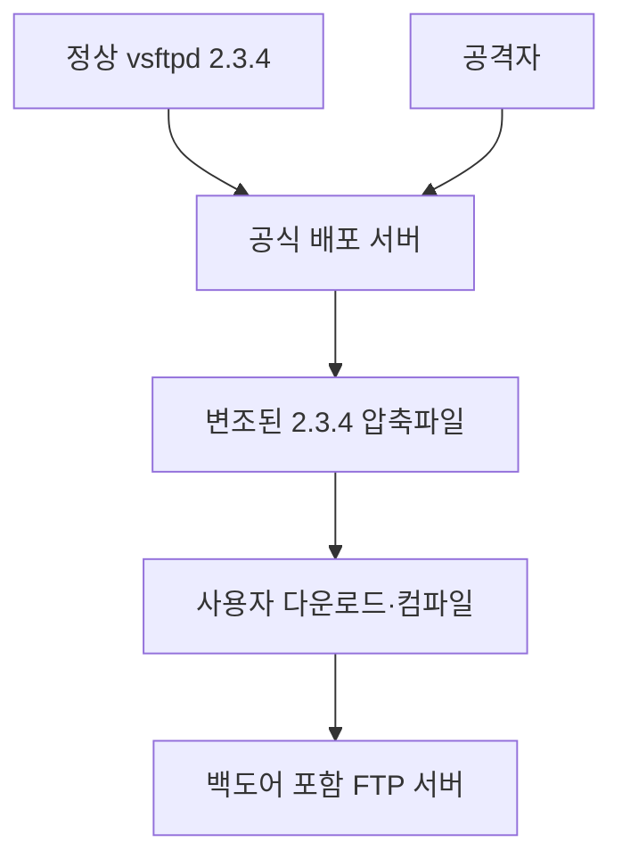
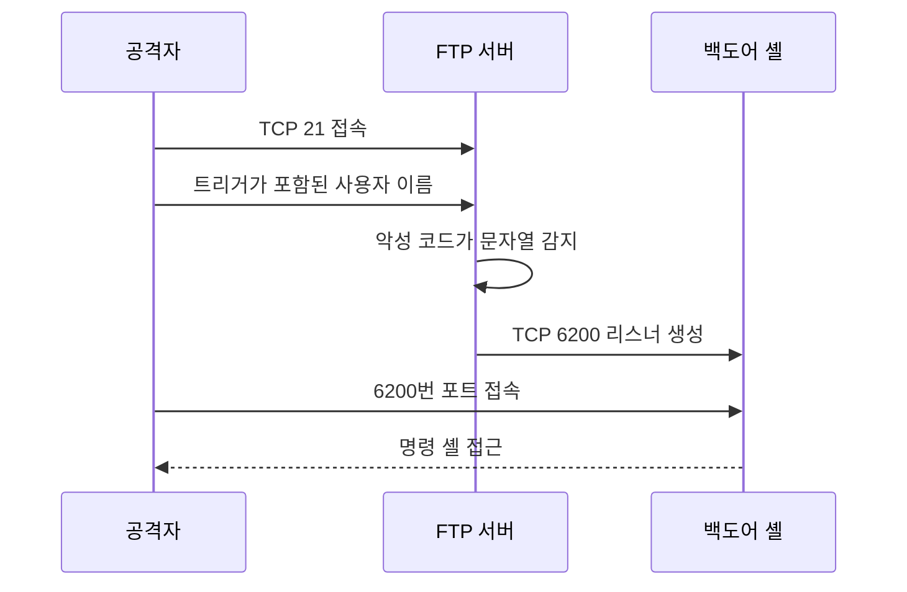

# vsftpd 2.3.4 백도어 취약점

## 1. 개요

**CVE-2011-2523**은 2011년 vsftpd 2.3.4 배포 파일에 악성 코드가 삽입된 사건입니다.

| 항목       | 내용                               |
| -------- | -------------------------------- |
| 취약점 ID   | CVE-2011-2523                    |
| 대상       | 변조된 vsftpd 2.3.4 소스 패키지          |
| 공개일      | 2011년 7월 3일                      |
| 취약점 유형   | 공급망 공격, 악성 백도어                   |
| 공격 위치    | 원격 네트워크                          |
| 인증 필요    | 없음                               |
| 사용자 상호작용 | 없음                               |
| 결과       | TCP 6200번 포트에 명령 셸 생성            |
| 심각도      | 치명적 수준의 원격 명령 실행                 |
| CWE 관점   | CWE-506: Embedded Malicious Code |

핵심은 이것이 **정상적인 vsftpd 2.3.4 프로그램에서 발견된 일반적인 코딩 실수나 설계 결함이 아니라는 점**입니다.

공격자가 vsftpd 프로젝트의 배포 서버를 침해한 뒤, 악성 코드가 삽입된 `vsftpd-2.3.4.tar.gz`를 정상 파일처럼 배포한 **소프트웨어 공급망 공격**입니다. NVD는 2011년 6월 30일부터 7월 3일 사이 내려받은 2.3.4 배포본을 영향 대상으로 설명합니다.

출처: [NVD—CVE-2011-2523](https://nvd.nist.gov/vuln/detail/CVE-2011-2523), [Rapid7 취약점 데이터베이스](https://www.rapid7.com/db/modules/exploit/unix/ftp/vsftpd_234_backdoor/)

---

## 2. 사건의 발생 과정

### 정상적인 배포 과정

일반적인 정상 배포는 다음과 같습니다.

```text
개발자 소스 코드
    ↓
공식 소스 패키지 생성
    ↓
공식 다운로드 서버
    ↓
사용자 다운로드·컴파일·설치
```

### 당시 발생한 변조

2011년에는 이 과정의 배포 서버 단계가 침해됐습니다.



알려진 사건 흐름은 다음과 같습니다.

* 2011년 6월 30일경 배포 서버의 압축파일이 변조됨
* 사용자가 공식 사이트에서 악성 `vsftpd-2.3.4.tar.gz`를 내려받음
* 소스를 직접 컴파일한 서버에 백도어가 설치됨
* 2011년 7월 3일 변조 사실이 확인됨
* 악성 배포본이 공식 서버에서 제거됨

따라서 단순히 버전 번호가 `2.3.4`라는 이유만으로 모두 백도어가 포함됐다고 단정할 수는 없습니다. **어디에서, 언제, 어떤 파일을 내려받아 설치했는지**가 중요합니다.

---

## 3. 백도어 동작 원리

변조된 프로그램은 FTP 로그인 과정에서 특별한 문자열을 트리거로 인식합니다.

### 트리거 문자열

FTP 클라이언트가 사용자 이름에 다음 문자 조합을 포함해 전송하면 백도어가 활성화됩니다.

```text
:)
```

즉, 웃는 얼굴처럼 보이는 문자 조합이 비밀 신호로 사용됐습니다.

### 동작 흐름



구체적인 과정은 다음과 같습니다.

1. 공격자가 FTP 서비스의 TCP 21번 포트에 접속합니다.
2. 로그인 과정의 사용자 이름에 `:)` 문자열을 포함합니다.
3. 변조된 문자열 처리 코드가 이 값을 감지합니다.
4. 악성 코드가 별도의 프로세스를 생성합니다.
5. 해당 프로세스가 TCP 6200번 포트에서 연결을 기다립니다.
6. 공격자가 6200번 포트에 접속하면 명령 셸을 사용할 수 있습니다.

정상적인 사용자 인증을 통과할 필요가 없으므로 **인증 전 원격 명령 실행**에 해당합니다.

---

## 4. TCP 21번과 6200번 포트의 역할

|       포트 | 역할                        |
| -------: | ------------------------- |
|   TCP 21 | 정상 FTP 제어 연결 및 백도어 트리거 전달 |
| TCP 6200 | 백도어가 생성하는 명령 셸 연결         |

6200번 포트는 서버 시작과 동시에 항상 열리는 것이 아니라, 일반적으로 특수 사용자 이름이 입력되어 백도어가 활성화된 후 열립니다.

따라서 특정 시점의 포트 검사에서 6200번 포트가 닫혀 있었다고 해서 안전하다고 단정할 수 없습니다.

또한 6200번 포트가 열려 있다는 사실만으로 이 취약점이라고 확정할 수도 없습니다. 다른 프로그램이 같은 포트를 사용할 수 있으므로 프로세스와 로그를 함께 확인해야 합니다.

---

## 5. 공격이 성공했을 때의 영향

백도어 셸이 열리면 공격자는 서버에서 임의의 운영체제 명령을 실행할 수 있습니다. 실제 권한은 해당 변조 바이너리의 실행 방식과 프로세스 권한에 영향을 받지만, 당시 vsftpd가 특권 프로세스를 포함해 실행되는 구성에서는 **시스템 전체 장악으로 이어질 가능성이 매우 높습니다.**

예상되는 피해는 다음과 같습니다.

* 서버 파일 열람·변조·삭제
* FTP 계정과 설정 파일 탈취
* 추가 악성코드 설치
* 신규 사용자 또는 SSH 키 등록
* 서버를 봇넷이나 공격 경유지로 이용
* 내부망 정찰과 다른 서버로의 횡적 이동
* 로그 삭제와 지속성 확보
* 서비스 중단
* 저장된 개인정보·인증정보 유출

이 취약점은 버퍼 오버플로처럼 성공 여부가 메모리 배치에 따라 달라지는 방식이 아닙니다. 악성 배포본 자체가 의도적으로 셸을 열도록 만들어졌으므로, 백도어가 포함된 경우 작동이 매우 단순하고 안정적이었습니다.

---

## 6. 왜 공급망 공격인가?

일반적인 취약점은 개발자가 작성한 정상 코드에 실수나 논리적 결함이 있어 발생합니다.

```text
정상 개발 → 결함 있는 코드 → 취약점 발생
```

이 사건은 다음과 같이 발생했습니다.

```text
정상 개발 → 배포 서버 침해 → 악성 코드 삽입 → 사용자에게 배포
```

사용자는 공식 다운로드 서버를 신뢰했지만, 서버에서 제공된 파일 자체가 이미 변조돼 있었습니다. 따라서 다음과 같은 현대적인 공급망 보안 원칙의 중요성을 보여줍니다.

* 배포 파일의 디지털 서명 검증
* 신뢰할 수 있는 패키지 저장소 사용
* 해시값 및 서명 별도 채널 확인
* 빌드 출처와 의존성 기록
* 소프트웨어 자재 명세서(SBOM) 관리
* 재현 가능한 빌드
* 배포 서버 접근 통제
* 설치 파일 무결성 지속 검증

---

## 7. 영향받는 시스템 판별

### 버전 문자열만으로는 확정할 수 없음

FTP 배너에 다음과 같이 표시될 수 있습니다.

```text
220 (vsFTPd 2.3.4)
```

이것은 조사 대상이라는 의미이지, 백도어 포함을 확정하는 증거는 아닙니다.

반대로 배너는 관리자가 변경하거나 숨길 수 있으므로 다른 버전으로 표시된다고 해서 안전한 것도 아닙니다.

### 확인해야 할 항목

#### 1. 설치 출처와 시점

* 2011년 6월 30일~7월 3일 공식 배포 서버에서 직접 받았는가?
* 소스 압축파일을 직접 컴파일했는가?
* 신뢰할 수 있는 Linux 배포판 저장소에서 설치했는가?
* 설치 파일의 서명과 해시를 검증했는가?

공식 배포 서버의 변조된 소스를 직접 내려받아 컴파일한 시스템이 핵심 영향 대상입니다. 배포판 패키지를 사용한 경우에는 해당 배포판의 보안 공지와 패키지 무결성을 별도로 확인해야 합니다.

#### 2. 바이너리 및 패키지 무결성

* 패키지 관리자 무결성 검사
* 설치된 바이너리와 정상 패키지 비교
* 소스 및 바이너리의 해시 확인
* 패키지 서명 검증
* 빌드 기록과 설치 로그 확인

오래된 인터넷 게시물의 해시값을 그대로 신뢰하기보다는 해당 Linux 배포판 또는 신뢰할 수 있는 공식 저장소의 서명된 패키지와 비교해야 합니다.

#### 3. 네트워크 흔적

* TCP 6200번 리스닝 기록
* 외부에서 서버 TCP 6200번으로 연결한 기록
* TCP 21 접속 직후 TCP 6200 접속이 이어진 패턴
* 방화벽·NetFlow·IDS에서 비정상 연결 기록
* 외부에 노출된 불필요한 FTP 서비스

#### 4. FTP 로그

다음과 같은 로그인 시도를 확인합니다.

* 사용자 이름에 `:)`가 포함된 기록
* 비정상적인 `USER` 명령
* 인증 실패 직후 6200번 연결 발생
* 알려지지 않은 외부 IP의 반복적인 FTP 접근

다만 로그가 남지 않았거나 공격자가 로그를 삭제했을 수 있으므로, 로그 부재를 안전하다는 증거로 사용해서는 안 됩니다.

#### 5. 호스트 흔적

* 정체불명의 셸 프로세스
* vsftpd의 자식 또는 연관 프로세스로 실행된 셸
* 비정상 사용자·그룹·SSH 키
* 변경된 시작 프로그램과 예약 작업
* 새롭게 설치된 실행파일
* 변경된 시스템 바이너리
* 비정상적인 외부 연결
* 삭제되거나 중단된 감사 로그

---

## 8. 네트워크 탐지 관점

탐지 규칙을 설계한다면 단일 조건보다 여러 증거를 결합하는 것이 좋습니다.

### 주요 탐지 지표

| 구분     | 탐지 지표                      |
| ------ | -------------------------- |
| 서비스    | vsftpd 2.3.4 식별            |
| FTP 요청 | `USER` 값에 트리거 문자열 포함       |
| 네트워크   | FTP 연결 이후 TCP 6200 리스너 생성  |
| 외부 연결  | 동일 출발지에서 21번과 6200번에 연속 접속 |
| 프로세스   | vsftpd와 관련된 비정상 셸 실행       |
| 무결성    | 정상 패키지와 다른 vsftpd 바이너리     |
| 로그     | 로그인 실패와 무관하게 생성된 명령 실행 흔적  |

트리거 문자열을 로그나 탐지 규칙에 작성할 때는 입력값을 적절히 이스케이프해야 합니다. 또한 포트 6200만 차단하는 것은 근본적인 해결이 아닙니다. 백도어가 포함된 바이너리가 남아 있다는 사실 자체가 시스템 무결성이 깨졌다는 뜻이기 때문입니다.

---

## 9. 대응 방법

### 백도어 포함 여부만 의심되는 경우

1. 외부에서 FTP 서비스에 접근하지 못하도록 제한합니다.
2. 설치된 패키지의 출처와 무결성을 확인합니다.
3. 신뢰할 수 있는 최신 패키지로 교체합니다.
4. TCP 6200번과 비정상 프로세스를 확인합니다.
5. FTP·방화벽·인증·시스템 로그를 보존합니다.
6. 관련 계정과 인증정보를 점검합니다.

### 백도어 실행 또는 침해 정황이 있는 경우

단순히 vsftpd만 업데이트하고 종료해서는 안 됩니다.

1. 시스템을 네트워크에서 격리합니다.
2. 메모리·프로세스·네트워크·디스크 증거를 보존합니다.
3. 침해 시점과 공격 범위를 조사합니다.
4. FTP뿐 아니라 SSH 키, 비밀번호, API 키와 인증서를 교체합니다.
5. 동일 자격증명을 사용하는 다른 서버를 점검합니다.
6. 신뢰할 수 있는 이미지와 패키지로 서버를 재구축합니다.
7. 복구 후 외부 통신과 계정 활동을 지속적으로 감시합니다.

원격 명령 셸이 한 번이라도 노출됐다면 공격자가 다른 백도어를 설치했을 수 있습니다. 따라서 기존 시스템을 그대로 두고 악성 vsftpd 파일만 삭제하는 방식은 충분하지 않습니다.

---

## 10. 업데이트만으로 충분하지 않은 이유

상황에 따라 대응 수준이 달라집니다.

| 상황                        | 권장 대응                    |
| ------------------------- | ------------------------ |
| 백도어 없는 정상 2.3.4임이 검증됨     | 그래도 지원되는 최신 버전으로 이전      |
| 출처를 확인할 수 없음              | 무결성 검사 후 신뢰 가능한 패키지로 재설치 |
| 백도어 바이너리만 발견되고 실행 흔적 없음   | 격리 후 정밀 조사, 재구축 고려       |
| TCP 6200 접속 또는 셸 실행 흔적 있음 | 완전한 침해로 간주하고 서버 재구축      |
| 외부 인터넷에 장기간 노출됨           | 과거 로그와 다른 내부 시스템까지 조사    |

2026년 기준으로 vsftpd 2.3.4는 매우 오래된 버전입니다. 백도어 포함 여부와 별개로 운영 환경에서 계속 사용해서는 안 됩니다.

---

## 11. 자주 혼동하는 내용

### “vsftpd 2.3.4는 모두 취약하다”

정확하지 않습니다. 특정 기간에 배포 서버에서 제공된 **변조된 2.3.4 소스 패키지**가 핵심 대상입니다.

다만 배너만 보고 안전한 정상 빌드인지 구분할 수 없으므로 2.3.4가 발견되면 출처와 무결성을 반드시 조사해야 합니다.

### “프로그램에 원래부터 있던 버그다”

아닙니다. 알려지지 않은 공격자가 배포 파일에 의도적으로 넣은 악성 기능입니다.

### “6200번 포트만 막으면 해결된다”

아닙니다. 외부 접근을 일시적으로 막을 수 있을 뿐, 악성 바이너리는 그대로 남습니다.

### “FTP 비밀번호를 알아야 공격할 수 있다”

해당 백도어의 활성화에는 정상적인 사용자 인증이 필요하지 않았습니다.

### “FTPS를 설정하면 백도어도 막을 수 있다”

아닙니다. FTPS는 전송 구간을 TLS로 암호화하는 기능입니다. 서버 프로그램 자체가 변조된 문제를 해결하지 못합니다.

---

## 12. 이 사건의 보안적 의미

vsftpd 2.3.4 사건은 다음 사실을 보여주는 대표적인 사례입니다.

> 보안성이 높은 프로그램도 배포 경로가 침해되면 악성 소프트웨어가 될 수 있다.

따라서 보안은 소스 코드뿐 아니라 다음 전체 과정에 적용되어야 합니다.

```text
개발 → 빌드 → 서명 → 배포 → 설치 → 실행 → 업데이트
```

오늘날에는 이를 소프트웨어 공급망 보안 또는 소프트웨어 공급망 무결성 문제로 다룹니다.

### 핵심 요약

> CVE-2011-2523은 변조된 vsftpd 2.3.4 배포본이 FTP 로그인 사용자 이름의 특수 문자열을 감지한 뒤 TCP 6200번 포트에 명령 셸을 생성하는 공급망 백도어입니다. 버전 정보만으로 감염을 확정할 수 없으며, 설치 출처·파일 무결성·FTP 로그·6200번 통신·프로세스 흔적을 함께 조사해야 합니다. 실행 정황이 있다면 단순 업데이트가 아니라 완전한 시스템 침해로 보고 격리·자격증명 교체·재구축까지 진행해야 합니다.

### 출처

* [NVD—CVE-2011-2523](https://nvd.nist.gov/vuln/detail/CVE-2011-2523)
* [Rapid7—VSFTPD 2.3.4 Backdoor Command Execution](https://www.rapid7.com/db/modules/exploit/unix/ftp/vsftpd_234_backdoor/)
* [HKCERT—vsftpd Compromised Source Packages Backdoor Vulnerability](https://www.hkcert.org/my_url/en/alert/11070501)
* [Broadcom Attack Signature—VSFTPD Compromised Source Packages](https://www.broadcom.com/support/security-center/attacksignatures/detail?asid=33416)


## 참고

- [[medium] Exploiting the vsftpd 2.3.4 Backdoor in Metasploitable 2](https://medium.com/@r62138808/one-smiley-face-one-root-shell-the-vsftpd-2-3-4-backdoor-in-metasploitable-2-9211680b2412)