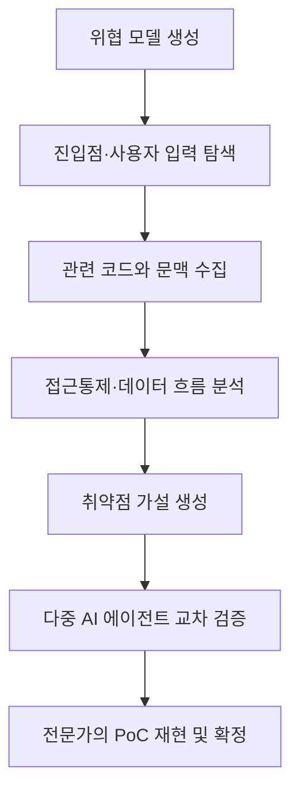

## 핵심 요약

구글 맨디언트(Mandiant)가 여러 AI 에이전트를 연결해 소스코드 취약점 분석을 자동화하는 내부 도구 **AVDH(Agentic Vulnerability Discovery Harness)** 를 공개했다는 내용입니다.

AVDH의 핵심은 AI 모델 하나에 전체 분석을 맡기는 것이 아니라, **위협 모델링 → 진입점 탐색 → 관련 코드 수집 → 취약점 가설 생성 → 교차 검증 → 전문가 검증**을 각각 전문 에이전트에게 나누어 맡기는 것입니다.

## 등장 배경

생성형 AI로 인해 공격자도 유출된 소스코드를 빠르게 분석할 수 있게 됐습니다. 반면 사람이 대규모 코드를 수동으로 검토하는 데는 오랜 시간이 걸립니다.

이에 맨디언트는 다음 요소를 결합했습니다.

* 여러 전문 AI 에이전트
* 정해진 순서로 진행되는 분석 파이프라인
* 보안 전문가의 취약점 분석 규칙
* 사람에 의한 최종 검증

즉, AI의 속도를 활용하면서도 환각과 오탐 문제는 구조적인 검증 과정으로 통제하는 방식입니다.

## AVDH 분석 과정

| 단계        | 담당 역할                      | 주요 작업                                  |
| --------- | -------------------------- | -------------------------------------- |
| 1. 위협 모델링 | Explorer·Specialist Agent  | 코드베이스의 목적, 구조, 인증·인가·라우팅 체계 분석         |
| 2. 진입점 탐색 | Discovery Agent            | HTTP Route, IPC Listener, 사용자 입력 위치 탐색 |
| 3. 문맥 보강  | Enrichment Agent           | 관련 함수, 권한 검사, Sanitizer, 호출 관계 수집      |
| 4. 가설 생성  | Access Control Agent       | 인증·인가 누락, 권한 상승, CSRF 가능성 분석           |
| 5. 가설 생성  | Data Flow Agent            | 사용자 입력이 위험한 Sink까지 도달하는지 추적            |
| 6. AI 검증  | Validation Agents          | 여러 에이전트가 각 취약점 가설을 독립적으로 검토            |
| 7. 종합 판정  | Validation Synthesis Agent | 확인·반증·기각 중 하나로 분류                      |
| 8. 전문가 검증 | 보안 전문가                     | 실제 공격 재현 및 PoC 실행 후 최종 확정              |

### 전체 흐름

## 탐지하는 주요 취약점

AVDH는 크게 접근통제와 데이터 흐름을 분석합니다.

* 인증 및 인가 누락
* 권한 상승
* CSRF
* SQL Injection
* XSS
* Command Injection
* Path Traversal
* 원격 코드 실행(RCE)

특히 사용자 입력이 프로그램 내부에서 어떻게 변환되고, 최종적으로 위험한 함수인 **Sink**에 도달하는지를 여러 파일과 함수 호출에 걸쳐 추적합니다.

## 검증 결과

맨디언트가 공개한 주요 성과는 다음과 같습니다.

* 약 10개월 동안 내부에서 운영
* 수천만 줄 규모의 소스코드 분석
* 수천 개의 분석 파이프라인 실행
* 수만 건의 잠재적 취약점 결과 생성
* 유출된 기업 저장소 분석에서 이틀 만에 100건 이상의 실제 중요 취약점 발견
* 현재까지 12건의 CVE 할당
* 약 12건이 추가 공개 절차 진행 중
* 모의 공격에서 초기 침투가 가능한 RCE 취약점 발견

다만 이는 맨디언트가 발표한 자체 성과이므로, 다른 환경에서도 같은 성능이 보장된다는 의미는 아닙니다. [Google Cloud 공식 발표](https://cloud.google.com/blog/topics/threat-intelligence/staying-ahead-of-adversarial-ai-through-agentic-source-code-review)

## 오탐을 줄이는 방법

AVDH는 AI가 제시한 내용을 바로 취약점으로 확정하지 않습니다.

1. 여러 Validation Agent가 같은 가설을 독립적으로 평가합니다.

2. Synthesis Agent가 결과를 종합합니다.

3. 결과를 다음 세 가지로 분류합니다.

   * `Confirmed`: 취약점 가능성이 충분히 확인됨
   * `Disproven`: 반대 증거가 있어 가설이 틀림
   * `Rejected`: 위협 모델과 맞지 않거나 취약점이 아님

4. 확인된 결과도 사람이 실제 PoC를 실행합니다.

5. 공격이 재현되지 않으면 최종 결과에서 제외합니다.

## 보안 전문가의 지식 적용

맨디언트는 전문가의 분석 경험을 다음과 같은 계층적 규칙으로 정리해 에이전트에 적용했습니다.

* 소프트웨어 도메인 규칙
* 프로그래밍 언어별 규칙
* 프레임워크별 규칙
* 취약점 유형별 규칙

예를 들어 특정 프레임워크에서 HTTP 진입점이 어떻게 정의되는지, 어떤 함수가 위험한 Sink인지 등을 에이전트가 참고합니다.

## 한계와 주의점

* AI 분석만으로 취약점을 최종 확정할 수 없음
* 실제 실행 환경의 보완 통제를 놓칠 수 있음
* 거짓 양성뿐 아니라 거짓 음성도 발생 가능
* 코드베이스 구조와 위협 모델이 잘못되면 이후 분석도 부정확해짐
* 공개 취약점 데이터로 평가하면 학습 데이터 오염 문제가 발생할 수 있음
* 최종적으로 전문가의 동적 검증과 PoC 재현이 필요함

## 핵심 의미

이 글의 핵심은 단순히 “AI가 사람보다 취약점을 잘 찾는다”가 아닙니다.

> AI 모델을 전문 역할별로 분리하고, 정해진 파이프라인·보안 규칙·교차 검증·사람의 최종 검토를 결합하면 대규모 소스코드 보안 분석을 빠르게 확장할 수 있다는 사례입니다.

AVDH는 특정 시점에 깊게 분석하는 도구이고, 지속적인 코드 감시 및 패치를 담당하는 **CodeMender**와 함께 사용하면 다음과 같은 이중 방어 구조가 됩니다.

* **AVDH:** 특정 코드베이스를 대상으로 깊은 취약점 및 공격 경로 분석
* **CodeMender:** 개발 과정에서 지속적인 스캔·우선순위 지정·패치·모니터링

원문 기사: [SSLC 테크토크](https://sslc.kr/board/news/1709)
