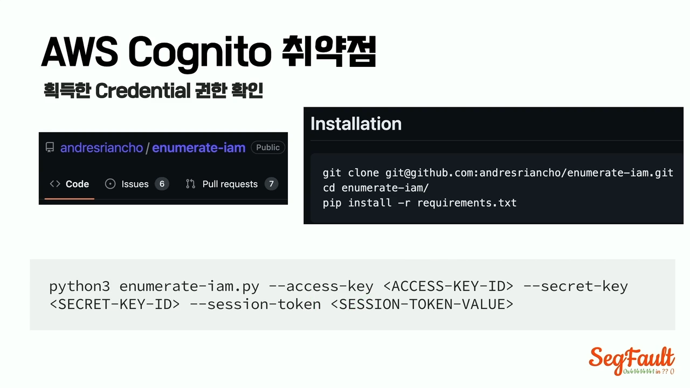
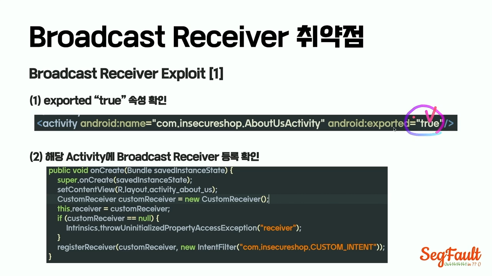
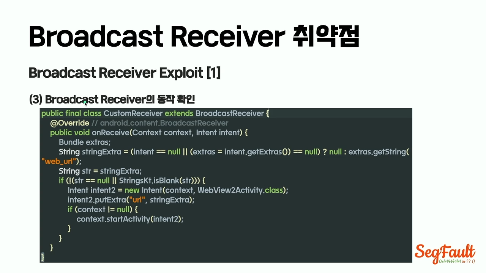
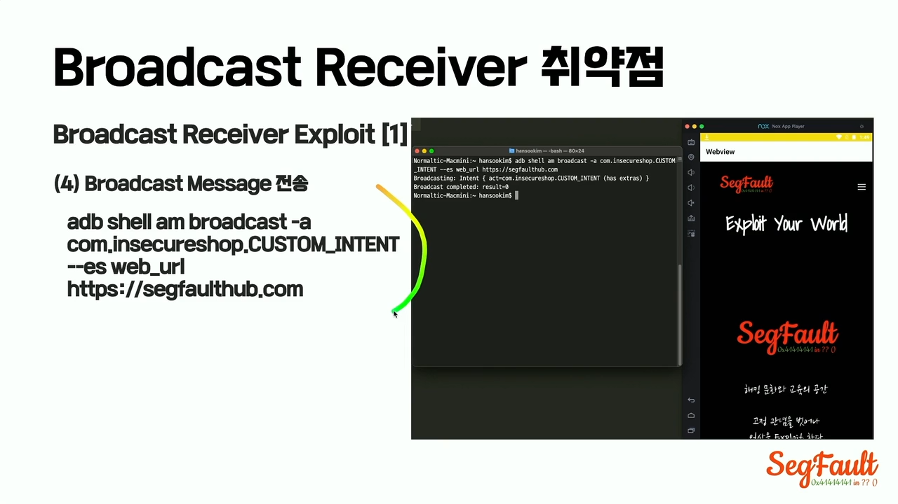
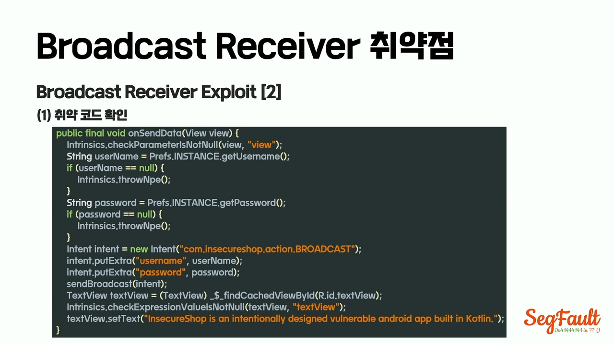
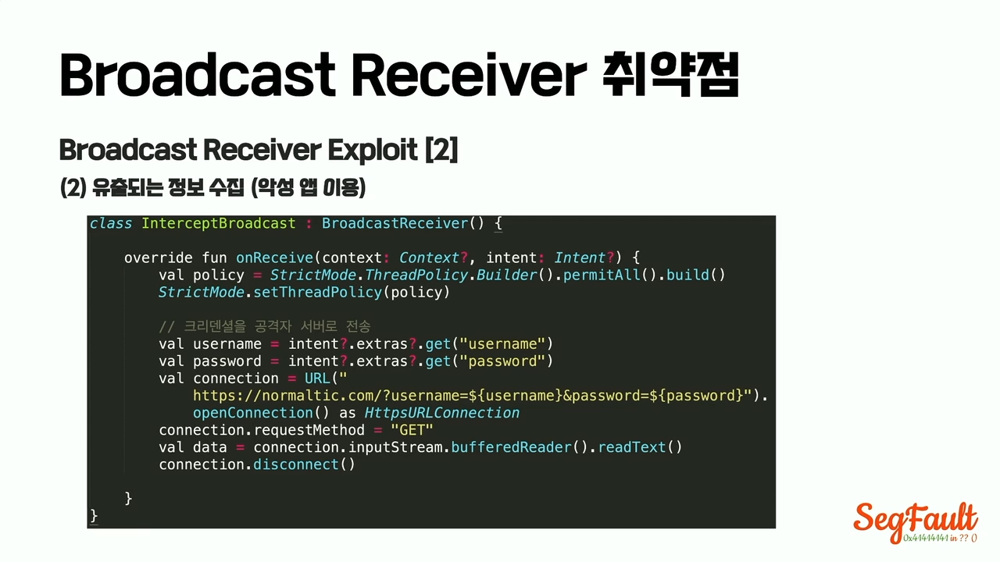
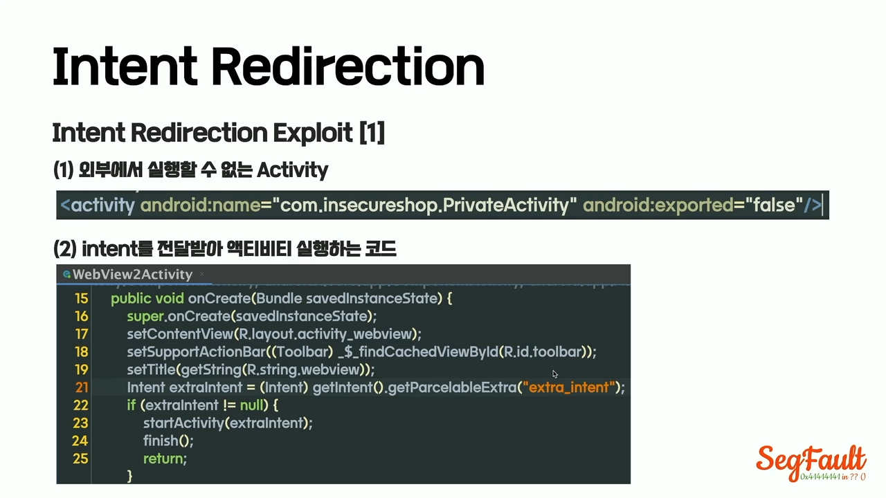
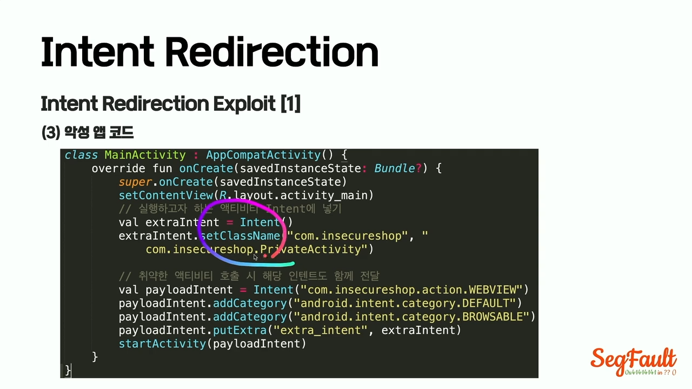
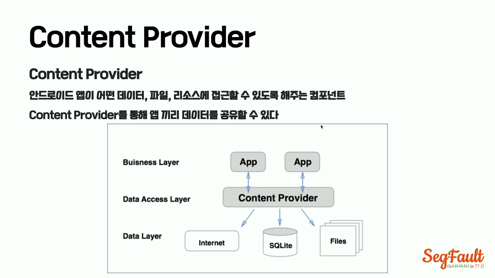
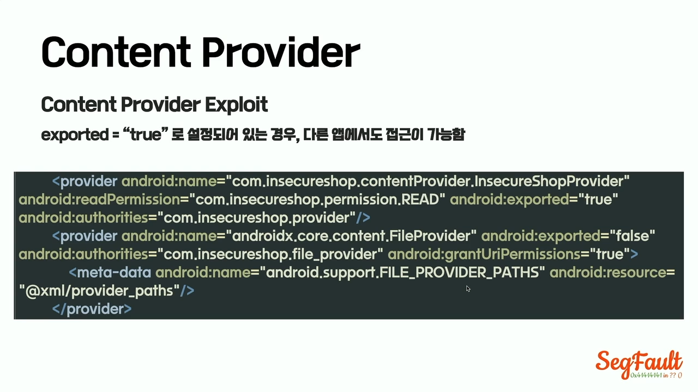

# 5. 애플리케이션 보안

애플리케이션 보안은 웹, 모바일, API, 클라이언트, 서버, 데이터 저장소 전반의 보안 취약점을 분석하는 영역이다.

모바일 앱 보안에서는 앱 자체의 로직뿐 아니라 앱과 통신하는 서버 API까지 함께 분석해야 한다.

---

## 5.1. 모바일 앱 해킹

### App Hacking과 Mobile Hacking의 차이

```text
App Hacking ≠ Mobile Hacking
```

| 구분             | 설명                                      |
| -------------- | --------------------------------------- |
| App Hacking    | 모바일 앱 자체의 로직, 저장소, 통신, 인증 흐름 분석         |
| Mobile Hacking | 모바일 OS, 기기, 베이스밴드, 펌웨어, 권한 상승 등 더 넓은 범위 |

### 모바일 앱 공격

모바일 앱 공격은 앱의 흐름을 조작해서 악용하는 것이다.

예시:

* 클라이언트 검증 우회
* 루팅 탐지 우회
* 인증 우회
* 결제 로직 우회
* 프리미엄 기능 활성화
* 앱 내부 secret 추출
* API 요청 변조
* 로컬 데이터 조작

### 모바일 앱 서버 공격

모바일 앱 서버 공격은 앱이 통신하는 백엔드 서버의 취약점을 악용하는 것이다.

예시:

* 인증 우회
* 권한 상승
* IDOR
* API 파라미터 변조
* Rate Limit 우회
* SQL Injection
* SSRF
* 파일 업로드 취약점
* JWT 검증 오류

### 앱 유형

모바일 앱 서버 공격은 앱 종류와 관계없이 발생할 수 있다.

| 앱 유형       | 설명                      |
| ---------- | ----------------------- |
| Web App    | 브라우저에서 실행               |
| Hybrid App | 앱 내부 WebView에서 웹 화면 실행  |
| Native App | Android/iOS 네이티브 코드로 개발 |

---

## 5.2. 모바일 앱 취약점 분석 환경

모바일 앱 분석을 위해서는 단말기, 에뮬레이터, 프록시, 인증서, 루팅 또는 탈옥 환경이 필요할 수 있다.

---

### 5.2.1. Rooting / Jailbreak

### Rooting

Rooting은 Android OS에서 최고 관리자 권한인 root 권한을 획득하는 과정이다.

목적:

* 앱 프로세스 접근
* 앱 내부 파일 열람
* 코드 흐름 조작
* 보안 정책 우회 테스트
* 시스템 인증서 설치
* Frida, objection 등 동적 분석 도구 사용

### Jailbreak

Jailbreak는 iOS에서 root 권한을 획득하는 과정이다.

목적:

* 앱 샌드박스 내부 확인
* 동적 분석
* 앱 동작 후킹
* Keychain 접근 테스트
* SSL Pinning 우회 테스트
* iOS tweak 사용

---

### 5.2.2. Android Rooting 흐름

일반적인 Android 루팅 흐름은 다음과 같다.

```text
Bootloader Unlock
→ Custom Recovery 설치
→ Custom ROM 또는 Root 패키지 설치
→ Root 권한 사용
```

### Bootloader

Bootloader는 Android OS 부팅 초기에 실행되는 프로그램이다.

역할:

* 커널이 올바르게 실행되도록 준비
* 커널을 RAM에 로드
* 부팅 과정 제어
* 펌웨어 무결성 확인

### Bootloader Locked

```text
Bootloader Locked
→ 사용자가 임의로 펌웨어를 수정하지 못하게 제한
```

### Bootloader Unlocked

```text
Bootloader Unlocked
→ Custom ROM, Custom Recovery, 수정된 Kernel 설치 가능
```

Fastboot 모드에서 다음과 같은 명령을 사용할 수 있다.

```bash
fastboot oem unlock
```

또는 기기에 따라:

```bash
fastboot flashing unlock
```

### Recovery

Recovery는 Android OS 유지 관리 기능을 제공하는 별도 부팅 환경이다.

기본 기능:

* 기기 초기화
* 업데이트 설치
* 캐시 삭제
* 백업 및 복구 일부 기능

### Custom Recovery

Custom Recovery는 순정 Recovery보다 더 많은 기능을 제공하는 Recovery 이미지이다.

예시:

* TWRP
* OrangeFox

가능한 작업:

* Custom ROM 설치
* Root 패키지 설치
* 파티션 백업
* 시스템 파일 접근
* ZIP 패키지 플래싱

### Custom ROM

Android ROM은 Android 기기의 펌웨어 이미지이다.

Custom ROM은 순정 ROM을 수정한 버전이다.

루팅 목적의 Custom ROM에는 `su` binary 또는 root 관리 기능이 포함될 수 있다.

---

### 5.2.3. iOS Jailbreak

### iOS Jailbreak 도구 예시

| iOS 버전               | 도구            |
| -------------------- | ------------- |
| iOS 14.0 - 14.8.1    | checkra1n     |
| iOS 14.0 - 14.8      | unc0ver       |
| iOS 14.0 - 14.3      | taurine       |
| iOS 13.0 - 13.5.5~b1 | unc0ver 일부 지원 |

### Jailbreak Type

| 종류                        | 설명                           |
| ------------------------- | ---------------------------- |
| Untethered Jailbreak      | 완전 탈옥. 재부팅 후에도 탈옥 유지         |
| Tethered Jailbreak        | 반 탈옥. 재부팅하면 탈옥 해제, PC 연결 필요  |
| Semi-tethered Jailbreak   | 준 반탈옥. 재부팅 후 특정 앱 실행으로 다시 탈옥 |
| Semi-untethered Jailbreak | 재부팅 후 앱을 통해 재탈옥 가능           |

### 3uTools

3uTools는 iOS 기기 관리 도구이다.

가능한 작업:

* iOS 기기 정보 확인
* 앱 관리
* 파일 관리
* 백업
* 탈옥 지원 기능 일부 제공

### iOS Tweak

iOS Tweak은 탈옥된 iOS 환경에서 사용할 수 있는 앱 또는 모듈이다.

용도:

* 시스템 동작 변경
* 앱 후킹
* UI 변경
* 보안 분석 보조

---

### 5.2.4. Proxy 세팅

모바일 앱 통신을 분석하려면 단말기와 프록시 도구를 연결해야 한다.

대표 도구:

* Burp Suite
* OWASP ZAP
* Charles Proxy
* mitmproxy

### Proxy 분석 목적

* HTTP 요청 확인
* HTTPS 요청 복호화
* API endpoint 확인
* Request / Response 수정
* 인증 토큰 확인
* 파라미터 변조 테스트
* 서버 응답 조작 테스트

### Android Proxy 설정 흐름

```text
1. Burp Suite Proxy Listener 열기
2. 모바일 단말기와 PC를 같은 네트워크에 연결
3. 단말기 Wi-Fi Proxy 설정
4. Burp CA 인증서 다운로드
5. 인증서 확장자 변경
6. 단말기에 인증서 설치
7. HTTPS 패킷 확인
```

### Android 인증서 설치

일반 사용자 인증서로 설치하면 일부 앱에서 신뢰하지 않을 수 있다.

특히 Android 7.0 이상에서는 앱이 명시적으로 사용자 CA를 신뢰하지 않으면 HTTPS 프록시가 되지 않을 수 있다.

이 경우 테스트 환경에서는 시스템 인증서 저장소에 인증서를 넣어 분석하기도 한다.

예시 흐름:

```text
1. Burp CA 인증서 다운로드
2. .cer 확장자로 변경
3. 보안 > SD 카드에서 설치
4. 설치한 인증서 확인
5. 필요 시 system 디렉토리 mount
6. 인증서를 system CA 경로로 이동
7. HTTPS 패킷 확인
```

예시 명령:

```bash
mount -o rw,remount /system
```

### iOS Proxy 설정 흐름

```text
1. Burp Suite Proxy Listener 열기
2. iPhone Wi-Fi Proxy 설정
3. Burp CA 인증서 다운로드
4. 프로파일 설치
5. Certificate Trust Settings에서 PortSwigger 인증서 신뢰 활성화
6. HTTPS 패킷 확인
```

iOS에서는 인증서를 설치한 뒤 반드시 다음 설정을 켜야 한다.

```text
Settings
→ General
→ About
→ Certificate Trust Settings
→ PortSwigger CA ON
```

---

### 5.2.5. Root Shell 접속

### Android

Android에서는 ADB를 사용한다.

```text
ADB = Android Debug Bridge
```

주요 명령:

```bash
adb devices
adb shell
adb root
adb connect 127.0.0.1:8080
adb install app.apk
adb pull /path/file
adb push file /path
```

### iOS

iOS 탈옥 환경에서는 SSH로 접속할 수 있다.

```bash
ssh root@device_ip
```

---

### 5.2.6. 추가로 알아두면 좋은 모바일 분석 도구

| 도구         | 용도                    |
| ---------- | --------------------- |
| jadx       | APK 디컴파일, Java 코드 확인  |
| apktool    | APK 리소스 및 smali 분석    |
| Frida      | 런타임 후킹                |
| objection  | Frida 기반 모바일 앱 분석 도구  |
| MobSF      | 모바일 앱 정적·동적 분석 자동화    |
| Ghidra     | 네이티브 바이너리 분석          |
| Hopper     | iOS/macOS 바이너리 분석     |
| class-dump | Objective-C 클래스 정보 추출 |
| strings    | 바이너리 내 문자열 확인         |
| otool      | Mach-O 바이너리 정보 확인     |
| lldb       | iOS 디버깅               |

---

## 5.3. Android App 이해

Android 앱은 Java 또는 Kotlin 기반으로 개발되는 경우가 많다.

Android 앱은 일반 JVM에서 직접 실행되지 않고, Android Runtime에서 실행된다.

---

### 5.3.1. Android Runtime

Android 앱 실행 환경은 다음 흐름으로 발전했다.

```text
JVM
→ Dalvik VM
→ ART
```

#### JVM

JVM은 Java Virtual Machine의 약자이다.

```text
Java 소스 코드
→ .class 바이트코드
→ JVM에서 실행
```

JVM은 일반 Java 프로그램을 실행하는 가상 머신이다.

#### Dalvik VM

Dalvik VM은 초기 Android에서 사용하던 가상 머신이다.

```text
Java/Kotlin 코드
→ .class
→ .dex
→ Dalvik VM에서 실행
```

Dalvik은 모바일 환경에 맞게 `.dex` 파일을 실행했다.

#### ART

ART는 Android Runtime의 약자이다.

현재 Android에서 사용하는 실행 환경이다.

```text
Java/Kotlin 코드
→ .class
→ .dex
→ ART에서 실행
```

ART는 AOT, JIT, 프로파일 기반 최적화를 사용하여 앱 실행 성능을 개선한다.

---

### 5.3.2. Android Language

### DEX

```text
DEX = Dalvik Executable
```

DEX는 Android 실행 파일 형식이다.

Android 앱의 Java/Kotlin 코드는 최종적으로 `.dex` 파일로 변환된다.

```text
.java / .kt
→ .class
→ .dex
```

### Smali

Smali는 Dalvik bytecode를 사람이 읽을 수 있게 표현한 어셈블리 언어이다.

```text
.dex
→ smali
```

Smali를 분석하면 앱의 내부 로직, 조건문, 메소드 호출, 문자열 등을 확인할 수 있다.

### Java/Kotlin과 Smali 관계

| 구분          | 설명                       |
| ----------- | ------------------------ |
| Java/Kotlin | 개발자가 작성하는 고급 언어          |
| .class      | JVM 바이트코드                |
| .dex        | Android용 바이트코드           |
| smali       | .dex를 사람이 읽을 수 있게 표현한 코드 |

---

### 5.3.3. Android 앱 위변조 방지

Android 앱은 APK 파일로 배포된다.

공격자는 APK를 디컴파일하고 코드를 수정한 뒤 다시 패키징할 수 있다.

이를 막기 위해 앱 서명, 무결성 검증, 난독화, 루팅 탐지, 디버깅 탐지 등을 사용한다.

### 코드 서명

코드 서명은 앱 개발자가 자신의 인증서로 앱을 서명하는 것이다.

목적:

* 앱 개발자 식별
* APK 위변조 여부 확인
* 공격자가 수정한 앱 배포 방지
* 앱 업데이트 시 동일 개발자 여부 확인

### 코드 서명 목적

```text
공격자가 악의적으로 패치한 앱의 배포를 막기 위해
```

### Android 서명 관련 개념

| 항목                      | 설명            |
| ----------------------- | ------------- |
| Keystore                | 서명 키를 저장하는 파일 |
| APK Signature Scheme v1 | JAR 기반 서명     |
| APK Signature Scheme v2 | 전체 APK 무결성 검증 |
| APK Signature Scheme v3 | 키 회전 지원       |
| APK Signature Scheme v4 | 증분 설치 지원      |

### 위변조 방지 기법

* 코드 난독화
* 문자열 암호화
* 무결성 체크
* 루팅 탐지
* 디버거 탐지
* 에뮬레이터 탐지
* SSL Pinning
* Anti-Frida 탐지
* Play Integrity API 사용

---

### 5.3.4. Android APK 구조

APK는 Android Package의 약자이다.

Android 앱을 배포하기 위한 압축 패키지 파일이다.

### APK 구조

```text
application.apk
├── assets/
├── res/
├── META-INF/
├── lib/
├── AndroidManifest.xml
├── resources.arsc
└── classes.dex
```

### 구성 요소

| 구성 요소               | 설명                          |
| ------------------- | --------------------------- |
| assets              | 앱 실행에 필요한 원본 자원 파일          |
| res                 | 이미지, 레이아웃, 문자열 등 리소스        |
| META-INF            | 인증 서명 관련 정보                 |
| lib                 | 네이티브 라이브러리 `.so` 파일         |
| AndroidManifest.xml | 앱의 핵심 설정 파일                 |
| resources.arsc      | 컴파일된 리소스 정보                 |
| classes.dex         | Android Runtime이 실행하는 바이트코드 |

> 오타 주의: `MEAT-INF`가 아니라 `META-INF`가 맞다.

---

### 5.3.5. AndroidManifest.xml

AndroidManifest.xml은 Android 앱의 핵심 설정 파일이다.

Android 앱에 대한 메타데이터와 구성 요소 정보를 포함한다.

### 포함 정보

* 고유 패키지 이름
* 앱 권한
* Activity
* Service
* Broadcast Receiver
* Content Provider
* 외부 라이브러리 정보
* intent-filter
* exported 여부
* minSdkVersion / targetSdkVersion
* 앱 테마
* 앱 아이콘
* 네트워크 보안 설정

### 보안 관점에서 중요한 속성

| 속성                    | 설명                      |
| --------------------- | ----------------------- |
| android:exported      | 외부 앱에서 해당 컴포넌트 접근 가능 여부 |
| android:permission    | 컴포넌트 접근에 필요한 권한         |
| intent-filter         | 외부 호출 가능한 진입점 정의        |
| uses-permission       | 앱이 요청하는 권한              |
| debuggable            | 디버깅 가능 여부               |
| allowBackup           | 앱 데이터 백업 가능 여부          |
| networkSecurityConfig | 네트워크 보안 설정              |

---

### 5.3.6. Android 주요 컴포넌트

### Activity

Activity는 사용자가 볼 수 있는 화면이다.

특징:

* 사용자와 상호작용하는 UI 제공
* Android 앱의 화면 단위
* 하나의 클래스
* Intent를 통해 실행 가능

예시:

```text
LoginActivity
MainActivity
SettingsActivity
```

### Service

Service는 백그라운드에서 실행되는 컴포넌트이다.

예시:

* 음악 재생
* 위치 추적
* 파일 업로드
* 알림 처리

### Broadcast Receiver

Broadcast Receiver는 Android 시스템 또는 앱에서 전송하는 방송 이벤트를 수신하는 컴포넌트이다.

예시 이벤트:

* 부팅 완료
* 네트워크 변경
* 배터리 상태 변경
* SMS 수신
* 앱 설치/삭제

### Content Provider

Content Provider는 앱 간 데이터를 공유하기 위한 컴포넌트이다.

예시:

* 연락처
* 캘린더
* 미디어 파일
* 앱 내부 DB 일부 공유

보안상 exported 설정과 권한 검증이 중요하다.

---

### 5.3.7. Intent

Intent는 Android 컴포넌트 간 메시지 전달 객체이다.

### Intent 종류

| 종류              | 설명                          |
| --------------- | --------------------------- |
| Explicit Intent | 특정 컴포넌트를 명시적으로 호출           |
| Implicit Intent | 수행할 동작만 지정하고 처리할 앱은 시스템이 결정 |

### 보안상 주의점

* 민감 데이터를 Intent에 평문으로 넣지 않기
* exported Activity에 인증 없이 접근 가능하지 않도록 하기
* Deep Link 검증
* Intent Redirection 취약점 주의

---

### 5.3.8. Android 저장소

Android 앱은 여러 위치에 데이터를 저장할 수 있다.

| 저장소               | 설명               |
| ----------------- | ---------------- |
| SharedPreferences | 간단한 key-value 저장 |
| SQLite            | 로컬 DB            |
| Room              | SQLite 추상화 라이브러리 |
| Internal Storage  | 앱 전용 내부 저장소      |
| External Storage  | 외부 저장소           |
| Keystore          | 암호키 보호 저장소       |

### 보안 관점

* 토큰, 비밀번호, API Key를 평문 저장하지 않는다.
* 민감 정보는 Android Keystore 또는 암호화 저장소를 사용한다.
* 로그에 민감 정보를 출력하지 않는다.
* 백업 대상에 민감 정보가 포함되지 않게 한다.

---

## 5.4. iOS App 이해

iOS 앱은 IPA 형식으로 배포된다.

IPA는 Android의 APK와 유사한 역할을 한다.

```text
IPA = iOS App Store Package
```

---

### 5.4.1. IPA 구조

### IPA 구조

```text
app.ipa
├── Payload/
│   └── {AppName}.app/
│       ├── Application Binary
│       ├── Mobile Provision File
│       ├── Code Signature
│       ├── Info.plist
│       └── Bundled Resource Files
├── iTunesArtwork
└── iTunesMetadata.plist
```

### 구성 요소

| 구성 요소                  | 설명                |
| ---------------------- | ----------------- |
| Payload                | 실제 앱 번들이 들어 있는 폴더 |
| {AppName}.app          | 앱 실행 파일과 리소스 포함   |
| Application Binary     | 앱 실행 바이너리         |
| Mobile Provision File  | 프로비저닝 프로파일        |
| Code Signature         | 코드 서명 정보          |
| Info.plist             | 앱 핵심 설정 파일        |
| Bundled Resource Files | 이미지, 사운드 등 리소스    |
| iTunesArtwork          | 앱 아이콘 이미지         |
| iTunesMetadata.plist   | 앱 메타데이터           |

---

### 5.4.2. iOS App Directory

iOS에 설치된 앱은 여러 컨테이너 구조를 가진다.

### iOS 앱 디렉토리 구조

```text
iOS App Directory
├── Bundle Container
├── Data Container
└── iCloud Container
```

---

#### 5.4.2.1. Bundle Container

Bundle Container는 실행 파일과 앱에서 사용하는 리소스를 저장한다.

포함 항목:

* Executable file
* Sound
* Image
* Resource files
* Info.plist
* Frameworks
* Assets

Bundle Container는 앱 자체의 구성 요소가 들어 있는 공간이다.

일반적으로 사용자가 생성한 데이터보다는 앱 실행에 필요한 파일이 들어 있다.

---

#### 5.4.2.2. Data Container

Data Container는 앱이 실행 중 생성하거나 저장하는 데이터를 보관한다.

### 구조

```text
Data Container
├── Documents/
│   └── Inbox/
├── Library/
│   ├── Application Support/
│   ├── Caches/
│   │   └── Snapshots/
│   └── Preferences/
├── tmp/
│   └── [BundleID]-Inbox
└── System Data
```

### 주요 폴더

| 폴더                          | 설명              |
| --------------------------- | --------------- |
| Documents                   | 사용자 생성 파일, 앱 문서 |
| Library/Application Support | 앱 동작에 필요한 데이터   |
| Library/Caches              | 캐시 데이터          |
| Library/Preferences         | 설정 파일, plist 저장 |
| tmp                         | 임시 파일           |
| Snapshots                   | 앱 전환 화면 스냅샷     |

### 보안 관점

* 민감 정보가 Documents나 Preferences에 평문으로 저장되는지 확인
* 캐시나 스냅샷에 개인정보가 남는지 확인
* 로그 파일에 토큰이나 개인정보가 남는지 확인
* 민감 정보는 Keychain에 저장하는 것이 적절하다.

---

#### 5.4.2.3. iCloud Container

iCloud Container는 iCloud를 사용하는 앱의 파일을 저장하는 공간이다.

사용 예시:

* 사용자 문서 동기화
* 설정 동기화
* 앱 데이터 백업
* 여러 기기 간 데이터 공유

보안상 민감 정보가 iCloud에 동기화되는지 확인해야 한다.

---

### 5.4.3. plist

plist는 Property List의 약자이다.

앱의 속성이나 설정 데이터를 저장하는 파일이다.

### plist 포맷

| 포맷           | 설명                     |
| ------------ | ---------------------- |
| XML plist    | 사람이 읽기 쉬운 XML 형식       |
| Binary plist | 바이너리 형식, 사람이 바로 읽기 어려움 |

### plist 파일에 포함될 수 있는 내용

* Core Foundation 데이터 타입 정보
* 앱 설정값
* 서버 URL
* Feature Flag
* 사용자 설정
* 개인정보
* 인증 정보
* 앱 동작 방식을 바꿀 수 있는 정보

### Core Foundation 타입 예시

```text
CFArray
CFString
CFDictionary
CFBoolean
CFNumber
```

---

### 5.4.4. Info.plist

Info.plist는 Android의 AndroidManifest.xml과 유사한 역할을 한다.

애플리케이션의 핵심 설정 정보를 가지고 있다.

### 주요 키

| 키                             | 설명                 |
| ----------------------------- | ------------------ |
| CFBundleExecutable            | 앱 실행 바이너리 파일 이름    |
| CFBundleIdentifier            | 앱 식별자              |
| CFBundleName                  | 앱 이름               |
| CFBundleVersion               | 빌드 버전              |
| CFBundleShortVersionString    | 사용자에게 보이는 앱 버전     |
| NSAppTransportSecurity        | ATS 설정             |
| URL Schemes                   | 앱 간 호출 설정          |
| Permissions Usage Description | 카메라, 위치 등 권한 요청 설명 |

### NSAppTransportSecurity

```text
NSAppTransportSecurity
→ App Transport Security 설정
```

ATS는 iOS 앱에서 안전한 네트워크 통신을 강제하기 위한 보안 기능이다.

기본적으로 HTTPS 사용을 요구하며, HTTP 통신은 제한된다.

잘못된 ATS 설정 예시:

```text
NSAllowsArbitraryLoads = true
```

이 설정이 있으면 앱이 모든 HTTP 통신을 허용할 수 있어 보안상 위험하다.

---

### 5.4.5. plutil

plutil은 plist 파일을 변환하거나 검사하는 도구이다.

### Windows에서 plutil 경로 예시

iTunes 기본 경로 설치 시:

```text
C:\Program Files (x86)\Common Files\Apple\Apple Application Support
```

### binary plist를 XML plist로 변환

```bash
plutil -convert xml1 [plist 파일]
```

### XML plist를 binary plist로 변환

```bash
plutil -convert binary1 [plist 파일]
```

---

### 5.4.6. App Delegate

App Delegate는 iOS 앱의 주요 생명주기 이벤트를 처리하는 객체이다.

즉, 앱 실행, 백그라운드 전환, 포그라운드 복귀, 종료 등 앱 전체 상태 변화를 관리한다.

### 주요 메소드

| 메소드                                         | 호출 시점                    |
| ------------------------------------------- | ------------------------ |
| application:willFinishLaunchingWithOptions: | 앱이 최초 실행될 때              |
| application:didFinishLaunchingWithOptions:  | 앱 실행 직후, 화면 표시 직전        |
| applicationDidBecomeActive:                 | 앱이 Active 상태로 전환된 직후     |
| applicationWillResignActive:                | 앱이 Inactive 상태로 전환되기 직전  |
| applicationDidEnterBackground:              | 앱이 Background 상태로 전환된 직후 |
| applicationWillEnterForeground:             | 앱이 Foreground로 돌아오기 직전   |
| applicationWillTerminate:                   | 앱이 종료되기 직전               |

---

### 5.4.7. iOS App Life Cycle


iOS 앱 실행 흐름은 다음과 같다.

```text
1. main 함수 실행
2. main 함수에서 UIApplicationMain 함수 실행
3. UIApplicationMain 함수에서 UIApplication 객체 생성
4. App Delegate 객체 생성
5. App 객체와 App Delegate 연결
6. Run Loop 생성
7. 실행 준비 완료
8. application:didFinishLaunchingWithOptions: 호출
9. 사용자 화면에 앱 표시
```

### 흐름 요약

```text
main()
→ UIApplicationMain()
→ UIApplication 객체 생성
→ AppDelegate 연결
→ Run Loop 생성
→ didFinishLaunchingWithOptions 호출
→ 앱 실행
```

---

### 5.4.8. iOS에서 추가로 알아두면 좋은 개념

### Mach-O

Mach-O는 iOS와 macOS에서 사용하는 실행 파일 포맷이다.

Android의 `.dex` 또는 `.so`와는 다르게, iOS 앱의 실행 바이너리는 Mach-O 형식이다.

### Entitlements

Entitlements는 앱이 사용할 수 있는 특정 권한 또는 기능을 정의한다.

예시:

* Push Notification
* iCloud
* Keychain Access Groups
* App Groups
* Associated Domains
* Apple Pay

### Provisioning Profile

Provisioning Profile은 앱, 개발자 인증서, 디바이스, Entitlement 정보를 연결하는 파일이다.

역할:

* 어떤 앱이 실행될 수 있는지
* 어떤 개발자가 서명했는지
* 어떤 디바이스에서 실행 가능한지
* 어떤 권한을 사용할 수 있는지 정의

### Keychain

Keychain은 iOS에서 민감 정보를 안전하게 저장하기 위한 보안 저장소이다.

저장 대상:

* Access Token
* Refresh Token
* Password
* Certificate
* Private Key

보안 분석 시 Keychain에 민감 정보가 안전하게 저장되는지 확인한다.

### URL Scheme / Universal Link

iOS 앱은 URL Scheme이나 Universal Link를 통해 외부에서 호출될 수 있다.

예시:

```text
myapp://login
myapp://payment?id=123
https://target.com/deeplink
```

보안상 확인할 점:

* 인증 없이 민감 기능 호출 가능 여부
* Deep Link 파라미터 검증 여부
* Redirect 취약점
* 계정 탈취 가능성
* 민감 정보 노출 여부

## 5.5. Android App 취약점

Data Leak: Logging
logcat을 이용해 데이터 유출

Data Leak: 하드코딩
소스코드 내 하드 코딩으로 크리덴셜 노출

Data Leak: Data Storage
디바이스 저장소에 크리덴셜이 평문으로 저장되는 경우
`cat Prefs.xml`

Data Leak: API Key
앱 소스코드 혹은 리소스 파일에서 API Key가 노출되는 경우
github: streaak/keyhacks

AWS Cognito 취약점
AWS에서 사용할 수 있는 인증/인가 시스템
Identity Pool ID 획득
- 소스코드 / 리소스에서 발견
- HTTP 트래픽에서 발견
 획득한 Identity Pool ID로 임시 Credential 획득
 획득한 Credential 권한 확인
 `andresriancho/enumerate-iam`
 

Deep Link 취약점
Deep Link: 특정 링크를 클릭했을 때 모바일 앱의 기능이 실행되게 하는 기술
`example://myapp` → 으로 MainActivity 실행 가능

Deep Link 이해
Deep Link를 악용해 공격자가 원하는 사이트로 리다이렉트 할 수 있다
phising page로 리다이렉트 등
URL 검증 미흡
host 검증 미흡

broadcast receiver 취약점
broadcast: 안드로이드 시스템에서 다른 앱으로 보내는 메시지 (전체 방송)

broadcast receiver exploit






intent redirection




content proivder


