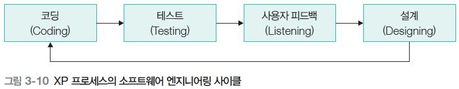
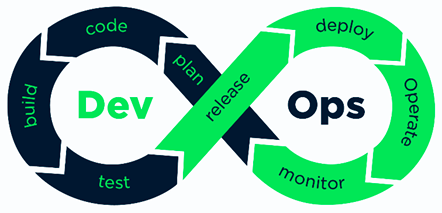
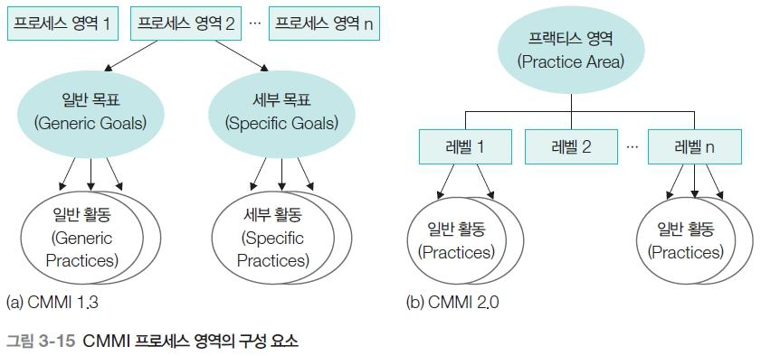

# XP · DevOps · 프로세스 성숙도 개요 정리

- **XP**: 반복 개발을 위한 **10가지 실천(중복 계획, 작은 배포, 단순 설계, 테스트 우선, 리팩토링, 페어프로그래밍, 공동 소유, CI, 지속 가능한 속도, 현장 고객)**.
- **DevOps**: 개발과 운영을 하나의 연속된 사이클로 보고, **자동화·반복·자기 서비스·협업·지속적 테스트·CI/CD**로 빠르고 안정적인 배포를 추구.
- **CMM/CMMI, SPICE/A-SPICE, 식스 시그마**는 조직/프로젝트 차원에서 **프로세스가 얼마나 성숙했는지 측정하고, 체계적으로 개선하기 위한 프레임워크**들이다.

## 1. XP 프로세스
### 1.1. XP의 실천 사항(Practices)

XP(eXtreme Programming)는 **반복/점진 개발**을 전제로 하는 개발 방법론이고, 이를 위해 10가지 실천 사항을 제시한다.
- **중복 계획(Incremental Planning)**: 한 번에 대규모 장기 계획을 세우지 않고, **스토리 단위로 짧은 주기의 계획을 계속 갱신**하면서 개발.
- **작은 배포(Small Release)**: 고객에게 **작은 기능 단위로 빠르게 배포**하여 실제 피드백을 기반으로 다음 계획을 조정.
- **단순 설계(Simple Design)**
    - “지금 필요한 기능”을 **가장 단순한 구조**로 구현하는 것을 우선.
    - 미래에 필요할지 모르는 기능을 미리 설계하지 않는다.
- **테스트 우선 개발(Test-First Development)**
    - 코드를 작성하기 전에 **테스트 케이스부터 작성**.
    - 구현이 테스트를 통과하는지로 기능 완성을 판단.
- **지속적인 리팩토링(Refactoring)**
    - 외부 동작은 유지하면서 **내부 구조를 계속 개선**.
    - 중복 제거, 함수/모듈 분리, 네이밍 개선 등.

### 1.2. 반복 개발 접근 실천 사항

- **짝 프로그래밍(Pair Programming)**
    - 두 사람이 한 컴퓨터에서 함께 개발.
    - 한 명은 코드 작성(Driver), 다른 한 명은 검토 및 방향 제시(Navigator).
- **공동 소유권(Collective Ownership)**
    - 시스템 전체 코드에 대해 **누구나 수정/개선 가능**.
    - “내 코드/네 코드”가 아니라 팀이 함께 책임지는 구조.
- **지속적 통합(Continuous Integration)**
    - 변경된 코드를 **자주(가능하면 매일) 통합**하고 빌드·테스트.
    - 통합 시 발생하는 충돌과 오류를 빠르게 발견.
- **지속 가능한 개발 속도(Sustainable Pace)**
    - 무리한 야근/철야 대신 **장기적으로 유지 가능한 속도**로 개발.
    - 번아웃을 막고 품질을 유지하는 것을 중시.
- **현장 상주 고객(On-site Customer)**: 고객(또는 고객 역할 담당자)이 팀에 상주(또는 항상 접근 가능)하여 요구사항·우선순위를 즉시 조정할 수 있는 환경.

## 2. XP 개발 사이클
### 2.1. 엔지니어링 사이클

- **Coding**: 테스트를 통과시키기 위한 최소한의 구현.
- **Testing**: 자동/수동 테스트로 기능 확인.
- **Listening(사용자 피드백)**: 고객/사용자로부터 요구·불만·개선점 수집.
- **Designing**: 피드백을 반영해 설계/구조 개선.

이 사이클이 짧은 단위로 계속 반복되면서 제품이 진화한다.

### 2.2. 배포 사이클

1. **사용자 스토리 작성**: 고객이 원하는 기능을 스토리 형태로 작성.
2. **스토리 분할 및 태스크 식별**: 개발 가능한 작은 작업 단위로 쪼갠다.
3. **배포 계획 수립**: 어떤 스토리를 언제 어떤 순서로 배포할지 계획.
4. **시스템 통합 및 피드백**: 구현된 스토리를 시스템에 통합 후 피드백 수집.
5. **스토리별 배포 + 배포/통합 테스트**: 실제 배포 후 문제 여부를 검증.

엔지니어링 사이클이 **개발 내부의 반복**, 배포 사이클이 **사용자에게 내보내는 반복**이라고 보면 된다.

## 3. Chaos Engineering과 DevOps
### 3.1. Chaos Engineering

- **정의**: 운영 중인 서비스에 **의도적으로 결함/장애를 주입**하고, 그 환경에서 시스템이 어떻게 반응하는지 관찰하면서 **예측 불가능한 상황에 대한 시스템의 회복력·패턴을 찾는 활동**.
- 목적: 장애 상황에서도 서비스가 버티거나 빠르게 복구될 수 있도록 **운영 대응 전략/아키텍처를 검증·개선**하는 것.

### 3.2. DevOps의 정의(여러 관점)

- **Wikipedia 관점**
    - 개발자와 운영자 간 **소통·협업·통합**을 강조하는 개발 방법.
    - 개발과 운영의 상호 의존성을 명확히 하여 **신속한 제품/서비스 개발**을 목표.
- **IBM 관점**: 개발 팀과 운영 팀 간 **조정을 위한 프로세스**.
- **O’Reilly 관점**: 운영 인프라가 PaaS처럼 **응용 프로그램의 일부**가 되었고, 운영은 사라지는 게 아니라 **개발 활동의 일부로 흡수**되어야 한다는 변화.
- **IEEE 표준 관점**: 소프트웨어 관련 이해관계자들이 시스템을 **명세·개발·운영**하고, **수명주기 전체**에 걸쳐 지속적인 개선을 하기 위한 **원리와 실천 사항들의 모음**.

DevOps는 **개발과 운영을 하나의 연속된 활동으로 묶고, 협업·자동화·지속적 개선을 통해 빠르고 안정적인 배포를 지향하는 방법론**이다.

## 4. DevOps의 핵심 원리
### 4.1. 자동화(Automation)

- 개발 환경에서의 동작이 **배포/운영 환경에서도 동일하게** 보장되도록, **빌드·테스트·배포·모니터링을 가능한 한 자동화**한다.
- 운영 환경의 오류를 **신속·일관성 있게 해결**하기 위해 전체 수명주기에 자동화된 도구와 프로세스를 적용.

### 4.2. 반복(Iteration)

- 개발과 운영을 **순환 구조**로 연결.
- “운영 중 모니터링된 요구사항”을 다시 개발에 반영하는 **반복 개발 형식**으로 진행 → 전통적 “유지보수” 개념을 확장한 것.

### 4.3. 자기 서비스(Self-Service)

- 협업·자동화 환경 덕분에, 개발자와 운영자가 서로 방해하지 않고 **독립적으로 일할 수 있는 구조**.
- 예: 개발자가 **스스로 운영 환경과 유사한 테스트 환경을 구성**하여 운영자에게 별도 요청 없이 개발·테스트를 수행.

### 4.4. 지속적 개선(Continuous Improvement)

- 사용자의 피드백과 모니터링 데이터를 활용해 소프트웨어 기능/성능/서비스 수준을 **계속 개선**.
- 기능 추가·삭제뿐 아니라 **성능 튜닝, 서비스 품질** 개선의 근거가 된다.

### 4.5. 협업(Collaboration)

- DevOps의 성공 조건: **개발 팀과 운영 팀 간 지속적인 협업 역량**.
- 신뢰성 있는 빠른 배포를 위해 요구사항, 이슈, 장애 상황을 **함께 공유하고 해결**하는 문화가 필수.

### 4.6. 지속적 테스트(Continuous Testing)

- 개발자는 단위 테스트, 서버에서의 통합 테스트 수행.
- QA는 운영 환경과 동일한 환경에서 시스템 테스트.
- 운영팀은 인수 테스트, 안정성 테스트 등 수행.
- 이 모든 테스트가 **지속적 통합·배포 과정에서 반복**된다.

### 4.7. 지속적 통합·지속적 배포(CI/CD)

- 여러 팀이 개발한 컴포넌트를 **주기적으로, 가능하면 매일 통합**(CI).
- 통합 후 품질 보증·테스트를 거쳐 **생산 환경으로 이동 후 배포**(CD).
- 통합과 마찬가지로 **배포도 문제가 없는 한 지속적으로 수행**.

### 4.8. DevOps 프로세스

- 요구사항을 작은 개발 태스크로 분할 → **Plan**
- 단위 컴포넌트 개발 → **Code**
- 컴포넌트 통합·빌드 → **Build**
- 테스트 수행 → **Test**
- 운영 환경으로 릴리즈 → **Release → (Ops/운영)**

## 5. CMM과 CMMI
### 5.1. CMM(Capability Maturity Model)

- 1986년 미국 국방부가 방산업체 소프트웨어 개발 데이터를 수집·체계화하면서 만든 **시스템 개발 프로세스 성숙도 모델**.
- **성숙도(Maturity)**: 임의로 수행되던 개발 활동을 **공식적인 단계·측정·평가·최적화 관점에서 얼마나 잘 하고 있는지**를 나타내는 척도.
- 목적: 기존 소프트웨어 개발 프로세스를 **계획적·측정 가능한 수준으로 개선**.

### 5.2. CMMI(Capability Maturity Model Integration)

- 여러 CMM 모델의 형식·용어·측정 방법 차이 때문에 **통합 적용의 어려움**이 있었음 → 이를 해결하기 위해 탄생.
- 프로세스 영역별로 **무엇을 하는가(활동 영역)** 와 **얼마나 잘하는가(능력도)** 를 함께 표현하는 통합 모델.

> 성숙도 수준(Initial, Managed, Defined, Quantitatively Managed, Optimizing)에 따라 어떤 프로세스 영역이 필요한지가 표로 제시되어 있다.

## 6. SPICE & A-SPICE
### 6.1. SPICE(ISO/IEC 15504)

- **Software Process Improvement and Capability dEtermination**의 약자.
- 소프트웨어 개발 프로세스 개선을 목표로 하는 **ISO 15504 표준의 별칭**.
- **6개 성숙도 수준**
    - 레벨 5: 최적화 프로세스
    - 레벨 4: 예측 가능한 프로세스
    - 레벨 3: 구축된 프로세스
    - 레벨 2: 관리되는 프로세스
    - 레벨 1: 적용하는 프로세스
    - 레벨 0: 불완전한 프로세스
- 정의하는 프로세스 속성(예: 프로세스 성능, 성과 관리, 산출물 관리, 정의, 배포, 측정, 제어, 혁신, 최적화 등)을 기반으로 **각 레벨을 평가**.

### 6.2. A-SPICE(Automotive SPICE)

- **자동차 분야**에 특화된 SPICE 적용 모델.
- **Acquisition, System Engineering, Software Engineering, Management** 등 여러 프로세스 그룹으로 나누어, 각 그룹에 필요한 프로세스를 정의.
- 역량 수준:
    - 레벨 5 Innovating ~ 레벨 0 Incomplete까지 조직·프로젝트의 프로세스가 **얼마나 체계적으로 정의·측정·개선되고 있는지**를 기준으로 판단.

## 7. 식스 시그마(Six Sigma)

- **프로세스 개선을 위한 공학적 기술과 도구**를 제공하는 방법론.
- 1986년 모토로라의 빌 스미스(Bill Smith)가 제시.
- 목표: **결함 원인을 식별·제거**하고, 기존 제조/비즈니스 프로세스의 구조를 크게 바꾸지 않으면서 **품질을 획기적으로 향상**시키는 것.
- 도입 시 기대 효과:
    - 공정 주기 단축
    - 결함 및 문제 감소
    - 비용 절감
    - 고객 만족도 향상
    - 이익 증가