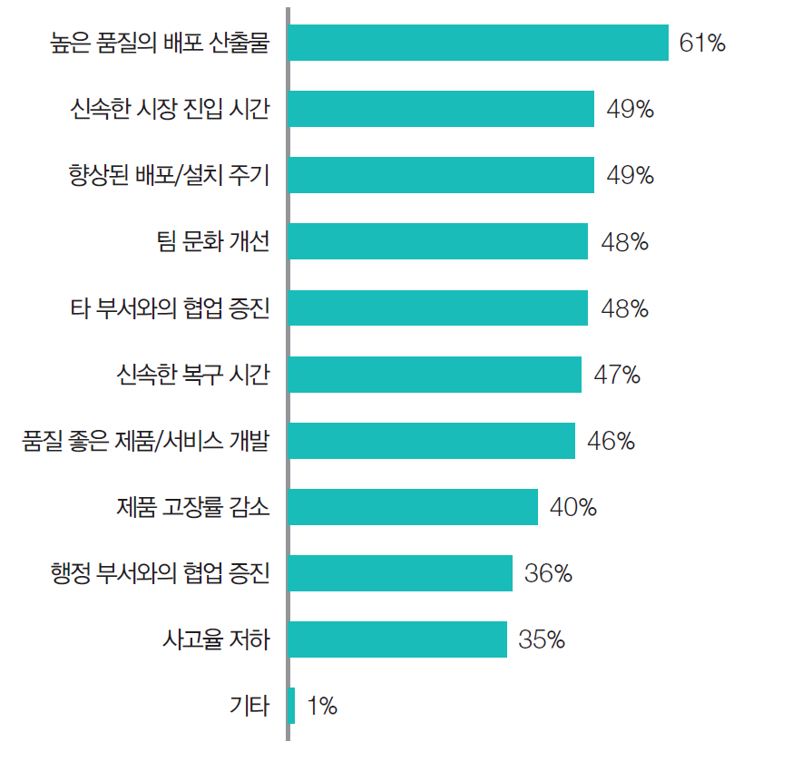
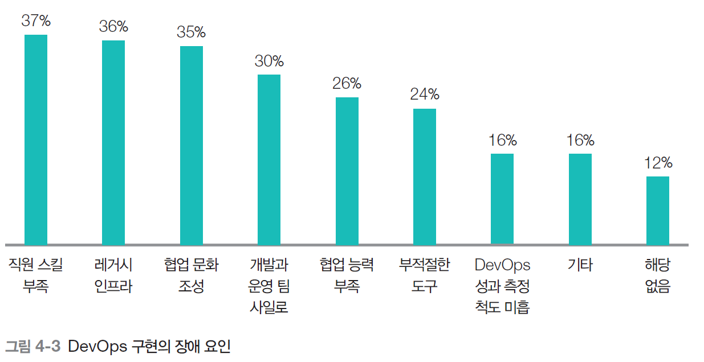
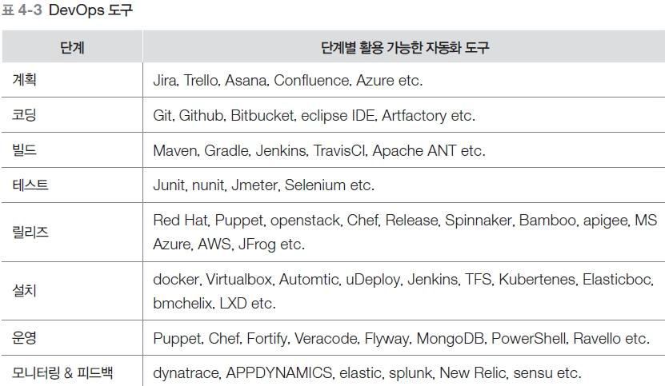
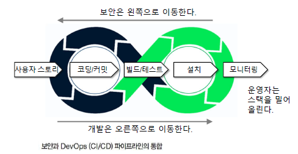
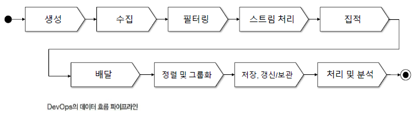

# DevOps
## 1. DevOps 개요

- **기존 사일로 방식 문제**
	- 
    - 개발·테스트·운영이 단계별로 끊어져 있고, 각 단계 간 상호작용이 거의 없음.
    - 결과: 전달 지연, 정보 손실, 책임 떠넘기기, 배포 속도 저하.
- **DevOps 정의**
    - 개발, 운영, 품질보증, 서비스 제공자가 **상호 협력**해 소프트웨어를 개발·배포하고 시장 기회 포착과 고객 피드백을 **신속히 반영**
    - 린(Lean)·애자일(Agile) 원칙에 기반한 **소프트웨어 개발·운영 접근 방식**.
- **Lean 사고 & 7원칙(슬로건 포함)**
    - “크게 생각하고, 작게 행동하고, 빨리 실패하고, 빠르게 배워라”
    - 낭비 제거, 전체 최적화, 통합 체계 구축, 팀에 권한 위임, 학습 확대, 최대한 늦게 결정, 최대한 빨리 배포.

## 2. DevOps 도입 동향과 효과

- **도입 동향**
    - 365일 24시간 서비스가 필요한 글로벌 IT 기업(아마존, 구글, 넷플릭스 등)이 적극 도입.
    - _페이지 4 표_: 기존 기업 대비, 이들은 **하루 수천~수만 회 배포** 수준의 고빈도 배포를 수행.
- **조직에서의 긍정적 효과**
	- 
    - 산출물 품질 향상
    - 배포 시간 단축
    - 팀 간 협업 유연성 증가
    - 결함 감소
    - 장애 발생 시 **복구 시간 단축**
- **구현 장애 요인**
	- 
    - DevOps 경험·기술 부족
    - 기존 인프라 유지 부담
    - 조직 문화·협업 조율의 어려움
    - 적절한 도구·자동화 부족 등

## 3. DevOps 성공 전략

- **DevOps 필요성·목표 명확화**: 왜 도입하는지, 조직에 어떤 변화(문화, 프로세스)를 감수할지부터 정리
- **사일로 타파 & 고객 중심**
    - 개발·운영·기타 기능이 **하나의 팀처럼 긴밀하게 작업**.
    - 변화하는 고객 요구에 맞춰 서비스·솔루션을 빠르게 제공.
- **작게 시작, 점진적 확장**: 작은 부분/파일럿 프로젝트에서 실험 → 성공 경험을 바탕으로 확대.
- **가능한 모든 곳 자동화**: 코드 통합, 형상 구성, 배포, 회귀·부하 테스트 등 **수명주기 전반 자동화**.
- **호환 가능한 도구 선정**: 서로 연동 가능한 도구를 선택해 파이프라인 구축, 개발·운영 간 충돌 감소.
- **팀 단위 성과 평가·실시간 가시성**
    - 개인이 아니라 **팀의 배포·품질 목표 달성 능력** 기준 평가.
    - 현재 단계, 리소스 사용 현황 등을 실시간으로 볼 수 있도록 대시보드 제공.
- **CI/CD · 모니터링·피드백**
    - 지속적 통합·배포를 DevOps 성공의 핵심으로 제시.
    - 모니터링·피드백을 통해 병목·문제점을 발견하고 바로 프로세스 개선.

## 4. DevOps 프로세스(수명주기)

### 4.1. 계획(Plan)

- 비즈니스 가치·사용자 요구 정의
- 소유자, 개발자, 설계자, 배포·보안·인프라 담당자 모두 참여
- 요구사항 명세, 비즈니스 지표·배포 지표 설정, 보안 정책 정의

### 4.2. 코딩(Code)

- 알고리즘·제품 형상 설계
- 코드 품질·생산성을 고려한 구현
- 단위 테스트 수행

### 4.3. 빌드(Build)

- 코드 통합 및 통합 테스트
- 제품 형상 구성, 배포 준비
- 버전 관리 수행

### 4.4. 테스트(Test)

- 요구사항 만족 여부 확인
- 변경사항 발생 시 회귀 테스트
- 보안·취약성 분석, 성능·형상 테스트

### 4.5. 릴리즈(Release) & 설치(Install)

- 릴리즈: 배포 승인, 패키징, 실제 배포 수행
- 설치:
    - 사용자 환경에 설치, 스토리지·DB·네트워크 구성
    - 설치 문제 복구, 서비스 오픈

### 4.6. 운영·모니터링(Operate & Monitor)

- 인프라 성능·사용자 경험, 서비스 지표를 지속 모니터링
- 목표 지표 달성 여부 확인 후 결과를 개발팀에 피드백

## 5. DevOps 표준과 Toolchain

- **IEEE Std 2675**
    - “DevOps: 신뢰성과 보안을 갖춘 시스템을 구축하기 위한 표준”
    - _페이지 16 표_: 계약/조직/기술관리/기술 프로세스 등 여러 그룹으로 DevOps 활동을 체계화.
- **Toolchain 예시
		
    - 계획: Jira, Trello, Asana, Confluence 등
    - 코딩: Git, GitHub, Bitbucket, Eclipse 등
    - 빌드: Maven, Gradle, Jenkins, TravisCI 등
    - 테스트: JUnit, NUnit, Selenium 등
    - 릴리즈·설치: Docker, Kubernetes, Ansible, Puppet, Chef 등
    - 운영·모니터링: Prometheus, NewRelic, Splunk, ELK, Dynatrace 등
	
## 6. DevOps와 클라우드

- **목적**
    - 개발 환경과 실제 서비스 환경 간 미묘한 차이에서 오는 설치 오류를 줄이기 위한 전략.
- **풀 스택 배포(Full-Stack Deployment)**
    - 인터페이스·데이터·통신 계층 모두를 다루는 풀 스택 개발자 개념.
    - 클라우드에서 **서비스 코드 + 실행 환경 구성**을 함께 배포.
- **IaaS / PaaS / SaaS 책임 분리**
	- 
    - IaaS: 인프라만 제공, OS 위는 사용자가 관리.
    - PaaS: 런타임·미들웨어까지 플랫폼 제공, 애플리케이션·데이터는 사용자가 관리.
    - SaaS: 애플리케이션까지 제공, 사용자는 거의 설정·사용에만 집중.

## 7. DevOps 성과 측정 지표

- 설치(배포) 주기, 배포 규모, 배포 시간
- 개발→배포까지 소요 시간(Lead time)
- 고객 티켓(문의·장애 건수)
- 자동 테스트 성공률, 결함 제거율
- 시스템 가용성, SLA 만족도
- 서비스 활용도·트래픽, 성능
- 평균 결함 발견 간 시간(MTBF)
- 평균 복구 시간(MTTR)

## 8. 확장 개념: DevSecOps · DevDataOps · BizDevOps
### 8.1. DevSecOps

- **Shift Left**: 보안을 개발 후반(운영 단계)에서 앞단(요구·설계·코딩 단계)으로 이동.
- 보안 교육: OWASP Top10, 보안 테스트·엔지니어링 관행 숙지.
- **추적 가능성**: 요구사항↔코드↔테스트를 전 주기에서 추적.
- **감사 가능성**: 보안 통제가 잘 지켜졌는지 검증 가능해야 함.
- **가시성**: 역할·책임·상태가 한눈에 보이는 모니터링 체계 필요.

### 8.2. DevDataOps

- DevOps의 개념을 **데이터 파이프라인**에 적용.
- 데이터 생성→수집→필터링→스트림 처리→집적→정렬/그룹화→저장/보관→처리·분석까지 전 과정의 품질과 **정보 제공의 적시성** 향상 목표.

### 8.3. BizDevOps

- 비즈니스·개발·운영을 하나의 피드백 루프로 묶는 접근.
- 프로세스:
	- 
    - 비즈니스 문제 정의 → 코드 개발 → 패키징 → 테스트 환경 배포 → 테스트 → 운영 환경 배포 → 모니터링·통제 → 보고·공유(비즈니스 목표·핵심 성과 지표).
- 목표: 팀 간 협업으로 **더 빠른 개발 & 사용자 요구 대응**, 그리고 **수익 극대화**.