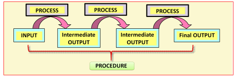
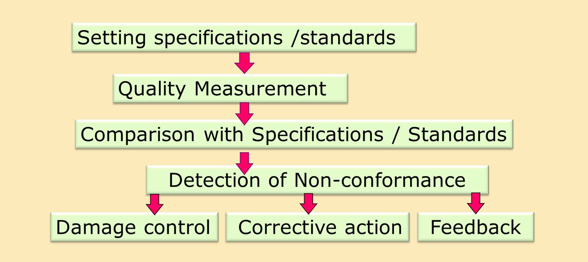
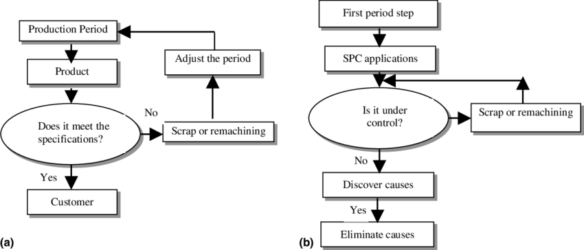
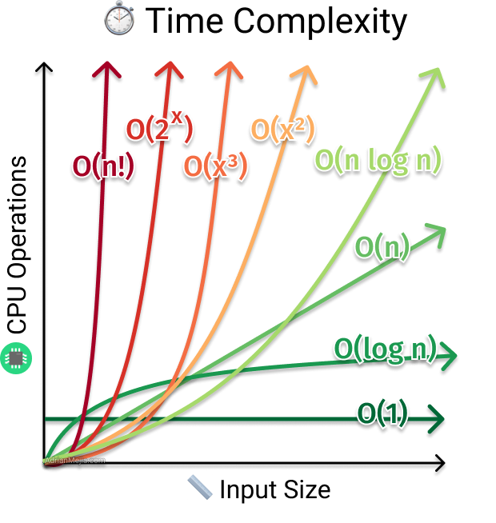

# 목차

---

# 소프트웨어 품질
## 1. 정의

- **Philip Crosby(1926~2001)**: “품질=요구사항(명세) 적합성”
	- 명확한 정의·측정·관리 강조.
- **W Edwards Deming(1900~1993)**: “품질=고객 만족”
	- 리더십·두려움 제거·부서 장벽 해소 등 **14원칙**으로 지속개선.
- **Armand V. Feigenbaum(1920~2014)**: “품질은 고객이 결정”
	- **전사적 품질관리(TQC)**, 목표는 **변동**.
- **Kaoru Ishikawa(1915~1989)**: “표준 충족만으론 부족”
	- 품질 범위 **광범위**, **가격=품질 속성** 포함.
- **Joseph Moses Juran(1904~2008)**: “**사용 적합성**”
	- **품질 기획–관리–개선**의 구조화된 경영.
- **Walter Shewhart(1891~1967)**: **객관/주관** 두 측면을 모두 다뤄야 함

- **명세 적합성(Verification)**: 규격·요구사항 충족 여부.
- **고객 요구 충족(Validation)**: 사용 맥락에서의 만족·가치.

## 2. 관리 사이클 & 측정

- **Shewhart/PDCA**: 계획→실행→점검→개선, 카이젠의 핵심 도구.
- **측정의 역할**: “측정→이해→통제→개선”의 출발점, 측정=사물/사건에 숫자 부여.

## 3. 품질 관리(Quality Control)

> 프로세스 내부 모습

프로세스 기반 통제(입력→프로세스→출력)

(a) 전통적 QC ↔ (b) **통계적 QC** 대비.

## 4. 알고리즘 관점의 품질

- **Correctness(정확성)**
- **Efficiency(효율성)**
	- 
	- 시간 (O(f(n)))
	- 공간 (memory)
- **Maintainability(유지보수성)**
	- Extendability(확장성)
- **Understandability(가독성)**
	- Structure(구조)

## 5. 소프트웨어 품질 모델

|모델|초점|구조/키워드|기억 포인트|
|---|---|---|---|
|**McCall (1977)**|제품 **운용/수정/전이**|11 요인–23 기준–메트릭|Correctness·Reliability·Usability…|
|**Boehm (1978)**|**As-is Utility / Maintainability / Portability**|계층 트리|유지보수성 비중 큼|
|**FURPS(+)**|기능/사용성/신뢰성/성능/**지원성**|URPS=비기능|요구사항 분류 틀|
|**Dromey**|**제품 속성↔품질 속성 연결**|5단계 링크 메커니즘|시스템별 **동적** 평가|
|**ISO 9001(QMS)**|**프로세스 지향** 품질경영|설계–운영–개선 전 주기|조직 수준 보증 체계|
|**ISO 9126**|제품 품질 **6특성**|기능성·신뢰성·사용성·효율성·유지보수성·이식성|내부/외부/사용중 품질|
|**SPICE(15504)**|**프로세스 역량 평가**|획득·개발·운영·지원|ISO 12207·CMM과 유사|
|**IEEE 표준군**|SQA·SCM·요구·테스트·설계 문서|730/828/829/830…|실무 문서화 기준|
|**CMM/CMMI**|**성숙도 레벨 0~5**|정의·관리·최적화|프로세스 성숙=품질 기반|
|**Six Sigma**|**VOC 기반 정량화**|DMAIC, 3.4 DPMO|품질↔재무성과 연결|

## 6. 조직 역량

- **CMMI**, **Six Sigma** 등 조직 차원의 성숙·개선 프레임워크.

## 7. 결론

- **모델은 간단·실행용**, **철학은 방향·판단용**.
- 두 축(명세 적합성 ↔ 고객 만족)을 **동시에 관리**해야 지속 가능한 품질이 나온다.