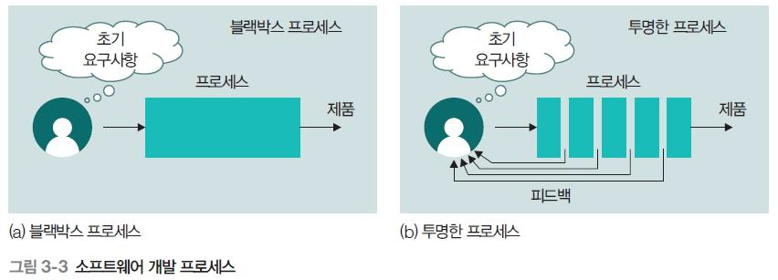
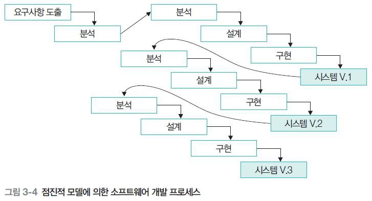
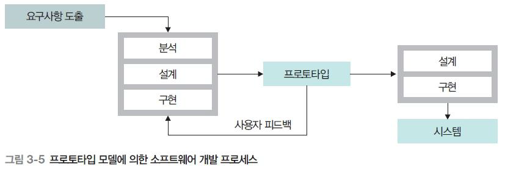
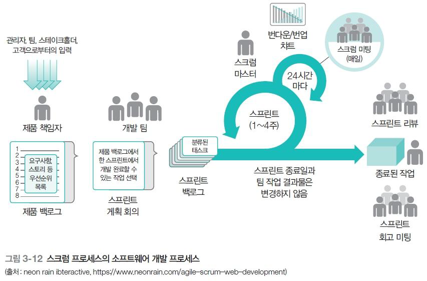

# **애자일(Agile) 개요
## 1. 전통적인 소프트웨어 개발 과정
### ■ 폭포수 모델(Waterfall Model)

- 소프트웨어 개발을 **순차적 단계**로 진행
- 단계: _실현 가능성 분석 → 요구사항 도출·분석 → 설계 → 코딩 및 단위 시험 → 통합 및 시스템 시험 → 배포 및 운영_
- 각 단계마다 문서를 작성하며, 다음 단계의 입력으로 사용됨

### ■ 폭포수 모델의 단점

- 변경 수용이 어려움
- 이전 단계의 오류가 다음 단계에 계속 전파됨
- 디테일한 문서 중심으로 진행되기 때문에 실제 개발까지 진행 속도 느림

## 2. 실현 가능성 분석(Feasibility Study)
### ■ 목적

- 요구사항 기반 프로젝트가 **비용·기술·일정** 면에서 수행 가능한지 판단
- 비용(Cost), 이득(Benefits), 대안(Alternatives) 평가

### ■ 고려할 측면

1. **경제적 측면**
    - 비용 대비 효과 분석
2. **기술적 측면**
    - 기술적 제약 여부, 현 기술로 구현 가능한지
3. **스케줄 측면**
    - 인력·자원으로 기간 내 완성 가능한지
4. **운영적 측면**
    - 배포 후 사용자·관리자가 운영 가능한지
5. **동기적 측면**
    - 사용자가 필요성을 인정하고 실제 사용할 의지가 있는가
6. **법적·윤리적 측면**
    - 개인정보 유출 등 법적 논란의 가능성 여부
	
## 3. 소프트웨어 프로세스의 필요성

- 프로세스: 소프트웨어 개발을 체계적으로 계획·관리하기 위한 절차
- 프로세스 필요성:
    - 요구사항 충족 → 재개발 감소 → 비용 절감 → 품질 관리 → 프로젝트 성공률 향상
	
## 4. 전통적인 프로세스 모델
### ■ 폭포수 모델

- 순차적 개발
- 변경·오류 전파 문제가 큼

### ■ 점진적 모델(Incremental Model)

#### ● 전략

1. 개발 및 배포: 사용자에게 빠르게 사용 가능한 부분을 제공
2. 측정 및 모니터링: 유용성 평가
3. 조정 및 수정: 피드백을 설계·구현에 반영

#### ● 이점

- 요구사항·변경 반영 용이
- 빠른 배포 가능

#### ● 문제점

- 반복적 테스트 및 통합으로 오버헤드 증가
- 구조가 무너질 위험
- 부분 기능만 제공하면 사용자 실망 가능

### ■ 프로토타입 모델(Prototype Model)

#### ● 개념

- 핵심 기능 또는 UI의 원형(Prototype)을 먼저 개발하여  
    → 사용자 검증 후  
    → 전체 시스템을 폭포수 모델로 개발

#### ● 이점

- 사용자 요구 검증
- 개발자-사용자 의사소통 강화
- 초기 오류 조기 발견

#### ● 문제점

- 프로토타입 이후 실제 개발 변경사항 반영 어려움

## 5. 애자일(Agile) 개발 프로세스
### ■ 애자일이란?

- “기민한(Agile)” 개발 방식
- **빠르고 낭비 없이**, 유연하게 변화에 대응
- 다양한 애자일 방법론 존재
    - DSDM, ASD, Crystal, XP, Scrum, Lean, FDD, Agile UP 등
	
## 6. 애자일의 적용 원리

1. 고객 만족을 위한 지속적이고 빠른 소프트웨어 제공
2. 개발 후반이라도 **요구 변경 수용**
3. 실행 가능한 소프트웨어를 **1~2주마다 배포**
4. 사용자·개발자 간 **매일 미팅**
5. 동기부여된 개인 중심 개발
6. 대면 대화를 통한 가장 효율적 의사소통
7. 동작하는 소프트웨어를 **진척도 기준**으로 사용
8. 지속 가능한 개발 속도 유지
9. 기술적 우수성과 좋은 설계 지속 추구
10. 단순성 추구
11. 자기 조직화된 팀이 최고의 아키텍처·설계 산출
12. 정기적인 회고 및 개선

## 7. 스크럼(Scrum) 프로세스

### ■ 스크럼 개념

- 애자일의 대표적 관리 프레임워크
- 반복주기(스프린트) 단위로 계획 → 개발 → 리뷰 → 회고 수행

### ■ 핵심 용어

- **스프린트(Sprint)**: 1~4주의 반복 개발 주기
- **제품 백로그(Product Backlog)**: 요구사항 목록
- **스프린트 백로그(Sprint Backlog)**: 스프린트 작업 목록
- **제품 증분(Increment)**: 스프린트 결과물(동작하는 기능)
- **번다운 차트(Burndown Chart)**: 남은 작업량 표시
- **번업 차트(Burnup Chart)**: 진행된 작업량 표시
- **제품 책임자(Product Owner)**: 요구 우선순위 결정
- **스크럼 마스터(Scrum Master)**: 프로세스 관리·장애 제거
- **개발 팀**: 실제 구현 담당

### ■ 스크럼 프레임워크 구성

- **제품 백로그 → 스프린트 계획 → 스프린트(개발) → 스프린트 리뷰 → 스프린트 회고**
- 매일 **스크럼 미팅**(15분)
- 스프린트가 끝날 때마다 **변경 불가한 증분**을 제공
- 특정 기능의 우선순위를 고려해 반복적으로 개발

## 8. PDF 핵심 요약

- 전통적 폭포수 모델은 **문서 중심·순차적·변경 어려움**
- 점진적 모델과 프로토타입 모델은 이를 보완하지만 구조 리스크 존재
- 애자일은 **빠른 배포·지속 피드백·유연성**을 강조
- 스크럼은 애자일을 실제 운영할 수 있는 **반복 개발 프레임워크**
- 스프린트·백로그·리뷰·회고 등 절차를 통해 **짧은 주기 반복 개발**을 수행한다

# 📘 애자일(Agile) 실습 정리
# # 1. 애자일 개념 요약
## ## 1.1 전통 방식 vs 애자일
### ● 워터폴(Waterfall)

- 초기에 **모든 계획을 세세하게 확정**하고 진행
- 역할 분리 명확, 긴 개발 주기
- 예측 가능한 환경을 가정하지만, 실제로는 잘 맞지 않음

### ● 애자일(Agile)

- **모르는 것이 많다**는 전제를 기반으로 반복과 적응 중심
- 짧은 개발 주기, 팀 기반 실행
- 고객 피드백을 빠르게 반영

애자일은 **고객 협력·짧은 주기·팀 중심 의사결정**을 강조한다.

# # 2. 주요 애자일 방법론
## 2.1 워터폴 = “패키지 투어”

- 처음부터 끝까지 완벽히 계획하려 하지만 현실적으로 어려움
- 장기간 계획은 리스크 증가

## 2.2 칸반(Kanban) = “식당 번호표/패스트푸드 주문화면”

- 현재 처리 가능한 범위 내에서 작업 진행
- 작업 현황의 시각화가 핵심 (To Do / Doing / Done)

## 2.3 스크럼(Scrum) = “대학교 팀플/스포츠 팀”

- 일정 주기(Sprint)를 반복하며 계획→실행→리뷰→회고
- 역할 필요:
    - Product Owner
    - Scrum Master(SM)
    - Development Team

> SM = 팀 경험 기반으로 **조율/장애 제거/상황 판단/일정 푸시** 담당.

# # 3. 애자일 선언문 (가치 & 원칙)
## 3.1 4가지 가치

- **개인과 상호작용** > 프로세스와 도구
- **작동하는 소프트웨어** > 문서
- **고객 협력** > 계약 협상
- **변화 대응** > 계획 고수

## 3.2 12가지 원칙 요점

- 고객에게 가치 전달을 최우선
- 요구사항 변경을 환영
- 짧은 주기로 동작하는 SW 제공
- 비즈니스와 개발자가 매일 협업
- 지속 가능한 개발 속도
- 단순함, 자율적 팀, 지속적 개선

# # 4. 애자일 실습 개요
## 4.1 실습 목표

- 팀 구성 → 짧은 스프린트(20~30분) 설정
- 기능 정의
- 칸반 보드 작성
- 짧은 스크럼 회의 경험
- 데모 및 리뷰 → 회고까지 연습

> “**짧은 시간이라도 스프린트의 압박을 느껴보는 게 중요하다.**  
> 진짜 현업은 2주 단위로 이것을 계속 반복한다.”

# # 5. 실습 절차 상세 정리
## 5.1 팀 빌딩

- 4~5명씩 팀 구성
- 자기소개 + 과거 역할 경험 공유
- 팀명 정하기
- 프로젝트 주제 간단히 확정

예: “캠퍼스 이벤트 통합 플랫폼” (학생들이 실제 선택)

## 5.2 제품 백로그 작성 (기능 정의)

학생 팀에서 실제로 도출한 요구사항:

1. **크롤링 기능**
2. 이벤트 **등록 및 관리**
3. **카테고리 생성 및 알림 기능**
4. **에브리타임 연동 기능**

교수님 피드백:

- 기능은 **우선순위 기반으로 하나만 선택해 스프린트에서 시연 가능한 수준**으로 좁히는 것이 중요

## 5.3 스프린트 계획 (Sprint Planning)

- 실습 스프린트는 **약 20~30분**
- 각 기능을 사람이 맡을 수 있도록 역할 배분
- 노션 칸반 보드 구성
    - To Do
    - In Progress
    - Done

녹음에서 실제 학생 팀 예시:

- “크롤링”을 1순위 기능으로 선정
- UI 초안은 피그마로 시연
- 일부 팀은 실행 가능한 간단한 코드까지 준비

## 5.4 데일리 스크럼 (Daily Scrum)

- 실습에서는 약 5분만 경험
- 질문 3가지 형식:
    1. 어제 한 일
    2. 오늘 할 일
    3. 장애물(Blocker)은?

> “현업에서는 이 15분 회의가 매일 반복된다.  
> 단순 보고가 아니라 **팀의 현재 속도와 장애물을 투명하게 공유하는 시간**.”

## 5.5 스프린트 리뷰 (Sprint Review)

- 팀 + 고객 역할(교수님)이 함께 진행
- 실제 산출물을 보여주며 피드백 즉시 반영

- “초기 UI만으로도 충분하다.”
- “요구사항과 다르면 리뷰에서 바로 수정 방향을 제시.”

## 5.6 스프린트 회고 (Sprint Retrospective)

- 팀 내부에서만 진행
- 다음 질문에 대해 문제점/개선점을 공유:
    - 잘한 점
    - 어려웠던 점
    - 다음 스프린트에서 개선할 점

> 교수님은 “리뷰가 끝나면 회고까지 가는 것이 이상적”이라고 강조.

# # 6. Scrum Master(SM) 역할에 대한 상세 설명
### ● SM이 하는 일

- 팀의 속도와 난이도 판단
- 고객 요구를 빠르게 팀에 전달
- 팀원 간 조율
- 장애물 제거
- 경험 기반으로 신입 개발자를 도와줌

> “SM은 경험 많은 사수 같은 역할을 한다.  
> 일정과 요구를 판단하고 양쪽을 중재한다.”

# # 7. 애자일 실습 중 실제 학생 산출물 예시

학생 팀들은 실제로 아래와 같은 산출물을 제작:

- 기능 우선순위 정의
- 노션 칸반 보드 구성
- UI 초안(피그마 or 텍스트 기반)
- 간단한 코드 또는 시연 가능 화면

> PDF 샘플과 교수님이 제공한 템플릿에 기반하여 학생들이 채워 넣는 방식.

# # 8. 교수님이 강조한 애자일의 본질

- **짧은 주기 + 우선순위 기반 + 반복적 개선**
- 기능 구현보다 **프로세스 경험**이 더 중요
- 문서보다 실행 가능한 작은 결과물이 더 가치 있음
- 팀워크 경험이 애자일의 핵심
- LLM(ChatGPT/Claude)을 활용하면  
    → “더 빠른 프로토타이핑이 가능하고, 이것도 애자일의 방향성에 맞는 접근”
	
# # 9. 실습 전체 요약

- **팀 구성하고 짧은 시간에 실제 스프린트를 경험하는 것 자체가 교육 목표**
- 기획–설계–실행–데모–회고의 흐름을 압축해서 체험
- 애자일 핵심 원칙을 “이론이 아닌 실습 기반”으로 습득
- 어려워도 “정해진 시간 안에 끝내야 한다”는 압박 속에서 아지일의 본질이 드러남

# # 10. 결론

이번 실습은 단순 이론이 아니라 **현업 스크럼의 축소판**을 그대로 압축해 수행한 형태로,  
학생들이 실제 개발자처럼
- 기능 정의
- 스프린트 계획
- 칸반 관리
- 데일리 스크럼
- 리뷰
- 회고  
    의 전체 주기를 경험하도록 설계되었다.