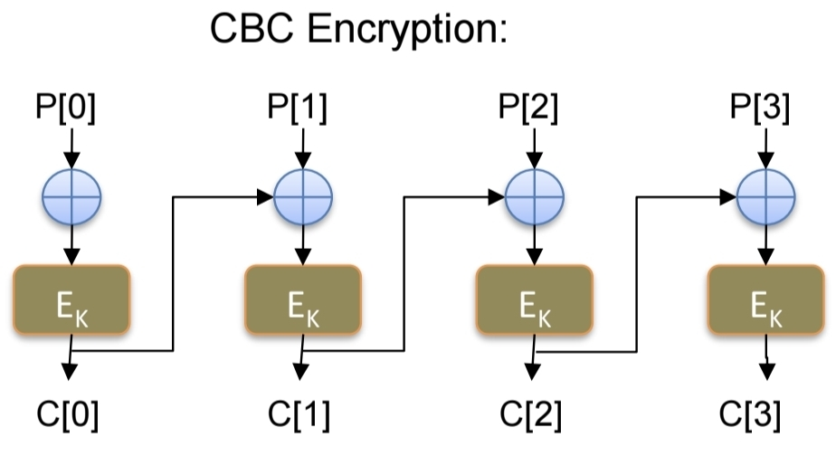
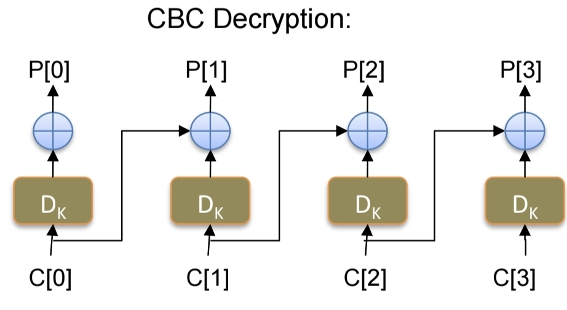

# 2. Symmetric-key
## 2.1. 대칭키 암호(Symmetric-key Algorithm)

- 다른 이름: conventional / private-key / single-key.
- 전통적인 암호화 방식


- 송신자와 수신자가 **같은 비밀키**를 공유한다.

- 안전한 사용을 위해선 **강한 알고리즘**과 **비밀키 보안**이 필수.
- 키 배포를 위한 **안전 채널**이 전제된다.
`
- 수식
	- $Y=E_K(X), \quad X=D_K(Y)$.
	- $E$: Encryption, $D$: Decryption, $K$: Key

## 2.2. 치환 암호 (Substitution Ciphers)
### 2.2.1. 정의

평문을 이루는 **단위(문자, 기호, 비트 패턴)** 를 **다른 단위로 바꾸는** 방식의 암호이다.
- 문자 기준: 한 글자  →  다른 **글자/숫자/기호**
- 비트 기준: 고정 길이 **비트 패턴**  →  **다른 비트 패턴**

### 2.2.2. 특징

- 치환은 “무엇으로 바꿀지”의 **매핑 표**가 핵심
- 고전 치환은 **빈도 분석**에 취약
- 현대 암호는 치환(S-box)과 전치(퍼뮤테이션)를 **여러 라운드**로 조합해 강한 보안을 달성합니다.

### 2.2.3. 주요 종류

- **단일 알파벳(모노알파벳)**: 전체 메시지에 하나의 고정 치환표 사용
	- 예: **카이사르 (시저) 암호**(알파벳 3칸 평행이동).
		- $c = E(p) = (p+k) \, mod \, 26$
		- $p = D(c) = (p- k) \, mod \, 26$
		- 카이사르(시프트 3): `HELLO → KHOOR`
	    - **약점**:
		    - 문자 빈도(**빈도 분석**)로 쉽게 깨짐
			- 가능한 키가 26개뿐이라 **브루트포스**로 쉽게 깨진다.
- **동형 치환(Homophonic)**: 자주 나오는 글자에 여러 기호를 할당해 빈도 흔적을 줄임
- **다중 알파벳(폴리알파벳)**: 위치에 따라 치환표가 바뀜
    - 예) 비제네르(Vigenère)
- **다문자(블록) 치환(Poly-graphic)**: 글자 **여러 개를 묶어서** 한 번에 치환
    - 예) 플레이페어(Playfair), 힐(Hill) 암호
- **비트 단위 치환(S-box)**: n비트 입력을 비선형으로 n비트 출력으로 매핑
    - 현대 블록암호(AES 등)에서 **혼돈(confusion)**을 제공

### 2.2.4. 전치 암호와의 차이

- **치환**: **기호 자체를 다른 값으로 바꿈**
- **전치(Transposition)**: 기호의 **순서만 섞음**, 기호 자체는 그대로

## 2.3. Crypto Analysis
### 2.3.1. 목표

- **비밀키/평문**을 알아내거나
- **암호 설계·구현의 약점**을 찾아 **실질적 보안성**을 무너뜨리는 것

### 2.3.2. 공격 가정(데이터 접근 수준)

- **Ciphertext-only**: 암문만 있음 → 빈도/통계 분석(고전암호)
- **Known-plaintext**: 일부 평문–암문 쌍을 앎
- **Chosen-plaintext (CPA)**: 임의 평문을 암호화 → 블록암호 분석에 강력
- **Chosen-ciphertext (CCA)**: 임의 암문을 복호화 → 패딩 오라클 등

> 현대 보안 목표: 보통 **IND-CPA**(스트림/블록 암호 모드)나 **IND-CCA**(암호화+MAC 또는 AEAD) 충족.

### 2.3.3. 대표 공격 기법

#### 2.3.3.1. 고전/기초

- **빈도 분석**: 모노알파벳 치환 붕괴
- **Kasiski/Index of Coincidence**: 비제네르 키 길이 추정
- **브루트포스/키 공간 탐색**: 키 길이 짧으면 파괴

#### 2.3.3.2. 현대 블록암호/스트림암호

- **선형 분석(Linear)**, **차분 분석(Differential)**: S-box·라운드 구조의 통계적 편향 이용
- **중간만남(Meet-in-the-middle)**: 다중 라운드/더블 암호
- **슬라이드/상관 공격, 불비성(algebraic) 공격**: 구조적 반복·대수 표현 노림
- **Nonce/IV 오용**(스트림/CTR): 같은 키·논스로 두 번 암호화 → XOR로 평문 관계 노출
- **패딩 오라클**: CBC+잘못된 에러 처리 → 바이트 단위 평문 복구
- **사이드 채널**: 시간/전력/EM/캐시 → 키 누출
- **결함 주입(Fault)**: 오류 유발 후 차이로 키 추정
- **랜덤성 취약**: 예측 가능 PRNG → 키/nonce 노출

#### 2.3.3.3. 해시/무결성

- **충돌 공격**(MD5/SHA-1): 서로 다른 메시지로 같은 해시
- **길이 확장 공격**: Merkle–Damgård 구조를 모르면 실수
- **Joux/MITM**: 다중-블록 구성 취약성

### 2.3.4. 설계·안전성 개념

- **Kerckhoffs 원칙**: 알고리즘은 공개, **비밀은 키만**
- **혼돈/확산(Shannon)**: S-box(혼돈) + 퍼뮤테이션/선형층(확산)
- **Avalanche 효과**: 입력 1비트 변화 → 출력 절반 이상 변화
- **Unicity distance**: 통계적으로 유일 키가 결정되는 최소 데이터량
- **감사·증명**: 축소판 공격 한계, 감쇠 계수, **감사된 표준(AES, SHA-2/3, ChaCha20-Poly1305)** 사용

## 2.4. 일회용 패드(One Time Pad, OTP)

- 어떤 평문이 있을 때, 평문과 길이가 같은 임의의 Key(Seed)를 XOR 연산으로 암호문을 생성하는 암호 체계이다.
- 메시지 길이만큼의 **진정한 난수 키**를 **한 번만 쓰면** **정보론적으로 안전**하다. → 기밀성
- 문제: 키 생성·분배가 현실적으로 어려움.
- XOR 예시로 암·복호가 성립(A⊕B⊕A=B).
```
m = 					 1110100 1110010
OTP = 					 0011010 1101101
E(m) = m ⊕ OTP = 		1101110 0011111
D(E(m)) = E(m) ⊕ OTP = 	1110100 1110010
```

> 참고
> [One Time Password, OTPassword](One%20Time%20Password.md)

## 2.5. Data Encryption Standard, DES
### 2.5.1. 무엇인가?

- 1977년 미국 표준으로 채택된 **대칭키 블록 암호**.
- **블록 크기 64비트**, **키 길이 56비트**(8비트 패리티 제외).
- 오늘날엔 **키가 짧아** 브루트포스로 깨질 수 있어 **사용 권장되지 않음**

### 구조


- **Feistel 네트워크 16라운드**
    1. 초기 치환(IP)
    2. 좌/우 32비트로 분할
    3. 라운드 함수 **F**: 확장(E, 32→48) → **서브키와 XOR** → **S-box 8개**(6비트→4비트 비선형 치환) → P-박스(확산)
	    1. 
    4. 좌우 스왑, 16라운드 반복
    5. 최종 치환(IP⁻¹)
- **키 스케줄**: 56비트를 PC-1로 분리(C,D) → 라운드마다 순환이동 → PC-2로 48비트 **서브키** 생성.

## 2.6. 운용 모드(Modes of Operation) 와 패딩

### 2.6.1. Electronic Code Book, ECB


블록마다 독립 암호화
- 장점: 단순·병렬화 용이, 블록 손실/손상에 견고함
- 단점: **패턴 누출**(이미지/문서 부적합).
	- 

### Cipher Block Chaining, CBC

- $C[i]=E_K(C[i−1]⊕P[i])$
	- 
- $P[i]=C[i−1]⊕D_K(C[i])$
	- 
- 평문을 암호화한 값을 그 다음 평문 암호화 키로 사용.
- **앞선 블록에 의존**.
- 초기값이 같아도 다르게 암호화 되게 하고 싶음 → 초기화 벡터(Initialization Vector, IV)가 필요.
	- 키와 동일한 크기의 난수 생성
	- 
	- 
- **PKCS#5 패딩**: “추가 바이트 수” 값을 그 개수만큼 채움(1~8바이트).
	- 예: 길이≡0(mod 8)면 `0x08`을 8바이트 채움.


## 2.7. Triple DES


- 두 키만으로도 구현
- C = E(k1) → D(k2) → E(k1)
- P = D(k1) → E(k2) → D(k1)
- DES 약점을 보완하지만 느림.


## 2.8. Advanced Encryption Standard, AES


- 128/192/256-bit Block Size
- 128/192/256-bit Key. 블록 크기와 독립적
- 10~14 rounds
- 2000년 선정, 2001년 FIPS-197 표준.
- 3DES보다 **더 강하고 빠름**.
- **PKCS#5 패딩**: “추가 바이트 수” 값을 그 개수만큼 채움(1~8바이트).
	- 예: `길이 mod 8 == 7` → PM = M + `0x01`
	- 예: `길이 mod 8 == 6` → PM = M + `0x0202`
	- 예: `길이 mod 8 == 5` → PM = M + `0x030303
	- 예: `길이 mod 8 == 0` → PM = M + `0x0808080808080808`

## 2.9. 스트림 암호와 RC4


- 스트림키를 생성해 **XOR**로 처리($C_i=M_i⊕StreamKey_i$). 좋은 설계는 긴 주기·통계적 무작위성·충분한 키 길이를 가진다.
- **RC4**: KSA(키로 `S[0~255]` 치환)→PRGA(매 바이트마다 i/j 갱신·스왑·S[i]+S[j] 인덱스로 스트림키 선택)로 동작. 과거 SSL/TLS·WEP 등에서 널리 사용.

## Block Cipher V.S. Streaming Cipher

### Block Cipher

- 블록 단위 암호화, 마지막 블록에서는 패딩 처리
- 종류: DES, AES

### Streaming Cipher

- 바이트 단위 암호화
- 종류: RC4

## 공격 모델과 실습 코드 힌트

- 공격 모델: **암호문 단독**, **기지 평문**, **선택 평문/암호문**. 목표는 보통 **키 복구**.
- 파이썬 예제: AES-ECB(실무 비권장)·AES-CBC(+IV)·PKCS7 패딩 데모 코드가 수록됨.

---

# 참고

- [NAVER: DES(Data Encryption Standard)](https://m.blog.naver.com/wnrjsxo/221708511553)
- [NAVER: AES(Advanced Encryption Standard)](https://blog.naver.com/PostView.naver?blogId=wnrjsxo&logNo=221711255389)
- [Wikipedia: OTPassword](https://ko.wikipedia.org/wiki/%EC%9D%BC%ED%9A%8C%EC%9A%A9_%EB%B9%84%EB%B0%80%EB%B2%88%ED%98%B8)