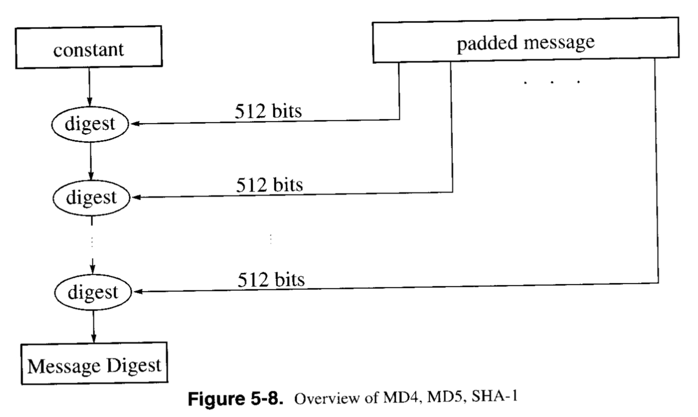
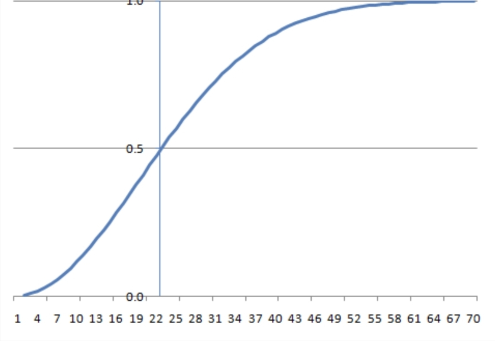

## 3.1. 해시 함수(Hash function)

- **자료구조의 해시**: “키를 **버킷/인덱스로 매핑**하기 위한 **결정적 함수**(빠르고, 균등 분포가 목표).”
- **암호학의 해시**: “임의 입력을 **고정 길이 다이제스트**로 만드는 **결정적 함수**로, 결과가 **난수처럼 보이지만(의사난수성)** 보안 성질(역상/충돌 저항)을 만족해야 함.”

- **핵심 보안 성질**
    - **역상 저항(일방향성)**(preimage): H(x)=h에서 x 찾기 어려움
    - **제2역상 저항**(second preimage): 주어진 x와 같은 해시를 갖는 x′ 찾기 어려움
    - **충돌 저항**(collision): x≠y이면서 H(x)=H(y) 찾기 어려움(생일한계 ~ 2^{n/2})
- **부가 성질**
    - **의사난수성/확산(Avalanche)**: 입력 1비트 변화 → 출력 절반 정도 뒤집힘
    - **고정 길이 출력**: 예) SHA-256 = 256비트

- 예시/출력 길이: **MD5(128비트)**, **SHA-1(160비트)**, RIPEMD-160, Whirlpool 등.
- 처리 개요: 메시지를 **512비트 배수**가 되도록 패딩 후, **512비트 단위**로 압축 함수에 투입.

## 3.2. 생일 공격(Birthday attack)

> 생일 문제: 23명만 모여도 50%가 된다

- 아이디어: 생일 역설처럼, **충돌은 직관보다 훨씬 자주 발생**한다는 점을 이용. 간단한 확률 예시로 설명됨.
- 결론: **64비트 출력 해시는 부적절**, 안전한 해시 출력 길이는 **128비트 초과 권장**.

## 3.3. 메시지 인증 코드(MAC)

- 목적: **무결성 보호**, **발신자 확인**, (슬라이드 기준) **부인방지**까지 목표로 제시. 구현은 블록암호 모드 또는 **키드 해시(해시+키)** 사용.
- 키드 해시의 진화: 초기 제안 **H(Key‖m)** 에는 약점이 지적되어, **HMAC**으로 발전(슬라이드는 대안으로 H(m‖Key) 표기).
- 활용: 파일/OS 이미지/소스 무결성 점검(Tripwire 등).

## 3.4. 일회용 비밀번호(OTP)

- 개념: 매 로그인마다 **새 비밀번호**를 쓰는 방식. **시간 동기형 토큰**, **수학적 알고리즘(해시 체인, 챌린지-응답)** 등이 있음.
- **시간 동기형**: 클라이언트·서버가 공유 키/시리얼을 바탕으로 **f(key, serial, time)** 값을 각각 계산해 일치 여부로 인증(시간은 느슨한 동기 필요).
- **해시 체인(S/Key)**: 서버는 **fⁿ(s)** 저장 → 로그인 때 클라이언트가 **fⁿ⁻¹(s)** 제시, 서버가 한 번 더 f를 적용해 검증 후 저장 값을 갱신.
- **챌린지-응답**: 서버 난수 **R** 제시 → 클라이언트가 **H(R‖s)** 제출 → 서버도 계산해 일치 시 통과.

