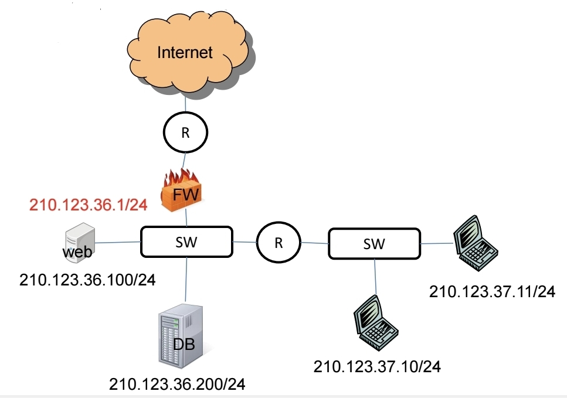
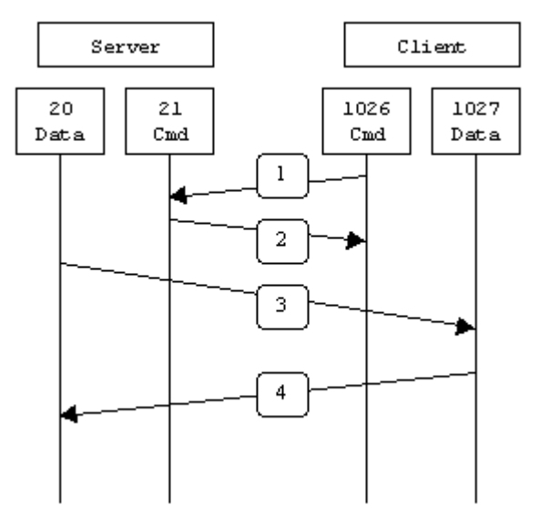
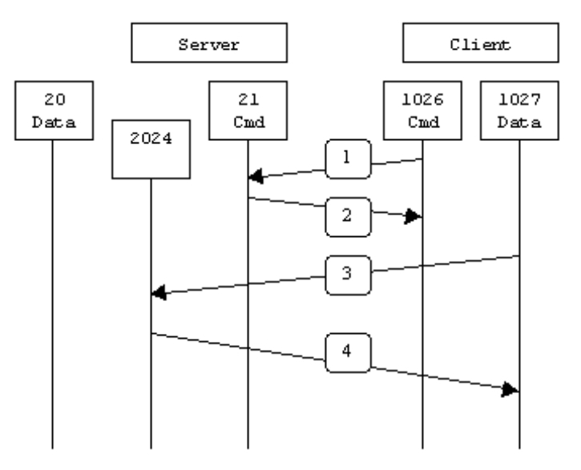
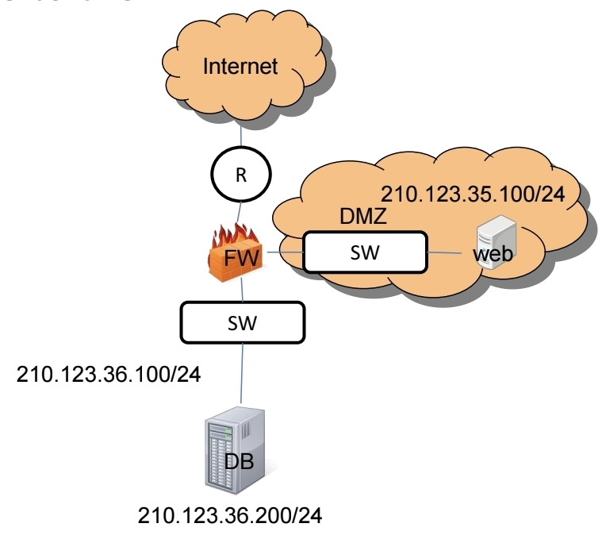
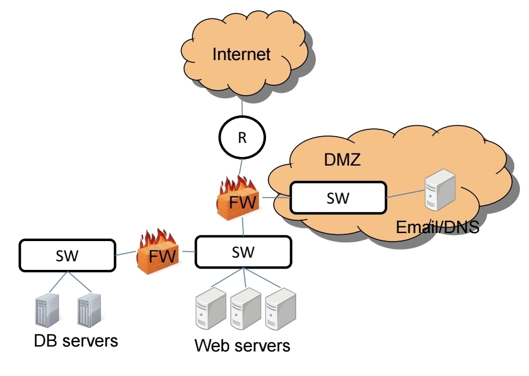
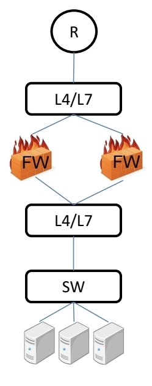
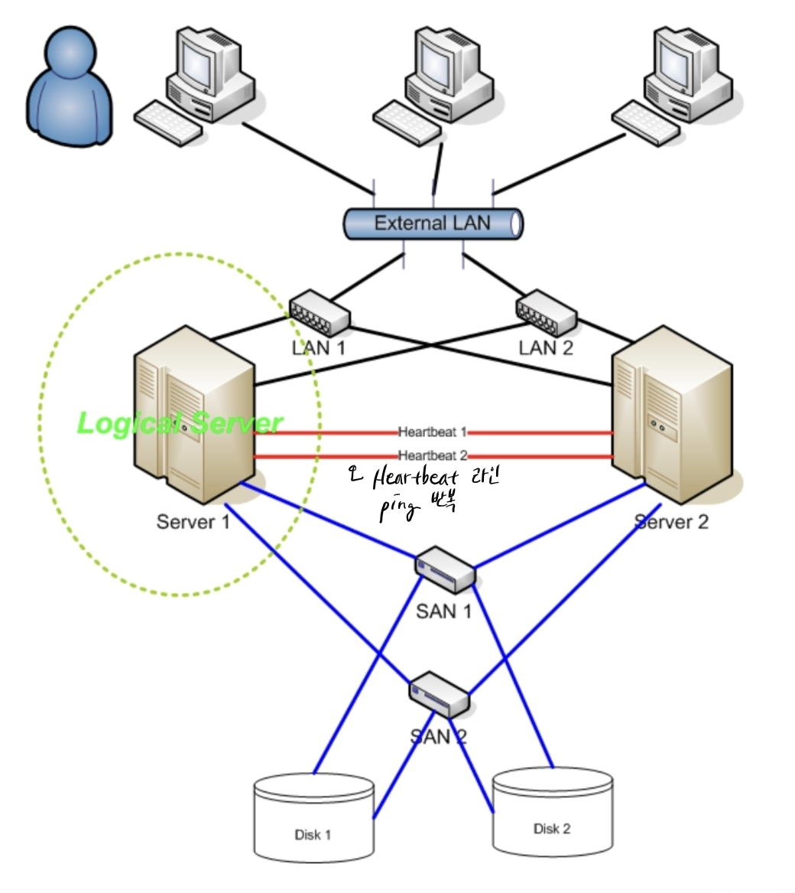
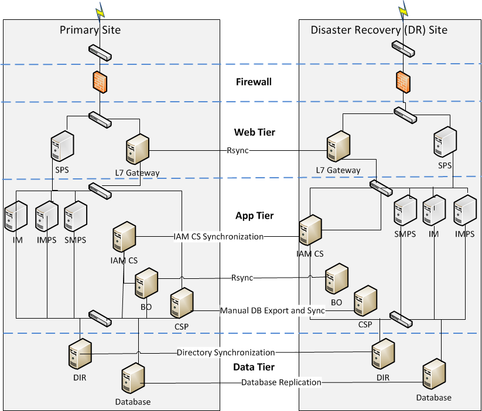
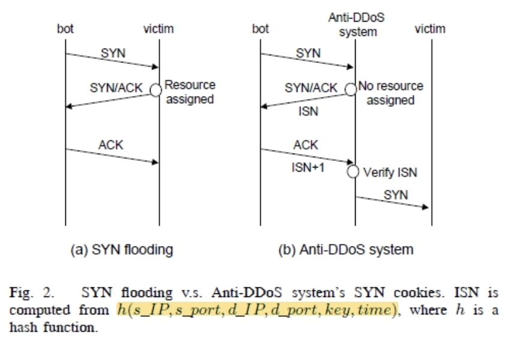

## 1. Firewall (방화벽)
### 1.1 정의

- 컴퓨터 시스템/네트워크에서 **허가되지 않은 접근을 차단**하고, **허가된 통신만 허용**하도록 설계된 장비 또는 소프트웨어.
- 사전에 정의된 **규칙 집합(rule-set, policy)** 에 따라 패킷을 허용(accept) 또는 차단(deny/drop)한다.

### 1.2 위치와 동작 계층

- 일반적으로 **엑세스 라우터 뒤쪽**(사내망과 인터넷 사이)에 위치.
- 전통적으로 L3에서 동작하지만, L2 투명(transparent) 방화벽도 존재.

## 2. Firewall Rule-set & Packet Classification
### 2.1 룰 형식

- `Rule := (s_ip, s_port, d_ip, d_port, protocol, action, interface)`
- 간단하게 `Rule := (s_ip, s_port, d_ip, d_port, protocol, action)`
- `action`: `accept/drop/deny`, NAT, IPSec 처리 등.

예시 rule-set (단순화):

| no  | s_ip              | s_port     | d_ip              | d_port     | Prot | action |
| --- | ----------------- | ---------- | ----------------- | ---------- | ---- | ------ |
| 1   | *                 | *          | 210.123.36.100/32 | 80         | TCP  | accept |
| 2   | 210.123.36.100/32 | 80         | *                 | *          | TCP  | accept |
| 3   | 210.123.37.0/24   | 1024:65535 | *                 | *          | *    | accept |
| 4   | *                 | *          | 210.123.37.0/24   | 1024:65535 | *    | accept |
| 5   | *                 | *          | *                 | *          | *    | deny   |

### 2.2 First-rule First-match

- 방화벽은 **위에서 아래로 규칙을 순차 비교**하며, **가장 먼저 매칭되는 룰**만 적용 (first-rule first-match).
- 실제 기업망에서는 규칙이 수천~수만 개가 될 수 있어, 룰 평가가 성능 병목이 될 수 있음.

### 2.3 Packet Classification 문제

- 방화벽의 룰 매칭 문제를 **packet filtering / packet classification**이라 부름.
- 단순 라우팅은 `목적지 IP`만 보고 longest prefix matching으로 처리하지만, 방화벽은 **복수 필드(IP, Port, Protocol, Range 등)의 조합**으로 룰을 매칭해야 해서 훨씬 어려운 문제.

## 3. Stateless Firewall vs Stateful Firewall
### 3.1 Stateless Firewall

| no  | s_ip              | s_port     | d_ip              | d_port     | Prot | action |
| --- | ----------------- | ---------- | ----------------- | ---------- | ---- | ------ |
| 1   | *                 | *          | 210.123.36.100/32 | 80         | TCP  | accept |
| 2   | 210.123.36.100/32 | 80         | *                 | *          | TCP  | accept |
| 3   | 210.123.37.0/24   | 1024:65535 | *                 | *          | *    | accept |
| 4   | *                 | *          | 210.123.37.0/24   | 1024:65535 | *    | accept |
| 5   | *                 | *          | *                 | *          | *    | deny   |

- **모든 패킷마다** rule-set을 매번 조회. 세션 상태를 기억하지 않음.
- 장점: 구조가 단순.
- 단점(중요):
    1. **성능 문제**: 한 번 허용된 연결의 이후 패킷도 매번 룰 검색을 반복 → 비효율.
    2. **보안 취약점**
        - 내부 사용자의 인터넷 사용 허용을 위해 `출발지: 내부 C 클래스, 출발 포트: 1024~65535, 목적지: any` 같은 룰을 열어두면, 공격자가 해당 범위 안의 포트(예: 12345 백도어 포트)로 직접 접속을 시도해도 방화벽이 허용해 버릴 수 있음.

### 3.2 Stateful Firewall

| no  | s_ip            | s_port     | d_ip              | d_port | Prot | action |
| --- | --------------- | ---------- | ----------------- | ------ | ---- | ------ |
| 1   | *               | *          | 210.123.36.100/32 | 80     | TCP  | accept |
| 2   | 210.123.37.0/24 | 1024:65535 | *                 | *      | *    | accept |
| 3   | *               | *          | *                 | *      | *    | deny   |

- **세션의 첫 패킷**에 대해서만 rule-set을 조회하고, 이후 패킷은 **세션 테이블(session table)** 을 먼저 조회.
- 세션 테이블에 (s_ip, s_port, d_ip, d_port, protocol) 등을 저장해두고, 반대 방향 패킷이 들어오면 **기존 세션의 일부인지 확인 후 허용**.
- 이로 인해:
    - **성능 향상**: 룰 조회 빈도 감소.
    - **보안 강화**:
        - 내부 → 외부로 나간 세션의 **짝 패킷**에 대해서만 역방향 허용.
        - 외부 공격자가 내부 포트로 직접 세션을 만들려는 시도는 세션이 없으므로 차단.
- 세션 테이블 항목은 일정 시간 후 **timeout** 처리; HTTP keepalive, TCP keepalive 등으로 연장.

### 3.3 Stateful Inspection (Application-aware)

- 단순히 IP/Port 수준의 상태만이 아니라, **애플리케이션 프로토콜의 맥락까지 이해**하는 방화벽.
- 예) FTP Active / Passive 모드:
	- 
	- 
    - FTP는 제어 포트(21)와 데이터 포트(20 또는 동적 포트)를 따로 사용.
    - 방화벽이 FTP 명령을 파싱해서, 제어 채널에서 협상된 데이터 포트에 대해 **임시 규칙을 자동 추가**해 준다.
- HTTP encapsulation, 동적 포트 사용 등 **포트가 수시로 바뀌는 프로토콜**에서는 이런 stateful inspection이 필수적.

## 4. DMZ (Demilitarized Zone)
### 4.1 개념

- 조직의 **외부 서비스를 외부 네트워크(인터넷)에 노출**시키기 위해 내부망과 분리된 **물리/논리적 서브넷**.
- 원칙:
    - E-mail, DNS, Web 등 인터넷에서 접근되는 서버는 **DMZ에 위치**
    - DB 서버 등 더 중요한 자산은 **내부망에 따로 두고 방화벽으로 분리**.

### 4.2 왜 필요한가? (웹 서버 해킹 시나리오)

- 웹 서버와 DB 서버가 같은 서브넷에 있으면:
    - 공격자가 웹 서버를 해킹(컴프로마이즈) → 그 서버에서 쉘 획득 → DB 서버 포트 스캔 및 취약점 공격 가능.
- DMZ 구조:
    - 인터넷 — FW(1차) — DMZ(웹, 메일, DNS 등) — FW(2차) — 내부망(DB 등)
    - DMZ 서버가 뚫려도, **DB로 향하는 트래픽은 2차 방화벽에서 엄격히 필터링** (예: DB 포트 하나만 허용).

### 4.3 장단점

- 장점: 공격 시 피해를 DMZ 영역 안으로 **격리(confine)** 가능.
- 단점: 방화벽이 추가되고 규칙이 복잡해져 **관리와 성능 부담** 증가.

## 5. 방화벽 High Availability (HA)
### 5.1 필요성

- 방화벽은 인터넷 서비스의 **단일 장애점(Single Point of Failure)** 이 되기 쉽다.
- 방화벽이 죽으면 곧바로 **서비스 전체 중단** → 가용성(Availability) 매우 중요.

### 5.2 방식 1: L4/L7 스위치 이용

- 구조: 인터넷 — L4/L7 스위치 — FW1 / FW2 — L4/L7 스위치 — 내부망
- 동작:
	- 같은 세션의 패킷은 항상 **같은 방화벽**을 지나야 함.
	- L4/L7 스위치에서 해시 기반 분배: `index = H(s_ip XOR d_ip) mod (# of firewall)`
	- 세션 생성 패킷과 응답 패킷의 `(s_ip, d_ip)` 조합에 대해 동일한 결과를 얻으므로, 동일 방화벽을 거치게 됨.
- 단점:
	- L4/L7 장비 자체가 **고가**, 이중화 필요 시 비용 증가.
	- 방화벽 한 대가 죽으면, 그 위에 있던 **기존 세션 정보가 사라져** 해당 세션은 끊어지고 재접속 필요.

### 5.3 방식 2: 세션 동기화(Session Synchronization)

- 구조: FW1, FW2가 **전용 고속 링크(예: 광)** 로 서로 연결.
- 동작:
	- 두 방화벽이 **커널 레벨에서 rule-set, session table 등을 실시간 동기화**.
	- 패킷이 내려가다가 올라오는 동안, 상대 방화벽으로 세션 정보가 복제되기 때문에 **어느 쪽으로 응답 패킷이 나가도 stateful 성질 유지**.
- 장점:
    - L4/L7 스위치 필요 없음 (L2/L3 환경에서도 구현 가능).
    - 방화벽 장애 시에도 **기존 세션을 그대로 이어갈 수 있어** 서비스 끊김 최소화.

## 6. 라우터 High Availability & VRRP
### 6.1 디폴트 게이트웨이 이중화 문제

- 여러 호스트/서버가 같은 서브넷에서 **하나의 디폴트 라우터**를 사용.
- 이 라우터가 장애 나면 해당 서브넷 전체가 인터넷을 사용하지 못함.

### 6.2 VRRP(Virtual Router Redundancy Protocol)

- RFC 3768 표준.
- LAN 상의 여러 물리 라우터 중 하나를 **가상 라우터(Virtual Router)** 의 역할(마스터)로 선출하는 **선출(election) 프로토콜**.
- 호스트들은 디폴트 게이트웨이로 **버추얼 IP(VIP)** 를 설정.
    - VIP는 현재의 **마스터 라우터 IP**에 바인딩.

마스터 장애 판단:
- 마스터는 주기적으로 **Advertisement 메시지**를 브로드캐스트.
- 백업 라우터는 타이머로 이를 감시하고, 일정 시간 동안 광고가 안 오면 마스터 다운으로 판단 후 **새 마스터를 선출**.

선출 과정: 백업 라우터들끼리 **우선순위(priority)** 를 비교해 가장 높은 우선순위의 라우터가 새로운 마스터가 됨.

### 6.3 ARP 트릭 & Active/Passive → Active/Active

- VIP(예: 192.168.42.1)를 두 라우터(A,B)가 **공유**.
- 마스터 라우터만 VIP에 대한 **ARP 응답**을 하여, 호스트의 ARP 캐시에 VIP → 마스터의 MAC 이 매핑되도록 함.
- 마스터가 죽으면:
    - 백업 라우터가 VIP를 자기 인터페이스에 설정하고, ARP 응답을 시작 → 거의 실시간에 가까운 **Fail-over**.

Active/Passive 구조: 한 라우터만 실사용, 다른 한 대는 대기(standby) → 자원 낭비.

HA for Server Clusters

Active/Active로 확장:
- **VIP를 두 개** 사용 (예: 42.1, 42.10).
    - A: 42.1의 마스터, 42.10의 백업
    - B: 42.10의 마스터, 42.1의 백업
- 클라이언트 일부는 42.1, 일부는 42.10을 디폴트 게이트웨이로 설정하여 평소에는 **트래픽 분산**, 장애 시에는 한쪽이 두 VIP 모두 담당.

### 6.4 VRRP 보안

- 공격자가 가짜 VRRP 광고를 흘려 **마스터를 탈취**할 수 있는 위험.
- VRRP는 다음 세 가지 인증 모드 지원:
    1. 인증 없음
    2. 평문 비밀번호
    3. IP 인증 + HMAC-MD5 기반 강한 인증
- 또한 원격 네트워크에서의 VRRP 패킷 주입을 막는 메커니즘 제공.

## 7. 서버/네트워크 이중화 & 가용성 계산
### 7.1 기본 모델

- 각 서버가 **독립적으로** 가동될 확률: `p`
- 서버 수: `n`
- 서비스가 계속 유지될 확률 = **적어도 한 대 이상 정상 동작**할 확률.

계산:
- 모든 서버가 다 죽을 확률: $(1-p)^n$
- 따라서 서비스 유지 확률: $q_n = 1 - (1-p)^n$

예:
- `p = 0.9999` → 1년 중 장애 시간 ≈ 53분.
- 서버 2대 이중화 (`n=2`)
    - `q_2 = 1 - (1-p)^2 ≈ 0.99999999`
    - 1년 장애 시간 < 0.006분(약 수 초 수준).

### 7.2 DR(Disaster Recovery) 센터 & GSLB

- 메인 데이터센터 + 백업 DR 센터를 구성하여 **지역 재난 대비**.
- Global Server Load Balancing(GSLB):
    - 여러 센터의 서버 상태(응답시간 등)를 모니터링하고, DNS 요청에 가장 적합한 서버의 IP를 응답.
    - 메인 센터 장애 시, DR 센터로 **DNS failover**.
    - 빠른 전환을 위해 **DNS TTL**을 최소화해야 하나, 브라우저/OS의 DNS 캐시 효과도 고려해야 함.

## 8. Intrusion Detection System (IDS)
### 8.1 정의와 분류

- 네트워크/시스템 활동을 모니터링하여 **악의적 활동이나 정책 위반을 탐지**하고 경보를 생성하는 장치/소프트웨어.
- 분류:
    - **HIDS**(Host-based IDS): 호스트 내부 파일, 메모리, 자원 사용 등을 감시.
    - **NIDS**(Network-based IDS): 네트워크 트래픽을 감시.
    - 탐지 방식:
        - **Signature-based**: 알려진 패턴/룰 기반 문자열 매칭.
        - **Anomaly-based**: 정상 패턴에서 벗어나는 이상 행동 탐지.

### 8.2 용어

| 구분            | 실제 공격이 발생 O    | 실제 공격 발생 X     |
| ------------- | -------------- | -------------- |
| 공격 탐지 알람 발생 O | True Positive  | False Positive |
| 공격 탐지 알람 발생 X | False Negative | True Negative  |

- **Alarm filtering**: False Positive를 줄이기 위한 경보 분류/정제 과정.

### 8.3 HIDS(Host-based IDS)
#### 8.3.1.전통적 HIDS vs EDR

- **전통적 Host-based IDS / 안티바이러스**:
    - 파일/메모리 내의 **악성 코드 시그니처**를 찾고, 파일 변경 여부를 체크(무결성 검사).
- **EDR(Endpoint Detection & Response)**:
    - 단순 “악성코드 감염 여부”를 넘어, 노트북/서버에서 돌아가는 프로세스들이 **어떤 OS API를 어떤 패턴으로 호출하는지** 등을 관찰.
    - 정상적인 동작 패턴과 다르게 움직이는 프로세스를 **이상 행위로 탐지**.
    - 예: `Dropbox.exe`가 평소에는 동기화만 하다가, 갑자기 로컬 실행 파일들을 마구 수정하거나, 키보드 입력을 후킹해서 외부로 전송하려고 하면 이상 행동으로 판단.

#### 8.3.2. 실행 파일 무결성 검사

- OS 시스템 파일이나 주요 실행 파일(EXE)은 **업데이트가 아닌 이상 값이 바뀔 일이 거의 없음**.
- HIDS/EDR는:
    - 이런 파일들의 내용을 **해시(SHA-256 등)** 로 계산해 저장.
    - 일정 주기로 파일 해시를 다시 계산해 **변경 여부**를 확인.
    - 값이 변했다면 악성코드가 해당 실행 파일을 변조했을 가능성이 큼 → 경보/차단.

#### 8.3.3. 랜섬웨어 탐지용 Decoy(미끼) 파일

- 랜섬웨어 입장:
    - “중요한 파일(HWP, DOCX, PPTX, XLSX, 사진 등)을 최대한 빨리 암호화”해야 함.
- EDR/백신 솔루션은 이를 역이용:
    - 시스템 곳곳에 랜섬웨어가 좋아할 만한 확장자의 **Decoy(미끼) 파일**을 다수 생성.
    - 이 파일들의 해시 값을 저장해 두고, **짧은 주기(예: 5초)** 로 계속 검사.
    - 사용자는 이 파일들을 직접 만질 일이 거의 없으므로, 누군가가 미끼 파일을 암호화/변조하면 → **랜섬웨어로 거의 확실**.
- 예:
    - 안랩 V3가 만든 `DECOY_*` 같은 폴더/파일이 실제 그 역할.
    - 이런 파일 내용이 바뀌는 순간 즉시 랜섬웨어를 탐지하고 대응.

### 8.4. Honeypot(허니팟) – 공격자 유인 시스템

- **허니팟(Honeypot)**: 말 그대로 “꿀단지”.
    - 의도적으로 **약해 보이고 취약해 보이는 서버/시스템**을 인터넷에 노출.
    - 해커가 스캔·공격을 시도하도록 유도.
- 목적:
    - 해커가 어떤 **명령어를 입력하는지**, 어떤 **악성 파일을 내려받는지**, 어떤 **취약점을 노리는지**를 관찰·수집.
    - 이렇게 수집된 정보를 바탕으로 **새로운 시그니처·방어 정책**을 만들거나 해커를 역추적.
- 리스크:
    - 허니팟 자체가 뚫리면, 그 장비도 또 다른 공격 기점이 될 수 있음.
    - 실제 사례: 어느 보안 회사는 허니팟에 잘못된 민감 데이터를 올려놓고, 허니팟이 뚫리면서 **실제 고객 정보가 유출**되는 사고가 발생.
- 결론: 허니팟은 강력한 연구/방어 수단이지만, 잘못 운영하면 **리스크도 매우 크다**.

### 8.4 NIDS

- 스위치 미러링 포트, **네트워크 TAP** 등으로 트래픽을 복사하여 **수동 감시**.
- 문자열/패턴 매칭(Signature) 또는 트래픽 통계 기반 이상 탐지.

Evasion 기법:
- 악성 문자열을 여러 패킷으로 나누기, fragment, TCP segment overwrite 등.
- 이를 막기 위해 **stateful inspection**이 필요.

### 8.5 Snort

- 가장 유명한 오픈소스 NIDS. 룰 기반 탐지.
- 사용자 정의 룰 예시(설명만):
    - `alert tcp any any -> any any ...` : TCP 트래픽에 대해 경보.
    - `content:"admin"` : payload에서 "admin" 문자열 발견 시 경보.
    - `sid` : 룰 ID, `rev` : 룰 버전.

## 9. DDoS(Distributed Denial of Service)
### 9.1 DoS vs DDoS

- **DoS**: 단일 공격자가 서비스 자원을 고갈시키거나 장애를 일으켜 사용 불가 상태로 만드는 공격.
- **DDoS**: 다수의 감염 PC(좀비, 봇)를 이용해 분산적으로 DoS를 수행.

예시:
- **Land Attack**: 출발지 IP와 목적지 IP를 동일하게 설정하여, 장비가 자기 자신에게 반복 응답하도록 만들어 장애 유발.
- 2010년 7·7 DDoS: 한국에서 20만대 이상의 좀비 PC가 동원, 30Gbps 규모 트래픽 발생.

### 9.2 Botnet

- 구성: Botmaster, C&C 서버(C2 Server), 다수의 Bot.
- 최근 DDoS는 과거처럼 **명성**이 아니라, **금전적 이익**을 노리는 경우가 많음.

### 9.3 방어의 어려움

- 개별 봇은 작은 양의 트래픽만 발생 → **정상 사용자와 구분 어려움**.
- 정상 이용자 급증으로 인한 **Flash Crowd 현상**과 구분도 복잡.
- 단순히 서버 수/대역폭을 늘리는 것만으로는 한계.

### 9.4 대응 전략

- 악성코드 감염 방지 캠페인, 조기 탐지 및 의심 패킷 필터링.
- Anti-DDoS 시스템(IPS와 유사), Botmaster 추적 등.
- 완전한 해결책은 아직 존재하지 않는 **어려운 문제**로 남아 있음.

## 10. Intrusion Prevention System (IPS)
### 10.1 개념

- IDS처럼 트래픽/시스템 활동을 모니터링하면서, **실시간으로 공격을 차단/블록**하는 기능까지 포함.
- 흔히 **IDS + Firewall**의 형태로 이해. 트래픽 경로에 **인라인**으로 위치.

### 10.2 DDoS 대응 기능

1. **IP Spoofing Test**
	- 
	- 
    - SYN-cookie를 이용해 TCP 3-way handshake의 신뢰성을 검증.
    - HTTP 레벨에서 캡차/리다이렉트 등으로 실제 브라우저인지 확인(Cisco Guard 등).
2. **Traffic Management
    - 정상 클라이언트의 트래픽 패턴(예: 웹 서버에 1Mbps 이하 전송)을 학습.
    - 임계치를 넘는 트래픽 또는 spoofing이 의심되는 IP에서 오는 트래픽을 선별적으로 드롭
3. **UTM(Unified Threat Management)**
    - 방화벽, IDS/IPS, 안티바이러스, Anti-DDoS 등 보안 기능을 한 장비에 통합.