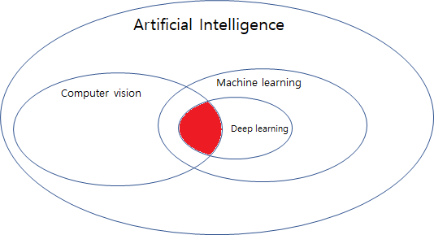
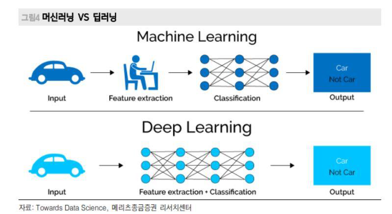
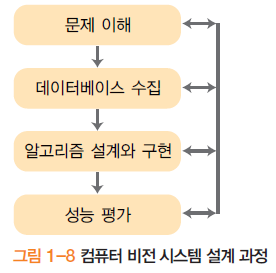
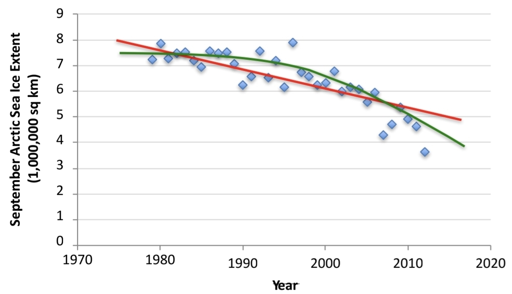
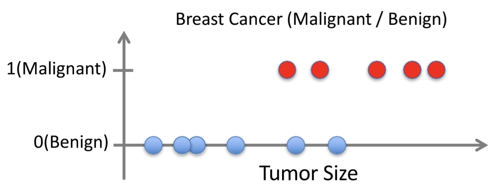
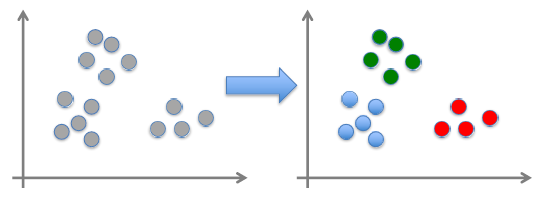
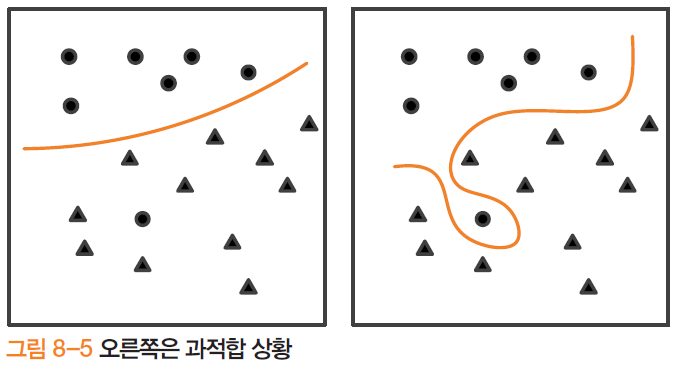

# Introduction – Computer Vision & Machine Learning
## 1. 컴퓨터 비전이란?

- **정의**: 사람이 눈으로 사물을 보고 인지하는 작업을 컴퓨터가 수행하게 만드는 학문.
- 결국, **이미지/영상 → 의미 있는 정보(객체, 사람, 문자, 거리 등)** 로 바꾸는 기술들의 집합.

## 2. 컴퓨터 비전의 주요 응용 사례

- **OCR (Optical Character Recognition)**
    - 스캔된 문서를 문자로 변환하는 기술
    - 우편 번호 인식, 문서 스캔, 번호판 인식 등
- **번호판 인식 (License Plate Recognition)**
    - 자동차 번호판을 자동으로 읽어서 주차/통행료/단속 시스템에 활용
- **얼굴 인식 & 얼굴 검출 (Face Detection)**
    - 디지털 카메라의 얼굴 자동 인식, 초점 맞추기
    - 일부 카메라는 **스마일 검출**까지 수행
- **자율주행 / 스마트카**
    - Mobileye, Tesla 등의 예시
    - 전방 차량/보행자 인식, 차선 인식, 충돌 방지 등에서 필수 기술
- **로보틱스**
    - RoboCup 로봇 축구, NASA Mars Rover 등
    - 로봇이 주변 환경을 인지하고 이동/작업하기 위해 비전 사용
- **의료 영상 (Medical Imaging)**
    - CT, MRI, 수술 내비게이션(이미지 유도 수술) 등에서 병변 탐지, 수술 경로 안내에 사용

## 3. AI, Machine Learning, Deep Learning, Computer Vision 관계

- **AI ⊃ Machine Learning ⊃ Deep Learning**

- **Computer Vision**은 이들 안에서
    - 예전에는: 주로 **머신러닝 + 수작업 특징(feature) 설계**
    - 최근에는: **딥러닝 모델이 feature를 자동 학습**하는 방향으로 변화

## 4. 클래식 비전 vs 딥러닝 비전

- **클래식 비전 (Classic Vision)**
    1. 원본 이미지 입력
    2. 사람이 설계한 특징 추출(Feature Extraction)
        - 예: 에지(edge), 코너(corner), HOG, SIFT 등
    3. 추출된 특징을 머신러닝 모델(SVM, Random Forest 등)에 넣어서 분류/검출
- **딥러닝 비전 (Deep Learning Vision)**
    1. 원본 이미지(픽셀 값)를 그대로 입력
    2. CNN/딥러닝 모델 내부에서 **계층적으로 feature를 자동 학습**
    3. 마지막 레이어에서 분류/검출 결과 산출
- 핵심 변화 포인트:
> 	_“Model 안에서 feature를 직접 뽑아주는 방식으로 변화”_  
> 	→ 사람이 설계하던 feature engineering이 **모델 구조 설계 & 학습** 문제로 이동

## 5. 머신러닝의 정의 (Mitchell / Simon)

> 학습이란 “**경험을 통해 성능이 개선되는 모든 과정**”
> - **Herbert Simon**

> 어떤 컴퓨터 프로그램이 작업 T를 수행하고, 성능을 측정하는 척도 P에 따라 평가할 때, 경험 E를 통해 T에 대한 성능이 개선된다면, 그 프로그램은 **E로부터 학습한다**고 말할 수 있다.
> - **Tom Mitchell**

- 컴퓨터 비전에 적용하면:
    - **T (Task)**: 분류/인식 (e.g. 고양이 vs 개, 사람 vs 배경)
    - **E (Experience)**: 학습 데이터셋(이미지 + 라벨)
    - **P (Performance)**: 인식률, 정확도 등

## 6. 학습의 종류 (Types of Learning)

1. **Supervised Learning (지도 학습)**
    - 입력 데이터 + 정답 라벨이 모두 주어짐
    - 예: 이미지 → “고양이/개” 라벨
2. **Unsupervised Learning (비지도 학습)**
    - 라벨 없이 입력 데이터만 주어짐
    - 대표적으로 **군집화(Clustering)**: K-means, SOM, Mean-shift 등
3. **Semi-supervised Learning (준지도 학습)**
    - 일부만 라벨이 있고, 대부분은 라벨이 없음
    - 라벨 있는 데이터로 1차 학습 → 라벨 없는 데이터의 라벨 추정 → 다시 학습을 반복
4. **Reinforcement Learning (강화 학습)**
    - 에이전트가 환경과 상호작용하면서 **보상(reward)** 을 통해 정책(policy)을 학습

## 7. 지도 학습: 회귀(Regression)와 분류(Classification)
### 7.1. 회귀 (Regression)

- 입력–출력 쌍: $(x_i, y_i)$
- 목표: $f(x)$ 를 학습해서 **연속 값 y를 예측**
- 예시:
    - **연도 $x$** → **북극 해빙 면적 $y$**
    - y가 실수(연속값)이므로 회귀 문제

### 7-2. 분류 (Classification)

- 입력–출력 쌍: $(x_i, y_i)$
- 목표: $f(x)$ 를 학습해서 **범주형 y(클래스)를 예측**
- 예시:
    - 유방암 데이터:
        - **입력 x**: 종양 크기, 세포 모양/크기 등 다양한 속성(다차원 벡터)
        - **출력 y**: 악성(Malignant=1) / 양성(Benign=0)
    - 분류기는 **결정 경계(decision boundary)** 를 학습해
        - 한쪽은 “Benign” 영역, 다른 한쪽은 “Malignant” 영역으로 나눔

## 8. 비지도/준지도 학습의 역할

- **비지도 학습**
		
    - 라벨 없는 데이터에서 **유사한 특징 벡터끼리 군집화**
    - 데이터 마이닝, 빅데이터 분석, 정보 검색 등 많은 응용에서 사용

- **준지도 학습**
    - 라벨이 있는 샘플과 없는 샘플이 섞여 있는 상황
    - 인터넷에서 **라벨 없는 데이터가 계속 생성**되므로 중요성이 증가
    - 라벨 있는 데이터로 1차 학습 → 라벨 없는 데이터에 대해 라벨 추정 → 이 추정값까지 활용하여 반복 학습

## 9. 학습 모델, 목적 함수, 일반화

- **학습 모델**
    - 모델은 매개변수 집합 $\Theta$로 표현
    - 학습의 목표: **목적 함수(objective function)** 를 기준으로 최적의 $\Theta$ 찾기
    - 모델 선택/튜닝을 위해 **검증 집합(validation set)** 을 사용할 수 있음
- **학습 알고리즘의 기본 원리**
    1. 학습 집합으로 현재 $\Theta$의 성능 평가
    2. 성능을 개선하는 방향으로 $\Theta$를 갱신
    3. 수렴할 때까지 반복
- **일반화 능력 (Generalization)**
	

    - 학습에 사용하지 않은 **테스트 집합**으로 최종 모델 성능 평가
    - 학습/테스트 성능이 비슷하면 **일반화가 잘 됨**
    - 학습 성능만 높고 테스트 성능이 낮으면 **과적합(Overfitting)**