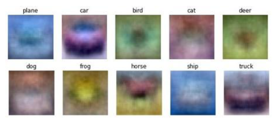
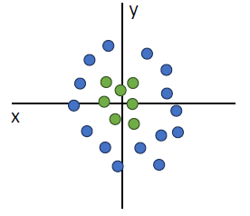
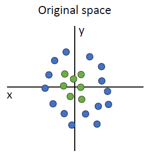
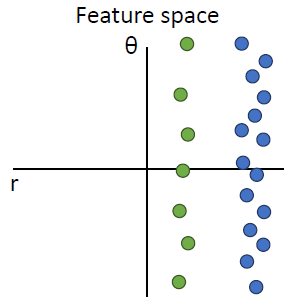
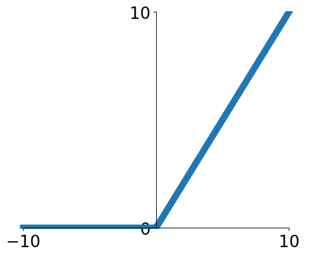
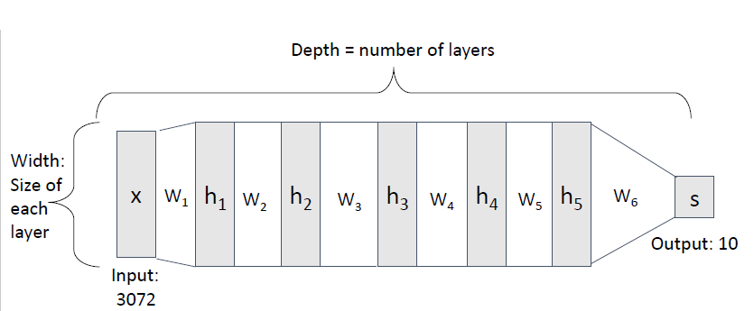

# DNN(Deep Neural Network)
## 1. 딥러닝 & 지도학습 복습

- **지도학습(supervised learning)**: 입력 $x$와 정답 레이블 $y$가 있는 데이터셋으로부터 “새로운 $x$가 들어왔을 때 $y$를 잘 맞추는 함수 $f(x)$”를 학습하는 문제.
- 분류 문제에서는
    1. **점수(score)** 계산: $s = f(x, W)$
    2. **Softmax**로 확률로 해석
    3. **Cross-Entropy Loss**로 정답 레이블과의 차이 측정
- 최종 목표: **미지의 데이터(테스트셋)에서 성능이 좋도록** 파라미터 $W$를 학습하는 것.

## 2. 리니어(선형) 모델의 한계
### 2.1. 템플릿 매칭으로 본 선형 분류기

- 기존 선형 분류기:  $$f(x) = Wx \quad (\text{또는 } Wx + b)$$
- 각 클래스마다 하나의 **템플릿 벡터 $w_c$** 를 두고,  입력 $x$와의 내적 $w_c^\top x$를 비교하여 가장 큰 클래스를 선택.
- 내적은 정규화하면 **코사인 유사도**와 같아서  “$x$와 가장 각도가 작은(가장 비슷한) 템플릿을 고르는 과정”으로 해석 가능.

### 2.2. 왜 약한가?

- 각 클래스당 **하나의 템플릿**만 있으므로 고양이의 “정면”, “측면”, “누워 있는 자세” 등 **여러 모드(패턴)** 를 충분히 표현하기 어려움.

- 데이터 분포가 원형/도넛 모양처럼 **비선형적으로 섞여 있는 경우** 아무리 직선을 잘 그어도 분리가 불가능한 문제가 존재.

## 3. 피처 트랜스폼(Feature Transform) 아이디어

- 핵심 질문: “**선형 모델 자체는 두고, 입력 공간을 바꾸면 어떨까?**”
- 예시:
	
    - 원래 좌표: $(x, y)$
    
	
    - 새로운 좌표(극좌표):
        - $r = \sqrt{x^2 + y^2}$
        - $\theta = \tan^{-1}(y/x)$
- $(x, y)$ 공간에서는 직선으로 분리 불가능하던 클래스도, $(r, \theta)$ 공간에서는 **직선 하나로 깔끔히 분리** 가능해짐.
- 이런 과정을
    - **Feature transform / Feature projection / Feature extraction**
    - 전통적인 **피처 엔지니어링**이라고 부름.

### 3.1. 한계

- 2차원, 3차원 정도는 사람이 “원, 각도” 같은 변환을 떠올릴 수 있지만,
- 이미지처럼 차원이 **수천, 수만**인 경우 사람이 직접 “좋은 변환”을 설계하는 것은 사실상 불가능.

 → “좋은 피처를 **모델이 직접 학습하게 하자** → 딥러닝”

## 4. 뉴럴 네트워크(Neural Network)의 기본 수식
### 4.1. 2-layer Neural Network

- 입력 차원: $D$ (예: CIFAR-10 이미지 → $32 \times 32 \times 3 = 3072)$
- 히든 레이어 크기: $H$
- 클래스 수: $C$

수식으로 쓰면:
$$h = \sigma(W_1 x) \quad (\text{h는 히든 레이어})$$
$$s = W_2 h \quad (\text{s는 클래스 점수})$$

- $W_1 \in \mathbb{R}^{H \times D}$
- $W_2 \in \mathbb{R}^{C \times H}$
- $\sigma(\cdot)$: **활성화 함수(activation function)**, 예: ReLU
- 실제로는 각 레이어마다 **bias**도 함께 존재.

### 4.2. Fully-Connected (FC) / Multi-Layer Perceptron (MLP)

- **모든 입력 노드가 모든 히든 노드와 연결**되어 있고,  모든 히든 노드가 모든 출력 노드와 연결된 구조 → **Fully-connected layer**.
- 이런 FC 레이어를 여러 층 쌓은 네트워크를 **MLP (Multi-Layer Perceptron)** 라고 부름.

## 5. 활성화 함수(Activation Function)의 역할
### 5.1. ReLU 함수

-  활성화 함수: **ReLU (Rectified Linear Unit)**: $$\text{ReLU}(x) = \max(0, x)$$
- 특징:
    - 입력이 음수 → 0
    - 입력이 양수 → 그대로 통과
    - 원점을 지나지만 **직선이 아닌 꺾인 함수** → “비선형(non-linear)” 함수.

### 5.2. 왜 꼭 필요할까? (선형성 깨기)

- 만약 활성화 함수를 **아예 쓰지 않으면**: $$s = W_2 (W_1 x) = (W_2 W_1) x = W_3 x$$→ 결국 **선형 분류기 하나**와 완전히 동일.
- 레이어를 10개, 100개 쌓아도 **선형 변환의 합성은 또 하나의 선형 변환**이므로, 템플릿 매칭의 한계를 **절대** 벗어날 수 없음.
- ReLU처럼 **비선형 함수**를 중간에 끼워 넣으면
    - 선형성(교환법칙·결합법칙)이 깨져서
    - $W_1, W_2, \dots$가 **진짜로 서로 다른 역할**을 하게 되고
    - 전체적으로 **비선형 결정 경계**를 만들 수 있게 됨.

## 6. 템플릿 매칭 관점에서 본 뉴럴 네트워크
### 6.1. 1-layer vs 2-layer

- **이전(1-layer)**
    - 클래스마다 **하나의 템플릿** $w_c$만 존재.
    - 고양이의 모든 포즈·배경·조명을 한 템플릿에 “우겨넣어야” 하므로 템플릿이 지저분하고 표현력이 떨어짐.
- **2-layer MLP**
    - 첫 번째 레이어 $W_1$:
        - 여러 개의 템플릿(예: 64개)을 학습 → 각 행이 하나의 템플릿 역할.
    - 히든 벡터 $h$의 각 원소 $h_i$:
        - “입력 이미지와 **i번째 템플릿의 유사도**”처럼 볼 수 있음.
    - 두 번째 레이어 $W_2$:
        - 이 유사도들(템플릿들)을 **조합**해서 각 클래스 점수를 만듦.

### 6.2. “여러 템플릿의 조합”이라는 관점

- 예를 들어, 말(class “horse”)을 인식하고 싶다고 하면:
    - 1층 템플릿 중 “말 왼쪽 보기”, “말 오른쪽 보기”, “다리”, “머리” 등  
        여러 템플릿이 말 이미지를 볼 때 동시에 높은 값을 낼 것.
    - 2층에서 “말 클래스”로 가는 가중치들은  
        이런 템플릿들에 **큰 양의 가중치**를 주어서 최종 점수를 크게 만듦.
- 결과적으로:
    - 예전에는 **“클래스 1개 ↔ 템플릿 1개”** 였다면,
    - 지금은 **“클래스 1개 ↔ 여러 템플릿의 조합”**  → 훨씬 더 풍부한 표현력이 생김.

## 7. 딥러닝 = 표현(Feature) 학습, 레프레젠테이션 러닝

- 전통 CV:
    - 사람이 **핸드크래프트 피처** 설계 (SIFT, HOG, 색 히스토그램 등)
    - 그 위에 간단한 ML 모델(리니어 분류기 등)을 얹음.
- 딥러닝:
	- 
    - 네트워크가 $W_1, W_2, \dots$ 를 학습하면서  
        “어떤 피처가 유용한지, 어떤 공간으로 변환해야 하는지”까지 **통째로 학습**.
    - 그래서 딥러닝을
        - **Representation learning (표현 학습)**
        - **Feature learning**이라고 부름.
- 실제로 CNN 같은 모델의 필터를 시각화해 보면
    - 첫 레이어: 엣지, 색깔 같은 **기본 패턴**
    - 중간 레이어: 텍스처, 부분 구조
    - 높은 레이어: 특정 물체 부위, 객체의 형태 등  
        사람이 직접 설계하기 힘든 피처들이 자동으로 등장.

## 8. Deep Neural Network: 깊이(Depth)와 너비(Width)

- **Depth(깊이)**: 레이어 개수
    - 입력, 출력 사이에 히든 레이어를 여러 층 쌓을수록 더 깊은 네트워크.
    - 예: $x \rightarrow h_1 \rightarrow h_2 \rightarrow h_3 \rightarrow \dots \rightarrow s$
- **Width(너비)**: 각 레이어에 있는 노드(뉴런)의 수
    - 히든 사이즈 100, 512, 4096 등.
- 깊은 네트워크의 장점:
    - 복잡한 함수를 “여러 단계의 간단한 변환”으로 나눠서 표현.
    - 각 단계는 상대적으로 단순한 패턴만 배우면 되고, 단계가 쌓이면서 고수준 개념까지 표현 가능.

## 9. 오버피팅, 일반화, 정규화(Regularization) 맛보기
### 9.1. 목표는 “테스트셋에서의 성능”

- 머신러닝의 진짜 목표:
    - 학습에 사용하지 않은 **테스트 데이터**에서 오류가 낮게 나오는 것.
- 하지만 우리가 가지고 있는 건 보통 **트레이닝 데이터**뿐.
    - 그래서 우리는 “트레인 성능을 올리되, 테스트 성능이 떨어지지 않게” 모델과 학습 전략을 설계해야 함.

### 9.2. 오버피팅(과적합)

- 모델이 너무 복잡(레이어/노드/파라미터가 많음)한데
- 데이터는 적을 때,
- 트레이닝 데이터는 거의 완벽히 맞추지만  **테스트 데이터에서는 성능이 나빠지는 현상**.
- 그래프 관점:
    - 파라미터가 많을수록 함수가 더 “꾸불꾸불”해져서
    - 훈련 데이터의 잡음까지 다 따라가 버림(복잡한 결정 경계).

### 9.3. 데이터 vs 모델 크기

- **데이터가 엄청 많다면**:
    - 큰 모델(많은 레이어, 많은 파라미터)을 쓰는 것이 오히려 유리할 수 있음.
    - 예: GPT 같은 대형 모델은 **어마어마하게 큰 데이터셋** 위에서 학습되기 때문에 오버피팅보다 **용량 부족**이 더 문제.
- **실제 연구/서비스에서는**:
    - 데이터 수집 & 정제(레이블링 포함)가 가장 비싼 작업이며 딥러닝 성능의 진짜 bottleneck이 되기도 한다고 언급.
