# CNN: Pooling & Batch Normalization
## 1. 1×1 Convolution

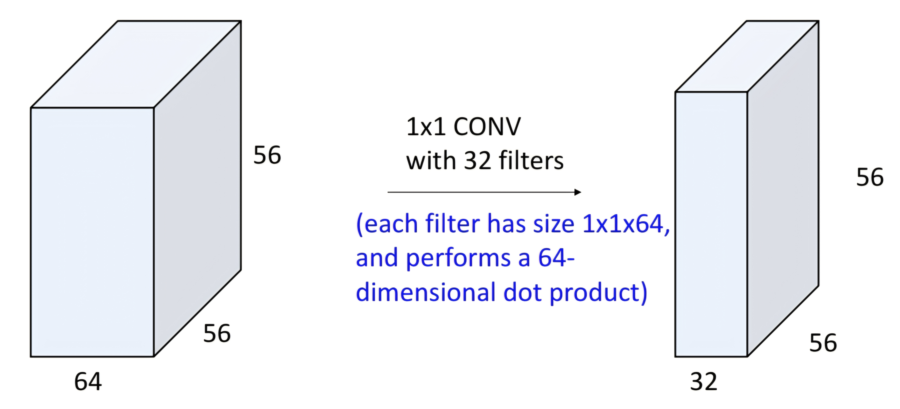

- 일반적인 컨볼루션은 $3\times 3$, $5\times 5$ 등 **공간적 이웃**을 보면서 특징을 추출하지만,  
    **$1\times 1$ 컨볼루션**은 커널 크기가 $1\times 1$이라 **공간 정보는 보지 않고 채널(뎁스)만 섞는 연산**이다.
- 입력이 $64\times 56\times 56$ (채널×높이×너비)이고, $1\times1$ 필터를 32개 쓰면  
    출력은 $32\times 56\times 56$이 된다. 각 필터는 $1\times 1\times 64$ 크기의 **64차원 내적**을 한다.
- 역할
    - 채널(특징 뎁스) 조절: $64\rightarrow 32$처럼 차원 축소 또는 확장
    - 서로 다른 채널에서 추출된 특징들을 **선형 결합**하여 새 특징을 만드는 MLP(전결합층)를 **각 위치별로 적용**하는 효과

## 2. Convolution

- 입력 크기: $C_\text{in} \times H \times W$
- 하이퍼파라미터
    - 커널 크기: $K_H \times K_W$ (보통 $K_H = K_W = K$)
    - 필터 개수(출력 채널): $C_\text{out}$
    - 패딩: $P$
    - 스트라이드: $S$
- 가중치/편향
    - weight: $C_\text{out} \times C_\text{in} \times K_H \times K_W$
    - bias: $C_\text{out}$
- 출력 크기
    - $H' = \dfrac{H - K + 2P}{S} + 1$
    - $W' = \dfrac{W - K + 2P}{S} + 1$
    - 최종 크기: $C_\text{out} \times H' \times W'$
- 자주 쓰는 설정
    - $K=3, P=1, S=1$ : $3\times 3$ conv (해상도 유지)
    - $K=1, P=0, S=1$ : $1\times 1$ conv
    - $K=3, P=1, S=2$ : 스트라이드 2 다운샘플링 conv

PyTorch `Conv2d(in_channels, out_channels, kernel_size, stride, padding, ...)`는 위 수식을 그대로 구현한 2D 컨볼루션 레이어이다.

## 3. Pooling (풀링) 레이어
### 3.1 개념

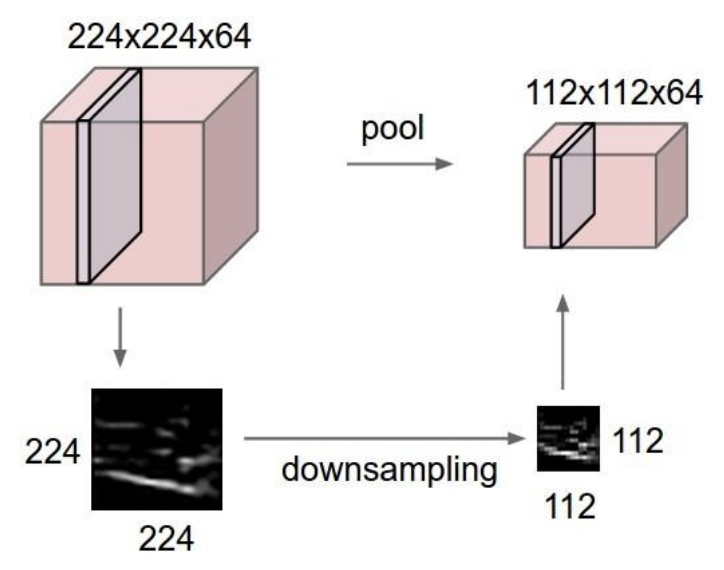

- **목적**: 학습 가능한 파라미터 없이, 피처맵의 해상도를 줄이면서 **지역적 요약값**을 뽑는 연산
- 하이퍼파라미터
    - 커널 크기: $K$ (보통 정사각형)
    - 스트라이드: $S$
    - 풀링 함수: max / average 등
- 입력: $C \times H \times W$
- 출력 크기
    - $H' = \dfrac{H - K}{S} + 1$
    - $W' = \dfrac{W - K}{S} + 1$
    - 출력: $C \times H' \times W'$ (채널 수는 유지)

### 3.2 Max Pooling 예시

- $2\times 2$ 커널, 스트라이드 $2$일 때, 입력의 $2\times2$ 블록마다 **최댓값**만 남긴다.
- 예: 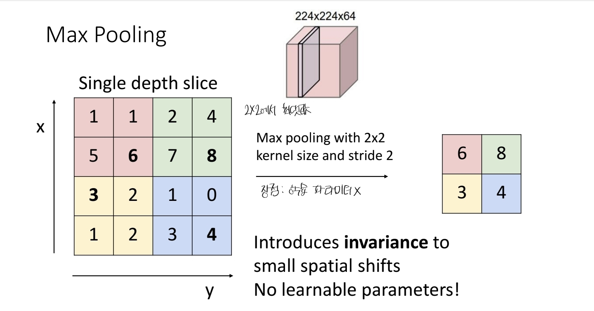
- 특징
    - 작은 위치 변화(translation)에 대해 어느 정도 **불변성**을 제공
    - **학습 파라미터가 전혀 없음** (그냥 max/avg 연산만 수행)

## 4. CNN 구조와 LeNet-5 예시
### 4.1 CNN의 전형적인 구성

- 예전 고전 CNN 구조:  
    **[Conv → ReLU → Pool] × N → Flatten → [FC → ReLU] × M → FC(출력)**
- 앞부분: 2D 컨볼루션으로 이미지를 처리 (공간 구조 유지)
- 뒷부분: Flatten 후 전결합(Linear) 레이어로 최종 분류

### 4.2 LeNet-5 구조

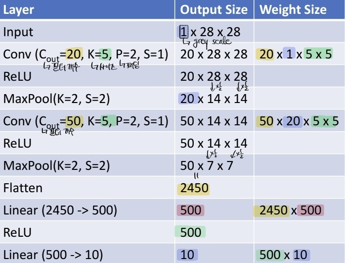

|단계|출력 크기|비고|
|---|---|---|
|Input|$1\times 28\times 28$|그레이스케일 이미지|
|Conv1 (Cout=20, K=5, P=2, S=1)|$20\times 28\times 28$|weight $20\times 1\times 5\times 5$|
|ReLU|$20\times 28\times 28$|비선형성|
|MaxPool(K=2,S=2)|$20\times 14\times 14$|해상도 1/2|
|Conv2 (Cout=50, K=5, P=2, S=1)|$50\times 14\times 14$|weight $50\times 20\times 5\times 5$|
|ReLU|$50\times 14\times 14$||
|MaxPool(K=2,S=2)|$50\times 7\times 7$||
|Flatten|$2450$|$50\times 7\times 7$ 펼침|
|Linear|$500$|$2450 \rightarrow 500$|
|ReLU|$500$||
|Linear|$10$|클래스 개수(0~9)|

- 네트워크를 따라가면
    - **공간 크기(해상도)는 감소** (풀링/스트라이드 conv)
    - **채널 수는 증가**
    - 대략적으로 “전체 볼륨”은 비슷하게 유지하는 경향이 있다.

## 5. 딥 네트워크의 학습 어려움 – Internal Covariate Shift

- 많은 레이어를 쌓으면, 각 레이어의 출력 분포가 학습이 진행될수록 계속 변한다.
- 특히 가중치 $W$가 1보다 큰 값들을 가지면, 앞 레이어 출력 범위가 **계속 커지거나 작아져**
    다음 레이어의 입력 분포가 매우 불안정해진다.
- 이렇게 **중간(feature) 분포가 계속 바뀌는 현상**을 _internal covariate shift_ 라고 부르며,  
    경사하강법의 수렴을 어렵게 만든다.

## 6. Batch Normalization (배치 정규화)
### 6.1 기본 아이디어

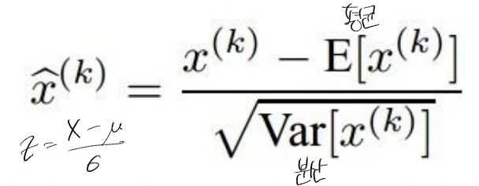

- **레이어 출력(활성값)을 평균 0, 분산 1에 가깝게 정규화**하여  
    internal covariate shift를 줄이고 학습을 안정화/가속화하자는 아이디어.

### 6.2 수식 (Fully-connected 기준)

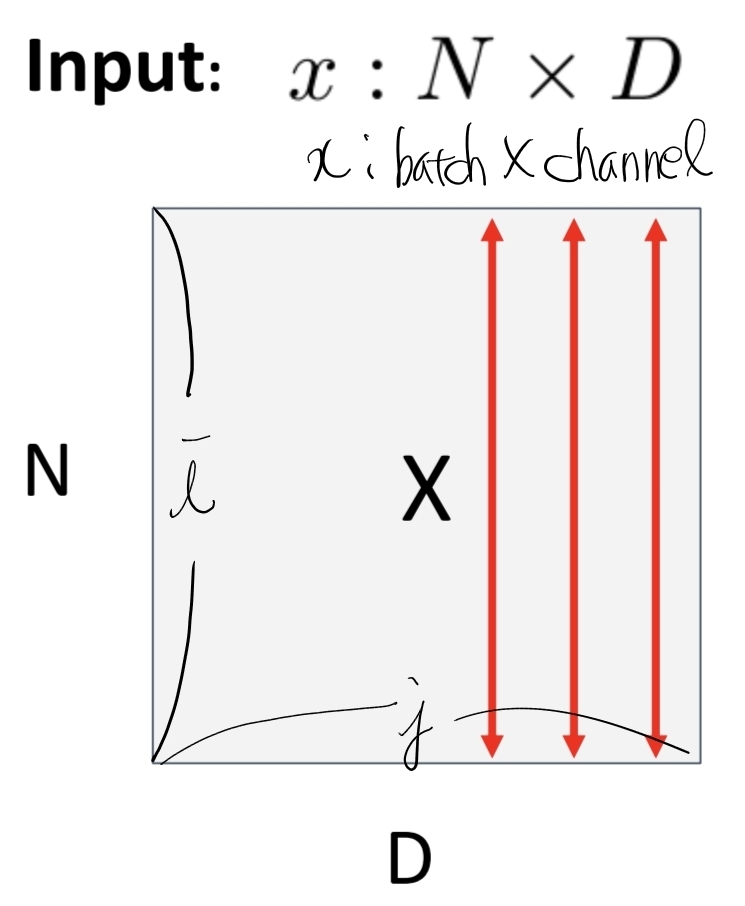

미니배치 $x \in \mathbb{R}^{N\times D}$ 에 대하여, 각 채널(특징) $j$에 대해:
- 배치 평균: $$\mu_j = \frac{1}{N}\sum_{i=1}^{N} x_{ij}$$
- 배치 분산: $$\sigma_j^2 = \frac{1}{N}\sum_{i=1}^{N} (x_{ij} - \mu_j)^2$$
- 정규화된 값: $$\hat{x}_{ij} = \frac{x_{ij} - \mu_j}{\sqrt{\sigma_j^2 + \epsilon}}$$
- 학습 가능한 스케일/시프트 $\gamma,\beta$를 적용한 출력: $$y_{ij} = \gamma_j \hat{x}_{ij} + \beta_j$$
- 여기서
    - $N$: 배치 크기 (한 번에 들어오는 샘플 수)
    - $D$: 채널/특징 차원 수
    - $\gamma,\beta$: 각 채널별 학습 파라미터
- $\gamma,\beta$ 덕분에 “평균 0, 분산 1”이라는 제약을 **완전히 고정하지 않고**,  
    네트워크가 필요하면 다른 분포(스케일·평행이동)를 학습할 수 있다.

### 6.3 ConvNet에서의 BatchNorm (Spatial BatchNorm)

- Batch Norm for Fully-Connected: 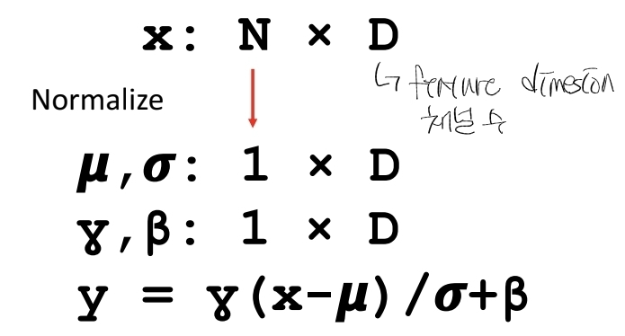
- Batch Norm for Conv: 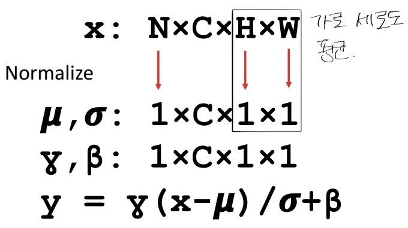

- ConvNet에서는 입력이 $x \in \mathbb{R}^{N\times C\times H\times W}$ 일 때, 
    **각 채널 $c$에 대해 $N, H, W$ 전체에 걸쳐 평균·분산**을 계산:
    - $\mu,\sigma \in \mathbb{R}^{1\times C\times 1\times 1}$
    - $\gamma,\beta \in \mathbb{R}^{1\times C\times 1\times 1}$
    - 수식은 동일하게 $y = \gamma \dfrac{x-\mu}{\sigma} + \beta$

### 6.4 학습 시와 테스트 시

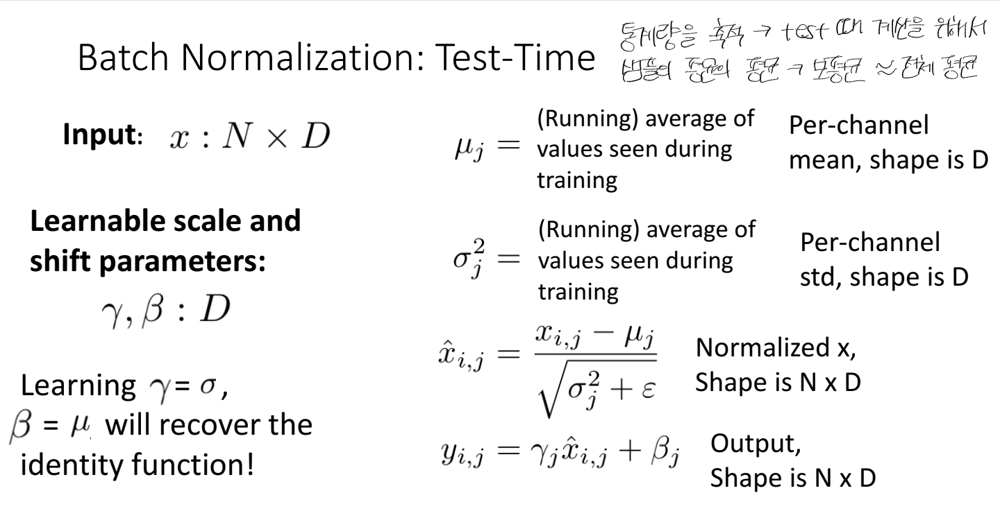

- **학습(train) 시**에는 각 미니배치에서 $\mu_j,\sigma_j^2$를 즉석에서 계산.
- **테스트(test) 시**에는 배치가 1장일 수도 있고 통계가 불안정하므로,  
    학습 동안 축적한 **running mean / running variance** 를 사용한다.
- 테스트 시 BatchNorm은 단순한 **고정된 선형 연산**이 되어,  
    이전 Conv/FC 레이어의 weight, bias에 흡수(퓨전)할 수도 있다.

### 6.5 위치와 효과

- 보통 레이어 순서는  
    **(Linear or Conv) → BatchNorm → 활성함수(ReLU, tanh, …)** 로 둔다.
- 장점
    - 깊은 네트워크도 **수렴이 훨씬 잘 됨**
    - 더 큰 learning rate 사용 가능 → 학습 속도 향상
    - 초기값에 덜 민감해짐
    - 어느 정도 **정규화(regularization)** 효과도 있어서 과적합을 줄이는 데 도움
    - 테스트 시 오버헤드 거의 없음
- 단점 / 주의점
    - **train / test 동작이 달라서** 구현 실수로 버그가 많이 생김
    - 이론적으로 완전히 이해된 것은 아니며, 여전히 연구 주제
	
## 7. 다른 정규화 기법들: Layer / Instance / Group Norm
### 7.1 Layer Normalization

- **Batch Norm** for **Fully-Connected**: 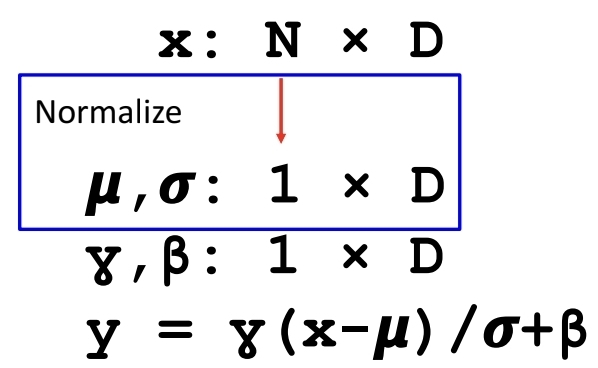
- **Layer Norm** for **Fully-Connected**: 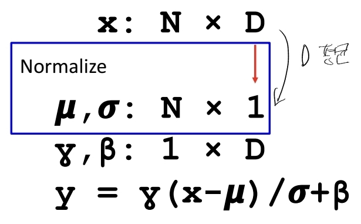

- Fully-connected 네트워크에서 주로 사용.
- 하나의 샘플 $x_i \in \mathbb{R}^{D}$ 에 대해 **특징 차원 전체**에 대해 평균·분산 계산:
    - $\mu_i, \sigma_i^2 \in \mathbb{R}^{1}$ (또는 $1\times 1$ 형태)
- 즉, **샘플별 정규화**이므로 배치 크기 $N$에 의존하지 않고  
    **학습/테스트 시 동작이 동일**하다.
- RNN, Transformer 등에서 표준처럼 사용.

### 7.2 Instance Normalization

- **Batch Norm** for **Conv**: 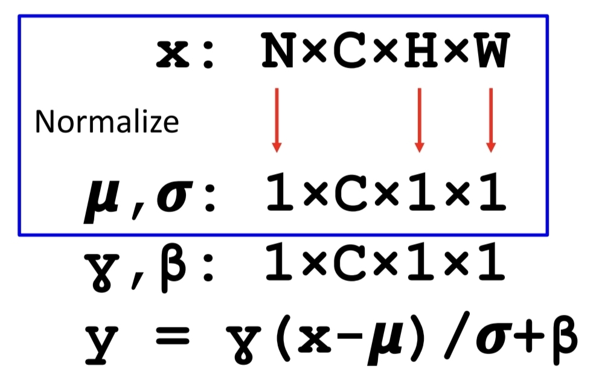
- **Instance Norm** for **Conv**: 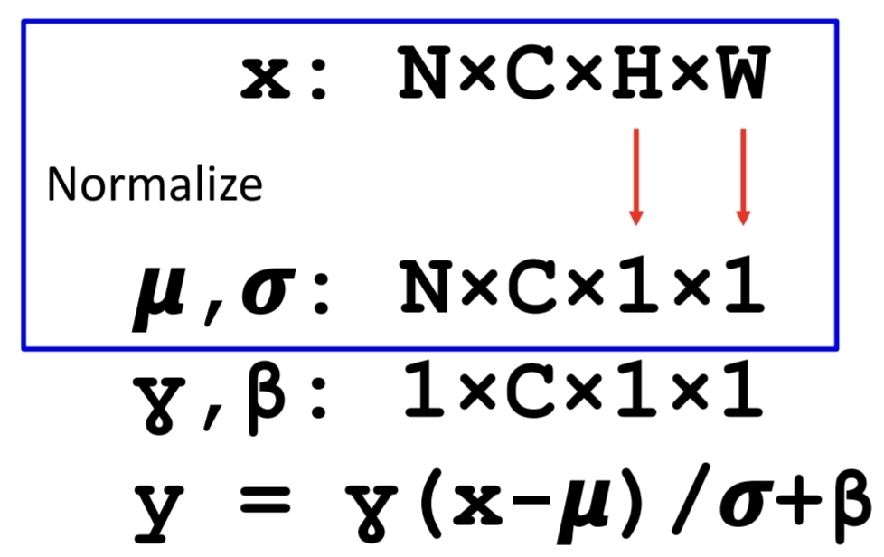

- ConvNet에서 사용.
- 한 샘플, 한 채널에 대해 공간 차원 $H\times W$ 에 대해 평균·분산 계산:
    - 입력 $x \in \mathbb{R}^{N\times C\times H\times W}$
    - $\mu,\sigma \in \mathbb{R}^{N\times C\times 1\times 1}$
- 마찬가지로 **배치에 의존하지 않아 train/test가 동일**하며,  
    스타일 변환, 텍스처 생성 같은 **이미지 스타일링**에서 많이 쓰인다.

### 7.3 Group Normalization

- 채널을 여러 **그룹**으로 나누고, 각 그룹 내부에서만 평균·분산을 계산.
- BatchNorm처럼 채널 일부를 같이 보고, InstanceNorm처럼 배치에 의존하지 않는 절충.
- **배치 크기가 매우 작을 때도 안정적**이라 detection/segmentation 등에서 많이 활용.

### 7.4 비교

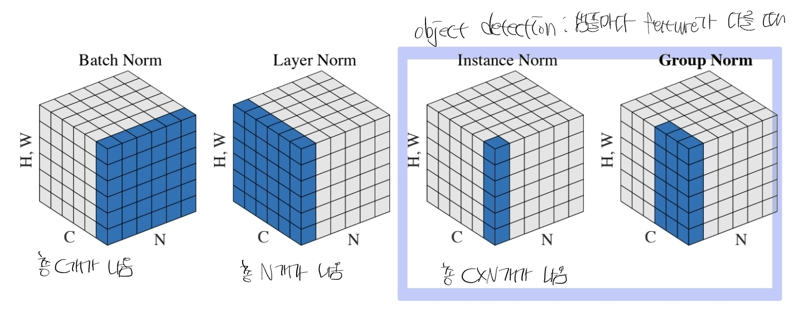

- 슬라이드의 3D 블록 그림(페이지 36–37)은 $N$(배치), $C$(채널), $H\times W$(공간)에 대해  
    어느 축을 따라 평균·분산을 내는지 시각적으로 보여준다.

## 8. ConvNet 구성 요소 요약

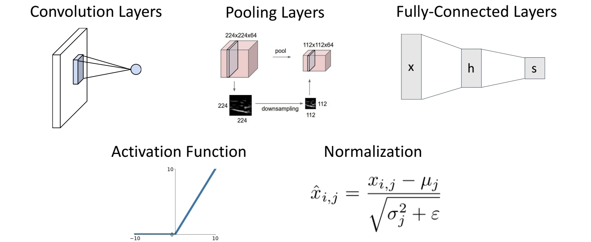

ConvNet은 다음 5가지 구성요소의 조합으로 이루어진다.
1. **Convolution Layers** – 대부분의 계산 비용을 차지, 지역적 패턴 추출
2. **Pooling Layers** – 파라미터 없이 해상도 축소, 위치 변화에 대한 불변성
3. **Activation Functions** – ReLU, tanh 등 비선형성 부여
4. **Normalization (Batch/Layer/Instance/Group)** – 학습 안정화 및 가속
5. **Fully-Connected Layers** – 마지막에 Flatten 후 분류/회귀 수행
