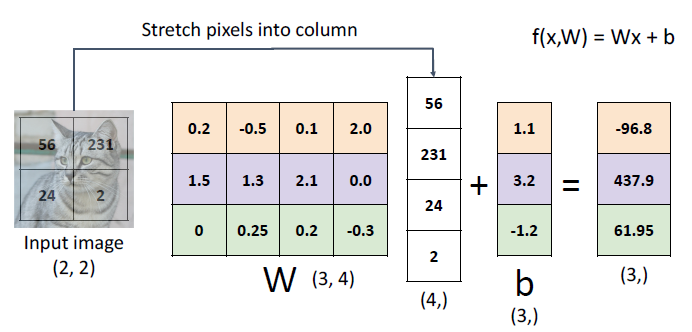
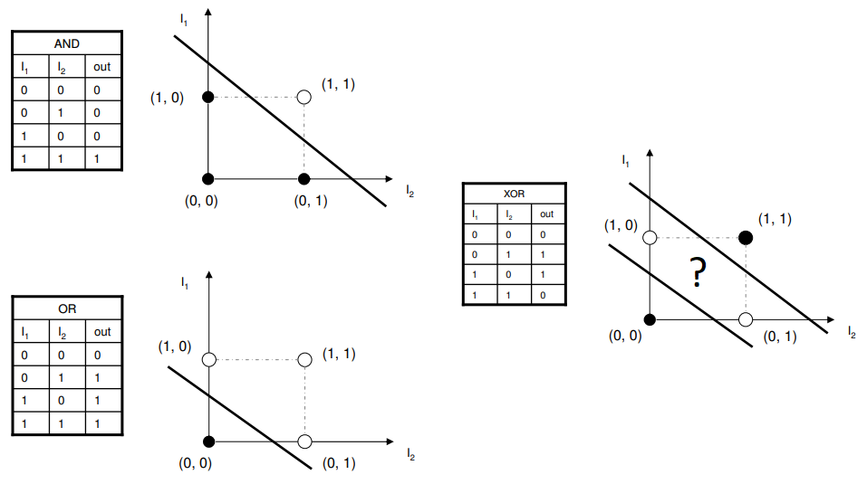

## 2. Linear Model (Linear Classifiers)
### 1. 문제 세팅: 이미지 분류 & CIFAR-10

- 입력: 32×32×3 컬러 이미지 5만장→ 픽셀을 일렬로 펼치면 **3072(32×32×3)차원 벡터**.
- 출력: 고양이, 개, 개구리, 트럭 등 **고정된 10개 클래스 중 하나**에 속하도록 분류.
- 목표: “이미지 → 각 클래스에 대한 점수(score)를 주는 함수”를 **매개변수(가중치)** 로 표현하고, 학습을 통해 좋은 가중치를 찾는 것.

### 2. 선형 분류기 정의
#### 2.1 파라메트릭 접근

- 이미지 $x \in \mathbb{R}^{3072}$
- 파라미터(가중치) $W, b$
- **선형 분류기 점수 함수**: $$f(x, W) = Wx + b$$
- CIFAR-10의 경우:
    - $W$: $(10 \times 3072)$ — 각 행(row)이 한 클래스에 대한 가중치(템플릿)
    - $b$: $(10,)$ — 각 클래스별 bias
    - 출력 $f(x,W)$: 길이 10짜리 벡터 (각 클래스의 score)

#### 2.2 작은 예시 (2×2 이미지, 3 클래스)

- 2×2 이미지 → 픽셀 4개 → $\mathbb{R}^4$ 벡터로 펼침.
- $W$: $(3 \times 4)$, $b$: $(3,)$
- $f(x,W) = Wx + b$ 연산을 통해 3개 클래스(cat/dog/ship)에 대한 score 3개를 얻음.

### 3. Bias Trick (바이어스 흡수하기)

- 원래 식: $f(x,W) = Wx + b$
- 데이터 벡터 뒤에 항상 1을 추가한 $\tilde{x} = [x; 1]$ 을 만들고, $b$ 를 **$W$ 의 마지막 열**로 흡수한 $\tilde{W}$ 를 사용하면: $$f(x,W) = Wx + b = \tilde{W}\tilde{x}$$
- 이렇게 하면 수식이 단순해져서 구현과 이론 전개가 편해짐.

### 4. “선형”이라는 것의 의미

- bias 무시 시: $$f(x, W) = Wx \Rightarrow f(cx, W) = W(cx) = c \cdot f(x,W)$$
- 즉, 입력 이미지 밝기를 반으로 줄이면 **점수들도 정확히 절반으로 줄어든다**.
- 이런 예측 가능성이 선형 모델의 장점이지만, 동시에 표현력이 제한된다는 것을 의미.

### 5. 선형 분류기의 해석: “템플릿 매칭” 관점
#### 5.1 행렬을 이미지로 보기

- 보통은 **이미지를 벡터로 펼쳐서** $W$와 곱하지만, 반대로 **$W$ 의 각 행(row)을 이미지 형태로 reshape** 해 보면:
    - 각 클래스마다 하나의 “필터 / 템플릿 이미지”처럼 보인다.
- 한 클래스에 대해 $$s_k = w_k^\top x + b_k$$는 “입력 이미지 $x$”와 “클래스 $k$ 의 템플릿 $w_k$”의 **내적(dot product)** 점수.

#### 5.2 내적과 코사인 유사도

- $x$와 $w_k$ 를 정규화(normalize)하면 $$w_k^\top x = |w_k| |x| \cos \theta$$
- 즉, 점수는 두 벡터(이미지와 템플릿) 사이의 **코사인 유사도**와 비례.
- 컴퓨터 비전에서 쓰는 **템플릿 매칭(template matching)** 과 사실상 동일한 구조.

#### 5.3 한계: 템플릿 하나로 모든 모양을 설명

- 선형 분류기는 **각 클래스당 템플릿 하나**만 가진다.
- 클래스 내에 여러 모드
    - 말이 왼쪽 보는 경우, 오른쪽 보는 경우, 누워있는 경우 …)가 있으면 → 학습된 템플릿은 여러 샘플의 **평균**처럼 되어 **뿌옇고 애매한 모습**이 된다.
- 강의 예시: 말 템플릿에서 **머리가 두 개**처럼 보이는 현상 →  여러 방향/자세의 말 이미지를 평균한 결과.

### 6. 선형 모델의 표현력 한계: XOR 예시

- XOR의 네 점은 평면상에서 **하나의 직선으로 나눌 수 없는(non-linearly separable)** 패턴.
- 퍼셉트론(단일 선형 분류기)으로는 XOR을 학습할 수 없음 → **선형 결정 경계만으로는 복잡한 패턴을 표현하기 어렵다**는 대표적인 예.

### 7. 좋은 $W$ 를 어떻게 찾을까? (Loss Function)
#### 7.1 데이터셋과 손실

- 데이터셋: ${(x_i, y_i)}_{i=1}^N$
    - $x_i$: 이미지
    - $y_i$: 정답 레이블(정수)
- 한 샘플에 대한 손실: $$L_i = L\big(f(x_i, W), y_i\big)$$
- 전체 데이터셋에 대한 손실: $$L = \frac{1}{N}\sum_{i=1}^N L_i$$
- **Loss가 작을수록 좋은 분류기**, 클수록 나쁜 분류기.

#### 7.2 학습의 목표

- 목적: $$W^* = \arg\min_W L(W)$$
- 즉, **데이터셋에 대한 평균 손실을 최소로 만드는 가중치 $W$** 를 찾는 것이 학습(optimization).

### 8. Softmax & Cross-Entropy Loss (Multinomial Logistic Regression)
#### 8.1 Raw score → 확률로 해석하기

- 선형 분류기가 내는 출력 $s = f(x_i; W)$ 는 **클래스별 score**; 값의 범위가 $-\infty \sim \infty$ 이고 합도 1이 아님.
- 이를 **확률 분포**로 바꾸기 위해 Softmax 사용: $$P(Y = k \mid X = x_i) = \frac{\exp(s_k)}{\sum_j \exp(s_j)}$$
- Softmax의 역할:
    - 모든 확률 $\ge 0$
    - 전체 클래스에 대해 합이 1이 되도록 **정규화**.

#### 8.2 Cross-Entropy Loss 정의

- 한 샘플 $(x_i, y_i)$ 에 대한 손실: $L_i = -\log P(Y = y_i \mid X = x_i)$
- 해석:
    - 정답 클래스의 확률이 **1에 가까울수록** $L_i \to 0$ (좋은 분류)
    - 정답 확률이 **0에 가까울수록** $L_i \to \infty$ (매우 나쁜 분류)
- 전체 Loss는 여전히 평균: $$L = \frac{1}{N}\sum_i L_i$$

#### 8.3 Maximum Likelihood와 연결

- Softmax + Cross-Entropy 조합은 “**관측된 정답 레이블들이 나올 확률을 최대화**” 하는 **Maximum Likelihood Estimation** 과 동치.